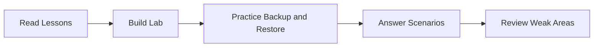

# Lesson 28 — VMCE Exam Preparation: Review, Scenario Practice and Reference Lab Appendix


> **VMCE Objective(s):** Whole-course review, scenario readiness, practical consolidation  
> **Level:** All Levels  
> **Estimated reading time:** 90–120 minutes  
> **Lab time:** Self-paced review

## Table of Contents

- [Lesson 28 — VMCE Exam Preparation: Review, Scenario Practice and Reference Lab Appendix](#lesson-28--vmce-exam-preparation-review-scenario-practice-and-reference-lab-appendix)
  - [Table of Contents](#table-of-contents)
  - [Learning Objectives](#learning-objectives)
  - [Concepts and Theory](#concepts-and-theory)
  - [How to Study From Here](#how-to-study-from-here)
  - [50 Practice Questions](#50-practice-questions)
  - [Short Answer Guidance](#short-answer-guidance)
  - [Practical Self-Assessment Rubric](#practical-self-assessment-rubric)
  - [Scenario Practice Guidance](#scenario-practice-guidance)
  - [Reference Lab Topology Appendix](#reference-lab-topology-appendix)
    - [Example Domain and Networks](#example-domain-and-networks)
    - [Example Systems](#example-systems)
    - [Example Role Assignments](#example-role-assignments)
    - [ASCII Topology](#ascii-topology)
  - [Final Advice](#final-advice)
  - [Exam Day Advice](#exam-day-advice)
  - [Key Takeaways](#key-takeaways)
  - [Review Questions](#review-questions)
    - [Answers](#answers)

[Go to TOC](#table-of-contents)

## Learning Objectives

- consolidate the major concepts from the course
- review VMCE-style scenario thinking
- identify weak areas before formal study or exam work
- use the reference lab topology as a repeatable self-study environment

[Go to TOC](#table-of-contents)

## Concepts and Theory

The best exam preparation is not memorization alone. It is structured understanding. Veeam-oriented certification questions often test whether you can reason through a scenario, not merely define a term. That is why this course emphasized design choices, recovery intent, and troubleshooting method instead of only feature lists.

[Go to TOC](#table-of-contents)

## How to Study From Here



1. Revisit any lesson where the review questions felt uncertain.
2. Redraw the architecture from memory.
3. Recreate at least one repository, one VM backup job, one agent policy, and one restore workflow in the lab.
4. Practice explaining why a design choice is correct, not just what button you would click.

[Go to TOC](#table-of-contents)

## 50 Practice Questions

1. What is the difference between RPO and RTO?
2. Why is backup copy not the same as replication?
3. What makes a hardened repository strategically important?
4. Why is application-aware processing important for SQL workloads?
5. Why can a green backup job still hide risk?
6. Why should backup repositories be viewed as fault domains?
7. What is the purpose of a proxy?
8. Why is vCenter usually preferred over adding ESXi hosts individually?
9. What common issue causes Hyper-V onboarding problems?
10. Why should credentials be separated by purpose?
11. What is the value of GFS retention?
12. Why should object storage not be judged only by capacity?
13. When is Instant VM Recovery preferable to full restore?
14. Why is recovery testing essential?
15. What is one risk of assuming replication replaces backup?
16. Why is the configuration database important?
17. What does the “1” in 3-2-1-1-0 commonly represent?
18. Why do NAS backups require their own thinking?
19. What is one common sign of proxy transport fallback?
20. Why is least privilege important in Veeam?
21. What should you check first if many jobs fail after a password rotation?
22. Why should restore scope be as narrow as practical?
23. Why do physical server recoveries require additional planning?
24. What makes tape still relevant in some industries?
25. Why does capacity planning belong in backup operations?
26. Why might a workload need replication and backup?
27. What does a backup copy job protect you from?
28. Why is guest processing dependency different from hypervisor dependency?
29. Why should warnings be reviewed, not just failures?
30. What is one reason to use Linux repositories?
31. What is a common symptom of repository misdesign?
32. Why should you not over-group unrelated VMs into one job?
33. What does failback mean?
34. Why is network mapping important during replication and restore?
35. What makes object immutability useful?
36. Why should automation follow understanding?
37. Why is RBAC helpful in larger teams?
38. Why should no-hypervisor workloads be treated as first-class protection targets?
39. What is a likely cause of recurring VSS warnings?
40. Why can a power-on VM still be unrecovered?
41. What is one reason to use a SOBR?
42. Why should backup schedules consider other infrastructure workloads?
43. What is the role of a cache repository in NAS backup?
44. Why are domain controllers special during backup and restore planning?
45. What should you ask before enabling log truncation features?
46. What is one cause of Linux agent deployment failure?
47. Why must the target environment be ready before replication is trusted?
48. Why does one backup location create strategic risk?
49. What does layered troubleshooting mean?
50. Why should documentation be part of every fix?

[Go to TOC](#table-of-contents)

## Short Answer Guidance

Use the lessons in this course to answer each question in complete, scenario-aware language. Avoid one-word memorized answers. Practice answering as if explaining to a colleague.

[Go to TOC](#table-of-contents)

## Practical Self-Assessment Rubric

Rate yourself from 1 to 5 on each of the following:

- backup fundamentals
- architecture understanding
- repository design
- VM job design
- agent-based protection
- restore method selection
- replication and copy strategy
- security hardening awareness
- troubleshooting method

Any category rated 3 or below deserves another review pass and a hands-on lab repetition.

[Go to TOC](#table-of-contents)

## Scenario Practice Guidance

When working through practice questions, try to identify what category of problem the question is really testing. Many Veeam questions are not testing obscure product trivia. They are really testing one of the following:

- understanding the difference between recovery speed and retention flexibility
- knowing when a second copy is required
- recognizing when application consistency matters
- understanding repository or proxy design implications
- choosing the correct scope of restore
- troubleshooting by layer rather than by panic

This framing helps you avoid overthinking. Many difficult-looking questions become easier once you identify the underlying category.

[Go to TOC](#table-of-contents)

## Reference Lab Topology Appendix

Use the following example topology if you want one consistent lab model across the course.

### Example Domain and Networks

- AD domain: `corp.local`
- Management subnet: `10.10.10.0/24`
- Backup/storage subnet: `10.10.20.0/24`
- Replica/DR subnet: `10.10.30.0/24`

### Example Systems

- `VEEAM-SRV` — 10.10.10.10
- `SQL01` — 10.10.10.20
- `VCENTER01` — 10.10.10.30
- `ESX01` — 10.10.10.31
- `ESX02` — 10.10.10.32
- `HV01` — 10.10.10.41
- `REPO01` — 10.10.20.10
- `LIN-IMMUT01` — 10.10.20.20
- `NAS01` — 10.10.20.30
- `WIN-APP01` — 10.10.10.101
- `LIN-WEB01` — 10.10.10.102
- `PHYS-SRV01` — 10.10.10.111

### Example Role Assignments

- `VEEAM-SRV` hosts the Veeam Backup & Replication console and services
- `REPO01` provides a standard repository
- `LIN-IMMUT01` provides a hardened repository target
- `VCENTER01` and `HV01` expose virtualization-managed workloads
- `PHYS-SRV01` and `LIN-WEB01` support the no-hypervisor path

### ASCII Topology

```text
                    +----------------+
                    |   VEEAM-SRV    |
                    | 10.10.10.10    |
                    +---+--------+---+
                        |        |
           +------------+        +-------------+
           |                                     |
   +-------v------+                     +--------v-------+
   | VCENTER01    |                     | HV01           |
   | ESX01 / ESX02|                     | Hyper-V host   |
   +--------------+                     +----------------+

           +---------------------------------------------+
           |
   +-------v------+      +----------------+     +----------------+
   | REPO01       |      | LIN-IMMUT01    |     | NAS01          |
   | Standard repo|      | Hardened repo  |     | File share src |
   +--------------+      +----------------+     +----------------+

           +---------------------------------------------+
           |
   +-------v------+      +----------------+
   | PHYS-SRV01   |      | LIN-WEB01      |
   | Agent path   |      | Agent path     |
   +--------------+      +----------------+
```

[Go to TOC](#table-of-contents)

## Final Advice

If you can explain why a design choice is correct, perform a backup, perform a restore, and troubleshoot a failure without panic, you are far better prepared than someone who only memorized feature names.

[Go to TOC](#table-of-contents)

## Exam Day Advice

- read scenario questions slowly
- identify whether the question is really about recovery speed, retention, consistency, or architecture
- eliminate answers that solve the wrong problem even if they sound technically impressive
- prefer answers that align to resilience principles rather than convenience shortcuts
- remember that backup design is judged by recoverability, not by wizard completion

[Go to TOC](#table-of-contents)

## Key Takeaways

- VMCE-style readiness depends on understanding, not just memorization.
- Practice building, backing up, restoring, and troubleshooting in the same lab.
- Use the reference topology if you want consistency across all course exercises.

[Go to TOC](#table-of-contents)

## Review Questions

1. Why is scenario reasoning more valuable than memorizing isolated terms?
2. Why should you revisit weak areas rather than only reread strong ones?
3. What is the value of a consistent lab topology?
4. Why should you practice restores as well as backups before an exam?
5. What is the strongest indicator that you are truly course-ready?

---

### Answers

1. Because real operational and exam questions often test decisions in context.
2. Because improvement comes from strengthening weak understanding, not just reinforcing familiar material.
3. It makes repeated practice and scenario comparison easier.
4. Because backup knowledge without recovery confidence is incomplete.
5. The ability to explain, implement, recover, and troubleshoot without relying entirely on step-by-step prompts.

[Go to TOC](#table-of-contents)

---

**License:** [CC BY-NC-SA 4.0](../LICENSE.md)
