> [!NOTE]
> Auto-generated combined document — do not edit manually.

<a id="course-complete-export"></a>
# Course Complete Export

<a id="master-table-of-contents"></a>

## Master Table of Contents

### Section 1 — Course Overview

- [Veeam Backup & Replication v12.x Course](#veeam-backup-replication-v12x-course)
- [Lessons Index](#lessons-index)

### Section 2 — Lessons

- [Veeam Backup & Replication v12.x — Beginner to Advanced Course](#veeam-backup-replication-v12x-beginner-to-advanced-course)
- [Lesson 1 — Veeam Backup & Replication v12: Product Overview, Editions and Licensing](#lesson-1-veeam-backup-replication-v12-product-overview-editions-and-licensing)
- [Lesson 2 — Backup Theory: RPO, RTO, 3-2-1 and Backup Types](#lesson-2-backup-theory-rpo-rto-3-2-1-and-backup-types)
- [Lesson 3 — Veeam Architecture: Components, Data Flow and Deployment Models](#lesson-3-veeam-architecture-components-data-flow-and-deployment-models)
- [Lesson 4 — Planning Your Deployment: Requirements, Ports, Service Accounts and Readiness](#lesson-4-planning-your-deployment-requirements-ports-service-accounts-and-readiness)
- [Lesson 5 — Lab: Installing Veeam Backup & Replication v12 on Windows Server](#lesson-5-lab-installing-veeam-backup-replication-v12-on-windows-server)
- [Lesson 6 — Adding Managed Infrastructure: vCenter, Hyper-V, Windows, Linux and Physical Systems](#lesson-6-adding-managed-infrastructure-vcenter-hyper-v-windows-linux-and-physical-systems)
- [Lesson 7 — Backup Repositories: Types, Design, Performance and Resilience](#lesson-7-backup-repositories-types-design-performance-and-resilience)
- [Lesson 8 — Lab: Configure a Repository and Scale-Out Backup Repository (SOBR)](#lesson-8-lab-configure-a-repository-and-scale-out-backup-repository-sobr)
- [Lesson 9 — VM Backup Jobs: Settings, Scheduling, Retention and Recovery Intent](#lesson-9-vm-backup-jobs-settings-scheduling-retention-and-recovery-intent)
- [Lesson 10 — Lab: Create and Run a VM Backup Job (VMware and Hyper-V)](#lesson-10-lab-create-and-run-a-vm-backup-job-vmware-and-hyper-v)
- [Lesson 11 — Backup Proxies: Data Movement, Transport Modes and Performance Behavior](#lesson-11-backup-proxies-data-movement-transport-modes-and-performance-behavior)
- [Lesson 12 — Application-Aware Processing: Consistency, Guest Interaction and Transaction-Safe Recovery](#lesson-12-application-aware-processing-consistency-guest-interaction-and-transaction-safe-recovery)
- [Lesson 13 — Agent-Based Backup: Windows, Linux and the No-Hypervisor Protection Model](#lesson-13-agent-based-backup-windows-linux-and-the-no-hypervisor-protection-model)
- [Lesson 14 — Lab: Deploy an Agent Policy for Windows and Linux Workloads](#lesson-14-lab-deploy-an-agent-policy-for-windows-and-linux-workloads)
- [Lesson 15 — NAS Backup: File Share Protection, Change Tracking and Recovery Expectations](#lesson-15-nas-backup-file-share-protection-change-tracking-and-recovery-expectations)
- [Lesson 16 — Restore Options Overview: VM, File, Volume and Service Recovery](#lesson-16-restore-options-overview-vm-file-volume-and-service-recovery)
- [Lesson 17 — Lab: Instant VM Recovery and Recovery Validation](#lesson-17-lab-instant-vm-recovery-and-recovery-validation)
- [Lesson 18 — Veeam Explorers and Application Item Recovery](#lesson-18-veeam-explorers-and-application-item-recovery)
- [Lesson 19 — VM Replication: Design, Use Cases and Failover Strategy](#lesson-19-vm-replication-design-use-cases-and-failover-strategy)
- [Lesson 20 — Lab: Configure Replication and Perform a Planned Failover](#lesson-20-lab-configure-replication-and-perform-a-planned-failover)
- [Lesson 21 — Backup Copy Jobs: Secondary Protection, GFS and Retention Strategy](#lesson-21-backup-copy-jobs-secondary-protection-gfs-and-retention-strategy)
- [Lesson 22 — Tape Infrastructure: Archive Workflows, Media Pools and Long-Term Retention](#lesson-22-tape-infrastructure-archive-workflows-media-pools-and-long-term-retention)
- [Lesson 23 — Object Storage, Capacity Tier and Cloud-Aligned Retention Design](#lesson-23-object-storage-capacity-tier-and-cloud-aligned-retention-design)
- [Lesson 24 — Security Hardening: Immutability, Least Privilege and Cyber-Resilient Backup Operations](#lesson-24-security-hardening-immutability-least-privilege-and-cyber-resilient-backup-operations)
- [Lesson 25 — Enterprise Scale: Enterprise Manager, RBAC, REST API and Automation Concepts](#lesson-25-enterprise-scale-enterprise-manager-rbac-rest-api-and-automation-concepts)
- [Lesson 26 — Monitoring and Reporting: Health Visibility, Capacity Planning and Operational Confidence](#lesson-26-monitoring-and-reporting-health-visibility-capacity-planning-and-operational-confidence)
- [Lesson 27 — Deep-Dive Troubleshooting: Common Failures, Root Causes and Recovery Tactics](#lesson-27-deep-dive-troubleshooting-common-failures-root-causes-and-recovery-tactics)

### Section 3 — Quizzes

- [Beginner Quiz — Lessons 1 to 6](#beginner-quiz-lessons-1-to-6)
- [Beginner Quiz — Answer Key](#beginner-quiz-answer-key)
- [Intermediate Quiz — Lessons 7 to 18](#intermediate-quiz-lessons-7-to-18)
- [Intermediate Quiz — Answer Key](#intermediate-quiz-answer-key)
- [Advanced Quiz — Lessons 19 to 28](#advanced-quiz-lessons-19-to-28)
- [Advanced Quiz — Answer Key](#advanced-quiz-answer-key)

### Section 4 — Exam Prep

- [Lesson 28 — VMCE Exam Preparation: Review, Scenario Practice and Reference Lab Appendix](#lesson-28-vmce-exam-preparation-review-scenario-practice-and-reference-lab-appendix)
- [Veeam Backup & Replication v12.x Master Exam Bank](#veeam-backup-replication-v12x-master-exam-bank)
- [Veeam Backup & Replication v12.x Master Exam Bank — Answer Key](#veeam-backup-replication-v12x-master-exam-bank-answer-key)

### Section 5 — Reference

- [Glossary of Terms — Veeam Backup & Replication v12.x](#glossary-of-terms-veeam-backup-replication-v12x)


---

<a id="section-1-course-overview"></a>
# SECTION 1 — Course Overview

<a id="veeam-backup-replication-v12x-course"></a>
# Veeam Backup & Replication v12.x Course


<a id="toc-readme"></a>
## Table of Contents

- [Veeam Backup \& Replication v12.x Course](#veeam-backup-replication-v12x-course)
  - [Table of Contents](#toc-readme)
  - [What is included](#readme-what-is-included)
  - [Audience](#readme-audience)
  - [Coverage](#readme-coverage)
  - [Learning style](#readme-learning-style)
  - [Additional learning assets](#readme-additional-learning-assets)
  - [Suggested order](#readme-suggested-order)
  - [Notes](#readme-notes)
  - [Recommended use patterns](#readme-recommended-use-patterns)
    - [Self-study](#readme-self-study)
    - [Team training](#readme-team-training)
  - [Files](#readme-files)
    - [File Navigation Table](#readme-file-navigation-table)

Beginner-to-advanced self-study course for **Veeam Backup & Replication v12**, with update awareness for **v12.1, v12.2, and v12.3**.

---

[Go to Lesson TOC](#toc-readme)

[Go to Course TOC](#master-table-of-contents)

---

<a id="readme-what-is-included"></a>
## What is included

- `lessons/` — index and lesson files
- `quizzes/` — quiz files and answer keys
- `exam/` — exam-prep lesson and exam assets
- `instructor-guide.md` — module-based syllabus and delivery guide
- `glossary.md` — extensive A–Z glossary of all course terminology

---

[Go to Lesson TOC](#toc-readme)

[Go to Course TOC](#master-table-of-contents)

---

<a id="readme-audience"></a>
## Audience

- general IT professionals
- backup administrators
- system administrators
- infrastructure engineers
- VMCE-oriented learners

---

[Go to Lesson TOC](#toc-readme)

[Go to Course TOC](#master-table-of-contents)

---

<a id="readme-coverage"></a>
## Coverage

- VMware vSphere path
- Microsoft Hyper-V path
- no-hypervisor path using Veeam Agents for physical and standalone systems
- backup, restore, backup copy, replication, NAS, security, monitoring, and troubleshooting

---

[Go to Lesson TOC](#toc-readme)

[Go to Course TOC](#master-table-of-contents)

---

<a id="readme-learning-style"></a>
## Learning style

Each lesson includes:

- learning objectives
- conceptual explanation
- practical guidance
- labs or decision exercises
- review questions and answers

Many lessons also include **Mermaid diagrams** for architecture or workflow explanation.

---

[Go to Lesson TOC](#toc-readme)

[Go to Course TOC](#master-table-of-contents)

---

<a id="readme-additional-learning-assets"></a>
## Additional learning assets

- beginner, intermediate, and advanced quizzes
- separate answer keys for each quiz
- 120-question master exam bank
- instructor guide for internal training or team enablement

---

[Go to Lesson TOC](#toc-readme)

[Go to Course TOC](#master-table-of-contents)

---

<a id="readme-suggested-order"></a>
## Suggested order

1. Start with `lessons/00-index.md`
2. Continue through the lesson files in `lessons/`
3. Use the quiz files after each phase:
   - beginner after lessons 1–6
   - intermediate after lessons 7–18
   - advanced after lessons 19–27
4. Finish with the exam materials in `exam/`

---

[Go to Lesson TOC](#toc-readme)

[Go to Course TOC](#master-table-of-contents)

---

<a id="readme-notes"></a>
## Notes

- This course teaches the **v12 platform generation** and calls out later v12.x refinements where relevant.
- Always verify exact product support and release-note details against current official Veeam documentation before applying changes in production.
- The troubleshooting lesson is intentionally much deeper than the others.
- Mermaid diagrams were written conservatively for Markdown compatibility.

---

[Go to Lesson TOC](#toc-readme)

[Go to Course TOC](#master-table-of-contents)

---

<a id="readme-recommended-use-patterns"></a>
## Recommended use patterns

<a id="readme-self-study"></a>
### Self-study

1. read each lesson in order
2. complete the lab or decision exercise
3. answer the review questions
4. complete the phase quiz
5. finish with the 120-question exam bank

<a id="readme-team-training"></a>
### Team training

1. use `instructor-guide.md`
2. assign one module per week
3. review lab outputs in group discussion
4. use quizzes for checkpoints
5. use the master exam bank as final review

---

[Go to Lesson TOC](#toc-readme)

[Go to Course TOC](#master-table-of-contents)

---

<a id="readme-files"></a>
## Files

Top-level structure:

- `lessons/`
- `quizzes/`
- `exam/`
- `README.md`
- `instructor-guide.md`

<a id="readme-file-navigation-table"></a>
### File Navigation Table

| Area | File or Folder | Description |
|---|---|---|
| Root | [`README.md`](README.md) | Course homepage and navigation guide |
| Root | [`LICENSE.md`](LICENSE.md) | Creative Commons BY-NC-SA 4.0 license |
| Root | [`instructor-guide.md`](instructor-guide.md) | Module-based syllabus and instructor delivery guide |
| Root | [`glossary.md`](glossary.md) | Extensive A–Z glossary of all course terminology |
| Lessons | [`lessons/README.md`](lessons/README.md) | Lesson folder index and lesson table of contents |
| Lessons | [`lessons/00-index.md`](lessons/00-index.md) | Master index and course roadmap |
| Quizzes | [`quizzes/quiz-beginner.md`](quizzes/quiz-beginner.md) | Beginner quiz |
| Quizzes | [`quizzes/quiz-beginner-answers.md`](quizzes/quiz-beginner-answers.md) | Beginner quiz answer key |
| Quizzes | [`quizzes/quiz-intermediate.md`](quizzes/quiz-intermediate.md) | Intermediate quiz |
| Quizzes | [`quizzes/quiz-intermediate-answers.md`](quizzes/quiz-intermediate-answers.md) | Intermediate quiz answer key |
| Quizzes | [`quizzes/quiz-advanced.md`](quizzes/quiz-advanced.md) | Advanced quiz |
| Quizzes | [`quizzes/quiz-advanced-answers.md`](quizzes/quiz-advanced-answers.md) | Advanced quiz answer key |
| Exam | [`exam/28-vmce-exam-prep.md`](exam/28-vmce-exam-prep.md) | Final exam-prep lesson and lab appendix |
| Exam | [`exam/exam-bank-120.md`](exam/exam-bank-120.md) | 120-question exam bank |
| Exam | [`exam/exam-bank-120-answers.md`](exam/exam-bank-120-answers.md) | 120-question answer key |

You can read the Markdown files directly from their folders or import them into your preferred documentation or course platform later.

---

[Go to Lesson TOC](#toc-readme)

[Go to Course TOC](#master-table-of-contents)

---

**License:** [CC BY-NC-SA 4.0](LICENSE.md)

---

<a id="lessons-index"></a>
# Lessons Index


<a id="toc-lessons-index"></a>
## Table of Contents

- [Lesson Navigation](#lessons-index-lesson-navigation)
- [Beginner Lessons](#lessons-index-beginner-lessons)
- [Intermediate Lessons](#lessons-index-intermediate-lessons)
- [Advanced Lessons](#lessons-index-advanced-lessons)
- [Reference Documents](#lessons-index-reference-documents)
- [How to Use This Folder](#lessons-index-how-to-use-this-folder)

---

[Go to Lesson TOC](#toc-lessons-index)

[Go to Course TOC](#master-table-of-contents)

---

<a id="lessons-index-lesson-navigation"></a>
## Lesson Navigation

| # | File | Topic |
|---|---|---|
| 00 | [`00-index.md`](00-index.md) | Master course index and roadmap |
| 01 | [`01-introduction.md`](01-introduction.md) | Product overview, editions, and licensing |
| 02 | [`02-backup-fundamentals.md`](02-backup-fundamentals.md) | Backup theory, RPO, RTO, and retention basics |
| 03 | [`03-architecture-overview.md`](03-architecture-overview.md) | Veeam architecture and data flow |
| 04 | [`04-installation-requirements.md`](04-installation-requirements.md) | Deployment planning and prerequisites |
| 05 | [`05-lab-install-vbr.md`](05-lab-install-vbr.md) | Lab: Install VBR on Windows Server |
| 06 | [`06-adding-infrastructure.md`](06-adding-infrastructure.md) | Add VMware, Hyper-V, Windows, and Linux infrastructure |
| 07 | [`07-backup-repositories.md`](07-backup-repositories.md) | Repository types and storage design |
| 08 | [`08-lab-configure-repository.md`](08-lab-configure-repository.md) | Lab: Configure repository and SOBR |
| 09 | [`09-vm-backup-jobs.md`](09-vm-backup-jobs.md) | VM backup job design |
| 10 | [`10-lab-vm-backup-job.md`](10-lab-vm-backup-job.md) | Lab: Create and run a VM backup job |
| 11 | [`11-backup-proxies.md`](11-backup-proxies.md) | Proxies and transport modes |
| 12 | [`12-application-aware-processing.md`](12-application-aware-processing.md) | Application-aware processing |
| 13 | [`13-agent-based-backup.md`](13-agent-based-backup.md) | Agent-based and no-hypervisor protection |
| 14 | [`14-lab-agent-backup.md`](14-lab-agent-backup.md) | Lab: Deploy agent policy |
| 15 | [`15-nas-backup.md`](15-nas-backup.md) | NAS backup and file share protection |
| 16 | [`16-restore-options.md`](16-restore-options.md) | Restore methods and decision logic |
| 17 | [`17-lab-instant-vm-recovery.md`](17-lab-instant-vm-recovery.md) | Lab: Instant VM Recovery |
| 18 | [`18-application-item-restore.md`](18-application-item-restore.md) | Application item recovery |
| 19 | [`19-replication.md`](19-replication.md) | Replication strategy |
| 20 | [`20-lab-replication.md`](20-lab-replication.md) | Lab: Replication and planned failover |
| 21 | [`21-backup-copy-jobs.md`](21-backup-copy-jobs.md) | Backup copy jobs and GFS |
| 22 | [`22-tape-support.md`](22-tape-support.md) | Tape workflows and archival retention |
| 23 | [`23-object-storage-cloud-tier.md`](23-object-storage-cloud-tier.md) | Object storage and capacity tier |
| 24 | [`24-security-hardening.md`](24-security-hardening.md) | Security hardening and resilience |
| 25 | [`25-scale-enterprise.md`](25-scale-enterprise.md) | Enterprise scale, RBAC, and automation |
| 26 | [`26-monitoring-reporting.md`](26-monitoring-reporting.md) | Monitoring and reporting |
| 27 | [`27-troubleshooting.md`](27-troubleshooting.md) | Deep-dive troubleshooting |

---

[Go to Lesson TOC](#toc-lessons-index)

[Go to Course TOC](#master-table-of-contents)

---

<a id="lessons-index-beginner-lessons"></a>
## Beginner Lessons

- [`00-index.md`](00-index.md)
- [`01-introduction.md`](01-introduction.md)
- [`02-backup-fundamentals.md`](02-backup-fundamentals.md)
- [`03-architecture-overview.md`](03-architecture-overview.md)
- [`04-installation-requirements.md`](04-installation-requirements.md)
- [`05-lab-install-vbr.md`](05-lab-install-vbr.md)
- [`06-adding-infrastructure.md`](06-adding-infrastructure.md)

---

[Go to Lesson TOC](#toc-lessons-index)

[Go to Course TOC](#master-table-of-contents)

---

<a id="lessons-index-intermediate-lessons"></a>
## Intermediate Lessons

- [`07-backup-repositories.md`](07-backup-repositories.md)
- [`08-lab-configure-repository.md`](08-lab-configure-repository.md)
- [`09-vm-backup-jobs.md`](09-vm-backup-jobs.md)
- [`10-lab-vm-backup-job.md`](10-lab-vm-backup-job.md)
- [`11-backup-proxies.md`](11-backup-proxies.md)
- [`12-application-aware-processing.md`](12-application-aware-processing.md)
- [`13-agent-based-backup.md`](13-agent-based-backup.md)
- [`14-lab-agent-backup.md`](14-lab-agent-backup.md)
- [`15-nas-backup.md`](15-nas-backup.md)
- [`16-restore-options.md`](16-restore-options.md)
- [`17-lab-instant-vm-recovery.md`](17-lab-instant-vm-recovery.md)
- [`18-application-item-restore.md`](18-application-item-restore.md)
- [`21-backup-copy-jobs.md`](21-backup-copy-jobs.md)

---

[Go to Lesson TOC](#toc-lessons-index)

[Go to Course TOC](#master-table-of-contents)

---

<a id="lessons-index-advanced-lessons"></a>
## Advanced Lessons

- [`19-replication.md`](19-replication.md)
- [`20-lab-replication.md`](20-lab-replication.md)
- [`22-tape-support.md`](22-tape-support.md)
- [`23-object-storage-cloud-tier.md`](23-object-storage-cloud-tier.md)
- [`24-security-hardening.md`](24-security-hardening.md)
- [`25-scale-enterprise.md`](25-scale-enterprise.md)
- [`26-monitoring-reporting.md`](26-monitoring-reporting.md)
- [`27-troubleshooting.md`](27-troubleshooting.md)

---

[Go to Lesson TOC](#toc-lessons-index)

[Go to Course TOC](#master-table-of-contents)

---

<a id="lessons-index-reference-documents"></a>
## Reference Documents

These documents are standalone references used alongside the lessons. They are not numbered lessons and do not need to be read in order.

| Document | Description |
|---|---|
| [`../glossary.md`](../glossary.md) | Extensive A–Z glossary of all terms, acronyms, and concepts used across the course |
| [`../instructor-guide.md`](../instructor-guide.md) | Module-based syllabus and delivery guidance for instructors and team leads |

---

[Go to Lesson TOC](#toc-lessons-index)

[Go to Course TOC](#master-table-of-contents)

---

<a id="lessons-index-how-to-use-this-folder"></a>
## How to Use This Folder

Start with [`00-index.md`](00-index.md), then continue in numeric order. Use the root [`../README.md`](../README.md) for overall project navigation, the [`../quizzes/`](../quizzes/) folder for checkpoints, and the [`../exam/`](../exam/) folder for final exam-prep materials.

---

[Go to Lesson TOC](#toc-lessons-index)

[Go to Course TOC](#master-table-of-contents)

---

**License:** [CC BY-NC-SA 4.0](../LICENSE.md)

---

<a id="veeam-backup-replication-v12x-beginner-to-advanced-course"></a>
# Veeam Backup & Replication v12.x — Beginner to Advanced Course


> **Audience:** Mixed / general IT professionals, administrators, consultants, and engineers  
> **Scope:** Veeam Backup & Replication v12 with update awareness for v12.1, v12.2, and v12.3  
> **Format:** One lesson per file, full-prose instruction, step-by-step labs, and VMCE-oriented review material

<a id="toc-course-index"></a>
## Table of Contents

- [How to Use This Course](#course-index-how-to-use-this-course)
- [Course Outcomes](#course-index-course-outcomes)
- [Recommended Study Order](#course-index-recommended-study-order)
- [Course Roadmap Diagram](#course-index-course-roadmap-diagram)
- [File List](#course-index-file-list)
- [Practical VMCE-Oriented Domain Map](#course-index-practical-vmce-oriented-domain-map)
- [How to Read the Lessons Efficiently](#course-index-how-to-read-the-lessons-efficiently)
- [Suggested Weekly Study Pacing](#course-index-suggested-weekly-study-pacing)
- [Reference Lab Naming Convention](#course-index-reference-lab-naming-convention)
- [Version Guidance for v12.x](#course-index-version-guidance-for-v12x)
- [Study Advice](#course-index-study-advice)
- [Success Criteria for Learners](#course-index-success-criteria-for-learners)
- [Instructor and Team Lead Notes](#course-index-instructor-and-team-lead-notes)
- [Reference Documents](#course-index-reference-documents)

---

[Go to Lesson TOC](#toc-course-index)

[Go to Course TOC](#master-table-of-contents)

---

<a id="course-index-how-to-use-this-course"></a>
## How to Use This Course

This course is designed for learners who want to move from first exposure to Veeam Backup & Replication (VBR) into confident day-to-day administration, design, recovery operations, and exam preparation. The lessons are written in progression order. If you are new to Veeam, start at Lesson 1 and continue sequentially. If you already operate a Veeam environment, you can selectively jump to lessons on repositories, application-aware processing, restores, replication, security hardening, or troubleshooting.

The course intentionally supports three common learning paths:

1. **Virtualization-first path** for environments centered on VMware vSphere.
2. **Microsoft virtualization path** for environments centered on Hyper-V.
3. **No-hypervisor path** for readers protecting physical servers, standalone systems, branch office systems, or cloud-hosted machines with Veeam Agents.

Throughout the lessons, you will see references to all three paths whenever the procedure or design decision changes.

---

[Go to Lesson TOC](#toc-course-index)

[Go to Course TOC](#master-table-of-contents)

---

<a id="course-index-course-outcomes"></a>
## Course Outcomes

By the end of this course, you should be able to:

- Explain backup and recovery fundamentals in business terms, including RPO, RTO, retention, and resilience.
- Install and configure a Veeam Backup & Replication v12.x environment.
- Add virtual and physical infrastructure safely.
- Design backup repositories, scale-out storage, and object storage tiers.
- Build and validate VM, agent, NAS, and backup copy jobs.
- Perform restores confidently, from guest files to Instant VM Recovery.
- Implement replication and disaster recovery workflows.
- Apply security hardening, immutability, malware-aware recovery practices, and operational safeguards.
- Troubleshoot common and complex failures across hypervisors, agents, repositories, application-aware jobs, and restores.
- Prepare effectively for VMCE-style exam questions and scenario thinking.

---

[Go to Lesson TOC](#toc-course-index)

[Go to Course TOC](#master-table-of-contents)

---

<a id="course-index-recommended-study-order"></a>
## Recommended Study Order

1. Lessons 1–6 build the beginner foundation.
2. Lessons 7–18 establish core operational competence.
3. Lessons 19–28 extend into advanced design, enterprise operations, and exam preparation.

---

[Go to Lesson TOC](#toc-course-index)

[Go to Course TOC](#master-table-of-contents)

---

<a id="course-index-course-roadmap-diagram"></a>
## Course Roadmap Diagram

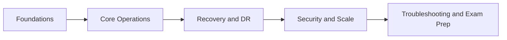

The roadmap above is intentionally simple. The course does not assume that a learner is already comfortable with enterprise backup language, so the opening lessons build shared vocabulary first. From there, the sequence shifts into operational skills such as repository design, backup job creation, and agent-based protection. Only after those foundations are stable does the course move into replication, copy strategy, hardening, monitoring, and advanced troubleshooting.

This sequence mirrors how real-world competence develops. Teams that skip directly to advanced features often discover that their environment is still weak at the basics: credential hygiene, repository placement, restore validation, or retention logic. By the time you reach the final lessons in this course, you should not merely know how to click through Veeam wizards. You should understand what those workflows are trying to achieve and what assumptions they depend on.

---

[Go to Lesson TOC](#toc-course-index)

[Go to Course TOC](#master-table-of-contents)

---

<a id="course-index-file-list"></a>
## File List

| File | Lesson | Level |
|---|---|---|
| `01-introduction.md` | Veeam B&R v12: Product Overview, Editions and Licensing | Beginner |
| `02-backup-fundamentals.md` | Backup Theory: RPO, RTO, 3-2-1 and Backup Types | Beginner |
| `03-architecture-overview.md` | Components, Data Flow and Deployment Models | Beginner |
| `04-installation-requirements.md` | Planning, Requirements, Accounts and Ports | Beginner |
| `05-lab-install-vbr.md` | Lab: Install VBR 12 on Windows Server | Beginner |
| `06-adding-infrastructure.md` | Add vCenter, Hyper-V and Physical Infrastructure | Beginner |
| `07-backup-repositories.md` | Backup Repositories and Storage Design | Intermediate |
| `08-lab-configure-repository.md` | Lab: Repository and SOBR Configuration | Intermediate |
| `09-vm-backup-jobs.md` | VM Backup Jobs and Retention Strategy | Intermediate |
| `10-lab-vm-backup-job.md` | Lab: Create and Run a VM Backup Job | Intermediate |
| `11-backup-proxies.md` | Backup Proxies and Transport Modes | Intermediate |
| `12-application-aware-processing.md` | Application-Aware Processing | Intermediate |
| `13-agent-based-backup.md` | Veeam Agents and No-Hypervisor Protection | Intermediate |
| `14-lab-agent-backup.md` | Lab: Agent Policy for Windows and Linux | Intermediate |
| `15-nas-backup.md` | NAS Backup and File Share Protection | Intermediate |
| `16-restore-options.md` | Restore Methods and Recovery Planning | Intermediate |
| `17-lab-instant-vm-recovery.md` | Lab: Instant VM Recovery and Validation | Intermediate |
| `18-application-item-restore.md` | Veeam Explorers and Item-Level Recovery | Intermediate |
| `19-replication.md` | Replication and Failover Strategy | Advanced |
| `20-lab-replication.md` | Lab: Replication and Planned Failover | Advanced |
| `21-backup-copy-jobs.md` | Backup Copy Jobs and GFS Retention | Intermediate/Advanced |
| `22-tape-support.md` | Tape Infrastructure and Archive Workflows | Advanced |
| `23-object-storage-cloud-tier.md` | Object Storage, Cloud Tier and Immutability | Advanced |
| `24-security-hardening.md` | Security Hardening and Cyber Resilience | Advanced |
| `25-scale-enterprise.md` | Enterprise Manager, RBAC, API and Automation | Advanced |
| `26-monitoring-reporting.md` | Monitoring, Reporting and Capacity Planning | Advanced |
| `27-troubleshooting.md` | Deep-Dive Troubleshooting | Advanced |
| `28-vmce-exam-prep.md` | VMCE-Style Review, Practice Questions and Lab Appendix | All |
| [`../glossary.md`](../glossary.md) | Glossary of Terms — A–Z reference for all course terminology | Reference |

---

[Go to Lesson TOC](#toc-course-index)

[Go to Course TOC](#master-table-of-contents)

---

<a id="course-index-practical-vmce-oriented-domain-map"></a>
## Practical VMCE-Oriented Domain Map

This course is aligned to the knowledge areas typically expected from a Veeam administrator preparing for VMCE-level work. Exact public exam blueprints may change over time, so use this table as a practical skills map rather than a claim of the official internal exam structure.

| Domain | Focus | Lessons |
|---|---|---|
| Product and backup fundamentals | Terminology, resilience, licensing, editions | 01, 02 |
| Architecture and planning | Components, deployment design, prerequisites | 03, 04, 05 |
| Managed infrastructure | Virtual, physical and agent-managed systems | 06, 13, 14 |
| Repositories and storage | Local, network, hardened, object, SOBR | 07, 08, 23 |
| Job configuration | Backup jobs, processing, scheduling, retention | 09, 10, 11, 12 |
| Recovery operations | VM, file, item, application and instant restore | 16, 17, 18 |
| Data movement and DR | Backup copy, replication, tape | 19, 20, 21, 22 |
| Security and operations | Hardening, enterprise controls, monitoring | 24, 25, 26 |
| Troubleshooting and support | Log reading, root cause isolation, remediation | 27 |
| Exam preparation | Review and scenario questions | 28 |

---

[Go to Lesson TOC](#toc-course-index)

[Go to Course TOC](#master-table-of-contents)

---

<a id="course-index-how-to-read-the-lessons-efficiently"></a>
## How to Read the Lessons Efficiently

Every lesson in this course follows the same broad teaching pattern:

1. a practical statement of what you are expected to learn
2. conceptual explanation in plain operational language
3. examples of where the topic matters in real environments
4. a lab or decision exercise
5. review questions and answer key

If you are self-studying for certification, use the lessons in three passes:

- **Pass one:** read for understanding
- **Pass two:** build the lab steps and take notes on configuration choices
- **Pass three:** answer the review questions without looking at the lesson body

If you are using the course as internal team training, assign one learner to summarize each lesson back to the group in business language rather than product language. That exercise quickly reveals whether the learner truly understands the topic.

---

[Go to Lesson TOC](#toc-course-index)

[Go to Course TOC](#master-table-of-contents)

---

<a id="course-index-suggested-weekly-study-pacing"></a>
## Suggested Weekly Study Pacing

This is a long-form course. It is reasonable to spread it across several weeks.

| Week | Recommended scope |
|---|---|
| 1 | Lessons 1–4 |
| 2 | Lessons 5–8 |
| 3 | Lessons 9–12 |
| 4 | Lessons 13–16 |
| 5 | Lessons 17–21 |
| 6 | Lessons 22–24 |
| 7 | Lessons 25–28 |

This pacing is only a guide. Some learners will move faster, especially if they already administer backups. Others will move more slowly because they are building a lab from scratch. Both approaches are valid. The main goal is to avoid rushing through the restore and troubleshooting sections, because those are often the most important parts of the entire subject.

---

[Go to Lesson TOC](#toc-course-index)

[Go to Course TOC](#master-table-of-contents)

---

<a id="course-index-reference-lab-naming-convention"></a>
## Reference Lab Naming Convention

The course uses generic hostnames so you can adapt the steps to your own environment. A full sample topology is included in the appendix section of Lesson 28.

Common system names used in the labs:

- `VEEAM-SRV` — the Veeam Backup & Replication server
- `SQL01` — external SQL Server if used
- `VCENTER01` — VMware vCenter Server
- `ESX01`, `ESX02` — VMware ESXi hosts
- `HV01`, `HV02` — Hyper-V hosts
- `WIN-APP01` — Windows application VM
- `LIN-WEB01` — Linux VM or server
- `PHYS-SRV01` — protected physical or standalone server
- `REPO01` — repository server
- `LIN-IMMUT01` — hardened Linux repository host
- `NAS01` — NAS share source

---

[Go to Lesson TOC](#toc-course-index)

[Go to Course TOC](#master-table-of-contents)

---

<a id="course-index-version-guidance-for-v12x"></a>
## Version Guidance for v12.x

This course teaches the Veeam Backup & Replication v12 platform while acknowledging that many environments operate on later v12 updates. Where relevant, lessons call out update-aware considerations such as:

- support matrix and platform compatibility changes
- hardened repository improvements
- object storage and immutability enhancements
- security and malware detection additions
- UI workflow changes in later v12 releases

Always validate platform support, upgrade order, and release notes against the current Veeam documentation before changing a production environment.

---

[Go to Lesson TOC](#toc-course-index)

[Go to Course TOC](#master-table-of-contents)

---

<a id="course-index-study-advice"></a>
## Study Advice

To get the most value from the course:

1. Read the theory section before starting the lab.
2. Build a small lab and actually run the steps.
3. Take notes on defaults, caveats, and verification points.
4. Do not skip restore labs. Backup success without restore validation is false confidence.
5. Review the questions at the end of every lesson before moving on.

---

[Go to Lesson TOC](#toc-course-index)

[Go to Course TOC](#master-table-of-contents)

---

<a id="course-index-success-criteria-for-learners"></a>
## Success Criteria for Learners

You can consider yourself course-complete when you can do the following without looking up every step:

- deploy a Veeam server and add core infrastructure
- configure at least one repository and one backup job
- protect a Windows or Linux workload with an agent
- perform an Instant VM Recovery or equivalent agent-based recovery operation
- explain why one repository or proxy design is better than another in a given scenario
- troubleshoot a failed backup by reading the log, identifying the failing component, and applying a sensible fix

---

[Go to Lesson TOC](#toc-course-index)

[Go to Course TOC](#master-table-of-contents)

---

<a id="course-index-instructor-and-team-lead-notes"></a>
## Instructor and Team Lead Notes

If this course is being used for internal enablement, onboarding, or cross-training, the following checkpoints are useful:

- after Lesson 4, learners should be able to explain the difference between a poor and a well-planned Veeam deployment
- after Lesson 9, learners should be able to justify a backup job configuration without relying on defaults
- after Lesson 16, learners should be able to choose the correct recovery method for a scenario without over-restoring
- after Lesson 24, learners should be able to explain why backup security is part of backup design
- after Lesson 27, learners should be able to classify failures by layer and propose an investigation path

These checkpoints help instructors and team leads assess whether learners are merely following instructions or actually building operational judgment.

Proceed to Lesson 1 to begin.

---

[Go to Lesson TOC](#toc-course-index)

[Go to Course TOC](#master-table-of-contents)

---

<a id="course-index-reference-documents"></a>
## Reference Documents

The following documents are standalone references that complement the lesson content. They are not lessons themselves and do not need to be read in sequence, but they are useful throughout the course and as revision aids.

| Document | Description |
|---|---|
| [`../glossary.md`](../glossary.md) | Extensive A–Z glossary of all terms, acronyms, and concepts used in the course |
| [`../instructor-guide.md`](../instructor-guide.md) | Module-based syllabus and delivery guidance for instructors and team leads |

---

[Go to Lesson TOC](#toc-course-index)

[Go to Course TOC](#master-table-of-contents)

---

**License:** [CC BY-NC-SA 4.0](../LICENSE.md)

---

<a id="section-2-lessons"></a>
# SECTION 2 — Lessons

<a id="lesson-1-veeam-backup-replication-v12-product-overview-editions-and-licensing"></a>
# Lesson 1 — Veeam Backup & Replication v12: Product Overview, Editions and Licensing


> **VMCE Objective(s):** Product positioning, core capabilities, deployment understanding  
> **Level:** Beginner  
> **Estimated reading time:** 35–45 minutes  
> **Lab time:** 20 minutes

<a id="toc-l01"></a>
## Table of Contents

- [Learning Objectives](#l01-learning-objectives)
- [Concepts and Theory](#l01-concepts-and-theory)
- [What Veeam Backup & Replication Includes](#l01-what-veeam-backup-replication-includes)
- [Backup, Replication and Copy: Similar Words, Different Jobs](#l01-backup-replication-and-copy-similar-words-different-jobs)
- [Who Usually Uses Veeam Day to Day](#l01-who-usually-uses-veeam-day-to-day)
- [Veeam in the Context of Data Resilience](#l01-veeam-in-the-context-of-data-resilience)
- [Why Veeam Matters in Modern Backup Strategy](#l01-why-veeam-matters-in-modern-backup-strategy)
- [Editions and Licensing at a High Level](#l01-editions-and-licensing-at-a-high-level)
- [High-Level Edition and Packaging Awareness](#l01-high-level-edition-and-packaging-awareness)
- [Core Use Cases You Will See Repeatedly](#l01-core-use-cases-you-will-see-repeatedly)
- [What Changed in v12 and Why It Matters](#l01-what-changed-in-v12-and-why-it-matters)
- [Practical Differences Between Learning v12 and Operating v12.x](#l01-practical-differences-between-learning-v12-and-operating-v12x)
- [Real-World Scenario Walkthrough](#l01-real-world-scenario-walkthrough)
- [Common Beginner Misunderstandings](#l01-common-beginner-misunderstandings)
- [Lab Walkthrough](#l01-lab-walkthrough)
- [Operational Checklist](#l01-operational-checklist)
- [Key Takeaways](#l01-key-takeaways)
- [Review Questions](#l01-review-questions)

---

[Go to Lesson TOC](#toc-l01)

[Go to Course TOC](#master-table-of-contents)

---

<a id="l01-learning-objectives"></a>
## Learning Objectives

By the end of this lesson, you should be able to:

- describe what Veeam Backup & Replication does and where it fits in a data protection strategy
- explain the difference between backup, replication, backup copy, and archive workflows
- identify the major Veeam platform components relevant to Backup & Replication
- understand common licensing terms and edition choices at a high level
- recognize how v12 evolved across later v12.x updates

---

[Go to Lesson TOC](#toc-l01)

[Go to Course TOC](#master-table-of-contents)

---

<a id="l01-concepts-and-theory"></a>
## Concepts and Theory

Veeam Backup & Replication is a backup, recovery, and replication platform designed to protect workloads across virtual, physical, cloud, and application-aware environments. For many administrators, Veeam becomes the operational center of data resilience: it coordinates how workloads are discovered, how copies of data are created, where those copies are stored, and how those copies are used for recovery when something goes wrong.

That “something” can be small or catastrophic. A junior administrator might need to recover a single deleted file from a Windows file server. A systems engineer might need to restore a failed business application virtual machine. A senior architect might need to build a retention strategy that satisfies ransomware resilience goals, legal retention requirements, and off-site copy expectations. Veeam is not only a backup engine. It is a set of coordinated workflows for operational recovery.

At a basic level, Veeam reads production data from a source workload, processes it through a proxy or agent, and writes the resulting restore points to one or more repositories. Those restore points are then used for many downstream operations: file recovery, VM recovery, application item recovery, replication-based failover, copy jobs, capacity tier offload, and long-term archival.

Because Veeam operates in many environments, it is useful to think in terms of protection models rather than only product names. In a virtualized environment, Veeam often integrates with the hypervisor and protects the VM from the outside, which allows image-based backups and fast restores. In a physical or standalone environment, Veeam Agent operates inside or directly on the protected system and becomes the protection mechanism. In a NAS scenario, Veeam protects file shares rather than VM disks. The product surface is broad, but the purpose is consistent: create reliable recovery points and make them recoverable under pressure.

---

[Go to Lesson TOC](#toc-l01)

[Go to Course TOC](#master-table-of-contents)

---

<a id="l01-what-veeam-backup-replication-includes"></a>
## What Veeam Backup & Replication Includes

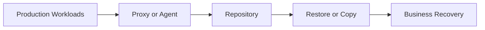

The product name is commonly shortened to **VBR**. In practice, VBR usually refers to the Windows-based backup server role and the management console, but operationally the term often includes the surrounding infrastructure that makes protection possible. A VBR deployment commonly includes:

- a backup server that runs Veeam services and stores configuration data
- one or more backup proxies that move and process data
- one or more repositories that store restore points
- optional scale-out backup repositories for policy-based capacity management
- optional hardened Linux repositories for immutability
- optional object storage integration for offload or direct backup targets
- optional enterprise management and reporting components

You should also distinguish Veeam Backup & Replication from adjacent Veeam products and services. Veeam ONE focuses on monitoring and reporting. Veeam Recovery Orchestrator addresses more formalized disaster recovery orchestration. Veeam Data Platform is a broader packaging concept that combines products into editions. In daily practice, administrators often say “Veeam” when they really mean “Veeam Backup & Replication,” so clarity matters.

---

[Go to Lesson TOC](#toc-l01)

[Go to Course TOC](#master-table-of-contents)

---

<a id="l01-backup-replication-and-copy-similar-words-different-jobs"></a>
## Backup, Replication and Copy: Similar Words, Different Jobs

One of the first sources of confusion for new administrators is the difference between a backup, a replica, and a copied backup.

A **backup** is a set of restore points stored in a backup repository. Backups are optimized for retention flexibility, storage efficiency, and a wide variety of restore operations. They are the backbone of most Veeam deployments.

A **replica** is a VM copy kept in a ready-to-start state on another host. Replication is usually chosen for faster failover in disaster recovery scenarios. The tradeoff is that replication is generally more infrastructure-specific and less flexible than a normal backup chain for long-term recovery requirements.

A **backup copy** is a second copy of already-created backups, typically moved to another repository, tier, or site. This improves resilience and supports multi-copy protection strategies. Backup copy jobs are extremely important in real-world design because a single backup chain on a single repository is not enough.

An **archive or long-term retention workflow** extends beyond normal operational retention and often targets tape or object storage tiers designed for extended retention windows and cost optimization.

Understanding these distinctions early prevents design mistakes later. Many weak environments are not caused by lack of tooling. They are caused by administrators assuming that one job type solves all recovery goals.

---

[Go to Lesson TOC](#toc-l01)

[Go to Course TOC](#master-table-of-contents)

---

<a id="l01-who-usually-uses-veeam-day-to-day"></a>
## Who Usually Uses Veeam Day to Day

One reason Veeam is so widely adopted is that it serves several operational personas at once. A virtualization administrator may care most about efficient VM protection and fast restore options. A systems administrator may focus on agent-based backup for physical servers or cloud-hosted Windows and Linux workloads. A storage or infrastructure architect may care more about repository design, immutability, and copy separation. A service desk escalation engineer may interact with Veeam mainly through guest file restore or application item recovery. All of these people are touching the same platform from different angles.

That matters because backup platforms often fail socially before they fail technically. If nobody clearly owns restore testing, backups may exist but recovery confidence remains low. If only one engineer understands repository design, growth and maintenance become fragile. If the security team is excluded from backup conversations, critical immutability and access-control decisions may be made too late. Learning Veeam well therefore means understanding not only what the software can do, but also how organizations divide responsibility around it.

---

[Go to Lesson TOC](#toc-l01)

[Go to Course TOC](#master-table-of-contents)

---

<a id="l01-veeam-in-the-context-of-data-resilience"></a>
## Veeam in the Context of Data Resilience

Data resilience is broader than backup, but backup is one of its central pillars. A resilient environment expects failure and still prepares to recover. That mindset affects how you think about every Veeam feature. Repositories are not simply storage targets; they are resilience anchors. Backup copy jobs are not just extra jobs; they are protection against a primary copy becoming unusable. Restore testing is not a checkbox; it is evidence that the environment can recover under real pressure.

This resilience mindset also changes how you talk about success. A successful Veeam environment is not defined solely by job success rate. It is defined by whether the business can recover the right data, in the right timeframe, from the right location, under the right conditions.

---

[Go to Lesson TOC](#toc-l01)

[Go to Course TOC](#master-table-of-contents)

---

<a id="l01-why-veeam-matters-in-modern-backup-strategy"></a>
## Why Veeam Matters in Modern Backup Strategy

Historically, backup was often treated as a nightly operational task. Modern resilience requires more. Organizations now expect:

- multiple copies of data
- copies stored in different fault domains
- immutability or isolation against ransomware
- application-consistent recovery
- verification that backups are actually recoverable
- flexible restoration across different scopes, from individual items to full services

Veeam became popular because it aligned well with these expectations, especially in virtual environments. Its recovery features, image-based protection model, and operational simplicity made it practical for busy infrastructure teams. Over time, the platform expanded to support modern requirements such as object storage integration, Linux hardened repositories, direct-to-object workflows, malware-aware recovery guidance, and broader workload coverage.

The most important mental shift for learners is this: Veeam is not just a way to “make backups.” It is a system for designing and executing recovery.

---

[Go to Lesson TOC](#toc-l01)

[Go to Course TOC](#master-table-of-contents)

---

<a id="l01-editions-and-licensing-at-a-high-level"></a>
## Editions and Licensing at a High Level

Licensing and packaging can change over time, so you should always verify current commercial details with official Veeam documentation and current sales guidance. Still, administrators need enough understanding to design and communicate effectively.

At a high level, you will encounter:

- community or trial-style access for lab or limited use
- Veeam Universal License concepts, commonly consumed per workload instance
- broader Veeam Data Platform packaging that bundles additional capabilities or related products depending on the edition

From an operational perspective, licensing matters because it can affect which workloads are protected, how many instances you can onboard, and whether certain advanced features or adjacent products are available. In many environments, licensing is not the immediate technical blocker. Poor planning is. But a good administrator should still know enough to avoid promising unsupported or unlicensed coverage.

---

[Go to Lesson TOC](#toc-l01)

[Go to Course TOC](#master-table-of-contents)

---

<a id="l01-high-level-edition-and-packaging-awareness"></a>
## High-Level Edition and Packaging Awareness

Because Veeam packaging evolves over time, the goal in this section is not to memorize a commercial matrix. Instead, you should understand the practical questions that licensing and edition choices raise:

- Are you protecting only a few workloads for a lab or proof of concept, or are you designing for a broad production estate?
- Do you need only backup and restore, or do you also expect broader monitoring, orchestration, or advanced platform capabilities?
- Are you likely to grow into additional workload types such as NAS, object-connected designs, or multi-platform protection?

These questions shape how organizations evaluate Veeam Universal Licensing and broader Veeam Data Platform editions. For exam preparation and operational understanding, the most important thing is to recognize that edition choice can affect platform scope, but it does not replace good technical design. Even a richly licensed environment can still be poorly protected if repositories, copy strategy, and recovery testing are weak.

---

[Go to Lesson TOC](#toc-l01)

[Go to Course TOC](#master-table-of-contents)

---

<a id="l01-core-use-cases-you-will-see-repeatedly"></a>
## Core Use Cases You Will See Repeatedly

Across this course, you will repeatedly return to a handful of real-world use cases:

1. Protect a set of VMs with application-aware processing and a sensible retention policy.
2. Keep a secondary copy of those backups on another repository or cloud-connected tier.
3. Protect physical or cloud-hosted standalone workloads with Veeam Agent.
4. Recover quickly at different scopes: file, application item, full system, or failed VM.
5. Validate recoverability, not just backup completion.
6. Harden the environment so that the backup platform itself is harder to compromise.

These are the operational motions that matter far more than memorizing product marketing language.

---

[Go to Lesson TOC](#toc-l01)

[Go to Course TOC](#master-table-of-contents)

---

<a id="l01-what-changed-in-v12-and-why-it-matters"></a>
## What Changed in v12 and Why It Matters

Version 12 was significant because it pushed Veeam further into modern storage patterns and security-oriented design. Although you will learn the details in later lessons, the major themes worth understanding now include:

- stronger object storage integration
- increased emphasis on immutability and hardened repository design
- broader workload flexibility and enterprise-scale storage patterns
- continued evolution in malware-aware and security-focused operational features

Later v12.x updates continued refining support matrices, security features, platform coverage, repository behaviors, and administrator workflows. For course purposes, treat **v12** as the platform generation and **v12.1, v12.2, and v12.3** as important operational refinements. Production administrators should always check the exact build and release notes before planning upgrades or new features.

---

[Go to Lesson TOC](#toc-l01)

[Go to Course TOC](#master-table-of-contents)

---

<a id="l01-practical-differences-between-learning-v12-and-operating-v12x"></a>
## Practical Differences Between Learning v12 and Operating v12.x

There is an important difference between learning a major platform generation and operating a specific point release. The major version gives you the architectural and conceptual model. The point release determines the exact support boundaries, updated features, UI refinements, and operational caveats you are actually working with.

For example, a design decision that is broadly correct for v12 may still require build-specific validation in production. Object storage behavior, hardened repository refinements, support for newer operating systems or hypervisor versions, and malware-aware recovery features can all evolve across point releases. This is why experienced administrators always pair conceptual knowledge with release-note discipline.

When teaching teams or planning production changes, a useful habit is to separate statements into two categories:

- **platform truths** that remain broadly valid across v12.x
- **build-specific details** that must be verified before implementation

This habit keeps your mental model stable while still respecting operational reality.

---

[Go to Lesson TOC](#toc-l01)

[Go to Course TOC](#master-table-of-contents)

---

<a id="l01-real-world-scenario-walkthrough"></a>
## Real-World Scenario Walkthrough

Consider a mid-sized organization with the following environment:

- 120 VMware virtual machines
- 15 physical Windows and Linux systems
- several department file shares
- one SQL-heavy business application
- a requirement for off-site copy and at least one immutable retention path

In that organization, Veeam Backup & Replication becomes more than a backup scheduler. It becomes the coordination point for multiple protection models:

- image-based VM backup for most virtualized workloads
- agent-based protection for physical and edge systems
- NAS protection for shared file data
- copy strategy for secondary resilience
- restore processes aligned to the service criticality of each workload

If the team thinks only in terms of “nightly backups,” they will under-design the environment. If they think in terms of recovery pathways and risk layers, they will use the platform much more effectively.

---

[Go to Lesson TOC](#toc-l01)

[Go to Course TOC](#master-table-of-contents)

---

<a id="l01-common-beginner-misunderstandings"></a>
## Common Beginner Misunderstandings

There are a few misconceptions that repeatedly cause trouble:

**“If the backup job is green, we are protected.”**  
Not necessarily. A successful job does not guarantee fast or successful recovery. You still need restore testing, verification, and sensible storage design.

**“Replication replaces backup.”**  
It does not. Replication is useful for fast failover, but you still need backups for retention flexibility, broader restore options, and resilience against corruption or site issues.

**“One repository is enough.”**  
It rarely is. If the repository fails, is encrypted, or becomes unavailable, your protection model collapses.

**“Virtual workloads are the only important ones.”**  
No-hypervisor workloads, physical systems, appliances, and standalone cloud servers are common and often critical.

---

[Go to Lesson TOC](#toc-l01)

[Go to Course TOC](#master-table-of-contents)

---

<a id="l01-lab-walkthrough"></a>
## Lab Walkthrough

<a id="l01-prerequisites"></a>
### Prerequisites

- access to a lab environment or at least the Veeam documentation site
- a text editor or notes tool
- optional: a trial or lab instance of Veeam Backup & Replication v12.x

<a id="l01-steps"></a>
### Steps

1. Create a simple worksheet with four columns: workload type, business criticality, target RPO, target RTO.
2. List at least five workloads you would expect in a real environment, such as domain controller, SQL Server, file server, Linux web server, and NAS share.
3. For each workload, decide whether backup alone is sufficient or whether replication or backup copy should also be considered.
4. Identify which workloads could be protected through hypervisor integration and which would need an agent-based path.
5. Write a one-paragraph summary answering this question: “Why is Veeam a recovery platform, not just a backup scheduler?”

<a id="l01-verification"></a>
### Verification

You have completed the lab if you can explain:

- the difference between backup, replica, and backup copy
- why multi-copy strategy matters
- how no-hypervisor workloads fit into the overall design

---

[Go to Lesson TOC](#toc-l01)

[Go to Course TOC](#master-table-of-contents)

---

<a id="l01-operational-checklist"></a>
## Operational Checklist

At the end of this lesson, you should be able to answer these practical starter questions without hesitation:

- What kinds of workloads will this Veeam environment protect?
- Which of those workloads depend on a hypervisor and which do not?
- Which workloads are most likely to require item-level or application-aware recovery?
- Which workloads would be dangerous to leave with only one backup copy?
- Which platform build is currently in use, and where would you validate feature details before making changes?

---

[Go to Lesson TOC](#toc-l01)

[Go to Course TOC](#master-table-of-contents)

---

<a id="l01-key-takeaways"></a>
## Key Takeaways

- Veeam Backup & Replication is a recovery-focused platform, not just a job runner.
- Backups, replicas, backup copies, and archives serve different operational purposes.
- The product supports virtual, physical, and file-based protection models.
- v12.x is best understood as a platform generation with meaningful later refinements.
- A successful backup strategy always starts by thinking about recovery outcomes.

---

[Go to Lesson TOC](#toc-l01)

[Go to Course TOC](#master-table-of-contents)

---

<a id="l01-review-questions"></a>
## Review Questions

1. What is the difference between a backup and a replica?
2. Why are backup copy jobs important in a resilience strategy?
3. What kinds of workloads can still be protected when there is no hypervisor?
4. Why is it dangerous to assume that a green job status means recovery is guaranteed?
5. Why should administrators pay attention to the exact v12.x build they are using?

---

<a id="l01-answers"></a>
### Answers

1. A backup stores restore points for flexible recovery and retention; a replica is a ready-to-start VM copy for faster failover.
2. They create an additional copy of backup data on another repository or site, reducing single-point-of-failure risk.
3. Physical servers, standalone systems, and cloud-hosted machines can be protected with Veeam Agent.
4. Because successful backup creation does not guarantee integrity, performance, recoverability, or proper restore testing.
5. Because support, features, and operational behavior can change across v12.1, v12.2, and v12.3.

---

[Go to Lesson TOC](#toc-l01)

[Go to Course TOC](#master-table-of-contents)

---

**License:** [CC BY-NC-SA 4.0](../LICENSE.md)

---

<a id="lesson-2-backup-theory-rpo-rto-3-2-1-and-backup-types"></a>
# Lesson 2 — Backup Theory: RPO, RTO, 3-2-1 and Backup Types


> **VMCE Objective(s):** Resilience concepts, backup terminology, retention and policy thinking  
> **Level:** Beginner  
> **Estimated reading time:** 40–50 minutes  
> **Lab time:** 25 minutes

<a id="toc-l02"></a>
## Table of Contents

- [Learning Objectives](#l02-learning-objectives)
- [Concepts and Theory](#l02-concepts-and-theory)
- [Why Business Context Matters](#l02-why-business-context-matters)
- [Translating Business Language Into Backup Policy](#l02-translating-business-language-into-backup-policy)
- [The 3-2-1 Rule and Its Modern Extensions](#l02-the-3-2-1-rule-and-its-modern-extensions)
- [Backup Types You Must Understand](#l02-backup-types-you-must-understand)
- [Operational Tradeoff Table](#l02-operational-tradeoff-table)
- [Retention Is Not the Same as Scheduling](#l02-retention-is-not-the-same-as-scheduling)
- [Compression, Deduplication and Encryption Tradeoffs](#l02-compression-deduplication-and-encryption-tradeoffs)
- [Translating Theory Into Veeam Policy Design](#l02-translating-theory-into-veeam-policy-design)
- [Scenario Examples](#l02-scenario-examples)
- [Decision Checklist](#l02-decision-checklist)
- [Update Awareness for v12.x](#l02-update-awareness-for-v12x)
- [Lab Walkthrough](#l02-lab-walkthrough)
- [Key Takeaways](#l02-key-takeaways)
- [Review Questions](#l02-review-questions)

---

[Go to Lesson TOC](#toc-l02)

[Go to Course TOC](#master-table-of-contents)

---

<a id="l02-learning-objectives"></a>
## Learning Objectives

- define RPO and RTO in practical business terms
- explain the 3-2-1 rule and modern extensions of that rule
- distinguish full, incremental, synthetic full, reverse incremental, and forever-forward concepts
- understand retention versus backup window versus copy strategy
- connect backup theory to day-to-day Veeam design choices

---

[Go to Lesson TOC](#toc-l02)

[Go to Course TOC](#master-table-of-contents)

---

<a id="l02-concepts-and-theory"></a>
## Concepts and Theory

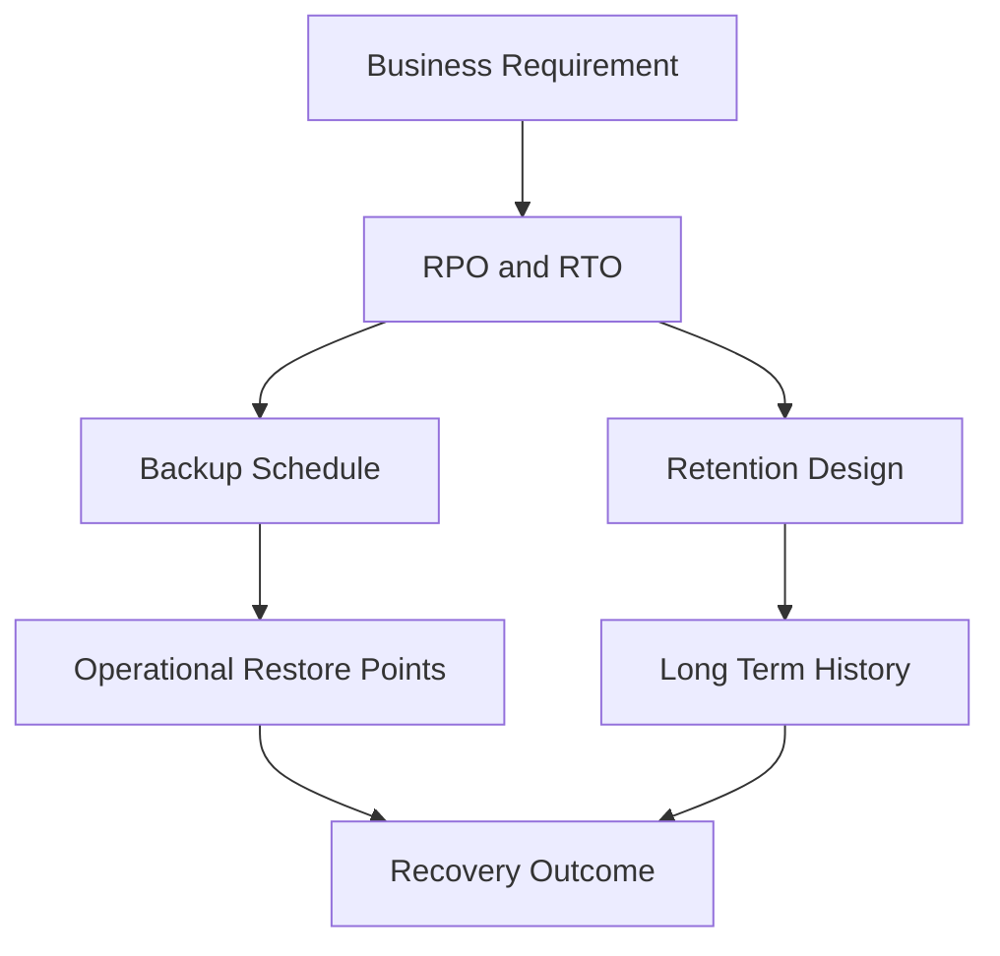

Before you configure a single Veeam job, you need to understand what problem backups are actually meant to solve. Backup administration is full of technical detail, but the real purpose is simple: preserve the ability to recover useful business data within an acceptable amount of data loss and downtime.

Two concepts govern almost every design conversation: **Recovery Point Objective (RPO)** and **Recovery Time Objective (RTO)**.

**RPO** is the maximum acceptable amount of data loss measured in time. If a server is backed up every four hours and it fails right before the next run, the theoretical data loss could be close to four hours. That is the practical meaning of RPO.

**RTO** is the maximum acceptable downtime before service must be restored. If the business can tolerate only fifteen minutes of outage, the recovery method must support that. A slow full restore from deep archive may satisfy retention, but not a tight RTO.

Administrators often confuse these two concepts. RPO is about how current the recovered data needs to be. RTO is about how quickly the service needs to be back.

---

[Go to Lesson TOC](#toc-l02)

[Go to Course TOC](#master-table-of-contents)

---

<a id="l02-why-business-context-matters"></a>
## Why Business Context Matters

The right protection design is never the same for every workload. A print server and a transactional database do not deserve the same policy. A payroll system and a development sandbox should not be prioritized equally. Good Veeam administrators translate business criticality into technical settings.

For example:

- a domain controller may require frequent backups and careful restore procedures, but perhaps not replication in every environment
- a SQL Server hosting revenue-critical data may need application-aware backups, shorter RPO, backup copies, and possibly replication
- a Linux web frontend might be rebuilt quickly from configuration management, making file-level protection of content and config more important than aggressive VM replication

The reason this lesson matters is that job settings are easy to click. Choosing the right settings is harder.

---

[Go to Lesson TOC](#toc-l02)

[Go to Course TOC](#master-table-of-contents)

---

<a id="l02-translating-business-language-into-backup-policy"></a>
## Translating Business Language Into Backup Policy

One of the most useful skills a backup administrator can develop is the ability to translate vague business language into concrete technical policy. Business leaders rarely ask for “hourly synthetic full strategy with weekly GFS retention.” They ask for things like:

- “we cannot lose more than an hour of work”
- “this system must be back before the business day starts”
- “finance needs seven years of historical records”
- “if ransomware hits, we need a clean copy that cannot be modified”

Your job is to translate those statements into schedule, retention, repository, copy, and restore design. This translation is where backup engineering becomes valuable. If you skip it, you create generic policies that are easy to configure but weak in practice.

---

[Go to Lesson TOC](#toc-l02)

[Go to Course TOC](#master-table-of-contents)

---

<a id="l02-the-3-2-1-rule-and-its-modern-extensions"></a>
## The 3-2-1 Rule and Its Modern Extensions

The classic **3-2-1 rule** means:

- keep at least **3 copies** of your data
- on at least **2 different media or storage types**
- with at least **1 copy off-site**

This rule remains a strong foundation because it forces redundancy and separation. But modern threat models, especially ransomware, pushed many organizations toward expanded versions such as **3-2-1-1-0**:

- 3 copies of data
- 2 different storage types
- 1 off-site copy
- 1 offline, air-gapped, or immutable copy
- 0 unverified backups, meaning restore points are tested and monitored

Veeam maps very naturally to this thinking. A primary repository can hold the first operational copy. A backup copy job or scale-out tier can create another copy. An immutable Linux repository, object storage with immutability, or tape can satisfy the isolated or immutable copy requirement. SureBackup-style validation or restore testing addresses the “0 errors” concept.

The deeper lesson is that backup is not only about storage. It is about fault domains. If all copies are writable by the same compromised account, the design may still fail under attack.

---

[Go to Lesson TOC](#toc-l02)

[Go to Course TOC](#master-table-of-contents)

---

<a id="l02-backup-types-you-must-understand"></a>
## Backup Types You Must Understand

Veeam exposes several methods and terms that can look intimidating at first, but the core logic is manageable once you understand restore points and change tracking.

<a id="l02-full-backup"></a>
### Full Backup

A full backup captures the complete dataset required for a recovery point. In practice, a full backup creates a self-contained restore point chain baseline. Full backups are easy to understand conceptually, but expensive if done too frequently because they consume more time, storage, and read operations from the source.

<a id="l02-incremental-backup"></a>
### Incremental Backup

An incremental backup stores only the changes since the last restore point, depending on the chain logic in use. Incrementals reduce daily backup impact and storage use, which is why they are common.

<a id="l02-synthetic-full"></a>
### Synthetic Full

A synthetic full creates a new full backup on the repository side using existing backup data plus incrementals, rather than rereading all data from production. This reduces source impact and can be very efficient when the repository is designed to handle the I/O.

<a id="l02-active-full"></a>
### Active Full

An active full reads all source data again from production. It is heavier but sometimes desirable to reset the chain from production data or as part of a periodic operational strategy.

<a id="l02-reverse-incremental"></a>
### Reverse Incremental

Reverse incremental keeps the most recent restore point in the full backup file while moving older states into reverse increments. Some environments used this to optimize certain restore patterns, but administrators must understand the storage and operational tradeoffs.

<a id="l02-forever-forward-incremental"></a>
### Forever Forward Incremental

This is a commonly discussed approach in modern backup design. The chain begins with a full backup and continues with incrementals. The oldest restore points are merged forward as retention ages out, keeping the chain manageable while minimizing repeated full backups.

The important point is not memorizing jargon. It is understanding how each method affects storage consumption, performance, backup windows, and recovery behavior.

---

[Go to Lesson TOC](#toc-l02)

[Go to Course TOC](#master-table-of-contents)

---

<a id="l02-operational-tradeoff-table"></a>
## Operational Tradeoff Table

| Backup pattern | Typical strength | Typical caution |
|---|---|---|
| Active full | Clean full read from source | Heavy source impact |
| Synthetic full | Lower production impact | Repository I/O can increase |
| Incremental chain | Efficient daily protection | Chain health and merge behavior matter |
| Reverse incremental | Recent state prominence | Operational complexity and storage behavior |
| Forever forward | Balanced common approach | Requires understanding of merge and retention behavior |

The goal is not to choose the “best” pattern universally. The goal is to choose the pattern that behaves acceptably in your environment and supports your recovery priorities.

---

[Go to Lesson TOC](#toc-l02)

[Go to Course TOC](#master-table-of-contents)

---

<a id="l02-retention-is-not-the-same-as-scheduling"></a>
## Retention Is Not the Same as Scheduling

New administrators often assume that backup frequency automatically equals retention quality. It does not. Frequency controls how often restore points are created. Retention controls how many restore points or how much history is kept. These are related but different decisions.

For example, you might back up a workload every four hours but retain only seven days of operational restore points. You might also create weekly, monthly, and yearly GFS points for longer retention. A short RPO requirement does not automatically mean long retention, and a long retention requirement does not automatically require an extremely short RPO.

In Veeam design, always separate the questions:

1. How often do I need new restore points?
2. How long do I need to keep them?
3. Where should additional copies live?
4. Which recovery methods must this policy support?

Administrators who confuse schedule and retention often make two opposite mistakes. The first is creating very frequent backups but retaining too little history to be useful after late discovery of data corruption or malware. The second is retaining enormous history without aligning it to realistic restore needs, creating waste and long-term management burden. Mature backup design tries to avoid both extremes.

---

[Go to Lesson TOC](#toc-l02)

[Go to Course TOC](#master-table-of-contents)

---

<a id="l02-compression-deduplication-and-encryption-tradeoffs"></a>
## Compression, Deduplication and Encryption Tradeoffs

Backup storage efficiency matters, but efficiency features can change behavior. Compression reduces backup size. Deduplication reduces redundant storage use. Encryption protects confidentiality. Each can affect performance and downstream storage efficiency.

For example, encrypted source data can reduce deduplication benefits. Compression settings can alter CPU use on proxies or repositories. These are not reasons to avoid the features. They are reasons to understand the consequences.

---

[Go to Lesson TOC](#toc-l02)

[Go to Course TOC](#master-table-of-contents)

---

<a id="l02-translating-theory-into-veeam-policy-design"></a>
## Translating Theory Into Veeam Policy Design

When you design a Veeam job, every key setting traces back to a fundamental question:

- retention window answers “how much history do I keep?”
- schedule answers “how frequently do I capture change?”
- backup copy answers “how many resilient copies do I maintain?”
- repository choice answers “how durable, fast, or secure is the storage?”
- immutability answers “how hard is it to destroy my backups?”
- application-aware processing answers “is the data inside the workload consistent?”

Understanding theory means your configuration choices stop being random.

---

[Go to Lesson TOC](#toc-l02)

[Go to Course TOC](#master-table-of-contents)

---

<a id="l02-scenario-examples"></a>
## Scenario Examples

<a id="l02-scenario-1-accounting-database"></a>
### Scenario 1 — Accounting Database

An accounting database may need relatively short RPO, application-aware protection, and longer retention than a test environment. That suggests more frequent restore points, careful guest/application consistency, and possibly longer copy retention.

<a id="l02-scenario-2-development-test-vm"></a>
### Scenario 2 — Development Test VM

A test VM may tolerate longer RPO and shorter retention. It may not justify replication. It might still need backup, but not premium protection treatment.

<a id="l02-scenario-3-branch-file-server"></a>
### Scenario 3 — Branch File Server

A branch file server may need daily protection, easy file-level restore, and at least one second copy off-site, especially if local IT support is limited.

These examples show why backup policy should reflect workload role, not just platform type.

---

[Go to Lesson TOC](#toc-l02)

[Go to Course TOC](#master-table-of-contents)

---

<a id="l02-decision-checklist"></a>
## Decision Checklist

Before creating a job, ask yourself:

- What is the real business impact if I lose the latest hour, four hours, or one day of data?
- How long can users wait for access to return?
- How much history is truly needed for operational recovery?
- Do I need a second copy in another fault domain?
- Do I need an immutable or otherwise protected copy?

---

[Go to Lesson TOC](#toc-l02)

[Go to Course TOC](#master-table-of-contents)

---

<a id="l02-update-awareness-for-v12x"></a>
## Update Awareness for v12.x

In the v12 generation, Veeam continued strengthening object storage, immutability, and large-scale backup strategy options. That means modern backup theory is not only about “disk versus tape.” It is increasingly about multi-tier copy strategy, immutable storage, and operational verification. When you read older backup advice, always ask whether it predates object-first or immutable backup design.

---

[Go to Lesson TOC](#toc-l02)

[Go to Course TOC](#master-table-of-contents)

---

<a id="l02-lab-walkthrough"></a>
## Lab Walkthrough

<a id="l02-prerequisites"></a>
### Prerequisites

- spreadsheet or notepad
- at least five example workloads
- optional access to a lab Veeam server

<a id="l02-steps"></a>
### Steps

1. Choose five workloads: one domain controller, one SQL workload, one Linux server, one file server, and one low-priority test VM.
2. Define a target RPO and RTO for each workload.
3. For each workload, decide whether it needs only backup, backup plus backup copy, or backup plus replication.
4. Write a retention policy for each workload including operational retention and long-term retention.
5. Identify which workloads would benefit most from immutability.
6. Explain why a single nightly full backup would be a weak design for at least two of the workloads.

<a id="l02-verification"></a>
### Verification

You have completed the lab if your policy choices clearly connect business requirements to technical settings.

---

[Go to Lesson TOC](#toc-l02)

[Go to Course TOC](#master-table-of-contents)

---

<a id="l02-key-takeaways"></a>
## Key Takeaways

- RPO measures acceptable data loss; RTO measures acceptable downtime.
- 3-2-1 and 3-2-1-1-0 thinking are practical design tools, not slogans.
- Backup type selection affects source impact, storage behavior, and restore workflow.
- Retention, frequency, and copy strategy must be planned separately.
- Good Veeam administration starts with policy logic, not wizard-clicking.

---

[Go to Lesson TOC](#toc-l02)

[Go to Course TOC](#master-table-of-contents)

---

<a id="l02-review-questions"></a>
## Review Questions

1. What is the difference between RPO and RTO?
2. What does the final “0” mean in 3-2-1-1-0?
3. Why might you choose a synthetic full instead of an active full?
4. Why is retention not the same as backup frequency?
5. Why should business criticality influence whether you choose backup only or backup plus replication?

---

<a id="l02-answers"></a>
### Answers

1. RPO defines acceptable data loss in time; RTO defines acceptable downtime to restore service.
2. It means backups should be verified so there are zero known unrecoverable or unvalidated backup errors.
3. To avoid rereading all production data while still producing a new full backup on the repository side.
4. Because frequency controls how often restore points are created, while retention controls how long they are kept.
5. Because critical systems may require faster recovery or additional resilience measures that backup alone does not provide.

---

[Go to Lesson TOC](#toc-l02)

[Go to Course TOC](#master-table-of-contents)

---

**License:** [CC BY-NC-SA 4.0](../LICENSE.md)

---

<a id="lesson-3-veeam-architecture-components-data-flow-and-deployment-models"></a>
# Lesson 3 — Veeam Architecture: Components, Data Flow and Deployment Models


> **VMCE Objective(s):** Core architecture, component roles, data flow understanding  
> **Level:** Beginner  
> **Estimated reading time:** 45–55 minutes  
> **Lab time:** 30 minutes

<a id="toc-l03"></a>
## Table of Contents

- [Learning Objectives](#l03-learning-objectives)
- [Concepts and Theory](#l03-concepts-and-theory)
- [The Backup Server](#l03-the-backup-server)
- [Backup Proxies](#l03-backup-proxies)
- [Backup Repositories](#l03-backup-repositories)
- [The Configuration Database](#l03-the-configuration-database)
- [Managed Servers and Infrastructure Objects](#l03-managed-servers-and-infrastructure-objects)
- [Data Flow at a High Level](#l03-data-flow-at-a-high-level)
- [Architecture as a Set of Boundaries](#l03-architecture-as-a-set-of-boundaries)
- [A Simple ASCII View](#l03-a-simple-ascii-view)
- [Small, Medium and Larger Deployment Models](#l03-small-medium-and-larger-deployment-models)
- [Architecture Patterns by Environment Size](#l03-architecture-patterns-by-environment-size)
- [Architectural Principles That Matter Early](#l03-architectural-principles-that-matter-early)
- [Architecture Review Questions for Real Environments](#l03-architecture-review-questions-for-real-environments)
- [v12.x Architectural Trends](#l03-v12x-architectural-trends)
- [Lab Walkthrough](#l03-lab-walkthrough)
- [Key Takeaways](#l03-key-takeaways)
- [Review Questions](#l03-review-questions)

---

[Go to Lesson TOC](#toc-l03)

[Go to Course TOC](#master-table-of-contents)

---

<a id="l03-learning-objectives"></a>
## Learning Objectives

- identify the major Veeam Backup & Replication components and their roles
- understand how data moves from source to restore point
- explain the purpose of backup server, proxy, repository, and optional supporting roles
- compare small, medium, and larger deployment models
- recognize why architecture decisions directly affect performance, scale, and resilience

---

[Go to Lesson TOC](#toc-l03)

[Go to Course TOC](#master-table-of-contents)

---

<a id="l03-concepts-and-theory"></a>
## Concepts and Theory

Veeam architecture is easiest to understand when you stop thinking of it as a single server application and instead see it as a coordinated set of roles. In a very small lab, several roles may coexist on one Windows server. In a larger environment, those roles are distributed to improve scalability, performance, and security. The names of the components matter because troubleshooting and design discussions often revolve around identifying which role is responsible for which task.

---

[Go to Lesson TOC](#toc-l03)

[Go to Course TOC](#master-table-of-contents)

---

<a id="l03-the-backup-server"></a>
## The Backup Server

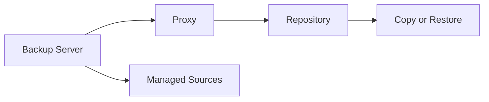

The **backup server** is the management brain of a Veeam deployment. It runs the core Veeam services, stores the configuration database reference, manages jobs, tracks infrastructure objects, and coordinates processing. Administrators connect to this server through the Veeam console or related management interfaces.

If the backup server is unavailable, jobs may stop, management becomes difficult, and restores may become more complex. This is why protecting the Veeam server itself and documenting its dependencies is so important. It is not usually the primary data mover in larger environments, but it is the control plane.

---

[Go to Lesson TOC](#toc-l03)

[Go to Course TOC](#master-table-of-contents)

---

<a id="l03-backup-proxies"></a>
## Backup Proxies

The **backup proxy** is the data mover and processor. It retrieves data from the source workload, applies processing such as compression and deduplication behavior relevant to the job flow, and sends the data toward the repository. In VMware environments, the proxy may use transport modes such as NBD, HotAdd, or Direct SAN. In Hyper-V or other scenarios, transport behavior differs.

Why does this matter? Because many performance and compatibility issues are not actually “backup server problems.” They are proxy path problems. A job that falls back from HotAdd to NBD can still succeed but perform badly. A proxy with too few resources can bottleneck an entire protection window.

---

[Go to Lesson TOC](#toc-l03)

[Go to Course TOC](#master-table-of-contents)

---

<a id="l03-backup-repositories"></a>
## Backup Repositories

The **backup repository** stores backup files and restore points. Repositories can be Windows-based, Linux-based, local disk, network-attached storage, deduplication appliances, or object-connected structures when used as part of broader designs like scale-out repositories or direct-to-object strategies.

Repositories are more than folders. Their design affects:

- backup ingest performance
- retention capacity
- immutability options
- health check and synthetic full efficiency
- copy and tiering behavior
- blast radius in a ransomware event

In mature environments, repository design becomes one of the most important architectural decisions.

---

[Go to Lesson TOC](#toc-l03)

[Go to Course TOC](#master-table-of-contents)

---

<a id="l03-the-configuration-database"></a>
## The Configuration Database

Veeam uses a configuration database to store metadata about jobs, infrastructure, sessions, settings, and operational state. In smaller deployments, this may be hosted in a bundled or local SQL-based option; in larger or more performance-sensitive environments, administrators often choose an external SQL platform.

Losing the configuration database does not automatically destroy backup files, but it complicates management and recovery of the Veeam environment itself. You should always treat the configuration database as a critical dependency.

---

[Go to Lesson TOC](#toc-l03)

[Go to Course TOC](#master-table-of-contents)

---

<a id="l03-managed-servers-and-infrastructure-objects"></a>
## Managed Servers and Infrastructure Objects

Veeam interacts with many managed systems, including:

- VMware vCenter or ESXi hosts
- Hyper-V hosts and clusters
- Windows or Linux servers used as repositories or agents
- NAS devices and file shares
- object storage endpoints

These are not just sources and targets. They are trust relationships. Credentials, ports, certificates, time sync, DNS, and permissions all matter.

---

[Go to Lesson TOC](#toc-l03)

[Go to Course TOC](#master-table-of-contents)

---

<a id="l03-data-flow-at-a-high-level"></a>
## Data Flow at a High Level

In a typical image-based virtual backup, the flow looks like this:

1. The backup server schedules and coordinates the job.
2. Veeam communicates with the virtualization platform to prepare the workload.
3. A proxy reads the source data.
4. Processed data is sent to the repository.
5. Metadata is updated in the configuration database.
6. Optional downstream jobs or tiers may later copy or move data.

For agent-based workloads, the protected system itself may participate more directly in data capture. For NAS backups, the flow centers on file share scanning, indexing, and repository/caching behavior rather than VM disk capture.

---

[Go to Lesson TOC](#toc-l03)

[Go to Course TOC](#master-table-of-contents)

---

<a id="l03-architecture-as-a-set-of-boundaries"></a>
## Architecture as a Set of Boundaries

It helps to think about Veeam architecture through boundaries rather than only through roles. The backup server is the coordination boundary. The proxy is the data movement boundary. The repository is the storage and retention boundary. Managed sources are the production boundary. When you view the platform this way, troubleshooting becomes much easier because you can ask: which boundary failed to do its job?

This mental model also improves design conversations. For example, when someone says “the backup server is slow,” you can ask whether the actual bottleneck is coordination, data movement, or repository write performance. Those are different things, even if the console makes them appear in one interface.

---

[Go to Lesson TOC](#toc-l03)

[Go to Course TOC](#master-table-of-contents)

---

<a id="l03-a-simple-ascii-view"></a>
## A Simple ASCII View

```text
            +-------------------+
            |   VEEAM-SRV       |
            | Backup Server     |
            | Console + Services|
            +---------+---------+
                      |
          +-----------+-----------+
          |                       |
  +-------v--------+     +--------v--------+
  | Backup Proxy   |     | Managed Sources |
  | Data Mover     |<--->| vCenter/HV/Agent|
  +-------+--------+     +-----------------+
          |
  +-------v--------+
  | Repository     |
  | Restore Points |
  +-------+--------+
          |
  +-------v--------+
  | Copy/Tier/Tape |
  +----------------+
```

This diagram is deliberately simple. Later lessons will add more detail around scale-out repositories, capacity tiers, hardened repositories, and replication targets.

---

[Go to Lesson TOC](#toc-l03)

[Go to Course TOC](#master-table-of-contents)

---

<a id="l03-small-medium-and-larger-deployment-models"></a>
## Small, Medium and Larger Deployment Models

In a **small environment**, it is common to place the backup server, proxy role, and repository role on one machine. This is easy to deploy and appropriate for labs or small businesses with modest workloads. The downside is role concentration. Performance bottlenecks and security exposure are centralized.

In a **medium environment**, the backup server may remain separate from at least one repository and one proxy. This allows better workload distribution and often improves scalability.

In a **larger environment**, multiple proxies, multiple repository extents, hardened storage, copy targets, and possibly enterprise management components are common. Here, design is less about “can Veeam run?” and more about “can it run predictably, securely, and at scale?”

---

[Go to Lesson TOC](#toc-l03)

[Go to Course TOC](#master-table-of-contents)

---

<a id="l03-architecture-patterns-by-environment-size"></a>
## Architecture Patterns by Environment Size

| Environment size | Common pattern | Main risk |
|---|---|---|
| Small lab | All-in-one server | Role concentration |
| Small production | Backup server plus dedicated repository | Underestimating growth |
| Medium production | Dedicated backup server, proxies, repositories | Inconsistent credential and role design |
| Larger enterprise | Multiple proxies, multiple repositories, copy tiers, hardened storage | Complexity without documentation |

A strong architecture scales not only technically but operationally. If the design cannot be understood quickly by the team that runs it, it becomes fragile under turnover, incidents, or growth.

---

[Go to Lesson TOC](#toc-l03)

[Go to Course TOC](#master-table-of-contents)

---

<a id="l03-architectural-principles-that-matter-early"></a>
## Architectural Principles That Matter Early

Even as a beginner, you should internalize a few principles:

**Keep management and data paths clear.**  
Know which component controls the job and which component actually moves data.

**Scale the data mover, not just the console server.**  
Adding CPU to the Veeam server does not solve a badly placed proxy.

**Treat repositories as strategic assets.**  
If your repository design is weak, your recovery design is weak.

**Minimize unnecessary trust.**  
Shared credentials and excessive permissions increase risk.

**Design for failure domains.**  
If one site, server, credential, or storage system is compromised, what survives?

---

[Go to Lesson TOC](#toc-l03)

[Go to Course TOC](#master-table-of-contents)

---

<a id="l03-architecture-review-questions-for-real-environments"></a>
## Architecture Review Questions for Real Environments

When reviewing an existing Veeam deployment, ask:

- Which component is doing data movement today?
- Is the repository in the same administrative blast radius as the backup server?
- Are the control plane and storage plane separated enough for the organization’s threat model?
- If the backup server is lost, how quickly could the team rebuild the environment and regain visibility?
- Does the architecture support both operational recovery and cyber resilience?

---

[Go to Lesson TOC](#toc-l03)

[Go to Course TOC](#master-table-of-contents)

---

<a id="l03-v12x-architectural-trends"></a>
## v12.x Architectural Trends

The v12 generation reinforced several architectural trends:

- stronger object storage use cases
- greater importance of immutable repository design
- more deliberate separation of management and storage trust boundaries
- increased attention to cyber resilience, not just operational backup completion

This means that architecture in modern Veeam environments is increasingly a security and resilience discussion, not just a performance discussion.

---

[Go to Lesson TOC](#toc-l03)

[Go to Course TOC](#master-table-of-contents)

---

<a id="l03-lab-walkthrough"></a>
## Lab Walkthrough

<a id="l03-prerequisites"></a>
### Prerequisites

- a lab note sheet or whiteboard
- optional access to an existing Veeam environment

<a id="l03-steps"></a>
### Steps

1. Draw your own Veeam architecture diagram using the systems in your lab or a hypothetical environment.
2. Mark the backup server, at least one proxy, at least one repository, and at least two protected workloads.
3. Identify the data path for a VMware VM backup, a Hyper-V VM backup, and a physical server backup.
4. Add a second copy target such as object storage, tape, or a secondary repository.
5. Circle which components are management-plane systems and which are data-plane systems.

<a id="l03-verification"></a>
### Verification

You have completed the lab if you can explain, in order, how data moves during a standard backup job and which component would be most likely responsible for a performance bottleneck.

---

[Go to Lesson TOC](#toc-l03)

[Go to Course TOC](#master-table-of-contents)

---

<a id="l03-key-takeaways"></a>
## Key Takeaways

- The backup server coordinates jobs; proxies move data; repositories store restore points.
- The configuration database is a critical dependency even though it is not the backup data itself.
- Architectural choices affect scale, performance, and security.
- Small environments can combine roles, but larger environments benefit from separation.
- Modern Veeam architecture must consider immutability and multi-copy resilience from the start.

---

[Go to Lesson TOC](#toc-l03)

[Go to Course TOC](#master-table-of-contents)

---

<a id="l03-review-questions"></a>
## Review Questions

1. What is the main role of the backup server?
2. Why is the backup proxy important?
3. What risks come from placing all roles on a single server?
4. Why should administrators treat the configuration database as critical?
5. How does repository design affect resilience?

---

<a id="l03-answers"></a>
### Answers

1. It coordinates jobs, stores configuration metadata references, and manages the environment.
2. It retrieves and processes source data and is often the key performance component during backups.
3. It concentrates performance load, operational dependency, and security risk in one place.
4. Because it stores the environment’s operational metadata and losing it complicates management and recovery.
5. It determines where restore points live, how fast they can be written or restored, and how resistant they are to failure or attack.

---

[Go to Lesson TOC](#toc-l03)

[Go to Course TOC](#master-table-of-contents)

---

**License:** [CC BY-NC-SA 4.0](../LICENSE.md)

---

<a id="lesson-4-planning-your-deployment-requirements-ports-service-accounts-and-readiness"></a>
# Lesson 4 — Planning Your Deployment: Requirements, Ports, Service Accounts and Readiness


> **VMCE Objective(s):** Deployment planning, prerequisite validation, infrastructure readiness  
> **Level:** Beginner  
> **Estimated reading time:** 45–55 minutes  
> **Lab time:** 30 minutes

<a id="toc-l04"></a>
## Table of Contents

- [Learning Objectives](#l04-learning-objectives)
- [Concepts and Theory](#l04-concepts-and-theory)
- [Operating System and Host Readiness](#l04-operating-system-and-host-readiness)
- [Database Planning](#l04-database-planning)
- [Service Accounts and Permission Design](#l04-service-accounts-and-permission-design)
- [Account Design Patterns That Age Well](#l04-account-design-patterns-that-age-well)
- [Network, Ports and Firewalls](#l04-network-ports-and-firewalls)
- [DNS and Time Synchronization](#l04-dns-and-time-synchronization)
- [Virtualization Readiness](#l04-virtualization-readiness)
- [Storage and Repository Readiness](#l04-storage-and-repository-readiness)
- [Common Deployment Mistakes](#l04-common-deployment-mistakes)
- [Pre-Install Readiness Checklist](#l04-pre-install-readiness-checklist)
- [Scenario Example](#l04-scenario-example)
- [Update Awareness for v12.x](#l04-update-awareness-for-v12x)
- [Lab Walkthrough](#l04-lab-walkthrough)
- [Key Takeaways](#l04-key-takeaways)
- [Review Questions](#l04-review-questions)

---

[Go to Lesson TOC](#toc-l04)

[Go to Course TOC](#master-table-of-contents)

---

<a id="l04-learning-objectives"></a>
## Learning Objectives

- identify the major prerequisites for deploying Veeam Backup & Replication
- understand why sizing, ports, permissions, and service accounts matter before installation
- plan for external dependencies such as SQL and virtualization access
- avoid common installation mistakes that create later operational problems

---

[Go to Lesson TOC](#toc-l04)

[Go to Course TOC](#master-table-of-contents)

---

<a id="l04-concepts-and-theory"></a>
## Concepts and Theory

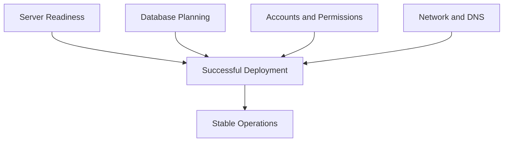

Many Veeam problems that appear later in production actually begin during deployment planning. An installation can complete successfully and still produce an environment that is fragile, undersized, over-privileged, or difficult to scale. Lesson 4 is about avoiding that trap.

When planning a Veeam deployment, think in terms of dependency categories:

- operating system and hardware readiness
- database choice and placement
- account and permission model
- network and firewall readiness
- virtualization platform access
- storage target readiness
- time synchronization, DNS, and name resolution

If you validate these well, installation becomes routine. If you skip them, you create hidden support debt.

---

[Go to Lesson TOC](#toc-l04)

[Go to Course TOC](#master-table-of-contents)

---

<a id="l04-operating-system-and-host-readiness"></a>
## Operating System and Host Readiness

Veeam Backup & Replication is commonly deployed on Windows Server. The exact supported versions change over time, so always verify the current Veeam support matrix before installing in production. Beyond simple supportability, pay attention to the practical readiness questions:

- Is the server dedicated or shared with unrelated roles?
- Does it have sufficient CPU and RAM for expected scale?
- Is storage provisioned sensibly for logs, temporary operations, and updates?
- Is the server domain-joined if the design assumes domain identities?
- Are OS patching and security baselines compatible with required Veeam communication?

In a lab, almost anything “works.” In production, it is better to avoid role sprawl. The more unrelated software you place on the Veeam server, the more operational and security risk you inherit.

---

[Go to Lesson TOC](#toc-l04)

[Go to Course TOC](#master-table-of-contents)

---

<a id="l04-database-planning"></a>
## Database Planning

Veeam uses a configuration database. Small environments often begin with a local or bundled database option, while larger environments may use an externally hosted SQL Server. The decision should be based on environment size, operational standards, DBA support expectations, and recovery planning.

Important considerations include:

- who backs up the database itself
- who is responsible for patching and maintenance
- whether latency or availability between Veeam and the database is acceptable
- how upgrades and rollback are handled

Externalizing the database is not automatically better. It is often better for larger organizations with established database administration practices, but it also introduces another dependency that must be managed carefully.

---

[Go to Lesson TOC](#toc-l04)

[Go to Course TOC](#master-table-of-contents)

---

<a id="l04-service-accounts-and-permission-design"></a>
## Service Accounts and Permission Design

One of the most common mistakes in backup deployments is using an account with far too much privilege because it is convenient. Convenience and good design are not the same thing.

Veeam needs accounts for multiple trust relationships, including:

- local installation and service execution
- access to virtualization platforms
- access to managed Windows and Linux servers
- access to repositories and object storage
- guest processing for application-aware backups

Best practice thinking starts with separation of purpose. Do not assume the same account should do everything. A domain administrator account might make initial setup easy, but it broadens the blast radius if that account is later compromised.

When you design accounts, ask:

- what system is this account accessing?
- what exact rights does it need?
- is this account interactive or service-only?
- how will credentials be rotated?
- what happens if the account is locked out or expires?

Many backup failures come from expired credentials rather than broken software.

---

[Go to Lesson TOC](#toc-l04)

[Go to Course TOC](#master-table-of-contents)

---

<a id="l04-account-design-patterns-that-age-well"></a>
## Account Design Patterns That Age Well

Strong account design is usually boring, which is exactly why it works. A mature environment tends to separate accounts by purpose and reduce informal exceptions. For example, the account used to install or maintain the Veeam server should not automatically become the same account used for guest processing inside every protected VM. Likewise, the account used to access VMware infrastructure should not necessarily be the same identity used to administer Linux repository servers.

This separation improves both troubleshooting and security. When a task fails, you can more easily identify which access path is broken. When a credential must be rotated, you can update a clearly defined dependency rather than risking accidental outage across half the environment.

---

[Go to Lesson TOC](#toc-l04)

[Go to Course TOC](#master-table-of-contents)

---

<a id="l04-network-ports-and-firewalls"></a>
## Network, Ports and Firewalls

Veeam is a distributed system. Distributed systems depend on network communication. Administrators sometimes underestimate how much backup reliability depends on port reachability, DNS consistency, certificate trust, and basic connectivity.

At a minimum, plan for communication among:

- backup server and proxies
- backup server and repositories
- backup server and vCenter / ESXi / Hyper-V hosts
- backup server and guest OS systems when guest processing is used
- backup server and object storage endpoints if relevant

Do not reduce this to “open all ports.” You should know which traffic is required and which ranges are customizable. This becomes especially important in segmented or security-conscious networks.

---

[Go to Lesson TOC](#toc-l04)

[Go to Course TOC](#master-table-of-contents)

---

<a id="l04-dns-and-time-synchronization"></a>
## DNS and Time Synchronization

DNS and time synchronization sound mundane, but they repeatedly appear in Veeam troubleshooting. Name resolution problems can cause infrastructure onboarding failures, certificate mismatch confusion, and unreliable communication with managed servers. Time drift can affect authentication, logging correlation, and event interpretation.

A mature deployment validates forward resolution, reverse resolution where relevant, and consistent NTP or domain time behavior before the backup platform is installed.

---

[Go to Lesson TOC](#toc-l04)

[Go to Course TOC](#master-table-of-contents)

---

<a id="l04-virtualization-readiness"></a>
## Virtualization Readiness

For VMware environments, decide whether Veeam will integrate with vCenter or directly with hosts. In most managed environments, vCenter is preferred because it provides centralized inventory and control. For Hyper-V, think about standalone hosts versus clusters and how WinRM, credentials, and network access will behave.

You should also know ahead of time:

- which workloads will need application-aware processing
- whether transport mode choices are constrained by the environment
- whether proxies need network or storage adjacency to the source workloads

---

[Go to Lesson TOC](#toc-l04)

[Go to Course TOC](#master-table-of-contents)

---

<a id="l04-storage-and-repository-readiness"></a>
## Storage and Repository Readiness

Even before installation, decide where restore points will go. If you postpone repository thinking, the backup server often ends up storing data locally “for now,” and temporary designs have a habit of becoming permanent.

Repository planning questions include:

- local disk, dedicated server, NAS, hardened Linux, or object-connected design?
- expected growth over 6, 12, and 24 months?
- immutability requirements?
- operational maintenance windows?
- copy strategy and off-site requirements?

---

[Go to Lesson TOC](#toc-l04)

[Go to Course TOC](#master-table-of-contents)

---

<a id="l04-common-deployment-mistakes"></a>
## Common Deployment Mistakes

The most common avoidable mistakes are:

- installing Veeam on an underpowered all-in-one server for a growing environment
- using an over-privileged domain admin credential everywhere
- ignoring port and DNS readiness until after onboarding fails
- not documenting account ownership and password expiration
- treating repository planning as an afterthought
- upgrading without a clear rollback or configuration backup plan

---

[Go to Lesson TOC](#toc-l04)

[Go to Course TOC](#master-table-of-contents)

---

<a id="l04-pre-install-readiness-checklist"></a>
## Pre-Install Readiness Checklist

Use the following as a practical readiness gate before installing in production:

- supported Windows version verified
- system sizing reviewed against expected workload count and growth
- hostname, DNS, and time synchronization validated
- database placement choice documented
- installation account and service-access model documented
- target repository plan documented
- firewall and port path assumptions validated
- virtualization platform access method identified
- configuration backup destination planned

If several items on this list are uncertain, the install should pause. Pausing before deployment is cheaper than redesigning a half-working environment later.

---

[Go to Lesson TOC](#toc-l04)

[Go to Course TOC](#master-table-of-contents)

---

<a id="l04-scenario-example"></a>
## Scenario Example

Imagine an organization that deploys Veeam quickly onto an existing utility Windows server because “it has enough space.” The same system also hosts unrelated management tools, has inconsistent patching, and uses a domain admin account whose password expires every 45 days. Installation may succeed. But over the next three months the team will likely experience avoidable failures: service interruptions after patching, confusion over which tool changed what, and job failures when the credential rotates. The technical product did not fail. The planning did.

---

[Go to Lesson TOC](#toc-l04)

[Go to Course TOC](#master-table-of-contents)

---

<a id="l04-update-awareness-for-v12x"></a>
## Update Awareness for v12.x

Across v12.x, administrators should pay extra attention to current support matrices, repository guidance, security hardening practices, and release-specific upgrade notes. Newer v12 releases often improve feature behavior, but they can also change prerequisites or supported combinations. Do not assume a design validated on early v12 behaves identically on later v12.x builds without checking release notes.

---

[Go to Lesson TOC](#toc-l04)

[Go to Course TOC](#master-table-of-contents)

---

<a id="l04-lab-walkthrough"></a>
## Lab Walkthrough

<a id="l04-prerequisites"></a>
### Prerequisites

- a blank planning worksheet
- sample environment details

<a id="l04-steps"></a>
### Steps

1. Create a checklist for your future `VEEAM-SRV` deployment.
2. Document the chosen OS, CPU, memory, and expected protected workload count.
3. Decide whether the configuration database will be local or external.
4. List every required account and the system each account will access.
5. Identify the major network paths that must be allowed.
6. Decide where the initial repository will reside.
7. Add a note describing how you would protect the Veeam configuration backup.

<a id="l04-verification"></a>
### Verification

You have completed the lab if you can hand your worksheet to another administrator and they could explain how the deployment is supposed to work before the installer is ever launched.

---

[Go to Lesson TOC](#toc-l04)

[Go to Course TOC](#master-table-of-contents)

---

<a id="l04-key-takeaways"></a>
## Key Takeaways

- Installation success is not the same as deployment quality.
- Account design, database planning, and repository placement should be decided before installation.
- DNS, ports, and time sync are operational requirements, not minor details.
- Early design shortcuts often become future troubleshooting tickets.

---

[Go to Lesson TOC](#toc-l04)

[Go to Course TOC](#master-table-of-contents)

---

<a id="l04-review-questions"></a>
## Review Questions

1. Why is using one highly privileged account for all Veeam tasks a bad practice?
2. What kinds of issues can DNS problems cause in a Veeam deployment?
3. Why should repository planning happen before installation?
4. What are the tradeoffs of using an external database?
5. Why should you document account ownership and password policies during planning?

---

<a id="l04-answers"></a>
### Answers

1. Because it expands the security blast radius and makes privilege separation difficult.
2. Infrastructure onboarding failures, certificate trust confusion, communication issues, and harder troubleshooting.
3. Because restore point placement, capacity, performance, and security strategy all depend on it.
4. It can improve organizational fit and scale, but introduces another managed dependency.
5. Because expired or locked credentials are a common cause of backup and management failures.

---

[Go to Lesson TOC](#toc-l04)

[Go to Course TOC](#master-table-of-contents)

---

**License:** [CC BY-NC-SA 4.0](../LICENSE.md)

---

<a id="lesson-5-lab-installing-veeam-backup-replication-v12-on-windows-server"></a>
# Lesson 5 — Lab: Installing Veeam Backup & Replication v12 on Windows Server


> **VMCE Objective(s):** Core installation and initial platform setup  
> **Level:** Beginner  
> **Estimated reading time:** 25–35 minutes  
> **Lab time:** 60–90 minutes

<a id="toc-l05"></a>
## Table of Contents

- [Learning Objectives](#l05-learning-objectives)
- [Concepts and Theory](#l05-concepts-and-theory)
- [Lab Topology for This Lesson](#l05-lab-topology-for-this-lesson)
- [Prerequisites](#l05-prerequisites)
- [Step-by-Step Lab Walkthrough](#l05-step-by-step-lab-walkthrough)
- [Common Installation Problems to Watch For](#l05-common-installation-problems-to-watch-for)
- [Troubleshooting Notes for This Lab](#l05-troubleshooting-notes-for-this-lab)
- [Platform Notes for Different Learning Paths](#l05-platform-notes-for-different-learning-paths)
- [Verification Checklist](#l05-verification-checklist)
- [Key Takeaways](#l05-key-takeaways)
- [Review Questions](#l05-review-questions)

---

[Go to Lesson TOC](#toc-l05)

[Go to Course TOC](#master-table-of-contents)

---

<a id="l05-learning-objectives"></a>
## Learning Objectives

- install Veeam Backup & Replication in a lab or controlled environment
- verify prerequisite readiness before running the installer
- understand the major installer phases and first-launch tasks
- perform basic post-install validation

---

[Go to Lesson TOC](#toc-l05)

[Go to Course TOC](#master-table-of-contents)

---

<a id="l05-concepts-and-theory"></a>
## Concepts and Theory

Installing Veeam is straightforward when the groundwork is done properly. The purpose of this lab is not merely to complete an installer wizard. It is to build disciplined deployment habits: verify prerequisites, understand dependencies, document decisions, and validate the platform before moving on to infrastructure onboarding.

In production, you should always align the exact installation flow with the current build’s release notes and supported upgrade/install guidance. In a lab, the goal is simpler: build a clean and understandable Veeam server that you can use for the rest of the course.

---

[Go to Lesson TOC](#toc-l05)

[Go to Course TOC](#master-table-of-contents)

---

<a id="l05-lab-topology-for-this-lesson"></a>
## Lab Topology for This Lesson

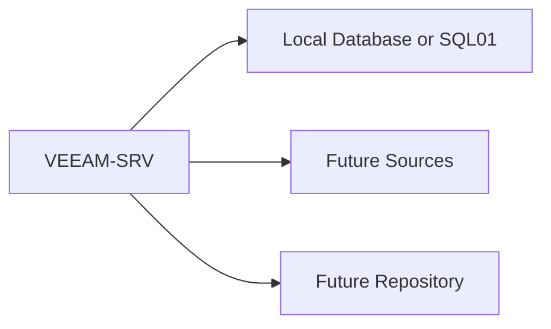

Minimum recommended systems:

- `VEEAM-SRV` — Windows Server for the Veeam Backup & Replication role
- optional `SQL01` — external SQL Server if you want to test separated database placement
- network connectivity to at least one future source system and one future repository target

---

[Go to Lesson TOC](#toc-l05)

[Go to Course TOC](#master-table-of-contents)

---

<a id="l05-prerequisites"></a>
## Prerequisites

Before installation, confirm the following:

- the Windows Server version is supported by the intended Veeam build
- the server has sufficient CPU, RAM, and free disk space
- the system has a stable hostname and correct DNS settings
- the account used to install Veeam has local administrative rights on `VEEAM-SRV`
- required Windows updates and restarts are complete
- antivirus or endpoint controls are reviewed so they do not block installation paths or services
- database decision is made: local/bundled or external

---

[Go to Lesson TOC](#toc-l05)

[Go to Course TOC](#master-table-of-contents)

---

<a id="l05-step-by-step-lab-walkthrough"></a>
## Step-by-Step Lab Walkthrough

<a id="l05-step-1-prepare-the-server"></a>
### Step 1 — Prepare the Server

Log on to `VEEAM-SRV` with the installation account. Confirm the server name, IP configuration, domain membership if applicable, and current time synchronization. Open Server Manager and verify there are no pending reboots.

If your organization uses a server build checklist, document the machine’s intended purpose as the Veeam backup server. This sounds procedural, but it prevents role confusion later.

<a id="l05-step-2-gather-installation-media-and-license-or-trial-access"></a>
### Step 2 — Gather Installation Media and License or Trial Access

Obtain the Veeam Backup & Replication v12.x installation media appropriate for your lab. If you are using a trial or community-appropriate access path, make sure you understand any feature or workload limitations that may affect later lessons.

<a id="l05-step-3-decide-on-database-placement"></a>
### Step 3 — Decide on Database Placement

If you are using a small self-contained lab, a local or bundled database path may be sufficient. If you want to simulate a more structured environment, point Veeam to an external SQL Server such as `SQL01`. Record your choice. The course works with either model, but later troubleshooting and upgrade lessons will be easier if you remember what you chose and why.

<a id="l05-step-4-launch-the-installer"></a>
### Step 4 — Launch the Installer

Start the Veeam installer. The exact UI may differ slightly by build, but the general flow remains similar:

1. launch setup
2. accept the license agreement
3. supply license details if required by your environment
4. allow the installer to check prerequisites
5. resolve any missing components it flags
6. select installation paths and database settings
7. confirm service account behavior if prompted
8. begin installation

Do not rush past prerequisite warnings. If the installer flags missing components or unsupported conditions, stop and resolve them properly instead of hoping they will not matter later.

<a id="l05-step-5-review-prerequisite-checks-carefully"></a>
### Step 5 — Review Prerequisite Checks Carefully

This step is where experienced administrators differ from rushed ones. If the installer indicates a missing runtime, system component, or other prerequisite, pause and understand the reason. A clean prerequisite screen is part of a clean deployment.

In some environments, security tools or outbound restrictions may prevent automatic prerequisite retrieval. If that happens, obtain the required packages through your approved software process and rerun the check.

<a id="l05-step-6-complete-installation-and-reboot-if-needed"></a>
### Step 6 — Complete Installation and Reboot if Needed

Allow the install to finish. If the system requires a reboot, complete it before launching the Veeam console. Do not treat “almost finished” as “ready.” Services, drivers, and dependencies should be fully initialized before validation begins.

<a id="l05-step-7-launch-the-veeam-console"></a>
### Step 7 — Launch the Veeam Console

Open the Veeam Backup & Replication console from `VEEAM-SRV`. Confirm that the console connects successfully to the backup server and that core views load without obvious errors.

At this stage, you are not expecting protected workloads yet. You are validating the platform itself.

<a id="l05-step-8-perform-immediate-post-install-checks"></a>
### Step 8 — Perform Immediate Post-Install Checks

Check the following:

- Veeam services are running
- the configuration database is reachable
- the local backup infrastructure views open normally
- there are no obvious warning dialogs about failed components
- the system event log does not show fresh service failures related to Veeam startup

<a id="l05-step-9-record-the-build-and-baseline-state"></a>
### Step 9 — Record the Build and Baseline State

Document the exact Veeam build installed, the Windows Server version, the database choice, and the account used for installation. Capture this information in a simple deployment note. Later, when you study upgrades, troubleshooting, or supportability, these basic facts will matter.

This step is often skipped in labs because the environment feels disposable. But keeping the habit is valuable. Production recovery and support work is easier when the baseline is written down from day one.

<a id="l05-step-10-configure-a-configuration-backup-target-plan"></a>
### Step 10 — Configure a Configuration Backup Target Plan

Even in a lab, make note of how you would back up the Veeam configuration. In production, the Veeam configuration backup is essential because it protects metadata about your backup environment and speeds rebuild scenarios.

You do not need to complete the full configuration backup strategy in this lesson, but you should identify where it would go and who would own it.

<a id="l05-step-11-capture-a-post-install-health-snapshot"></a>
### Step 11 — Capture a Post-Install Health Snapshot

Before ending the lab, note the following:

- core services visible and healthy
- console launches consistently
- no unresolved prerequisite issues remain
- installation media and version details are documented

Think of this as a baseline snapshot. Later, if something breaks, you will know what “good” looked like.

---

[Go to Lesson TOC](#toc-l05)

[Go to Course TOC](#master-table-of-contents)

---

<a id="l05-common-installation-problems-to-watch-for"></a>
## Common Installation Problems to Watch For

- pending reboot blocks prerequisite installation
- antivirus blocks file extraction or service creation
- external SQL connectivity fails because of permissions or firewall issues
- installer account lacks local administrative rights
- server naming, DNS or certificate trust issues later confuse console connectivity

---

[Go to Lesson TOC](#toc-l05)

[Go to Course TOC](#master-table-of-contents)

---

<a id="l05-troubleshooting-notes-for-this-lab"></a>
## Troubleshooting Notes for This Lab

If the console does not connect after installation, begin by checking whether Veeam services actually started and whether the database path is reachable. If prerequisites failed during setup, avoid the temptation to proceed “for now.” Re-run the checks and resolve the gap cleanly. If the installer appears to hang or fail unexpectedly, confirm there is no endpoint protection interfering with service creation or binary extraction.

These habits may feel cautious in a lab, but they build the discipline needed in production where partial installs become expensive to unwind.

---

[Go to Lesson TOC](#toc-l05)

[Go to Course TOC](#master-table-of-contents)

---

<a id="l05-platform-notes-for-different-learning-paths"></a>
## Platform Notes for Different Learning Paths

This lesson is shared across all paths because the Veeam management server is still central even if you later focus on no-hypervisor agent protection. The difference comes later when you begin onboarding sources and choosing repositories.

---

[Go to Lesson TOC](#toc-l05)

[Go to Course TOC](#master-table-of-contents)

---

<a id="l05-verification-checklist"></a>
## Verification Checklist

You can consider the lab complete when all of the following are true:

- `VEEAM-SRV` boots cleanly after installation
- the Veeam console opens successfully
- core Veeam services are running
- the environment is ready for infrastructure onboarding in Lesson 6

---

[Go to Lesson TOC](#toc-l05)

[Go to Course TOC](#master-table-of-contents)

---

<a id="l05-key-takeaways"></a>
## Key Takeaways

- A disciplined Veeam installation begins before the setup wizard starts.
- Prerequisite failures should be resolved, not ignored.
- Post-install validation is part of the installation, not an optional extra.
- Documenting database choice and configuration backup strategy now will help later.

---

[Go to Lesson TOC](#toc-l05)

[Go to Course TOC](#master-table-of-contents)

---

<a id="l05-review-questions"></a>
## Review Questions

1. Why should you confirm there are no pending reboots before installing Veeam?
2. Why is a clean prerequisite check important?
3. What should you verify immediately after installation completes?
4. Why should you think about configuration backup even in a lab?
5. What is one common cause of external database connection failure during installation?

---

<a id="l05-answers"></a>
### Answers

1. Pending reboots can interrupt component installation and leave the environment in a partial or unstable state.
2. Because unresolved prerequisites often become later failures in services or management components.
3. Service health, console connectivity, database reachability, and absence of obvious startup errors.
4. Because rebuilding Veeam without protected configuration metadata is much harder, and the lab teaches production habits.
5. Firewall, credential, or SQL permissions issues.

---

[Go to Lesson TOC](#toc-l05)

[Go to Course TOC](#master-table-of-contents)

---

**License:** [CC BY-NC-SA 4.0](../LICENSE.md)

---

<a id="lesson-6-adding-managed-infrastructure-vcenter-hyper-v-windows-linux-and-physical-systems"></a>
# Lesson 6 — Adding Managed Infrastructure: vCenter, Hyper-V, Windows, Linux and Physical Systems


> **VMCE Objective(s):** Managed server onboarding, credential use, platform integration  
> **Level:** Beginner  
> **Estimated reading time:** 45–55 minutes  
> **Lab time:** 45 minutes

<a id="toc-l06"></a>
## Table of Contents

- [Learning Objectives](#l06-learning-objectives)
- [Concepts and Theory](#l06-concepts-and-theory)
- [Categories of Infrastructure Commonly Added to Veeam](#l06-categories-of-infrastructure-commonly-added-to-veeam)
- [Adding VMware Infrastructure](#l06-adding-vmware-infrastructure)
- [Adding Hyper-V Infrastructure](#l06-adding-hyper-v-infrastructure)
- [Adding Windows Servers](#l06-adding-windows-servers)
- [Adding Linux Servers](#l06-adding-linux-servers)
- [Credentials Manager and Credential Hygiene](#l06-credentials-manager-and-credential-hygiene)
- [Infrastructure Onboarding Patterns That Reduce Confusion](#l06-infrastructure-onboarding-patterns-that-reduce-confusion)
- [No-Hypervisor Path Considerations](#l06-no-hypervisor-path-considerations)
- [Practical Sequence for Infrastructure Onboarding](#l06-practical-sequence-for-infrastructure-onboarding)
- [Scenario Example](#l06-scenario-example)
- [Lab Walkthrough](#l06-lab-walkthrough)
- [Key Takeaways](#l06-key-takeaways)
- [Review Questions](#l06-review-questions)

---

[Go to Lesson TOC](#toc-l06)

[Go to Course TOC](#master-table-of-contents)

---

<a id="l06-learning-objectives"></a>
## Learning Objectives

- add and categorize common infrastructure objects in Veeam
- understand how Veeam connects to VMware, Hyper-V, Windows and Linux systems
- use credentials deliberately instead of carelessly reusing privileged accounts
- prepare the environment for backup, repository, and agent-based lessons

---

[Go to Lesson TOC](#toc-l06)

[Go to Course TOC](#master-table-of-contents)

---

<a id="l06-concepts-and-theory"></a>
## Concepts and Theory

After the Veeam server is installed, the next step is to teach it about the environment it must protect. This is the moment where the abstract architecture from earlier lessons becomes practical. Veeam cannot create meaningful jobs until it can see workloads, authenticate to management points, and communicate with the systems that will become sources, proxies, repositories, or managed agent targets.

Infrastructure onboarding is also where many avoidable mistakes appear. Administrators sometimes add systems with overly broad credentials, ignore certificate warnings, use IP addresses where DNS would be more stable, or fail to separate management accounts from guest-processing accounts. All of these shortcuts may work initially and then fail later at exactly the wrong time.

---

[Go to Lesson TOC](#toc-l06)

[Go to Course TOC](#master-table-of-contents)

---

<a id="l06-categories-of-infrastructure-commonly-added-to-veeam"></a>
## Categories of Infrastructure Commonly Added to Veeam

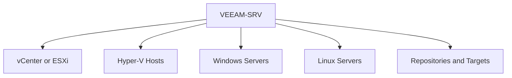

In a typical environment, you may add:

- VMware vCenter Server or individual ESXi hosts
- Hyper-V standalone hosts or clusters
- Windows servers that will serve as repositories, proxies, or agent-managed targets
- Linux servers that will serve as repositories, proxies, or agent-managed targets
- object storage endpoints and other backup target systems

For this lesson, focus on the principle that “adding infrastructure” means building a trusted, functional relationship between Veeam and another system.

---

[Go to Lesson TOC](#toc-l06)

[Go to Course TOC](#master-table-of-contents)

---

<a id="l06-adding-vmware-infrastructure"></a>
## Adding VMware Infrastructure

In most VMware environments, you should add **vCenter** rather than manually onboarding each ESXi host separately. vCenter gives Veeam centralized inventory visibility, consistent policy application, and cleaner long-term management.

When you add VMware infrastructure, Veeam needs:

- stable network connectivity
- correct DNS resolution
- credentials with appropriate privileges
- certificate acceptance if the presented certificate is not already trusted

Certificate prompts deserve attention. Administrators often click through them reflexively. In a lab, that may be acceptable if documented. In production, you should know exactly what system you are trusting and why.

---

[Go to Lesson TOC](#toc-l06)

[Go to Course TOC](#master-table-of-contents)

---

<a id="l06-adding-hyper-v-infrastructure"></a>
## Adding Hyper-V Infrastructure

Hyper-V integration differs because it leans heavily on Microsoft remote management behavior. Credentials, WinRM configuration, firewall rules, cluster awareness, and host communication become especially important.

For Hyper-V clusters, remember that cluster behavior matters beyond host-level reachability. VM mobility, CSV ownership, and off-host processing all influence later backup behavior.

---

[Go to Lesson TOC](#toc-l06)

[Go to Course TOC](#master-table-of-contents)

---

<a id="l06-adding-windows-servers"></a>
## Adding Windows Servers

Windows servers may be added for many reasons:

- repository role
- proxy role
- guest processing access path
- managed agent or protection group scope

When Veeam connects to a Windows server, administrative rights are often required for role deployment or management actions. That does not mean the same account should be used universally. Keep the access purpose clear.

---

[Go to Lesson TOC](#toc-l06)

[Go to Course TOC](#master-table-of-contents)

---

<a id="l06-adding-linux-servers"></a>
## Adding Linux Servers

Linux systems are increasingly important in Veeam environments because hardened repositories rely on Linux-based immutability designs, and Veeam Agents for Linux cover no-hypervisor protection needs. Linux onboarding usually depends on:

- SSH connectivity
- correct credentials or key-based access
- privilege elevation behavior such as sudo
- package compatibility and supported distribution versions

Linux systems reward careful planning. They also punish assumptions. A server that allows interactive SSH may still fail role deployment if privilege escalation is misconfigured.

---

[Go to Lesson TOC](#toc-l06)

[Go to Course TOC](#master-table-of-contents)

---

<a id="l06-credentials-manager-and-credential-hygiene"></a>
## Credentials Manager and Credential Hygiene

Veeam stores and uses credentials to access managed systems. This makes operational sense, but it also creates responsibility. Poor credential hygiene can cause both backup failures and security exposure.

Good habits include:

- create separate credentials for separate roles where practical
- label stored credentials clearly
- document ownership and password rotation schedule
- avoid leaving obsolete or test credentials in the system
- review failed authentications promptly

If a credential expires, the failure may not become obvious until the next job or next management action. Proactive review matters.

---

[Go to Lesson TOC](#toc-l06)

[Go to Course TOC](#master-table-of-contents)

---

<a id="l06-infrastructure-onboarding-patterns-that-reduce-confusion"></a>
## Infrastructure Onboarding Patterns That Reduce Confusion

In mature environments, the order in which infrastructure is added can make the rest of the project easier. A good pattern is to first add the management systems that provide inventory visibility, then add target systems such as repositories, and only then move on to protected endpoint scope. This ensures that when jobs are created later, the environment already reflects the intended trust and data-flow relationships.

Another useful practice is to name stored credentials and infrastructure objects clearly enough that another administrator can understand the design without guessing. Labels such as “temporary admin” or “old VMware account” create confusion very quickly. Explicit naming makes both troubleshooting and handoff easier.

---

[Go to Lesson TOC](#toc-l06)

[Go to Course TOC](#master-table-of-contents)

---

<a id="l06-no-hypervisor-path-considerations"></a>
## No-Hypervisor Path Considerations

If you are protecting physical servers or standalone systems, this lesson is especially important. Your environment may not contain vCenter or Hyper-V at all. In that case, your infrastructure onboarding focuses more on Windows and Linux servers as protected or managed endpoints, plus the repository design that will receive agent-based backups.

This is still a first-class Veeam deployment. It is simply a different protection model.

---

[Go to Lesson TOC](#toc-l06)

[Go to Course TOC](#master-table-of-contents)

---

<a id="l06-practical-sequence-for-infrastructure-onboarding"></a>
## Practical Sequence for Infrastructure Onboarding

Although environments vary, a sensible sequence is usually:

1. add the main virtualization management point if one exists
2. add repository target servers
3. add proxy candidates if separate from the backup server
4. add Windows and Linux managed systems for future protection or roles
5. validate credentials and connectivity before creating jobs

---

[Go to Lesson TOC](#toc-l06)

[Go to Course TOC](#master-table-of-contents)

---

<a id="l06-scenario-example"></a>
## Scenario Example

Suppose an administrator adds vCenter with one credential, Hyper-V with a second, Linux repositories with a third, and guest processing with a fourth, but documents none of them. Two months later, a password rotation breaks only the Linux repository path. The team sees failing jobs and assumes the repository is corrupt, when the actual problem is a single outdated stored credential. This is a small example of why onboarding discipline matters. Good onboarding reduces future ambiguity.

The goal is not to add everything as quickly as possible. The goal is to add systems cleanly and confirm they behave as expected.

---

[Go to Lesson TOC](#toc-l06)

[Go to Course TOC](#master-table-of-contents)

---

<a id="l06-lab-walkthrough"></a>
## Lab Walkthrough

<a id="l06-prerequisites"></a>
### Prerequisites

- `VEEAM-SRV` installed and console accessible
- at least one source environment available: `VCENTER01`, `HV01`, or `PHYS-SRV01` / `LIN-WEB01`
- credentials prepared for each system type

<a id="l06-steps"></a>
### Steps

1. Open the Veeam console on `VEEAM-SRV`.
2. Add one virtualization management system if available:
   - VMware path: add `VCENTER01`.
   - Hyper-V path: add `HV01` or the cluster entry point.
3. Add one Windows managed server that may later become a repository or protected host.
4. Add one Linux managed server using SSH-based access.
5. If following the no-hypervisor path, add `PHYS-SRV01` and `LIN-WEB01` as systems you intend to protect with agent-based workflows.
6. Review the stored credentials in the Veeam credential manager area and label them clearly.
7. Confirm that each added system appears healthy and reachable in the console.

<a id="l06-optional-extension"></a>
### Optional Extension

If your lab is large enough, add one repository target and one Linux host that is intended to become a hardened repository later. This gives you a stronger mental link between infrastructure onboarding and storage design.

<a id="l06-verification"></a>
### Verification

You have completed the lab if you can show, in the Veeam console, at least two successfully added infrastructure objects and explain which credentials are used for each and why.

---

[Go to Lesson TOC](#toc-l06)

[Go to Course TOC](#master-table-of-contents)

---

<a id="l06-key-takeaways"></a>
## Key Takeaways

- Adding infrastructure creates trust relationships that affect later job success.
- VMware, Hyper-V, Windows and Linux onboarding each have different dependency patterns.
- Credential hygiene is an operational and security requirement.
- No-hypervisor environments rely heavily on Windows and Linux endpoint onboarding.

---

[Go to Lesson TOC](#toc-l06)

[Go to Course TOC](#master-table-of-contents)

---

<a id="l06-review-questions"></a>
## Review Questions

1. Why is adding vCenter usually preferable to adding ESXi hosts one by one?
2. What common dependency often causes Hyper-V onboarding issues?
3. Why should Linux onboarding be tested carefully before repository or agent use?
4. Why is credential labeling important in Veeam?
5. How does the no-hypervisor path change the importance of Windows and Linux managed servers?

---

<a id="l06-answers"></a>
### Answers

1. Because vCenter provides centralized inventory and cleaner long-term management.
2. WinRM configuration, permissions, and firewall reachability.
3. Because SSH access alone is not enough if privilege elevation or distribution compatibility fails.
4. Because it reduces confusion, supports rotation, and helps troubleshoot authentication failures.
5. They become the primary protected workloads and management targets rather than secondary supporting systems.

---

[Go to Lesson TOC](#toc-l06)

[Go to Course TOC](#master-table-of-contents)

---

**License:** [CC BY-NC-SA 4.0](../LICENSE.md)

---

<a id="lesson-7-backup-repositories-types-design-performance-and-resilience"></a>
# Lesson 7 — Backup Repositories: Types, Design, Performance and Resilience


> **VMCE Objective(s):** Repository planning, storage target selection, resilience-oriented design  
> **Level:** Intermediate  
> **Estimated reading time:** 55–70 minutes  
> **Lab time:** 40 minutes

<a id="toc-l07"></a>
## Table of Contents

- [Learning Objectives](#l07-learning-objectives)
- [Concepts and Theory](#l07-concepts-and-theory)
- [What a Repository Stores](#l07-what-a-repository-stores)
- [Common Repository Types](#l07-common-repository-types)
- [Windows vs. Linux Repositories](#l07-windows-vs-linux-repositories)
- [Hardened Repository Thinking](#l07-hardened-repository-thinking)
- [Repository Selection Matrix](#l07-repository-selection-matrix)
- [Scale-Out Backup Repository (SOBR)](#l07-scale-out-backup-repository-sobr)
- [Object Storage and Modern Repository Strategy](#l07-object-storage-and-modern-repository-strategy)
- [Repository Design Questions You Should Always Ask](#l07-repository-design-questions-you-should-always-ask)
- [Performance Considerations](#l07-performance-considerations)
- [Maintenance Considerations](#l07-maintenance-considerations)
- [Security Considerations](#l07-security-considerations)
- [No-Hypervisor Path Repository Design](#l07-no-hypervisor-path-repository-design)
- [Decision Checklist](#l07-decision-checklist)
- [v12.x Notes](#l07-v12x-notes)
- [Lab Walkthrough](#l07-lab-walkthrough)
- [Key Takeaways](#l07-key-takeaways)
- [Review Questions](#l07-review-questions)

---

[Go to Lesson TOC](#toc-l07)

[Go to Course TOC](#master-table-of-contents)

---

<a id="l07-learning-objectives"></a>
## Learning Objectives

- compare major Veeam repository types and when to use them
- understand how repository choice affects performance, retention, security, and recovery speed
- explain the role of hardened repositories, SOBR extents, and object storage integration
- choose repository designs for VMware, Hyper-V, and no-hypervisor environments

---

[Go to Lesson TOC](#toc-l07)

[Go to Course TOC](#master-table-of-contents)

---

<a id="l07-concepts-and-theory"></a>
## Concepts and Theory

If backup jobs are the visible part of Veeam administration, repositories are the operational foundation underneath them. A poorly chosen repository can slow backups, weaken resilience, complicate maintenance, and make recovery more painful than it needs to be. A well-designed repository strategy, by contrast, supports performance, predictability, growth, and security at the same time.

Many beginners think of a repository as simply “the place where the backup files go.” That is true, but incomplete. A repository is also a performance domain, a security domain, a retention domain, and often a fault domain. The repository determines how quickly restore points can be ingested, how long they can be retained, what copy and tiering strategies are practical, and how vulnerable the backup estate is to compromise or accidental damage.

---

[Go to Lesson TOC](#toc-l07)

[Go to Course TOC](#master-table-of-contents)

---

<a id="l07-what-a-repository-stores"></a>
## What a Repository Stores

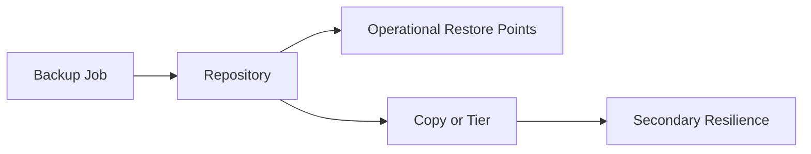

At a practical level, repositories store Veeam backup data files and related metadata. Depending on job type and settings, this may include full backup files, incremental files, metadata for indexing, and operational structures used by health checks or synthetic operations. What matters to the administrator is not only that the files exist, but that the underlying storage can support the expected write rate, retention window, and maintenance operations.

For example, a repository that handles ingest well may still struggle with synthetic full operations. Another may be large enough for retention but too exposed from a security perspective. A third may be ideal for capacity and immutability but slower for frequent small restore operations. Repository design is always a tradeoff exercise.

---

[Go to Lesson TOC](#toc-l07)

[Go to Course TOC](#master-table-of-contents)

---

<a id="l07-common-repository-types"></a>
## Common Repository Types

Veeam supports multiple repository models. The broad categories you will commonly encounter are:

- **direct attached or local storage** on a Windows or Linux repository server
- **network-based repositories**, such as SMB or NFS-backed targets depending on the supported scenario
- **deduplication appliances** such as vendor-integrated storage platforms
- **hardened Linux repositories** designed for immutability
- **scale-out backup repositories (SOBR)** that combine multiple extents and optional tiers
- **object storage connected designs**, often used with capacity tier or direct-to-object workflows in modern deployments

These are not interchangeable in all scenarios. Their operational behavior differs significantly.

---

[Go to Lesson TOC](#toc-l07)

[Go to Course TOC](#master-table-of-contents)

---

<a id="l07-windows-vs-linux-repositories"></a>
## Windows vs. Linux Repositories

Historically, many Veeam administrators began with Windows repositories. They are familiar, easy to onboard in Microsoft-centric environments, and fine for many use cases. However, the rise of hardened Linux repositories gave Linux-based storage a much stronger strategic role, especially where immutability is a requirement.

A **Windows repository** may still be acceptable for simple or legacy deployments, short-term operational backup landing zones, or environments where the team’s operational maturity strongly favors Windows. But if the organization is serious about ransomware resilience, Linux-based hardened repositories deserve close consideration.

A **Linux repository** becomes especially compelling when you want to reduce the attack surface and enforce immutability controls that make it much harder for compromised credentials or hostile software to alter restore points during the protected window.

---

[Go to Lesson TOC](#toc-l07)

[Go to Course TOC](#master-table-of-contents)

---

<a id="l07-hardened-repository-thinking"></a>
## Hardened Repository Thinking

The hardened repository concept is one of the most important architectural changes in modern Veeam practice. The reason is simple: many organizations learned that “we have backups” is not enough if the attacker can encrypt or delete those backups before recovery begins.

An immutable or hardened repository is designed so that even administrative actions are constrained in specific ways. This sharply reduces the chance that a compromised account or hasty human action can destroy critical restore points. In security-conscious environments, hardened repositories are no longer a niche feature. They are part of the expected baseline for serious resilience planning.

However, hardening is not magic. It requires correct deployment, correct user model, correct immutability settings, correct retention alignment, and ongoing operational discipline. A misconfigured hardened repository gives false confidence.

---

[Go to Lesson TOC](#toc-l07)

[Go to Course TOC](#master-table-of-contents)

---

<a id="l07-repository-selection-matrix"></a>
## Repository Selection Matrix

| Repository type | Best fit | Main caution |
|---|---|---|
| Windows repository | Simpler Microsoft-centric environments | Larger attack surface and weaker immutability story |
| Linux repository | Flexible general-purpose target | Requires Linux operational comfort |
| Hardened Linux repository | Security-focused resilience design | Must be configured carefully to avoid false confidence |
| Dedup appliance | Existing enterprise storage strategy | Vendor behavior and restore expectations vary |
| SOBR | Growth and policy-based placement | More moving parts to understand |
| Object-connected strategy | Long-term scale and copy separation | Restore expectations and connectivity must be planned |

This matrix is not meant to make the decision for you automatically. It is meant to train you to ask the right questions before choosing.

---

[Go to Lesson TOC](#toc-l07)

[Go to Course TOC](#master-table-of-contents)

---

<a id="l07-scale-out-backup-repository-sobr"></a>
## Scale-Out Backup Repository (SOBR)

A **scale-out backup repository** allows Veeam to treat multiple repository extents as a logical pool. This improves flexibility and makes it easier to grow capacity over time. It also enables more modern tiering behavior, especially when combined with capacity or archive tiers.

SOBR is not just a convenience feature. It supports policy-driven storage design. Instead of managing each repository as an isolated island, administrators can group capacity and apply placement logic more consistently. This becomes valuable as environments grow and backup data spreads across more than one storage system.

The tradeoff is complexity. Once you move into scale-out behavior, you must understand extent health, placement modes, evacuation behavior, maintenance considerations, and how backup chains interact with those extents.

---

[Go to Lesson TOC](#toc-l07)

[Go to Course TOC](#master-table-of-contents)

---

<a id="l07-object-storage-and-modern-repository-strategy"></a>
## Object Storage and Modern Repository Strategy

Veeam v12.x continued reinforcing object storage as an important part of backup architecture. In earlier generations, many administrators thought primarily in terms of local disk, dedupe appliance, or tape. Modern Veeam environments increasingly include object storage for off-site durability, long-term retention, or scale-out tier integration.

Object storage is particularly valuable because it supports separation from the primary performance landing zone. In other words, you can optimize one location for ingest and operational restore performance while using another location for scale, cost management, and immutability-oriented copy strategy.

This does not mean every environment should back up directly to object storage as the first choice. It means administrators must understand when object storage is appropriate and how it changes the copy model.

---

[Go to Lesson TOC](#toc-l07)

[Go to Course TOC](#master-table-of-contents)

---

<a id="l07-repository-design-questions-you-should-always-ask"></a>
## Repository Design Questions You Should Always Ask

Before selecting a repository type, ask the following:

1. What is my expected ingest rate during the backup window?
2. How much retention must be stored locally for fast recovery?
3. Do I need immutable restore points?
4. Will this repository be the primary landing zone, a copy target, or both?
5. How quickly must I restore from it?
6. What maintenance operations will it need to support?
7. How will capacity grow over time?
8. If this repository is unavailable, what surviving copy remains?

These questions matter just as much in a no-hypervisor environment as they do in a large vSphere environment. Physical server backups still need durable, recoverable storage.

---

[Go to Lesson TOC](#toc-l07)

[Go to Course TOC](#master-table-of-contents)

---

<a id="l07-performance-considerations"></a>
## Performance Considerations

Repository performance is influenced by:

- storage media type
- network throughput and latency
- synthetic full and merge behavior
- number of concurrent tasks
- repository role placement
- compression and encryption settings
- extent distribution in SOBR designs

Do not reduce repository sizing to raw capacity. Capacity is the easiest thing to see and often the least interesting operational variable. Two repositories with equal capacity may behave very differently under the same workload.

---

[Go to Lesson TOC](#toc-l07)

[Go to Course TOC](#master-table-of-contents)

---

<a id="l07-maintenance-considerations"></a>
## Maintenance Considerations

Repositories must also support maintenance behavior. That includes merge operations, health checks, compact or verification activity where relevant, storage firmware changes, Linux maintenance windows, and capacity expansions. A repository that performs well during initial backups but becomes difficult to maintain cleanly is not a strong long-term design.

Administrators should ask not only “can this repository hold the data?” but also “can the team operate this repository safely for the next several years?”

---

[Go to Lesson TOC](#toc-l07)

[Go to Course TOC](#master-table-of-contents)

---

<a id="l07-security-considerations"></a>
## Security Considerations

From a security perspective, repositories should be evaluated based on:

- credential exposure
- operating system hardening
- immutability support
- isolation from routine administrative activity
- copy separation from primary infrastructure

Repositories are often targeted because they concentrate recovery value. That is why repository design is inseparable from security design.

---

[Go to Lesson TOC](#toc-l07)

[Go to Course TOC](#master-table-of-contents)

---

<a id="l07-no-hypervisor-path-repository-design"></a>
## No-Hypervisor Path Repository Design

For no-hypervisor or agent-heavy environments, repository thinking changes slightly. You may not need transport mode considerations that dominate virtualization discussions, but you still need:

- good ingest performance for agent backups
- suitable space for long retention
- secure copy strategy
- workable recovery speed for file, volume, or bare metal restore

In these environments, the lack of a hypervisor does not reduce the importance of repository design. It often increases the importance of agent recovery media and repository accessibility during disaster conditions.

---

[Go to Lesson TOC](#toc-l07)

[Go to Course TOC](#master-table-of-contents)

---

<a id="l07-decision-checklist"></a>
## Decision Checklist

- What is the primary landing zone?
- Where is the second copy?
- Is one copy immutable?
- What is the expected restore speed from each location?
- Which platform team owns the repository host?
- How will capacity be monitored?

---

[Go to Lesson TOC](#toc-l07)

[Go to Course TOC](#master-table-of-contents)

---

<a id="l07-v12x-notes"></a>
## v12.x Notes

The v12 generation strengthened the practical importance of object storage, direct-to-object and cloud-connected strategies, and immutable design patterns. Even if your current environment is simple, learn repository design with growth in mind. A repository decision made today often shapes the next two or three years of backup operations.

---

[Go to Lesson TOC](#toc-l07)

[Go to Course TOC](#master-table-of-contents)

---

<a id="l07-lab-walkthrough"></a>
## Lab Walkthrough

<a id="l07-prerequisites"></a>
### Prerequisites

- `VEEAM-SRV` operational
- at least one potential repository target, such as `REPO01` or `LIN-IMMUT01`
- worksheet for design choices

<a id="l07-steps"></a>
### Steps

1. List three candidate repository models for your lab: local Windows, Linux hardened, and SOBR with object-connected tier concept.
2. For each one, note strengths and weaknesses in performance, security, and complexity.
3. Decide which model you would choose for:
   - a small VMware lab
   - a medium Hyper-V environment
   - a no-hypervisor branch-office or physical server scenario
4. Write a short explanation of which repository would be your primary landing zone and which would hold your second copy.
5. If possible in the console, inspect the repository management area to become familiar with the available repository categories.

<a id="l07-verification"></a>
### Verification

You have completed the lab if you can justify a repository choice using both operational and security reasoning, not just available capacity.

---

[Go to Lesson TOC](#toc-l07)

[Go to Course TOC](#master-table-of-contents)

---

<a id="l07-key-takeaways"></a>
## Key Takeaways

- Repositories are performance, retention, and security decisions at the same time.
- Hardened Linux repositories are strategically important in modern ransomware-aware design.
- SOBR improves flexibility and growth but adds design complexity.
- Object storage is now a mainstream part of Veeam architecture, not a niche option.

---

[Go to Lesson TOC](#toc-l07)

[Go to Course TOC](#master-table-of-contents)

---

<a id="l07-review-questions"></a>
## Review Questions

1. Why is repository design more than just choosing a folder or disk volume?
2. What makes hardened repositories important in modern environments?
3. What is the main idea behind SOBR?
4. Why should repository planning include restore speed, not just backup speed?
5. How does repository design still matter in a no-hypervisor environment?

---

<a id="l07-answers"></a>
### Answers

1. Because it affects performance, retention, recovery behavior, and security.
2. They reduce the risk that backups can be altered or deleted during the immutability window.
3. It groups multiple extents into one logical backup repository with flexible placement and growth options.
4. Because a repository that writes backups quickly but restores too slowly may still fail business recovery requirements.
5. Because agent backups still rely on durable, secure, and recoverable storage targets.

---

[Go to Lesson TOC](#toc-l07)

[Go to Course TOC](#master-table-of-contents)

---

**License:** [CC BY-NC-SA 4.0](../LICENSE.md)

---

<a id="lesson-8-lab-configure-a-repository-and-scale-out-backup-repository-sobr"></a>
# Lesson 8 — Lab: Configure a Repository and Scale-Out Backup Repository (SOBR)


> **VMCE Objective(s):** Repository implementation, storage onboarding, foundational SOBR workflow  
> **Level:** Intermediate  
> **Estimated reading time:** 25–35 minutes  
> **Lab time:** 60–90 minutes

<a id="toc-l08"></a>
## Table of Contents

- [Learning Objectives](#l08-learning-objectives)
- [Concepts and Theory](#l08-concepts-and-theory)
- [Lab Scenarios Supported](#l08-lab-scenarios-supported)
- [Prerequisites](#l08-prerequisites)
- [Step-by-Step Lab Walkthrough](#l08-step-by-step-lab-walkthrough)
- [Common Issues During Repository Onboarding](#l08-common-issues-during-repository-onboarding)
- [Operational Reflection](#l08-operational-reflection)
- [Verification Checklist](#l08-verification-checklist)
- [Key Takeaways](#l08-key-takeaways)
- [Review Questions](#l08-review-questions)

---

[Go to Lesson TOC](#toc-l08)

[Go to Course TOC](#master-table-of-contents)

---

<a id="l08-learning-objectives"></a>
## Learning Objectives

- add a repository to Veeam
- understand the practical steps involved in repository onboarding
- create a simple SOBR design in a lab scenario
- validate repository readiness before using it in production-style jobs

---

[Go to Lesson TOC](#toc-l08)

[Go to Course TOC](#master-table-of-contents)

---

<a id="l08-concepts-and-theory"></a>
## Concepts and Theory

This lab takes the repository concepts from Lesson 7 and makes them concrete. Your goal is not only to add storage to Veeam, but also to understand what information the platform needs from you during repository configuration and why those decisions matter later.

In a real production environment, repository onboarding should be accompanied by storage sizing review, security review, and maintenance planning. In the lab, focus on correctness and clarity.

---

[Go to Lesson TOC](#toc-l08)

[Go to Course TOC](#master-table-of-contents)

---

<a id="l08-lab-scenarios-supported"></a>
## Lab Scenarios Supported

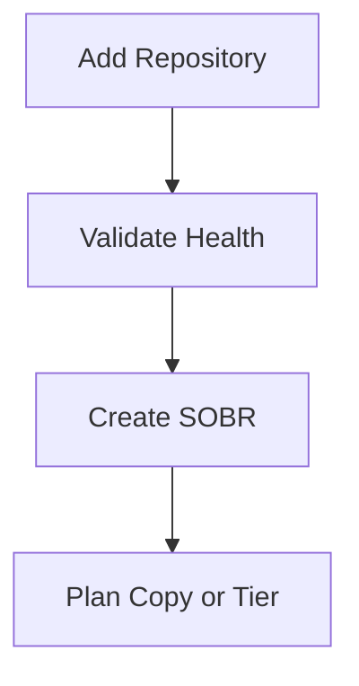

You can perform this lab in one of three ways:

1. **Simple Windows repository path** using `REPO01`
2. **Linux repository path** using `LIN-IMMUT01` as a standard or hardened repository candidate
3. **Multi-extent SOBR path** using two repositories or one primary repository plus a conceptual second extent if your lab is limited

---

[Go to Lesson TOC](#toc-l08)

[Go to Course TOC](#master-table-of-contents)

---

<a id="l08-prerequisites"></a>
## Prerequisites

- `VEEAM-SRV` installed and operational
- repository target system(s) already added to Veeam if required
- storage on target system(s) prepared and documented
- if using Linux, SSH and privilege access validated

---

[Go to Lesson TOC](#toc-l08)

[Go to Course TOC](#master-table-of-contents)

---

<a id="l08-step-by-step-lab-walkthrough"></a>
## Step-by-Step Lab Walkthrough

<a id="l08-step-1-review-repository-target-health"></a>
### Step 1 — Review Repository Target Health

Before adding the repository, confirm the target server is reachable and has the intended storage mounted or available. Make sure the repository path is not being used casually for unrelated file storage.

The reason for this check is simple: backup targets should not feel temporary. Treating them as general-purpose file shares invites accidents.

<a id="l08-step-2-add-a-basic-repository"></a>
### Step 2 — Add a Basic Repository

From the Veeam console on `VEEAM-SRV`, go to the backup infrastructure area and begin the workflow to add a backup repository.

Choose the appropriate repository type based on your lab:

- Windows server repository on `REPO01`
- Linux server repository on `LIN-IMMUT01`

Specify the path that will store the backup data. Review any task slot or concurrent task settings that appear, even if you keep defaults in the lab. These settings become more important in larger environments.

<a id="l08-step-3-validate-role-deployment"></a>
### Step 3 — Validate Role Deployment

If the repository target requires deployment of Veeam components, allow the process to complete and watch for credential, firewall, or package-related errors. If the system is Linux-based, confirm the deployment account can elevate as needed.

<a id="l08-step-4-review-mount-server-and-operational-settings"></a>
### Step 4 — Review Mount Server and Operational Settings

Some repository flows also involve mount server or related operational choices. Even if you use defaults in the lab, note what these settings are for. They affect how certain restore and processing workflows behave later.

<a id="l08-step-5-test-repository-visibility"></a>
### Step 5 — Test Repository Visibility

After onboarding, confirm the repository appears in the infrastructure inventory and shows no immediate warnings. If possible, inspect repository properties and note available space, role settings, and operational state.

<a id="l08-step-6-create-a-simple-sobr"></a>
### Step 6 — Create a Simple SOBR

If your lab supports more than one repository extent, create a Scale-Out Backup Repository.

General workflow:

1. start the SOBR creation wizard
2. name the SOBR logically
3. add one or more performance extents
4. review placement or policy options presented by the wizard
5. if available in your lab, explore the capacity tier concept even if you do not fully configure object storage yet

If your lab has only one repository, still walk through the SOBR conceptually and document what second extent you would add in a larger environment.

<a id="l08-step-7-record-operational-assumptions"></a>
### Step 7 — Record Operational Assumptions

Write down:

- who owns the repository server
- where free space will be monitored
- whether this repository is expected to support synthetic operations or only direct ingest
- whether this repository is intended to remain a simple landing zone or evolve into a larger strategy

<a id="l08-step-8-document-intended-use"></a>
### Step 8 — Document Intended Use

Write down whether this repository or SOBR will act as:

- primary landing zone
- backup copy target
- future object-connected structure
- immutable storage target

This step matters because repositories should not exist without a clear role.

<a id="l08-step-9-validate-before-using-in-jobs"></a>
### Step 9 — Validate Before Using in Jobs

Before you point important jobs at the repository, confirm one more time that the path, capacity, role deployment, and operational purpose all match your notes. In production, a quick validation step here prevents backup jobs from being built on top of a misidentified path or the wrong server.

---

[Go to Lesson TOC](#toc-l08)

[Go to Course TOC](#master-table-of-contents)

---

<a id="l08-common-issues-during-repository-onboarding"></a>
## Common Issues During Repository Onboarding

- access denied to the target path
- insufficient free space or wrong disk selected
- Linux package deployment or sudo issue
- firewall or remote management communication failure
- unexpected performance limitations because storage is shared with other workloads

---

[Go to Lesson TOC](#toc-l08)

[Go to Course TOC](#master-table-of-contents)

---

<a id="l08-operational-reflection"></a>
## Operational Reflection

After this lab, ask yourself whether you have actually designed a repository or merely registered one. The difference matters. Registering a storage path is easy. Designing a backup target means understanding how it will behave under retention growth, restore pressure, maintenance activity, and security events.

---

[Go to Lesson TOC](#toc-l08)

[Go to Course TOC](#master-table-of-contents)

---

<a id="l08-verification-checklist"></a>
## Verification Checklist

The lab is complete when:

- at least one repository is visible and healthy in the console
- you understand where backup files will land
- you can explain whether the repository is operational, immutable, scale-out, or intended as a copy target

---

[Go to Lesson TOC](#toc-l08)

[Go to Course TOC](#master-table-of-contents)

---

<a id="l08-key-takeaways"></a>
## Key Takeaways

- Repository configuration is a design task, not just a setup wizard.
- You should always know what role a repository plays in the protection strategy.
- SOBR introduces flexibility, but you should understand extent logic before using it heavily.

---

[Go to Lesson TOC](#toc-l08)

[Go to Course TOC](#master-table-of-contents)

---

<a id="l08-review-questions"></a>
## Review Questions

1. Why should you validate storage on the target before adding it as a repository?
2. What is the value of documenting the intended role of the repository?
3. What is one reason a Linux repository might fail onboarding?
4. Why is it useful to learn SOBR even in a small lab?
5. What should you verify immediately after repository creation?

---

<a id="l08-answers"></a>
### Answers

1. Because selecting the wrong path, volume, or shared storage area can create operational and capacity problems later.
2. Because primary landing zones, copy targets, and immutable targets serve different purposes.
3. SSH or sudo/privilege elevation failure.
4. Because it teaches scalable storage design patterns that become important as environments grow.
5. Health, available space, component deployment success, and clear repository role understanding.

---

[Go to Lesson TOC](#toc-l08)

[Go to Course TOC](#master-table-of-contents)

---

**License:** [CC BY-NC-SA 4.0](../LICENSE.md)

---

<a id="lesson-9-vm-backup-jobs-settings-scheduling-retention-and-recovery-intent"></a>
# Lesson 9 — VM Backup Jobs: Settings, Scheduling, Retention and Recovery Intent


> **VMCE Objective(s):** Job design, scheduling, retention logic, backup policy translation  
> **Level:** Intermediate  
> **Estimated reading time:** 60–75 minutes  
> **Lab time:** 35 minutes

<a id="toc-l09"></a>
## Table of Contents

- [Learning Objectives](#l09-learning-objectives)
- [Concepts and Theory](#l09-concepts-and-theory)
- [Start With the Workload, Not the Wizard](#l09-start-with-the-workload-not-the-wizard)
- [Object Selection Strategy](#l09-object-selection-strategy)
- [Job Naming and Policy Clarity](#l09-job-naming-and-policy-clarity)
- [Storage Settings and Chain Logic](#l09-storage-settings-and-chain-logic)
- [Scheduling and Backup Windows](#l09-scheduling-and-backup-windows)
- [Application-Aware Processing Preview](#l09-application-aware-processing-preview)
- [VMware and Hyper-V Differences](#l09-vmware-and-hyper-v-differences)
- [Security and Job Design](#l09-security-and-job-design)
- [Job Review Checklist Before Production Use](#l09-job-review-checklist-before-production-use)
- [No-Hypervisor Path Contrast](#l09-no-hypervisor-path-contrast)
- [v12.x Notes](#l09-v12x-notes)
- [Scenario Example](#l09-scenario-example)
- [Lab Walkthrough](#l09-lab-walkthrough)
- [Key Takeaways](#l09-key-takeaways)
- [Review Questions](#l09-review-questions)

---

[Go to Lesson TOC](#toc-l09)

[Go to Course TOC](#master-table-of-contents)

---

<a id="l09-learning-objectives"></a>
## Learning Objectives

- design a VM backup job based on recovery requirements rather than guesswork
- understand job components such as object selection, storage settings, schedule, and advanced options
- compare policy choices for VMware and Hyper-V workloads
- connect VM backup job design to backup copy, restore, and security strategies

---

[Go to Lesson TOC](#toc-l09)

[Go to Course TOC](#master-table-of-contents)

---

<a id="l09-concepts-and-theory"></a>
## Concepts and Theory

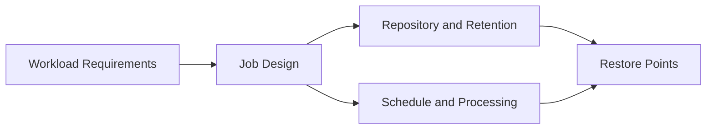

Creating a backup job is one of the most visible tasks in Veeam, but it is also one of the easiest to oversimplify. New administrators often open the wizard, click through the pages, and accept defaults without fully understanding the consequences. A backup job can still run that way, but the resulting policy may be badly aligned with business needs.

The correct way to think about a VM backup job is this: it is a formal statement of recovery intent. The objects you include, the schedule you choose, the repository you target, and the retention policy you apply all express what kind of failure you are preparing for and how much disruption the organization can tolerate.

---

[Go to Lesson TOC](#toc-l09)

[Go to Course TOC](#master-table-of-contents)

---

<a id="l09-start-with-the-workload-not-the-wizard"></a>
## Start With the Workload, Not the Wizard

Before selecting VMs, ask:

- how critical is the service?
- what is the RPO?
- what is the RTO?
- is application consistency required?
- how long should restore points remain available locally?
- does this workload also need replication or backup copy?

Once you know the answers, the wizard becomes straightforward. Without them, it becomes easy to create inconsistent or wasteful jobs.

---

[Go to Lesson TOC](#toc-l09)

[Go to Course TOC](#master-table-of-contents)

---

<a id="l09-object-selection-strategy"></a>
## Object Selection Strategy

In many environments, job design begins with one of two approaches:

- **service-oriented grouping**, where related workloads are protected together because they share recovery or maintenance expectations
- **infrastructure-oriented grouping**, where workloads are grouped by host, cluster, folder, or tag

Either can work, but service-oriented thinking usually produces more meaningful recovery policies. For example, if a SQL Server and its dependent application servers need aligned schedules and similar restore handling, grouping them intentionally may make sense.

At the same time, very large jobs can create long backup windows and harder troubleshooting. Job sprawl is bad, but over-consolidation is also bad. Balance matters.

---

[Go to Lesson TOC](#toc-l09)

[Go to Course TOC](#master-table-of-contents)

---

<a id="l09-job-naming-and-policy-clarity"></a>
## Job Naming and Policy Clarity

An underrated part of good backup administration is naming. A job name should help another administrator understand what is protected and why. Names like `Job1`, `Nightly-2`, or `New Backup` create confusion almost immediately. Clear names make review, troubleshooting, and audit conversations easier.

Good job design also includes a short rationale in your operational documentation. For example: “This job protects customer-facing application VMs with four-hour RPO, application-aware processing, and seven-day local retention plus backup copy.” That level of clarity improves both handoff and long-term consistency.

---

[Go to Lesson TOC](#toc-l09)

[Go to Course TOC](#master-table-of-contents)

---

<a id="l09-storage-settings-and-chain-logic"></a>
## Storage Settings and Chain Logic

The storage page of a Veeam job is where backup theory becomes implementation. Here you decide:

- which repository receives the data
- how many restore points to retain
- whether specific full backup behavior applies
- whether compression, deduplication, or encryption is enabled

Every one of these choices affects downstream operations. For example, enabling encryption may be necessary for compliance or security, but it also affects some storage efficiency assumptions. Choosing short retention may save space but weaken the ability to recover from late-detected corruption or malware dwell time.

---

[Go to Lesson TOC](#toc-l09)

[Go to Course TOC](#master-table-of-contents)

---

<a id="l09-scheduling-and-backup-windows"></a>
## Scheduling and Backup Windows

Scheduling is often treated as a convenience setting. In reality, it is a negotiation between production operations, backup infrastructure capacity, and recovery requirements. A backup job that starts at 10 p.m. because “that’s when backups run” may conflict with maintenance windows, replication traffic, batch processing, or repository merge behavior.

Good scheduling practice considers:

- when the workload is least disruptive to read
- whether application-aware processing will increase runtime
- how long the backup window can realistically be
- how many tasks the proxies and repository can sustain simultaneously
- whether backup copy or offload jobs will overlap later

Another scheduling lesson is to avoid thinking of backup jobs in isolation. A job can be perfectly reasonable by itself and still become problematic when several similar jobs start at the same time, consume the same proxy capacity, and push to the same repository. Mature scheduling takes the whole environment into account.

---

[Go to Lesson TOC](#toc-l09)

[Go to Course TOC](#master-table-of-contents)

---

<a id="l09-application-aware-processing-preview"></a>
## Application-Aware Processing Preview

For many virtual machines, crash-consistent backup may be technically acceptable. But if the workload hosts a transactional application such as SQL Server or Exchange, you should usually think more carefully. Application-aware processing helps create better recovery outcomes by interacting with the guest operating system and supported application behaviors.

Lesson 12 explores this in detail, but job design must anticipate it now.

---

[Go to Lesson TOC](#toc-l09)

[Go to Course TOC](#master-table-of-contents)

---

<a id="l09-vmware-and-hyper-v-differences"></a>
## VMware and Hyper-V Differences

The job design principles are similar across VMware and Hyper-V, but environmental details differ. VMware jobs may interact with CBT, snapshots, and transport mode behavior more visibly. Hyper-V jobs may be more sensitive to host communication, VSS integration, checkpoint behavior, and cluster topology.

The lesson here is simple: job design is shared, implementation details differ.

---

[Go to Lesson TOC](#toc-l09)

[Go to Course TOC](#master-table-of-contents)

---

<a id="l09-security-and-job-design"></a>
## Security and Job Design

Job design also affects security posture. Consider:

- should this job write to an immutable target?
- should backup encryption be enabled?
- how much retention is necessary to recover from slow-moving compromise?
- who is allowed to change or disable the job?

Security is not an optional layer added after the backup policy. It is part of the policy.

---

[Go to Lesson TOC](#toc-l09)

[Go to Course TOC](#master-table-of-contents)

---

<a id="l09-job-review-checklist-before-production-use"></a>
## Job Review Checklist Before Production Use

Before enabling a new job widely, review the following:

- Are the included objects grouped intentionally?
- Does the repository align to the importance of the workload?
- Is retention sufficient for both ordinary mistakes and delayed incident discovery?
- Is guest/application processing enabled where needed?
- Does the schedule fit infrastructure and business reality?
- Is there a plan for secondary copy or immutability?

If you cannot answer these questions clearly, the job is probably not ready for production.

---

[Go to Lesson TOC](#toc-l09)

[Go to Course TOC](#master-table-of-contents)

---

<a id="l09-no-hypervisor-path-contrast"></a>
## No-Hypervisor Path Contrast

If you are protecting systems without a hypervisor, the equivalent policy decisions still exist, but the mechanism shifts to agent-based jobs or policies. That means this lesson remains conceptually important even if your next practical steps happen in the agent lessons rather than the VM job wizard.

---

[Go to Lesson TOC](#toc-l09)

[Go to Course TOC](#master-table-of-contents)

---

<a id="l09-v12x-notes"></a>
## v12.x Notes

Modern Veeam job design increasingly assumes that backup jobs are only one part of a broader copy and resilience strategy. In v12.x environments, think less in terms of a single job and more in terms of a **protection chain**:

source backup -> repository restore points -> backup copy or tier -> validation -> restore readiness.

---

[Go to Lesson TOC](#toc-l09)

[Go to Course TOC](#master-table-of-contents)

---

<a id="l09-scenario-example"></a>
## Scenario Example

Imagine two jobs protecting ten VMs each. The first job protects low-priority test systems once per day with short retention to a standard repository. The second protects a customer-facing application group every four hours with application-aware processing, longer retention, and an immutable copy strategy. Both jobs may use the same wizard. But from a design standpoint, they are solving different business problems. That is the mindset this lesson is trying to build.

---

[Go to Lesson TOC](#toc-l09)

[Go to Course TOC](#master-table-of-contents)

---

<a id="l09-lab-walkthrough"></a>
## Lab Walkthrough

<a id="l09-prerequisites"></a>
### Prerequisites

- virtualization infrastructure added in Veeam
- at least one repository configured
- at least one candidate VM available

<a id="l09-steps"></a>
### Steps

1. Select one VM or small VM group for protection.
2. Write down the intended RPO, RTO, and retention target before opening the job wizard.
3. In the Veeam console, begin creating a backup job.
4. Choose the VM(s), repository, and retention settings.
5. Decide whether you would enable application-aware processing and why.
6. Create a schedule that matches the workload’s business criticality.
7. Before finishing, review the complete configuration and explain it in your own words.

<a id="l09-optional-reflection"></a>
### Optional Reflection

After creating the job design, ask yourself what would happen if the repository became unavailable, if a credential expired, or if the application owner asked for a longer restore history. If those changes would be hard to accommodate, note that now. Job design should be adaptable, not brittle.

<a id="l09-verification"></a>
### Verification

You have completed the lab if you can justify every major job setting based on the workload’s recovery requirement.

---

[Go to Lesson TOC](#toc-l09)

[Go to Course TOC](#master-table-of-contents)

---

<a id="l09-key-takeaways"></a>
## Key Takeaways

- A VM backup job is a recovery policy expressed in Veeam settings.
- Object grouping, retention, schedule, and processing choices should all reflect business need.
- Backup jobs should be designed alongside copy, restore, and security strategy.

---

[Go to Lesson TOC](#toc-l09)

[Go to Course TOC](#master-table-of-contents)

---

<a id="l09-review-questions"></a>
## Review Questions

1. Why should you define RPO and RTO before creating a job?
2. What is the risk of grouping too many unrelated workloads into one job?
3. Why is schedule planning more than choosing an overnight time?
4. How can retention settings affect ransomware recovery?
5. Why is job design still relevant to no-hypervisor environments?

---

<a id="l09-answers"></a>
### Answers

1. Because job settings should reflect business recovery needs, not arbitrary defaults.
2. It can create long backup windows, policy mismatch, and harder troubleshooting.
3. Because backup runtime, maintenance windows, infrastructure load, and downstream jobs all matter.
4. Short retention may leave too little clean history if compromise is detected late.
5. Because the same policy logic applies even if the mechanics are implemented through agents rather than hypervisor-based image backups.

---

[Go to Lesson TOC](#toc-l09)

[Go to Course TOC](#master-table-of-contents)

---

**License:** [CC BY-NC-SA 4.0](../LICENSE.md)

---

<a id="lesson-10-lab-create-and-run-a-vm-backup-job-vmware-and-hyper-v"></a>
# Lesson 10 — Lab: Create and Run a VM Backup Job (VMware and Hyper-V)


> **VMCE Objective(s):** Practical job creation and first-run validation  
> **Level:** Intermediate  
> **Estimated reading time:** 20–30 minutes  
> **Lab time:** 45–75 minutes

<a id="toc-l10"></a>
## Table of Contents

- [Learning Objectives](#l10-learning-objectives)
- [Concepts and Theory](#l10-concepts-and-theory)
- [Prerequisites](#l10-prerequisites)
- [Lab Goal and Success Standard](#l10-lab-goal-and-success-standard)
- [Step-by-Step Lab Walkthrough](#l10-step-by-step-lab-walkthrough)
- [Platform Notes](#l10-platform-notes)
- [What to Record in Your Lab Notes](#l10-what-to-record-in-your-lab-notes)
- [Common First-Run Issues](#l10-common-first-run-issues)
- [Verification Checklist](#l10-verification-checklist)
- [Operational Reflection](#l10-operational-reflection)
- [Extended Practice](#l10-extended-practice)
- [Key Takeaways](#l10-key-takeaways)
- [Review Questions](#l10-review-questions)

---

[Go to Lesson TOC](#toc-l10)

[Go to Course TOC](#master-table-of-contents)

---

<a id="l10-learning-objectives"></a>
## Learning Objectives

- create a working VM backup job in Veeam
- run the job and monitor the session
- verify that restore points are created successfully
- observe differences in VMware and Hyper-V workflows

---

[Go to Lesson TOC](#toc-l10)

[Go to Course TOC](#master-table-of-contents)

---

<a id="l10-concepts-and-theory"></a>
## Concepts and Theory

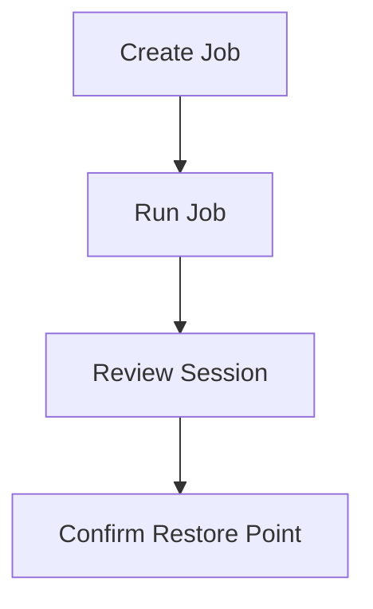

This lesson turns the design thinking from Lesson 9 into a live backup job. The point is not only to create a green status in the console, but to observe what the platform does during the run and to verify the resulting restore point.

In production, first-run observation is essential. The first successful run often reveals timing, processing, or credential issues that would otherwise remain hidden until the next maintenance window or incident.

---

[Go to Lesson TOC](#toc-l10)

[Go to Course TOC](#master-table-of-contents)

---

<a id="l10-prerequisites"></a>
## Prerequisites

- `VEEAM-SRV` functioning normally
- repository available
- VMware or Hyper-V infrastructure visible in Veeam
- at least one powered-on test VM available for protection

---

[Go to Lesson TOC](#toc-l10)

[Go to Course TOC](#master-table-of-contents)

---

<a id="l10-lab-goal-and-success-standard"></a>
## Lab Goal and Success Standard

The purpose of this lab is not just to produce a green status icon. The real goal is to build the habit of treating the first backup run as a validation event. A correctly run lab should leave you able to answer all of the following:

- Which objects were protected and why were they grouped together?
- Which repository received the backup data?
- What processing choices were used?
- Did the resulting restore point appear where you expected?
- What would you change before using the same configuration in production?

If you finish the lab without being able to answer those questions, you completed the wizard but missed the deeper lesson.

---

[Go to Lesson TOC](#toc-l10)

[Go to Course TOC](#master-table-of-contents)

---

<a id="l10-step-by-step-lab-walkthrough"></a>
## Step-by-Step Lab Walkthrough

<a id="l10-step-1-select-the-workload"></a>
### Step 1 — Select the Workload

Choose a non-critical test VM such as `WIN-APP01` or `LIN-WEB01`. For VMware learners, the VM should be visible through `VCENTER01`. For Hyper-V learners, it should be visible through `HV01` or the cluster inventory.

<a id="l10-step-2-create-the-job"></a>
### Step 2 — Create the Job

In the Veeam console:

1. create a new VM backup job
2. name the job clearly
3. select the VM object(s)
4. choose the repository
5. specify retention
6. decide on guest/application processing settings
7. define the schedule

Keep the configuration simple for the first run. Complexity can come later.

As you create the job, pay attention to the difference between fields you are filling because they are technically required and fields you are choosing because they represent actual policy decisions. A name is required, but a meaningful name is a design decision. A repository must be selected, but the right repository is a resilience decision. This distinction helps you avoid becoming a passive wizard operator.

<a id="l10-step-3-start-the-job-manually"></a>
### Step 3 — Start the Job Manually

Run the job manually so you can observe it in real time. Open the session details and watch the stages. Look for major phases such as object preparation, snapshot/checkpoint behavior, data read, processing, and target write.

This is also the point where you begin building troubleshooting instincts. If the job slows, warns, or fails, try not to jump immediately to random changes. Instead, ask which phase you are currently in and which component is most likely responsible. That habit becomes extremely valuable in larger environments where many jobs may be active at once.

<a id="l10-step-4-inspect-the-session-result"></a>
### Step 4 — Inspect the Session Result

If the job succeeds, review the session statistics rather than closing the window immediately. Note total data processed, duration, and any warnings.

If the job fails, do not treat that as a failed lab. It is still valuable. Record the failure and identify which component failed first.

If the job succeeds but shows warnings, do not wave them away. Review whether the warning is operationally meaningful. For example, a warning related to guest processing on a transactional workload may matter far more than a cosmetic or environmental note in a low-priority test VM.

<a id="l10-step-5-confirm-restore-point-creation"></a>
### Step 5 — Confirm Restore Point Creation

Navigate to the backup data area and confirm the restore point exists. Identify the job name, protected object, timestamp, and repository location.

This step is critical because it shifts your focus from job execution to recovery readiness. Many junior administrators stop at the session window and assume success. Experienced administrators confirm that the resulting restore point is actually visible and logically consistent with what they expected to create.

<a id="l10-step-6-document-what-you-observed"></a>
### Step 6 — Document What You Observed

Write down:

- the job duration
- whether warnings occurred
- what consistency model was used
- which repository received the data
- whether the observed behavior matched your expectations

<a id="l10-step-7-record-follow-up-actions"></a>
### Step 7 — Record Follow-Up Actions

Even if the job succeeds, write down one improvement you would make before using the same configuration in production. That improvement might involve naming, retention, repository choice, application-aware processing, or backup copy planning. This helps turn a lab success into operational judgment.

---

[Go to Lesson TOC](#toc-l10)

[Go to Course TOC](#master-table-of-contents)

---

<a id="l10-platform-notes"></a>
## Platform Notes

<a id="l10-vmware-path"></a>
### VMware Path

You may observe snapshot-related steps and VMware-specific processing behavior more explicitly. These details become important later when learning about CBT and snapshot troubleshooting.

<a id="l10-hyper-v-path"></a>
### Hyper-V Path

You may observe checkpoint or host-related behavior that ties more directly to Hyper-V and VSS processing expectations.

---

[Go to Lesson TOC](#toc-l10)

[Go to Course TOC](#master-table-of-contents)

---

<a id="l10-what-to-record-in-your-lab-notes"></a>
## What to Record in Your Lab Notes

Your notes for this lab should include at least:

- job name and purpose
- included object(s)
- chosen repository
- retention setting used
- whether application-aware processing was enabled
- start time and completion time
- success, warning, or failure result
- what you would improve before production use

Building this note-taking habit now will make later troubleshooting and design review much easier.

---

[Go to Lesson TOC](#toc-l10)

[Go to Course TOC](#master-table-of-contents)

---

<a id="l10-common-first-run-issues"></a>
## Common First-Run Issues

Typical issues in first-run backup jobs include:

- wrong object selection
- wrong repository selection
- unexpected guest processing warnings
- connectivity or credential issues to the source platform
- backup duration longer than expected because the job design did not account for infrastructure reality

The point of the first run is to expose these assumptions early, not to hide them.

---

[Go to Lesson TOC](#toc-l10)

[Go to Course TOC](#master-table-of-contents)

---

<a id="l10-verification-checklist"></a>
## Verification Checklist

- job created successfully
- job executed at least once
- restore point confirmed
- observations documented

---

[Go to Lesson TOC](#toc-l10)

[Go to Course TOC](#master-table-of-contents)

---

<a id="l10-operational-reflection"></a>
## Operational Reflection

The most useful outcome of this lab is not simply “the job worked.” It is your ability to say why it worked, what path it used, and what you would verify next before trusting it with production workloads.

---

[Go to Lesson TOC](#toc-l10)

[Go to Course TOC](#master-table-of-contents)

---

<a id="l10-extended-practice"></a>
## Extended Practice

As a second pass through this lab, try one of the following:

- create a similar job for a second low-priority VM and compare the session statistics
- change the schedule design on paper and explain how it would alter the workload’s RPO
- pretend the repository has failed and describe what additional design you would need to preserve resilience

These exercises help connect a basic backup run to broader policy thinking.

---

[Go to Lesson TOC](#toc-l10)

[Go to Course TOC](#master-table-of-contents)

---

<a id="l10-key-takeaways"></a>
## Key Takeaways

- A green job is valuable, but the session details teach more than the final status alone.
- First-run validation should always include restore point confirmation.
- Platform-specific behavior becomes easier to understand when observed live.

---

[Go to Lesson TOC](#toc-l10)

[Go to Course TOC](#master-table-of-contents)

---

<a id="l10-review-questions"></a>
## Review Questions

1. Why should you run a new job manually the first time?
2. Why is checking the restore point itself important after job completion?
3. What should you do if the first run fails?
4. What VMware behavior might you notice during a run?
5. What should you document after the session completes?

---

<a id="l10-answers"></a>
### Answers

1. So you can observe processing stages and catch issues immediately.
2. Because job completion alone is not enough; you want to confirm actual recoverable data exists.
3. Record the error and identify which component failed first rather than just rerunning blindly.
4. Snapshot-related operations and VMware-specific data path behavior.
5. Duration, warnings, settings used, repository target, and whether results matched intent.

---

[Go to Lesson TOC](#toc-l10)

[Go to Course TOC](#master-table-of-contents)

---

**License:** [CC BY-NC-SA 4.0](../LICENSE.md)

---

<a id="lesson-11-backup-proxies-data-movement-transport-modes-and-performance-behavior"></a>
# Lesson 11 — Backup Proxies: Data Movement, Transport Modes and Performance Behavior


> **VMCE Objective(s):** Proxy role understanding, transport mode selection, performance interpretation  
> **Level:** Intermediate  
> **Estimated reading time:** 55–70 minutes  
> **Lab time:** 30 minutes

<a id="toc-l11"></a>
## Table of Contents

- [Learning Objectives](#l11-learning-objectives)
- [Concepts and Theory](#l11-concepts-and-theory)
- [What the Proxy Actually Does](#l11-what-the-proxy-actually-does)
- [VMware Transport Modes](#l11-vmware-transport-modes)
- [Why Transport Mode Matters](#l11-why-transport-mode-matters)
- [Proxy Placement Strategy](#l11-proxy-placement-strategy)
- [Proxy Sizing and Operational Expectations](#l11-proxy-sizing-and-operational-expectations)
- [Hyper-V and Other Paths](#l11-hyper-v-and-other-paths)
- [Concurrency and Task Slots](#l11-concurrency-and-task-slots)
- [Common Proxy Problems](#l11-common-proxy-problems)
- [Performance Reading Mindset](#l11-performance-reading-mindset)
- [Common Proxy Design Mistakes](#l11-common-proxy-design-mistakes)
- [Lab Walkthrough](#l11-lab-walkthrough)
- [Key Takeaways](#l11-key-takeaways)
- [Review Questions](#l11-review-questions)

---

[Go to Lesson TOC](#toc-l11)

[Go to Course TOC](#master-table-of-contents)

---

<a id="l11-learning-objectives"></a>
## Learning Objectives

- explain what a backup proxy does in Veeam
- compare common VMware transport modes such as NBD, HotAdd, and Direct SAN
- understand how proxy placement affects performance and scalability
- recognize common proxy-related pitfalls before they appear in production

---

[Go to Lesson TOC](#toc-l11)

[Go to Course TOC](#master-table-of-contents)

---

<a id="l11-concepts-and-theory"></a>
## Concepts and Theory

The backup proxy is one of the most important and misunderstood roles in a Veeam environment. Many administrators assume the backup server itself “does the backup.” In reality, the proxy often performs the heavy lifting of reading source data and moving it toward the repository. When backup performance is poor, the proxy or transport path is frequently part of the explanation.

---

[Go to Lesson TOC](#toc-l11)

[Go to Course TOC](#master-table-of-contents)

---

<a id="l11-what-the-proxy-actually-does"></a>
## What the Proxy Actually Does

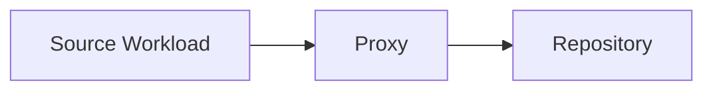

At a high level, the proxy:

- reads or receives data from the source workload
- processes that data as part of the backup pipeline
- passes the resulting stream to the repository

This makes the proxy a bridge between source and target. Because of that position, its CPU, RAM, network reachability, storage visibility, and transport mode all matter.

---

[Go to Lesson TOC](#toc-l11)

[Go to Course TOC](#master-table-of-contents)

---

<a id="l11-vmware-transport-modes"></a>
## VMware Transport Modes

In VMware environments, you will commonly encounter three transport models:

<a id="l11-nbd"></a>
### NBD

Network Block Device mode reads data over the network through the VMware management path. It is often the simplest option because it requires fewer special placement considerations. The downside is that performance can be limited compared with more direct data paths.

NBD is often acceptable in small environments or labs, but in larger production environments it may become a bottleneck if used unintentionally for many large jobs.

<a id="l11-hotadd"></a>
### HotAdd

HotAdd allows a virtual proxy VM to attach target VM disks and read them more directly. This can improve performance, but it requires careful proxy placement and operational understanding. It can also introduce its own complexities around datastore visibility and disk attachment behavior.

<a id="l11-direct-san"></a>
### Direct SAN

Direct SAN mode allows a proxy with direct storage visibility to read data from shared storage without traversing the production network path in the same way as NBD. This can be highly efficient in the right environment, but it depends on proper storage presentation and careful design.

---

[Go to Lesson TOC](#toc-l11)

[Go to Course TOC](#master-table-of-contents)

---

<a id="l11-why-transport-mode-matters"></a>
## Why Transport Mode Matters

A backup can still “work” when the wrong transport mode is used, but it may work badly. This is a common trap. An environment designed for HotAdd or Direct SAN may silently fall back to NBD when prerequisites are not met. Administrators then wonder why performance dropped even though jobs still complete.

The real lesson is that success status and efficiency are different concepts.

---

[Go to Lesson TOC](#toc-l11)

[Go to Course TOC](#master-table-of-contents)

---

<a id="l11-proxy-placement-strategy"></a>
## Proxy Placement Strategy

Proxy placement should reflect the environment:

- proximity to the data source
- network path to the repository
- expected concurrency
- storage access requirements
- role isolation and scalability goals

In a small all-in-one lab, the backup server may also act as the proxy. In larger environments, dedicated proxies are often the better design.

---

[Go to Lesson TOC](#toc-l11)

[Go to Course TOC](#master-table-of-contents)

---

<a id="l11-proxy-sizing-and-operational-expectations"></a>
## Proxy Sizing and Operational Expectations

Although exact sizing depends on workload mix and environment behavior, the administrator should always think of the proxy as a finite resource. CPU, RAM, network, and in some designs storage adjacency all influence how many tasks the proxy can sustain. It is therefore possible for a proxy to appear fine in a pilot and then become a major limitation as more jobs are added.

This is why proxy design should be reviewed whenever any of the following happen:

- backup windows become longer
- more large VMs are added
- repository targets change
- transport mode expectations change
- replication or copy activity overlaps with backup processing

---

[Go to Lesson TOC](#toc-l11)

[Go to Course TOC](#master-table-of-contents)

---

<a id="l11-hyper-v-and-other-paths"></a>
## Hyper-V and Other Paths

Hyper-V environments do not use VMware transport modes in the same way, but the architectural lesson remains the same: the component moving data matters. You should always ask which system reads the source, how it reaches the source, and what network or storage path it uses.

---

[Go to Lesson TOC](#toc-l11)

[Go to Course TOC](#master-table-of-contents)

---

<a id="l11-concurrency-and-task-slots"></a>
## Concurrency and Task Slots

A proxy is not infinitely scalable. It can handle only a certain number of concurrent tasks effectively. If too many tasks are placed on a proxy with limited resources, jobs may slow, queue excessively, or become unpredictable. Understanding concurrency is part of responsible capacity planning.

---

[Go to Lesson TOC](#toc-l11)

[Go to Course TOC](#master-table-of-contents)

---

<a id="l11-common-proxy-problems"></a>
## Common Proxy Problems

- wrong transport mode due to fallback
- proxy VM placed where required datastores are not visible
- too few resources assigned to proxy systems
- network bottlenecks between proxy and repository
- overloaded all-in-one Veeam server trying to serve as management point, proxy, and repository simultaneously

---

[Go to Lesson TOC](#toc-l11)

[Go to Course TOC](#master-table-of-contents)

---

<a id="l11-performance-reading-mindset"></a>
## Performance Reading Mindset

When performance is poor, ask:

1. Is the source read path efficient?
2. Is the proxy resource-constrained?
3. Is the network path saturated?
4. Is the repository writing slowly?
5. Has the job fallen back to a less efficient transport mode?

This line of questioning is more useful than immediately changing random settings.

---

[Go to Lesson TOC](#toc-l11)

[Go to Course TOC](#master-table-of-contents)

---

<a id="l11-common-proxy-design-mistakes"></a>
## Common Proxy Design Mistakes

- assuming the backup server can always remain the best proxy forever
- placing a virtual proxy where required storage visibility does not exist
- overlooking concurrency growth as new jobs are added
- assuming a single proxy is acceptable because one successful lab job completed quickly

In each case, the visible symptom often appears later as “backups are now slow” rather than “the proxy is wrong.”

---

[Go to Lesson TOC](#toc-l11)

[Go to Course TOC](#master-table-of-contents)

---

<a id="l11-lab-walkthrough"></a>
## Lab Walkthrough

<a id="l11-prerequisites"></a>
### Prerequisites

- at least one functioning VM backup job
- visibility into proxy configuration in the Veeam console

<a id="l11-steps"></a>
### Steps

1. Open the backup infrastructure area and identify the proxy currently used in your lab.
2. Determine whether your environment uses an all-in-one proxy or a separate proxy.
3. For VMware learners, note which transport mode is expected and why.
4. For Hyper-V learners, document the likely data path between source host and repository.
5. Write one paragraph answering: “If this job became slow tomorrow, what would I check first and why?”

<a id="l11-verification"></a>
### Verification

You have completed the lab if you can explain the role of the proxy in your current environment and identify at least one likely bottleneck domain.

---

[Go to Lesson TOC](#toc-l11)

[Go to Course TOC](#master-table-of-contents)

---

<a id="l11-key-takeaways"></a>
## Key Takeaways

- The proxy is a core performance component in Veeam.
- VMware transport mode selection strongly affects efficiency.
- A successful backup can still be inefficient if the proxy path is wrong.
- Capacity planning must include concurrency and placement considerations.

---

[Go to Lesson TOC](#toc-l11)

[Go to Course TOC](#master-table-of-contents)

---

<a id="l11-review-questions"></a>
## Review Questions

1. What is the main job of a backup proxy?
2. Why is NBD often simpler but slower?
3. What is a common risk with HotAdd environments?
4. Why can an all-in-one deployment become a bottleneck?
5. What question should you ask first when backup performance suddenly drops?

---

<a id="l11-answers"></a>
### Answers

1. To read and move source data as part of the backup pipeline.
2. Because it uses the network path more generally and may not be as direct as other methods.
3. Datastore visibility or attachment issues can prevent expected transport behavior.
4. Because management, proxy, and repository load all compete for the same system resources.
5. Whether the source read path and proxy transport behavior are still what you expect.

---

[Go to Lesson TOC](#toc-l11)

[Go to Course TOC](#master-table-of-contents)

---

**License:** [CC BY-NC-SA 4.0](../LICENSE.md)

---

<a id="lesson-12-application-aware-processing-consistency-guest-interaction-and-transaction-safe-recovery"></a>
# Lesson 12 — Application-Aware Processing: Consistency, Guest Interaction and Transaction-Safe Recovery


> **VMCE Objective(s):** Application consistency, guest processing, transactional recovery readiness  
> **Level:** Intermediate  
> **Estimated reading time:** 55–70 minutes  
> **Lab time:** 35 minutes

<a id="toc-l12"></a>
## Table of Contents

- [Learning Objectives](#l12-learning-objectives)
- [Concepts and Theory](#l12-concepts-and-theory)
- [Crash-Consistent vs. Application-Consistent](#l12-crash-consistent-vs-application-consistent)
- [How Veeam Interacts With the Guest](#l12-how-veeam-interacts-with-the-guest)
- [Typical Workloads That Need Special Attention](#l12-typical-workloads-that-need-special-attention)
- [Transaction Logs and Truncation](#l12-transaction-logs-and-truncation)
- [Credentials and Security](#l12-credentials-and-security)
- [Why This Matters for Restores](#l12-why-this-matters-for-restores)
- [Practical Decision Framework](#l12-practical-decision-framework)
- [No-Hypervisor Path Relevance](#l12-no-hypervisor-path-relevance)
- [Common Failure Themes](#l12-common-failure-themes)
- [Lab Walkthrough](#l12-lab-walkthrough)
- [Key Takeaways](#l12-key-takeaways)
- [Review Questions](#l12-review-questions)

---

[Go to Lesson TOC](#toc-l12)

[Go to Course TOC](#master-table-of-contents)

---

<a id="l12-learning-objectives"></a>
## Learning Objectives

- explain the purpose of application-aware processing
- distinguish crash-consistent and application-consistent backups
- understand guest credentials and processing requirements
- identify common workloads that benefit from application-aware settings

---

[Go to Lesson TOC](#toc-l12)

[Go to Course TOC](#master-table-of-contents)

---

<a id="l12-concepts-and-theory"></a>
## Concepts and Theory

Backing up a running machine is not the same as backing up a quiet one. If an operating system and its applications are actively writing data when the backup is taken, the resulting restore point may be technically usable but operationally messy unless the workload is processed consistently. This is why application-aware processing matters.

---

[Go to Lesson TOC](#toc-l12)

[Go to Course TOC](#master-table-of-contents)

---

<a id="l12-crash-consistent-vs-application-consistent"></a>
## Crash-Consistent vs. Application-Consistent

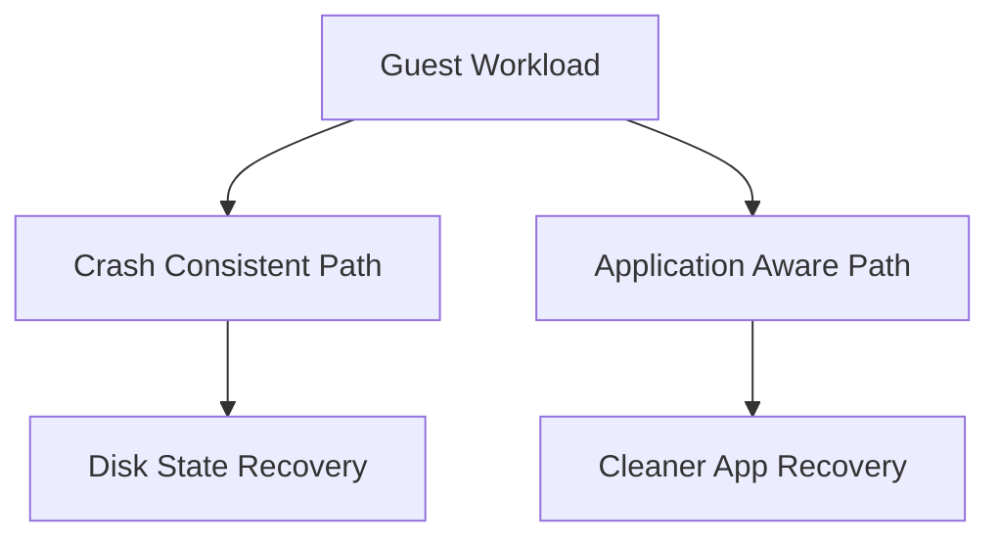

A **crash-consistent** backup is similar to pulling power from a machine and preserving its disk state at that moment. Many systems can recover from that state, especially simple services, stateless application tiers, or lightly changing workloads. But databases and transactional platforms may not recover cleanly or may require repair and replay operations.

An **application-consistent** backup attempts to coordinate with the guest operating system and supported applications so the backup reflects a cleaner transaction state. This is often important for SQL Server, Exchange, and other data-heavy application workloads.

The goal is not perfection for every application on every platform. The goal is materially better recovery behavior.

---

[Go to Lesson TOC](#toc-l12)

[Go to Course TOC](#master-table-of-contents)

---

<a id="l12-how-veeam-interacts-with-the-guest"></a>
## How Veeam Interacts With the Guest

Application-aware processing depends on communication into the guest operating system. That means:

- the guest must be reachable in the required way
- credentials must be valid
- relevant guest services or frameworks must function correctly
- VSS or equivalent mechanisms must work where required

This is why guest processing issues often involve more than the hypervisor. The backup platform may be functioning, yet guest-level consistency fails because the application writer, service, or credential path is broken.

---

[Go to Lesson TOC](#toc-l12)

[Go to Course TOC](#master-table-of-contents)

---

<a id="l12-typical-workloads-that-need-special-attention"></a>
## Typical Workloads That Need Special Attention

Common examples include:

- Microsoft SQL Server
- Microsoft Exchange
- Active Directory domain controllers
- Oracle-backed application systems
- file servers or application servers with consistency-sensitive services

Not every workload requires full application-aware processing in the same way. But administrators should be able to identify which systems deserve more careful handling.

---

[Go to Lesson TOC](#toc-l12)

[Go to Course TOC](#master-table-of-contents)

---

<a id="l12-transaction-logs-and-truncation"></a>
## Transaction Logs and Truncation

For some workloads, application-aware backups also connect to transaction log handling. Done correctly, this can help keep application log growth under control and support point-in-time recovery models. Done incorrectly, or assumed without validation, it can create confusion or risk.

You should never enable log-handling options casually without understanding the application owner’s recovery expectations.

---

[Go to Lesson TOC](#toc-l12)

[Go to Course TOC](#master-table-of-contents)

---

<a id="l12-credentials-and-security"></a>
## Credentials and Security

Application-aware processing usually requires guest credentials. This introduces security and operational questions:

- who owns those credentials?
- do they expire?
- are they scoped narrowly enough?
- can they reach all intended systems?

One of the most common causes of guest processing failure is stale or incorrect credentials. Another is assuming that administrator access to the hypervisor automatically grants guest processing access. It does not.

---

[Go to Lesson TOC](#toc-l12)

[Go to Course TOC](#master-table-of-contents)

---

<a id="l12-why-this-matters-for-restores"></a>
## Why This Matters for Restores

Application-aware processing pays off during recovery. A backup that captures a database in a more consistent state is easier to restore and trust. That does not eliminate all restore testing requirements, but it improves the odds that your restore behaves as expected under stress.

---

[Go to Lesson TOC](#toc-l12)

[Go to Course TOC](#master-table-of-contents)

---

<a id="l12-practical-decision-framework"></a>
## Practical Decision Framework

When deciding whether application-aware processing should be enabled, ask:

- Does the workload host a transactional service?
- Would crash-consistent recovery create unacceptable repair time or uncertainty?
- Are reliable guest credentials available?
- Is the guest healthy enough to support the processing workflow?

If the answer to the first two questions is yes, the workload probably deserves close review for application-aware protection.

---

[Go to Lesson TOC](#toc-l12)

[Go to Course TOC](#master-table-of-contents)

---

<a id="l12-no-hypervisor-path-relevance"></a>
## No-Hypervisor Path Relevance

In no-hypervisor and agent-based environments, consistency still matters. The mechanisms may differ, but the recovery principle remains: application data should be captured in a way that supports clean recovery.

---

[Go to Lesson TOC](#toc-l12)

[Go to Course TOC](#master-table-of-contents)

---

<a id="l12-common-failure-themes"></a>
## Common Failure Themes

- bad guest credentials
- VSS writer failures inside Windows guests
- application writer issues
- firewall or connectivity problems to the guest
- misunderstanding what “successful backup” means when guest processing only partially succeeds

These failure themes are important because they train administrators not to stop reading the session details too early. A green or warning-marked job may still need operational attention if the protected workload is one where consistency matters.

This lesson is also an important precursor to troubleshooting, because many VSS and guest-processing failures are among the most common Veeam support scenarios.

---

[Go to Lesson TOC](#toc-l12)

[Go to Course TOC](#master-table-of-contents)

---

<a id="l12-lab-walkthrough"></a>
## Lab Walkthrough

<a id="l12-prerequisites"></a>
### Prerequisites

- at least one Windows guest VM or physical Windows workload
- optional SQL or similar application workload for realism
- guest credentials available

<a id="l12-steps"></a>
### Steps

1. Choose one workload that should receive application-aware treatment.
2. Explain why crash-consistent protection alone may not be sufficient.
3. In your job or policy design notes, record which guest credentials would be used.
4. Identify one risk if those credentials expire.
5. If your lab allows, inspect the application-aware processing settings in a job configuration.

<a id="l12-verification"></a>
### Verification

You have completed the lab if you can clearly explain why a transactional workload benefits from application-aware processing and what dependencies that introduces.

---

[Go to Lesson TOC](#toc-l12)

[Go to Course TOC](#master-table-of-contents)

---

<a id="l12-key-takeaways"></a>
## Key Takeaways

- Crash-consistent and application-consistent backups are not the same.
- Transactional workloads often need guest-aware processing for reliable recovery.
- Guest credentials and internal guest health are part of backup success.

---

[Go to Lesson TOC](#toc-l12)

[Go to Course TOC](#master-table-of-contents)

---

<a id="l12-review-questions"></a>
## Review Questions

1. What is the main difference between crash-consistent and application-consistent backups?
2. Why are guest credentials important for application-aware processing?
3. Name two workloads that often benefit from application-aware backups.
4. Why can a backup still appear successful even if application consistency is imperfect?
5. How does this concept remain relevant in agent-based environments?

---

<a id="l12-answers"></a>
### Answers

1. Crash-consistent captures disk state only; application-consistent coordinates with the guest and supported applications for cleaner recovery.
2. Because Veeam needs guest-level access to perform processing and consistency operations.
3. SQL Server and Exchange, among others.
4. Because the data capture may complete even if guest-level processing produces warnings or limited consistency.
5. Because transactional consistency still matters regardless of whether the backup is image-based or agent-based.

---

[Go to Lesson TOC](#toc-l12)

[Go to Course TOC](#master-table-of-contents)

---

**License:** [CC BY-NC-SA 4.0](../LICENSE.md)

---

<a id="lesson-13-agent-based-backup-windows-linux-and-the-no-hypervisor-protection-model"></a>
# Lesson 13 — Agent-Based Backup: Windows, Linux and the No-Hypervisor Protection Model


> **VMCE Objective(s):** Agent architecture, physical and standalone workload protection, policy-based management  
> **Level:** Intermediate  
> **Estimated reading time:** 60–75 minutes  
> **Lab time:** 40 minutes

<a id="toc-l13"></a>
## Table of Contents

- [Learning Objectives](#l13-learning-objectives)
- [Concepts and Theory](#l13-concepts-and-theory)
- [What an Agent Changes](#l13-what-an-agent-changes)
- [Common Agent Use Cases](#l13-common-agent-use-cases)
- [Windows and Linux Agent Considerations](#l13-windows-and-linux-agent-considerations)
- [Managed vs. Standalone Thinking](#l13-managed-vs-standalone-thinking)
- [What You Need to Protect Successfully With Agents](#l13-what-you-need-to-protect-successfully-with-agents)
- [Recovery Scope in Agent Environments](#l13-recovery-scope-in-agent-environments)
- [Policy Design for Agent Estates](#l13-policy-design-for-agent-estates)
- [Why Agent Policies Matter](#l13-why-agent-policies-matter)
- [No-Hypervisor Design Principles](#l13-no-hypervisor-design-principles)
- [Common Agent Failure Themes](#l13-common-agent-failure-themes)
- [v12.x Notes](#l13-v12x-notes)
- [Lab Walkthrough](#l13-lab-walkthrough)
- [Key Takeaways](#l13-key-takeaways)
- [Review Questions](#l13-review-questions)

---

[Go to Lesson TOC](#toc-l13)

[Go to Course TOC](#master-table-of-contents)

---

<a id="l13-learning-objectives"></a>
## Learning Objectives

- explain when Veeam Agent is the right protection model
- compare agent-managed protection with hypervisor-based image protection
- understand policy-based deployment concepts for Windows and Linux agents
- design no-hypervisor protection workflows for physical and standalone systems

---

[Go to Lesson TOC](#toc-l13)

[Go to Course TOC](#master-table-of-contents)

---

<a id="l13-concepts-and-theory"></a>
## Concepts and Theory

Not every important workload lives neatly inside a virtualized environment that Veeam can protect from the outside. Organizations still rely on physical servers, isolated application systems, edge devices, branch office systems, standalone cloud VMs, and Linux hosts that are better protected directly through an agent. This is where Veeam Agent becomes essential.

The no-hypervisor path in this course is not a secondary topic. It is a real-world operational pattern. Many backup failures in the field happen because teams unconsciously design everything around their hypervisor estate and forget that critical standalone workloads need equal attention.

---

[Go to Lesson TOC](#toc-l13)

[Go to Course TOC](#master-table-of-contents)

---

<a id="l13-what-an-agent-changes"></a>
## What an Agent Changes

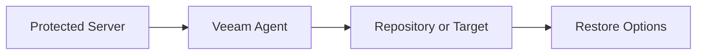

In hypervisor-based backup, Veeam often reads the VM from the outside through the virtualization stack. In agent-based protection, the protected machine itself participates directly in the backup process. That means backup behavior depends more explicitly on the operating system, local services, volume layout, and guest-level configuration.

The advantage is flexibility. The tradeoff is that you must think more carefully about endpoint health, deployment, and recovery media.

---

[Go to Lesson TOC](#toc-l13)

[Go to Course TOC](#master-table-of-contents)

---

<a id="l13-common-agent-use-cases"></a>
## Common Agent Use Cases

Typical reasons to use Veeam Agent include:

- physical Windows server protection
- physical Linux server protection
- standalone machines outside the main hypervisor estate
- cloud-hosted systems where agent control is preferable or necessary
- branch or edge workloads where centralized management still matters

---

[Go to Lesson TOC](#toc-l13)

[Go to Course TOC](#master-table-of-contents)

---

<a id="l13-windows-and-linux-agent-considerations"></a>
## Windows and Linux Agent Considerations

Windows and Linux agents solve a similar problem, but they do not behave identically. Windows agent workflows often align closely with familiar backup and VSS concepts. Linux agent workflows require more awareness of distribution support, kernel behavior, snapshot mechanisms, and credential models.

The core administrator skill is not memorizing every distro nuance. It is understanding that agent reliability depends on the local system’s readiness.

---

[Go to Lesson TOC](#toc-l13)

[Go to Course TOC](#master-table-of-contents)

---

<a id="l13-managed-vs-standalone-thinking"></a>
## Managed vs. Standalone Thinking

Agents can often be managed centrally through Veeam policies or used more independently depending on the design. Central management is powerful because it gives the backup team control and visibility. But it also means onboarding, policy scope, and connectivity become more important.

Standalone agent operations may suit isolated or small environments, but they can create visibility gaps if not documented well.

---

[Go to Lesson TOC](#toc-l13)

[Go to Course TOC](#master-table-of-contents)

---

<a id="l13-what-you-need-to-protect-successfully-with-agents"></a>
## What You Need to Protect Successfully With Agents

Agent-based protection usually requires:

- reachability or deployment path from Veeam to the system, where central management is used
- administrative or elevated access sufficient for deployment and configuration
- compatible OS and kernel support
- enough local stability for snapshot/consistency operations
- a target repository or backup destination that aligns with recovery goals

---

[Go to Lesson TOC](#toc-l13)

[Go to Course TOC](#master-table-of-contents)

---

<a id="l13-recovery-scope-in-agent-environments"></a>
## Recovery Scope in Agent Environments

Agent-based backups can support more than simple file restore. Depending on the policy and platform, they can support full machine, volume, or bare-metal-style recovery patterns. That makes them extremely valuable for physical workloads.

However, bare metal recovery is only useful if recovery media and hardware driver considerations are understood ahead of time. Backup without tested recovery media is a dangerous assumption in physical environments.

---

[Go to Lesson TOC](#toc-l13)

[Go to Course TOC](#master-table-of-contents)

---

<a id="l13-policy-design-for-agent-estates"></a>
## Policy Design for Agent Estates

When many standalone systems need protection, policy consistency becomes very important. Rather than building one-off settings for every machine, a good administrator defines policy families. For example:

- branch office Windows systems with daily backup and short retention
- critical physical application servers with tighter RPO and stronger copy policy
- Linux infrastructure nodes with a focus on system-state and config recovery

This kind of policy grouping reduces drift and makes backup behavior easier to explain to stakeholders.

---

[Go to Lesson TOC](#toc-l13)

[Go to Course TOC](#master-table-of-contents)

---

<a id="l13-why-agent-policies-matter"></a>
## Why Agent Policies Matter

At scale, you do not want to configure every agent manually forever. Centralized policy-based management helps standardize schedules, retention, processing behavior, and repository targets. This reduces drift and improves operational control.

Still, policy-based management is only as good as your scoping and credential hygiene. If systems are added sloppily or grouped badly, policy management becomes confusing.

---

[Go to Lesson TOC](#toc-l13)

[Go to Course TOC](#master-table-of-contents)

---

<a id="l13-no-hypervisor-design-principles"></a>
## No-Hypervisor Design Principles

For no-hypervisor environments, keep these principles in mind:

- standardize backup policy by role where possible
- document recovery media and boot assumptions
- treat repository access and network reachability as first-class design inputs
- test at least one restore path per system category
- do not assume physical recovery will resemble virtual recovery in speed or convenience

---

[Go to Lesson TOC](#toc-l13)

[Go to Course TOC](#master-table-of-contents)

---

<a id="l13-common-agent-failure-themes"></a>
## Common Agent Failure Themes

- deployment blocked by firewall, antivirus, or policy
- credential issues during installation or policy push
- snapshot/VSS problems on Windows
- kernel or snapshot-module problems on Linux
- connectivity loss between agent and central management point

The lesson here is not that agent backups are fragile. It is that endpoint-centered protection requires endpoint-centered operational discipline.

These topics become even more important in the troubleshooting lesson.

---

[Go to Lesson TOC](#toc-l13)

[Go to Course TOC](#master-table-of-contents)

---

<a id="l13-v12x-notes"></a>
## v12.x Notes

As Veeam environments became more hybrid, agent-based protection grew in importance. Administrators who understand only image-based VM backup are no longer seeing the full platform. Modern Veeam operations require comfort across both hypervisor-integrated and agent-based protection models.

---

[Go to Lesson TOC](#toc-l13)

[Go to Course TOC](#master-table-of-contents)

---

<a id="l13-lab-walkthrough"></a>
## Lab Walkthrough

<a id="l13-prerequisites"></a>
### Prerequisites

- one Windows system such as `PHYS-SRV01` or `WIN-APP01`
- one Linux system such as `LIN-WEB01`
- repository available for agent-targeted backups

<a id="l13-steps"></a>
### Steps

1. Identify one system that would be better protected through an agent than through hypervisor integration.
2. Explain why.
3. Choose one Windows and one Linux workload for future agent-based protection.
4. Define a simple policy for each: schedule, retention, destination.
5. Decide what type of restore you would need most urgently for each system: file, volume, or full machine.

<a id="l13-verification"></a>
### Verification

You have completed the lab if you can explain the protection and recovery model for both a Windows and Linux standalone workload.

---

[Go to Lesson TOC](#toc-l13)

[Go to Course TOC](#master-table-of-contents)

---

<a id="l13-key-takeaways"></a>
## Key Takeaways

- Agent-based protection is essential for physical and standalone systems.
- The no-hypervisor path is a full Veeam operating model, not an exception.
- Policy design and recovery planning matter just as much in agent environments as in VM environments.

---

[Go to Lesson TOC](#toc-l13)

[Go to Course TOC](#master-table-of-contents)

---

<a id="l13-review-questions"></a>
## Review Questions

1. When is Veeam Agent preferable to hypervisor-based backup?
2. What does agent-based protection change operationally?
3. Why are recovery media important in physical environments?
4. Why is centralized policy management useful for agents?
5. What is one Linux-specific risk in agent deployment?

---

<a id="l13-answers"></a>
### Answers

1. When workloads are physical, standalone, isolated, or otherwise not best protected through hypervisor integration.
2. The protected system participates directly in the backup process, increasing dependence on guest OS health and local configuration.
3. Because full machine recovery may depend on bootable media and driver support.
4. It standardizes protection and reduces configuration drift across many endpoints.
5. Kernel or snapshot-module compatibility issues.

---

[Go to Lesson TOC](#toc-l13)

[Go to Course TOC](#master-table-of-contents)

---

**License:** [CC BY-NC-SA 4.0](../LICENSE.md)

---

<a id="lesson-14-lab-deploy-an-agent-policy-for-windows-and-linux-workloads"></a>
# Lesson 14 — Lab: Deploy an Agent Policy for Windows and Linux Workloads


> **VMCE Objective(s):** Practical agent onboarding and policy assignment  
> **Level:** Intermediate  
> **Estimated reading time:** 20–30 minutes  
> **Lab time:** 60–90 minutes

<a id="toc-l14"></a>
## Table of Contents

- [Learning Objectives](#l14-learning-objectives)
- [Concepts and Theory](#l14-concepts-and-theory)
- [Prerequisites](#l14-prerequisites)
- [Lab Goal and Mindset](#l14-lab-goal-and-mindset)
- [Step-by-Step Lab Walkthrough](#l14-step-by-step-lab-walkthrough)
- [Common Issues to Watch For](#l14-common-issues-to-watch-for)
- [Documentation Checklist for This Lab](#l14-documentation-checklist-for-this-lab)
- [Operational Reflection](#l14-operational-reflection)
- [Extended Practice](#l14-extended-practice)
- [Verification Checklist](#l14-verification-checklist)
- [Key Takeaways](#l14-key-takeaways)
- [Review Questions](#l14-review-questions)

---

[Go to Lesson TOC](#toc-l14)

[Go to Course TOC](#master-table-of-contents)

---

<a id="l14-learning-objectives"></a>
## Learning Objectives

- prepare Windows and Linux systems for agent-based protection
- define and apply a policy for agent-managed backups
- verify that the systems can be protected through the no-hypervisor path

---

[Go to Lesson TOC](#toc-l14)

[Go to Course TOC](#master-table-of-contents)

---

<a id="l14-concepts-and-theory"></a>
## Concepts and Theory

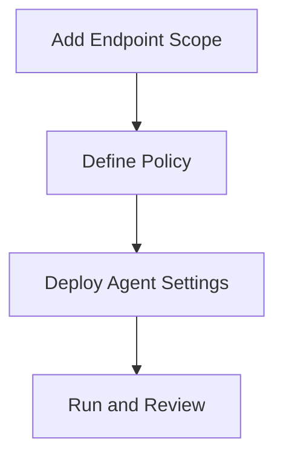

This lesson turns the no-hypervisor design ideas into a real managed workflow. The main point is to prove that Veeam can protect systems that are not being read through a hypervisor management API. Just as important, you will document the assumptions the policy makes about connectivity, credentials, and destination storage.

---

[Go to Lesson TOC](#toc-l14)

[Go to Course TOC](#master-table-of-contents)

---

<a id="l14-prerequisites"></a>
## Prerequisites

- `VEEAM-SRV` operational
- one Windows target such as `PHYS-SRV01`
- one Linux target such as `LIN-WEB01`
- credentials prepared
- repository configured

---

[Go to Lesson TOC](#toc-l14)

[Go to Course TOC](#master-table-of-contents)

---

<a id="l14-lab-goal-and-mindset"></a>
## Lab Goal and Mindset

This lab is designed to make the no-hypervisor path feel operationally normal rather than exceptional. Many environments are strongest on VM backup and weakest on physical or standalone systems. The goal here is to reduce that gap. By the end of the lab, you should be able to explain the policy, the deployment dependencies, the target repository path, and the likely first restore option for each protected endpoint.

---

[Go to Lesson TOC](#toc-l14)

[Go to Course TOC](#master-table-of-contents)

---

<a id="l14-step-by-step-lab-walkthrough"></a>
## Step-by-Step Lab Walkthrough

<a id="l14-step-1-validate-endpoint-reachability"></a>
### Step 1 — Validate Endpoint Reachability

Confirm both systems are reachable, correctly named, and stable. Validate that administrative or elevated access works. If remote access is inconsistent now, policy assignment will not get easier later.

<a id="l14-step-2-create-a-protection-group-or-equivalent-scope"></a>
### Step 2 — Create a Protection Group or Equivalent Scope

In the Veeam console, identify the mechanism used to scope managed agents in your lab. Add `PHYS-SRV01` and `LIN-WEB01` as intended targets.

Think carefully about grouping. Even in a small lab, do not group systems together simply because they are available. Group them because the policy you are about to apply makes sense for both of them. This trains you to avoid messy policy sprawl in real environments.

<a id="l14-step-3-define-the-policy"></a>
### Step 3 — Define the Policy

Create a policy that includes:

- backup schedule
- destination repository or target
- retention settings
- any application-aware or volume selection choices relevant to the platform

Do not simply accept defaults. State why each choice makes sense for these systems.

For example, if the Windows system is a general-purpose business server and the Linux system is a web server, ask whether one schedule and one retention policy really makes sense for both. If the answer is yes, explain why. If the answer is no, note what a more mature production design would change.

<a id="l14-step-4-assign-and-deploy"></a>
### Step 4 — Assign and Deploy

Apply the policy to both endpoints. Watch for deployment or communication issues, especially on the Linux side where SSH and privilege behavior may matter more explicitly.

This stage is especially valuable because it teaches you that agent protection depends on endpoint realities. A hypervisor path can sometimes hide guest-level complexity. Agent-based protection makes local OS assumptions much more visible.

<a id="l14-step-5-trigger-or-observe-first-protection-run"></a>
### Step 5 — Trigger or Observe First Protection Run

If possible, run the policy or wait for the first scheduled session. Review the outcome carefully. Record any warnings.

If the run succeeds for one endpoint but not the other, do not treat that as a simple “one host is broken” event. Instead, compare the differences systematically: operating system, credentials, repository reachability, privilege behavior, and local snapshot/consistency expectations. That comparison process is one of the most useful habits in mixed OS environments.

<a id="l14-step-6-confirm-recovery-scope"></a>
### Step 6 — Confirm Recovery Scope

For each endpoint, write down the most likely recovery action you would perform first in a real incident.

Include the reason for that choice. A Windows system might most often need file or volume restore. A Linux web server might be faster to rebuild partially and then recover configuration or content. Recovery planning should reflect operational reality, not just available product features.

<a id="l14-step-7-compare-the-two-endpoints"></a>
### Step 7 — Compare the Two Endpoints

Write a short comparison of the Windows and Linux policy experience. Which platform was easier to onboard? Which one introduced more dependency checks? Which one would you want to test more aggressively before using in production? This reflection helps turn the lab into cross-platform operational understanding.

---

[Go to Lesson TOC](#toc-l14)

[Go to Course TOC](#master-table-of-contents)

---

<a id="l14-common-issues-to-watch-for"></a>
## Common Issues to Watch For

- endpoint firewall blocks deployment or communication
- wrong credentials or privilege elevation problem
- Linux compatibility or package issue
- target repository not accessible as expected

---

[Go to Lesson TOC](#toc-l14)

[Go to Course TOC](#master-table-of-contents)

---

<a id="l14-documentation-checklist-for-this-lab"></a>
## Documentation Checklist for This Lab

Record the following:

- endpoint names and operating systems
- credentials used for policy deployment
- repository target
- schedule and retention choices
- result of first policy run
- first likely restore option for each endpoint
- one improvement you would make before scaling agent protection further

This small documentation habit mirrors the kind of operational record that becomes very useful in real environments.

---

[Go to Lesson TOC](#toc-l14)

[Go to Course TOC](#master-table-of-contents)

---

<a id="l14-operational-reflection"></a>
## Operational Reflection

A useful checkpoint after this lab is whether you now see agent-based protection as equivalent in seriousness to VM-based protection. If the answer is yes, the no-hypervisor path is becoming part of your normal backup thinking rather than an exception case.

---

[Go to Lesson TOC](#toc-l14)

[Go to Course TOC](#master-table-of-contents)

---

<a id="l14-extended-practice"></a>
## Extended Practice

Try one follow-up exercise:

- design a second agent policy for a different class of system
- compare Windows and Linux restore priorities
- write a simple decision matrix for when to choose agent protection over hypervisor-based protection

These exercises help cement the policy-thinking side of the lesson.

---

[Go to Lesson TOC](#toc-l14)

[Go to Course TOC](#master-table-of-contents)

---

<a id="l14-verification-checklist"></a>
## Verification Checklist

- both endpoints visible in the managed scope
- policy assigned successfully
- at least one initial protection result reviewed
- recovery intent documented for each system

---

[Go to Lesson TOC](#toc-l14)

[Go to Course TOC](#master-table-of-contents)

---

<a id="l14-key-takeaways"></a>
## Key Takeaways

- Agent policies should be deliberate and role-aware.
- The no-hypervisor path still benefits from centralized control and disciplined validation.
- First-run verification matters just as much with agents as with VM jobs.

---

[Go to Lesson TOC](#toc-l14)

[Go to Course TOC](#master-table-of-contents)

---

<a id="l14-review-questions"></a>
## Review Questions

1. Why should you verify endpoint reachability before assigning an agent policy?
2. What is the value of using a protection group or managed scope?
3. Why should you document intended recovery action for each protected system?
4. What is one common Linux deployment obstacle?
5. Why is the first agent run important to watch closely?

---

<a id="l14-answers"></a>
### Answers

1. Because connectivity and authentication problems will otherwise cause avoidable deployment failure.
2. It supports central management and consistent policy application.
3. Because backup design should reflect recovery need, not just data capture.
4. SSH or privilege elevation problems.
5. Because it reveals whether the policy actually works in the real endpoint context.

---

[Go to Lesson TOC](#toc-l14)

[Go to Course TOC](#master-table-of-contents)

---

**License:** [CC BY-NC-SA 4.0](../LICENSE.md)

---

<a id="lesson-15-nas-backup-file-share-protection-change-tracking-and-recovery-expectations"></a>
# Lesson 15 — NAS Backup: File Share Protection, Change Tracking and Recovery Expectations


> **VMCE Objective(s):** NAS protection, file-share-oriented backup strategy, restore concepts  
> **Level:** Intermediate  
> **Estimated reading time:** 45–60 minutes  
> **Lab time:** 30 minutes

<a id="toc-l15"></a>
## Table of Contents

- [Learning Objectives](#l15-learning-objectives)
- [Concepts and Theory](#l15-concepts-and-theory)
- [Why NAS Backup Is Different](#l15-why-nas-backup-is-different)
- [Typical NAS Use Cases](#l15-typical-nas-use-cases)
- [Cache Repository and Processing Considerations](#l15-cache-repository-and-processing-considerations)
- [Recovery Expectations for NAS Data](#l15-recovery-expectations-for-nas-data)
- [Operational Design Questions for NAS Protection](#l15-operational-design-questions-for-nas-protection)
- [Security and Ransomware Considerations](#l15-security-and-ransomware-considerations)
- [Relationship to No-Hypervisor Environments](#l15-relationship-to-no-hypervisor-environments)
- [v12.x Notes](#l15-v12x-notes)
- [Lab Walkthrough](#l15-lab-walkthrough)
- [Key Takeaways](#l15-key-takeaways)
- [Review Questions](#l15-review-questions)

---

[Go to Lesson TOC](#toc-l15)

[Go to Course TOC](#master-table-of-contents)

---

<a id="l15-learning-objectives"></a>
## Learning Objectives

- explain how NAS backup differs from VM and agent backup
- understand why file share protection has its own architecture and workflow
- identify design concerns such as cache, indexing, and recovery speed
- recognize use cases for NAS backup in mixed IT environments

---

[Go to Lesson TOC](#toc-l15)

[Go to Course TOC](#master-table-of-contents)

---

<a id="l15-concepts-and-theory"></a>
## Concepts and Theory

NAS backup protects file shares rather than virtual disk images or directly managed endpoint volumes. This sounds simpler at first, but it introduces its own architecture and operational logic. Instead of focusing on VM snapshots or agent deployment, NAS protection focuses on discovering share contents, tracking changes, indexing, and storing recoverable versions efficiently.

NAS workloads matter because many organizations still depend heavily on shared file stores for departmental data, user home folders, collaboration shares, archives, engineering files, and application-generated content. These shares are often business-critical and heavily used.

---

[Go to Lesson TOC](#toc-l15)

[Go to Course TOC](#master-table-of-contents)

---

<a id="l15-why-nas-backup-is-different"></a>
## Why NAS Backup Is Different

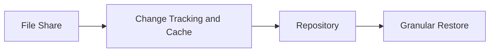

A VM backup captures the state of a virtual machine. An agent backup protects a machine from within or directly on the OS. NAS backup, by contrast, protects data exposed through the file share interface. That means:

- the protected object is the share and its contents
- file-level change tracking and indexing become more important
- cache and repository behavior matter differently than in image-based backups
- restore expectations are often more granular and user-facing

Administrators should not treat NAS backup as an afterthought. It serves a distinct recovery need.

---

[Go to Lesson TOC](#toc-l15)

[Go to Course TOC](#master-table-of-contents)

---

<a id="l15-typical-nas-use-cases"></a>
## Typical NAS Use Cases

- departmental file shares
- home directories
- application-export shares
- long-lived content repositories
- user collaboration or project spaces

In many environments, the volume of NAS data is large and the file count is even larger. This changes performance and indexing expectations considerably.

---

[Go to Lesson TOC](#toc-l15)

[Go to Course TOC](#master-table-of-contents)

---

<a id="l15-cache-repository-and-processing-considerations"></a>
## Cache Repository and Processing Considerations

Because NAS backup involves change tracking and file indexing logic, cache behavior becomes relevant. The cache repository supports the operational model that helps Veeam determine what changed between runs. Poor cache design or insufficient space can affect efficiency.

The key lesson is that NAS protection is not only about where the backup lands, but also how Veeam keeps track of the file-share state over time.

---

[Go to Lesson TOC](#toc-l15)

[Go to Course TOC](#master-table-of-contents)

---

<a id="l15-recovery-expectations-for-nas-data"></a>
## Recovery Expectations for NAS Data

Most NAS recoveries are granular. Users often need a deleted file, overwritten folder, or prior version restored. That means administrators should pay special attention to:

- browse and search usability
- retention depth for accidental deletion scenarios
- performance when restoring many small files
- share availability expectations after incident conditions

NAS backups may also play a role in larger disaster recovery situations if an entire file share or file server function is disrupted.

---

[Go to Lesson TOC](#toc-l15)

[Go to Course TOC](#master-table-of-contents)

---

<a id="l15-operational-design-questions-for-nas-protection"></a>
## Operational Design Questions for NAS Protection

Before configuring NAS backup in a serious environment, ask:

- How many files and how much total data are involved?
- How often does content change?
- How often do users request deleted or previous-version recovery?
- What retention window is needed for accidental deletion versus corruption discovery?
- Does the organization need a second copy or immutable copy of file-share data?

NAS protection often becomes more demanding as file counts grow, even if total capacity seems manageable.

---

[Go to Lesson TOC](#toc-l15)

[Go to Course TOC](#master-table-of-contents)

---

<a id="l15-security-and-ransomware-considerations"></a>
## Security and Ransomware Considerations

Shared file environments are common ransomware targets because they contain broad user-accessible content. Protecting them effectively means:

- retaining sufficient history
- maintaining resilient backup copies
- considering immutable storage for at least one copy
- ensuring restore workflows are fast enough to respond to large-scale file corruption or encryption

---

[Go to Lesson TOC](#toc-l15)

[Go to Course TOC](#master-table-of-contents)

---

<a id="l15-relationship-to-no-hypervisor-environments"></a>
## Relationship to No-Hypervisor Environments

NAS backup is highly relevant in no-hypervisor and mixed environments. Even if you are not protecting many VMs, you may still have critical shared storage that needs dedicated protection.

---

[Go to Lesson TOC](#toc-l15)

[Go to Course TOC](#master-table-of-contents)

---

<a id="l15-v12x-notes"></a>
## v12.x Notes

Modern Veeam environments increasingly treat NAS as a first-class workload type. Administrators should be comfortable discussing file-share protection alongside VM and agent protection rather than seeing it as a niche edge case.

---

[Go to Lesson TOC](#toc-l15)

[Go to Course TOC](#master-table-of-contents)

---

<a id="l15-lab-walkthrough"></a>
## Lab Walkthrough

<a id="l15-prerequisites"></a>
### Prerequisites

- access to a NAS share or file-share concept such as `NAS01`
- repository available

<a id="l15-steps"></a>
### Steps

1. Identify one file share in your environment that would require backup.
2. Document why VM-level protection alone might not be the best operational answer.
3. Define a retention expectation for accidental deletion recovery.
4. State where you would want the second copy of that data to live.
5. If your lab allows, inspect the NAS backup workflow area in the Veeam console.

<a id="l15-verification"></a>
### Verification

You have completed the lab if you can explain how NAS backup differs from VM backup and what kind of recovery users would expect from it.

---

[Go to Lesson TOC](#toc-l15)

[Go to Course TOC](#master-table-of-contents)

---

<a id="l15-key-takeaways"></a>
## Key Takeaways

- NAS backup protects shares and file content, not entire VM disk images.
- File count, indexing, and cache behavior are central to NAS design.
- Granular restore expectations make retention and usability especially important.

---

[Go to Lesson TOC](#toc-l15)

[Go to Course TOC](#master-table-of-contents)

---

<a id="l15-review-questions"></a>
## Review Questions

1. Why is NAS backup different from VM backup?
2. Why does cache design matter in NAS protection?
3. What type of restore is especially common in NAS scenarios?
4. Why are NAS shares attractive ransomware targets?
5. How can NAS backup still matter in a no-hypervisor environment?

---

<a id="l15-answers"></a>
### Answers

1. Because it protects file shares and their contents rather than VM images.
2. Because Veeam uses change tracking and operational state to process large file-share datasets efficiently.
3. Granular file or folder restore.
4. Because they centralize large amounts of user and departmental data.
5. Because file shares remain critical workloads even when virtual machine protection is limited.

---

[Go to Lesson TOC](#toc-l15)

[Go to Course TOC](#master-table-of-contents)

---

**License:** [CC BY-NC-SA 4.0](../LICENSE.md)

---

<a id="lesson-16-restore-options-overview-vm-file-volume-and-service-recovery"></a>
# Lesson 16 — Restore Options Overview: VM, File, Volume and Service Recovery


> **VMCE Objective(s):** Recovery method selection, restore workflow understanding, RTO-aware recovery planning  
> **Level:** Intermediate  
> **Estimated reading time:** 60–75 minutes  
> **Lab time:** 35 minutes

<a id="toc-l16"></a>
## Table of Contents

- [Learning Objectives](#l16-learning-objectives)
- [Concepts and Theory](#l16-concepts-and-theory)
- [Common Recovery Questions](#l16-common-recovery-questions)
- [Full VM Restore](#l16-full-vm-restore)
- [Instant VM Recovery](#l16-instant-vm-recovery)
- [Guest File Restore](#l16-guest-file-restore)
- [Application Item Restore](#l16-application-item-restore)
- [Volume or Bare Metal Recovery](#l16-volume-or-bare-metal-recovery)
- [Restore Speed vs. Restore Simplicity](#l16-restore-speed-vs-restore-simplicity)
- [Recovery Decision Table](#l16-recovery-decision-table)
- [Recovery Verification](#l16-recovery-verification)
- [Security Considerations During Restore](#l16-security-considerations-during-restore)
- [Recovery Planning Checklist](#l16-recovery-planning-checklist)
- [Lab Walkthrough](#l16-lab-walkthrough)
- [Key Takeaways](#l16-key-takeaways)
- [Review Questions](#l16-review-questions)

---

[Go to Lesson TOC](#toc-l16)

[Go to Course TOC](#master-table-of-contents)

---

<a id="l16-learning-objectives"></a>
## Learning Objectives

- compare major Veeam restore methods and when to use each one
- understand the difference between operational convenience and recovery completeness
- choose restore methods based on incident type and business pressure
- explain how restore planning differs across virtual and no-hypervisor workloads

---

[Go to Lesson TOC](#toc-l16)

[Go to Course TOC](#master-table-of-contents)

---

<a id="l16-concepts-and-theory"></a>
## Concepts and Theory

Backups exist for one reason: recovery. If administrators spend all their time optimizing backup jobs and none of their time understanding restore choices, the backup program is incomplete. Veeam offers many recovery methods, and that flexibility is one of its strengths. It is also one reason learners can feel overwhelmed. The solution is to organize restore methods by problem type.

---

[Go to Lesson TOC](#toc-l16)

[Go to Course TOC](#master-table-of-contents)

---

<a id="l16-common-recovery-questions"></a>
## Common Recovery Questions

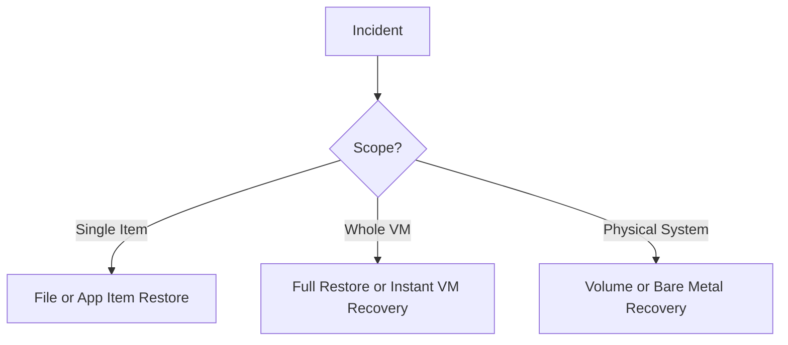

When an incident occurs, ask:

- do I need one file or the whole system?
- do I need the system online immediately, or can I wait for a full restore?
- is the workload virtual, physical, or NAS-based?
- do I need application items rather than raw files?
- is the target location the original system or a new one?

The right restore method becomes clearer once these questions are answered.

---

[Go to Lesson TOC](#toc-l16)

[Go to Course TOC](#master-table-of-contents)

---

<a id="l16-full-vm-restore"></a>
## Full VM Restore

A full VM restore is appropriate when you want to restore an entire virtual machine back to production or an alternate location. It is conceptually simple but may require more time and target capacity than faster, more surgical methods.

This method is useful when the whole VM must be reconstructed, the original is lost or corrupted beyond practical repair, or alternate faster methods are not appropriate.

---

[Go to Lesson TOC](#toc-l16)

[Go to Course TOC](#master-table-of-contents)

---

<a id="l16-instant-vm-recovery"></a>
## Instant VM Recovery

Instant VM Recovery is designed to restore service quickly by mounting and running the VM directly from backup storage while a more permanent move back to production is prepared. This is a classic example of balancing RTO and long-term restoration completeness.

The reason Instant VM Recovery is so powerful is not that it is always the final answer. It is powerful because it gets the service back faster while buying time for a cleaner final placement.

---

[Go to Lesson TOC](#toc-l16)

[Go to Course TOC](#master-table-of-contents)

---

<a id="l16-guest-file-restore"></a>
## Guest File Restore

Many incidents are small. A user deletes a folder, overwrites a report, or needs a single configuration file. Guest file restore is ideal here because it avoids the disruption of restoring the whole machine. Administrators should become very comfortable with this path because it is often the most common real-world recovery request.

---

[Go to Lesson TOC](#toc-l16)

[Go to Course TOC](#master-table-of-contents)

---

<a id="l16-application-item-restore"></a>
## Application Item Restore

Sometimes what is needed is not the VM, and not just a raw file, but an application object such as a database item, directory object, message, or record. This is where Veeam’s application explorer tools become important. Lesson 18 covers these in more detail, but the core recovery principle belongs here: recover at the narrowest scope that solves the incident.

---

[Go to Lesson TOC](#toc-l16)

[Go to Course TOC](#master-table-of-contents)

---

<a id="l16-volume-or-bare-metal-recovery"></a>
## Volume or Bare Metal Recovery

For physical or no-hypervisor systems, recovery needs often involve entire volume sets, operating system recovery, or bare metal rebuild scenarios. This can be more operationally demanding than virtual recovery because hardware compatibility, boot media, and drivers become part of the story.

The broader lesson is that no-hypervisor recovery is often less forgiving than VM recovery. Planning matters more, not less.

---

[Go to Lesson TOC](#toc-l16)

[Go to Course TOC](#master-table-of-contents)

---

<a id="l16-restore-speed-vs-restore-simplicity"></a>
## Restore Speed vs. Restore Simplicity

Not every recovery method optimizes the same goal. Some methods optimize speed, others completeness, others granularity. A skilled administrator chooses based on the incident rather than blindly preferring the most dramatic option.

For example:

- a deleted spreadsheet should not trigger a full VM restore
- a business-critical failed application server may justify Instant VM Recovery
- a corrupted physical server may require full machine or volume-oriented recovery planning

---

[Go to Lesson TOC](#toc-l16)

[Go to Course TOC](#master-table-of-contents)

---

<a id="l16-recovery-decision-table"></a>
## Recovery Decision Table

| Incident type | Likely best first action |
|---|---|
| Single deleted document | Guest file restore |
| Missing AD object | Application item recovery |
| Failed business VM with tight RTO | Instant VM Recovery |
| Total VM corruption with time available | Full VM restore |
| Physical server boot failure | Volume or bare-metal-oriented recovery |

This table is intentionally simple, but it reinforces an essential recovery lesson: match the method to the incident, not to whatever feature you are most excited to use.

---

[Go to Lesson TOC](#toc-l16)

[Go to Course TOC](#master-table-of-contents)

---

<a id="l16-recovery-verification"></a>
## Recovery Verification

The existence of a restore method is not proof that it will succeed under pressure. Recovery planning should include:

- target capacity and placement awareness
- network mapping awareness
- credential readiness for guest-level operations
- familiarity with the restore wizard paths
- regular testing of representative recovery cases

---

[Go to Lesson TOC](#toc-l16)

[Go to Course TOC](#master-table-of-contents)

---

<a id="l16-security-considerations-during-restore"></a>
## Security Considerations During Restore

Modern recovery also requires cyber awareness. If compromise is suspected, administrators should consider whether the restore point is likely clean, whether malware scanning or validation should occur, and whether the recovered system should be isolated first.

This becomes especially important in ransomware scenarios where restoring the wrong point too quickly can recreate the problem.

---

[Go to Lesson TOC](#toc-l16)

[Go to Course TOC](#master-table-of-contents)

---

<a id="l16-recovery-planning-checklist"></a>
## Recovery Planning Checklist

- Do we know the cleanest likely restore point?
- Do we know the target location?
- Do we know whether the recovery is temporary or final?
- Do we know who validates the application after restore?
- Do we know what to do if the first recovery attempt is incomplete?

These questions reduce confusion during high-pressure incidents.

---

[Go to Lesson TOC](#toc-l16)

[Go to Course TOC](#master-table-of-contents)

---

<a id="l16-lab-walkthrough"></a>
## Lab Walkthrough

<a id="l16-prerequisites"></a>
### Prerequisites

- at least one restore point created from earlier lessons
- optional agent-protected system or NAS share concept

<a id="l16-steps"></a>
### Steps

1. List three incident types: deleted file, failed VM, corrupted physical server.
2. For each incident, choose the best Veeam restore method and explain why.
3. Define one case where Instant VM Recovery is the best answer.
4. Define one case where it is not.
5. For a physical server, write what additional information you would need before attempting full recovery.

<a id="l16-verification"></a>
### Verification

You have completed the lab if you can match the recovery method to the incident instead of treating every incident as a full restore problem.

---

[Go to Lesson TOC](#toc-l16)

[Go to Course TOC](#master-table-of-contents)

---

<a id="l16-key-takeaways"></a>
## Key Takeaways

- Restore method selection should match the scope and urgency of the incident.
- Instant VM Recovery optimizes service restoration speed, not necessarily final placement.
- Guest file and item-level restores often solve common problems faster and more safely.
- No-hypervisor recovery requires additional planning around boot and hardware assumptions.

---

[Go to Lesson TOC](#toc-l16)

[Go to Course TOC](#master-table-of-contents)

---

<a id="l16-review-questions"></a>
## Review Questions

1. When is a full VM restore appropriate?
2. What makes Instant VM Recovery valuable?
3. Why should administrators prefer narrow-scope recovery when possible?
4. Why is physical recovery often more demanding than virtual recovery?
5. What additional concern applies to recovery in suspected malware incidents?

---

<a id="l16-answers"></a>
### Answers

1. When the entire VM must be restored or reconstructed.
2. It can restore service quickly by running the VM from backup storage while permanent recovery is completed later.
3. Because it minimizes disruption and targets only what is actually missing or damaged.
4. Because hardware, boot media, and driver compatibility can all affect the outcome.
5. You must consider whether the restore point is clean and whether validation or isolation is needed before returning it to production.

---

[Go to Lesson TOC](#toc-l16)

[Go to Course TOC](#master-table-of-contents)

---

**License:** [CC BY-NC-SA 4.0](../LICENSE.md)

---

<a id="lesson-17-lab-instant-vm-recovery-and-recovery-validation"></a>
# Lesson 17 — Lab: Instant VM Recovery and Recovery Validation


> **VMCE Objective(s):** Practical recovery execution and validation mindset  
> **Level:** Intermediate  
> **Estimated reading time:** 20–30 minutes  
> **Lab time:** 60–90 minutes

<a id="toc-l17"></a>
## Table of Contents

- [Learning Objectives](#l17-learning-objectives)
- [Concepts and Theory](#l17-concepts-and-theory)
- [Prerequisites](#l17-prerequisites)
- [Lab Goal and Success Criteria](#l17-lab-goal-and-success-criteria)
- [Step-by-Step Lab Walkthrough](#l17-step-by-step-lab-walkthrough)
- [Common Issues During Recovery Testing](#l17-common-issues-during-recovery-testing)
- [Lab Note Checklist](#l17-lab-note-checklist)
- [Verification Checklist](#l17-verification-checklist)
- [Key Takeaways](#l17-key-takeaways)
- [Operational Reflection](#l17-operational-reflection)
- [Extended Practice](#l17-extended-practice)
- [Review Questions](#l17-review-questions)

---

[Go to Lesson TOC](#toc-l17)

[Go to Course TOC](#master-table-of-contents)

---

<a id="l17-learning-objectives"></a>
## Learning Objectives

- perform or simulate an Instant VM Recovery workflow
- understand the difference between temporary service recovery and final migration
- validate that recovery is more than a wizard completion event

---

[Go to Lesson TOC](#toc-l17)

[Go to Course TOC](#master-table-of-contents)

---

<a id="l17-concepts-and-theory"></a>
## Concepts and Theory

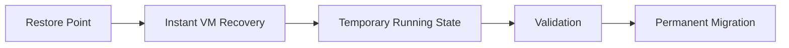

Instant VM Recovery is one of the most recognizable Veeam features because it demonstrates why Veeam is considered recovery-focused. Instead of waiting for a full restore to complete before service resumes, you can bring a VM online from the backup storage and then move it back to production more cleanly afterward.

The crucial lesson is that recovery success should be measured by workload usability, not just by the wizard reporting completion.

---

[Go to Lesson TOC](#toc-l17)

[Go to Course TOC](#master-table-of-contents)

---

<a id="l17-prerequisites"></a>
## Prerequisites

- at least one VM restore point
- virtualization infrastructure available for test recovery
- non-production test VM strongly recommended

---

[Go to Lesson TOC](#toc-l17)

[Go to Course TOC](#master-table-of-contents)

---

<a id="l17-lab-goal-and-success-criteria"></a>
## Lab Goal and Success Criteria

This lab should leave you able to distinguish between three separate stages of recovery:

1. the technical act of starting a recovered VM
2. the operational act of verifying the guest system is usable
3. the business act of confirming the service actually meets its purpose again

That distinction is essential. Many recovery exercises stop at stage one and therefore provide less confidence than the team thinks.

---

[Go to Lesson TOC](#toc-l17)

[Go to Course TOC](#master-table-of-contents)

---

<a id="l17-step-by-step-lab-walkthrough"></a>
## Step-by-Step Lab Walkthrough

<a id="l17-step-1-choose-a-candidate-vm"></a>
### Step 1 — Choose a Candidate VM

Select a lab VM with a completed restore point. Prefer a non-critical workload such as `WIN-APP01` or `LIN-WEB01`.

<a id="l17-step-2-start-instant-vm-recovery"></a>
### Step 2 — Start Instant VM Recovery

In the Veeam console, locate the restore point and start the Instant VM Recovery workflow. Review the wizard steps carefully instead of clicking through automatically. Pay attention to target host, datastore, and network mapping choices.

The reason to move slowly here is that recovery mistakes are often made during mapping. A technically correct restore into the wrong network or wrong host context can produce a VM that is powered on but functionally wrong. This is a common reason recovery testing feels less successful than the console suggests.

<a id="l17-step-3-bring-the-recovered-vm-online"></a>
### Step 3 — Bring the Recovered VM Online

If your lab supports it, allow the VM to come online. Validate that the operating system boots and that basic service behavior is what you expect.

Be explicit about what you are testing. If the recovered system is a web server, a successful login alone is not enough. If it is an application server, the application service state matters. If it is a directory or database workload, domain or database function may matter more than desktop usability.

<a id="l17-step-4-validate-function-not-just-power-state"></a>
### Step 4 — Validate Function, Not Just Power State

Check at least two meaningful indicators:

- can you log in?
- is the application service running?
- does the network identity appear correct?

The point is to avoid equating “powered on” with “recovered.”

This distinction is one of the most important recovery habits in the whole course. Infrastructure operators often stop when the hypervisor looks healthy. Application owners do not care whether the hypervisor looks healthy. They care whether the service works.

<a id="l17-step-5-document-what-a-permanent-recovery-step-would-be"></a>
### Step 5 — Document What a Permanent Recovery Step Would Be

If your lab does not complete a full migration back to production, write the next step you would take. The lesson is to understand that Instant VM Recovery is often the first phase, not the last one.

In real operations, this may involve moving the workload back to production storage, updating mappings, or planning a controlled maintenance step once the crisis has passed. The key point is that temporary service return and final recovery are related but not identical goals.

<a id="l17-step-6-capture-validation-evidence"></a>
### Step 6 — Capture Validation Evidence

Write down the exact tests you used to decide that the workload was usable. Avoid vague statements such as “it looked fine.” Instead, note concrete evidence such as login success, service status, application response, or network reachability.

---

[Go to Lesson TOC](#toc-l17)

[Go to Course TOC](#master-table-of-contents)

---

<a id="l17-common-issues-during-recovery-testing"></a>
## Common Issues During Recovery Testing

- VM boots but application service does not start
- network mapping is wrong or incomplete
- authentication succeeds locally but service integration fails
- recovered workload is usable only partially because dependencies were not considered

These are all useful lab outcomes because they teach where recovery validation must go deeper.

---

[Go to Lesson TOC](#toc-l17)

[Go to Course TOC](#master-table-of-contents)

---

<a id="l17-lab-note-checklist"></a>
## Lab Note Checklist

Record:

- source restore point used
- target host and mapping choices
- whether the VM booted cleanly
- functional validation steps performed
- what permanent recovery step would follow
- one improvement you would make to the recovery procedure

---

[Go to Lesson TOC](#toc-l17)

[Go to Course TOC](#master-table-of-contents)

---

<a id="l17-verification-checklist"></a>
## Verification Checklist

- recovery workflow launched successfully
- recovered VM or equivalent test object validated at a functional level
- final-state recovery step understood

---

[Go to Lesson TOC](#toc-l17)

[Go to Course TOC](#master-table-of-contents)

---

<a id="l17-key-takeaways"></a>
## Key Takeaways

- Instant VM Recovery is about fast service restoration.
- Recovery validation must include functional checks.
- Temporary restored state should be followed by a plan for permanent placement.

---

[Go to Lesson TOC](#toc-l17)

[Go to Course TOC](#master-table-of-contents)

---

<a id="l17-operational-reflection"></a>
## Operational Reflection

If a restored VM boots but the application is broken, the recovery is not complete. This lab should build the habit of validating business function, not just hypervisor state.

---

[Go to Lesson TOC](#toc-l17)

[Go to Course TOC](#master-table-of-contents)

---

<a id="l17-extended-practice"></a>
## Extended Practice

For a second run, try one of these:

- repeat the lab with a different VM type and compare validation requirements
- create a simple recovery checklist template for future Instant VM Recovery tests
- describe how the test would change if compromise were suspected and you needed a cleaner recovery process

---

[Go to Lesson TOC](#toc-l17)

[Go to Course TOC](#master-table-of-contents)

---

<a id="l17-review-questions"></a>
## Review Questions

1. Why is Instant VM Recovery valuable for low-RTO scenarios?
2. Why is power-on state alone not enough to prove recovery?
3. What should happen after temporary service is restored?
4. Why should labs use non-production test systems?
5. What kinds of mapping choices matter during recovery?

---

<a id="l17-answers"></a>
### Answers

1. Because it gets service running faster than waiting for a full restore to complete first.
2. Because the application may still be unusable even if the VM boots.
3. A migration or final placement plan should return the workload to a proper production state.
4. Because recovery testing can change system state and should not endanger real services.
5. Host, datastore, and network mapping choices.

---

[Go to Lesson TOC](#toc-l17)

[Go to Course TOC](#master-table-of-contents)

---

**License:** [CC BY-NC-SA 4.0](../LICENSE.md)

---

<a id="lesson-18-veeam-explorers-and-application-item-recovery"></a>
# Lesson 18 — Veeam Explorers and Application Item Recovery


> **VMCE Objective(s):** Granular recovery, explorer-based restore workflows, application-aware restore scope  
> **Level:** Intermediate  
> **Estimated reading time:** 50–65 minutes  
> **Lab time:** 30 minutes

<a id="toc-l18"></a>
## Table of Contents

- [Learning Objectives](#l18-learning-objectives)
- [Concepts and Theory](#l18-concepts-and-theory)
- [Why Item-Level Application Recovery Matters](#l18-why-item-level-application-recovery-matters)
- [Relationship to Application-Aware Processing](#l18-relationship-to-application-aware-processing)
- [Common Explorer Use Cases](#l18-common-explorer-use-cases)
- [Operational Benefits](#l18-operational-benefits)
- [Decision Framework](#l18-decision-framework)
- [Risks and Cautions](#l18-risks-and-cautions)
- [No-Hypervisor Relevance](#l18-no-hypervisor-relevance)
- [Lab Walkthrough](#l18-lab-walkthrough)
- [Key Takeaways](#l18-key-takeaways)
- [Review Questions](#l18-review-questions)

---

[Go to Lesson TOC](#toc-l18)

[Go to Course TOC](#master-table-of-contents)

---

<a id="l18-learning-objectives"></a>
## Learning Objectives

- understand the purpose of Veeam Explorer-based application item recovery
- identify scenarios where item-level restore is better than full system restore
- explain how application-aware backups support granular application recovery
- recognize common operational use cases for AD, Exchange, SQL, and similar recoveries

---

[Go to Lesson TOC](#toc-l18)

[Go to Course TOC](#master-table-of-contents)

---

<a id="l18-concepts-and-theory"></a>
## Concepts and Theory

One of the strongest operational benefits of Veeam is the ability to recover not just systems, but meaningful objects inside systems. This is where Veeam Explorers shine. Rather than restoring an entire VM because one Active Directory object or SQL database item is needed, the administrator can work at the application object level.

This aligns with a core recovery principle: restore only as much as necessary to solve the problem.

---

[Go to Lesson TOC](#toc-l18)

[Go to Course TOC](#master-table-of-contents)

---

<a id="l18-why-item-level-application-recovery-matters"></a>
## Why Item-Level Application Recovery Matters

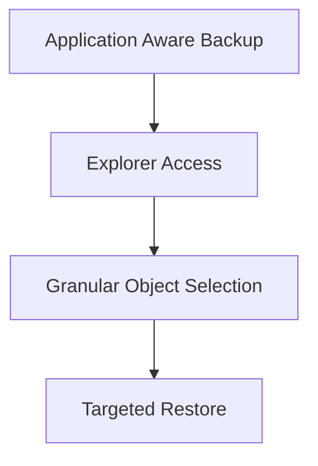

In real environments, failures are often granular:

- an AD object is deleted or modified incorrectly
- an Exchange item needs recovery
- a SQL database needs point-in-time or object-focused help
- a SharePoint or similar application object is missing or damaged

Restoring the whole server for such incidents would often be excessive, disruptive, and risky. Granular recovery improves operational speed and reduces collateral impact.

---

[Go to Lesson TOC](#toc-l18)

[Go to Course TOC](#master-table-of-contents)

---

<a id="l18-relationship-to-application-aware-processing"></a>
## Relationship to Application-Aware Processing

Application item recovery usually depends on having captured the workload in a way that supports meaningful introspection and consistency. That is why Lesson 12 matters so much. If the backup was not taken with the right level of guest and application awareness, the resulting restore flexibility may be reduced.

---

[Go to Lesson TOC](#toc-l18)

[Go to Course TOC](#master-table-of-contents)

---

<a id="l18-common-explorer-use-cases"></a>
## Common Explorer Use Cases

<a id="l18-active-directory"></a>
### Active Directory

Administrators may need to recover accidentally deleted users, groups, OUs, or attributes. Domain controllers are especially sensitive systems, so granular recovery can be much safer than broad rollback.

<a id="l18-exchange"></a>
### Exchange

Mailbox- or item-level recovery allows targeted restoration of messages or related data without restoring the entire mail server environment.

<a id="l18-sql-server"></a>
### SQL Server

Database-oriented recovery is one of the most common reasons application-aware backup settings are taken seriously. Administrators often need precise recovery options rather than all-or-nothing server rollback.

<a id="l18-other-supported-application-contexts"></a>
### Other Supported Application Contexts

Depending on the workload and integration path, other application-level recovery options may also exist. The exact toolset and platform support can evolve across releases, so always validate the current product capabilities for your environment.

---

[Go to Lesson TOC](#toc-l18)

[Go to Course TOC](#master-table-of-contents)

---

<a id="l18-operational-benefits"></a>
## Operational Benefits

- faster targeted recovery
- less disruption to healthy data or services
- more confidence in meeting application owner expectations
- better alignment between backup design and business support outcomes

---

[Go to Lesson TOC](#toc-l18)

[Go to Course TOC](#master-table-of-contents)

---

<a id="l18-decision-framework"></a>
## Decision Framework

Before restoring an application item, ask:

- Is the problem isolated enough for granular recovery?
- Is the original application still healthy apart from the missing item?
- Do we need to restore in place or to an alternate location for review?
- Who should validate the recovered object?

These questions help avoid turning a focused recovery request into a broader operational incident.

---

[Go to Lesson TOC](#toc-l18)

[Go to Course TOC](#master-table-of-contents)

---

<a id="l18-risks-and-cautions"></a>
## Risks and Cautions

Granular restore is powerful, but administrators should still be cautious about:

- restoring into the wrong context
- overwriting valid current state unintentionally
- assuming application data is healthy without validation
- misunderstanding whether the restore should go to the original location or an alternate target

---

[Go to Lesson TOC](#toc-l18)

[Go to Course TOC](#master-table-of-contents)

---

<a id="l18-no-hypervisor-relevance"></a>
## No-Hypervisor Relevance

Application item thinking also matters in environments where agents protect the workload. The important idea is not just how the backup is captured, but whether recovery can be performed at the right scope.

---

[Go to Lesson TOC](#toc-l18)

[Go to Course TOC](#master-table-of-contents)

---

<a id="l18-lab-walkthrough"></a>
## Lab Walkthrough

<a id="l18-prerequisites"></a>
### Prerequisites

- at least one application-aware backup or conceptual workload
- optional domain controller or SQL workload in lab

<a id="l18-steps"></a>
### Steps

1. Choose one application workload such as AD or SQL.
2. Define a realistic recovery incident at the item level.
3. Explain why full machine restore would be a poor first response.
4. Identify what preconditions are necessary for successful item recovery.
5. If your lab allows, inspect the relevant explorer or restore menu paths.

<a id="l18-verification"></a>
### Verification

You have completed the lab if you can explain when application item recovery is the best operational choice and what earlier backup design choices enable it.

---

[Go to Lesson TOC](#toc-l18)

[Go to Course TOC](#master-table-of-contents)

---

<a id="l18-key-takeaways"></a>
## Key Takeaways

- Granular application recovery is often safer and faster than full system rollback.
- Application-aware backup design improves restore flexibility.
- Item-level restore should still be planned and validated carefully.

---

[Go to Lesson TOC](#toc-l18)

[Go to Course TOC](#master-table-of-contents)

---

<a id="l18-review-questions"></a>
## Review Questions

1. Why is application item restore often preferable to full VM restore?
2. How does application-aware processing support this kind of recovery?
3. Name two workloads where granular recovery is especially valuable.
4. What is one risk of careless item-level restoration?
5. Why does this lesson still matter in mixed or no-hypervisor environments?

---

<a id="l18-answers"></a>
### Answers

1. Because it solves narrow incidents with less disruption and faster turnaround.
2. It helps capture the workload in a state that supports meaningful object-level recovery.
3. Active Directory and SQL Server.
4. Overwriting valid current data or restoring into the wrong context.
5. Because the recovery scope problem exists regardless of the source protection method.

---

[Go to Lesson TOC](#toc-l18)

[Go to Course TOC](#master-table-of-contents)

---

**License:** [CC BY-NC-SA 4.0](../LICENSE.md)

---

<a id="lesson-19-vm-replication-design-use-cases-and-failover-strategy"></a>
# Lesson 19 — VM Replication: Design, Use Cases and Failover Strategy


> **VMCE Objective(s):** Replication concepts, DR-oriented protection design, failover planning  
> **Level:** Advanced  
> **Estimated reading time:** 55–70 minutes  
> **Lab time:** 35 minutes

<a id="toc-l19"></a>
## Table of Contents

- [Learning Objectives](#l19-learning-objectives)
- [Concepts and Theory](#l19-concepts-and-theory)
- [When Replication Makes Sense](#l19-when-replication-makes-sense)
- [Replication Is Not Backup Replacement](#l19-replication-is-not-backup-replacement)
- [Core Replication Concepts](#l19-core-replication-concepts)
- [Planned vs. Unplanned Failover](#l19-planned-vs-unplanned-failover)
- [Failback Thinking](#l19-failback-thinking)
- [Design Considerations](#l19-design-considerations)
- [Replication Planning Table](#l19-replication-planning-table)
- [VMware and Hyper-V Context](#l19-vmware-and-hyper-v-context)
- [No-Hypervisor Contrast](#l19-no-hypervisor-contrast)
- [Key Takeaways](#l19-key-takeaways)
- [Review Questions](#l19-review-questions)

---

[Go to Lesson TOC](#toc-l19)

[Go to Course TOC](#master-table-of-contents)

---

<a id="l19-learning-objectives"></a>
## Learning Objectives

- explain what VM replication is and when it is the right choice
- compare replication with backup and backup copy workflows
- design replication for faster recovery objectives
- understand planned failover, unplanned failover, and failback concepts at a high level

---

[Go to Lesson TOC](#toc-l19)

[Go to Course TOC](#master-table-of-contents)

---

<a id="l19-concepts-and-theory"></a>
## Concepts and Theory

Replication exists for one reason: speed of recovery. Where a traditional backup is optimized for flexible restore options and broader retention models, replication is optimized for getting a VM or service running at a secondary location with less delay. That does not make replication “better” than backup. It makes it different.

This distinction is essential. Some administrators discover replication and assume it can replace a well-designed backup strategy. That is almost always a mistake. Replication is powerful, but its strengths are concentrated around readiness and failover, not long-term retention or wide-scope restore flexibility.

---

[Go to Lesson TOC](#toc-l19)

[Go to Course TOC](#master-table-of-contents)

---

<a id="l19-when-replication-makes-sense"></a>
## When Replication Makes Sense

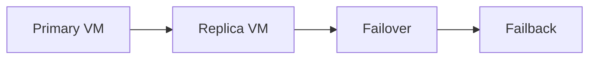

Replication is useful when:

- a workload has a relatively tight RTO
- a secondary site or host exists and is operationally prepared
- VM-level readiness is more important than long history on the replica itself
- the workload can tolerate the infrastructure coupling that replication implies

Typical candidates include business-critical application servers, services that must resume quickly after infrastructure loss, and workloads where waiting for a full restore from backup would be too disruptive.

---

[Go to Lesson TOC](#toc-l19)

[Go to Course TOC](#master-table-of-contents)

---

<a id="l19-replication-is-not-backup-replacement"></a>
## Replication Is Not Backup Replacement

A replica is not the same as a backup chain. It may provide a quicker path to service availability, but it does not automatically provide the same retention flexibility, corruption history, or independent recovery breadth as a well-maintained backup plus copy design.

In practice, the best environments often use both:

- backup for operational restore depth and flexible recovery
- backup copy for resilience and off-site history
- replication for fast failover of selected workloads

---

[Go to Lesson TOC](#toc-l19)

[Go to Course TOC](#master-table-of-contents)

---

<a id="l19-core-replication-concepts"></a>
## Core Replication Concepts

Replication usually involves:

- selecting the source VM
- defining the replica target host or site
- mapping storage and network expectations
- maintaining point-in-time states or restore capability on the replica side
- coordinating failover and possible failback

Unlike simple backup, replication is more tightly tied to the target runtime environment. That means planning is not only about storage. It is also about compute, network, and operational readiness at the target side.

---

[Go to Lesson TOC](#toc-l19)

[Go to Course TOC](#master-table-of-contents)

---

<a id="l19-planned-vs-unplanned-failover"></a>
## Planned vs. Unplanned Failover

In a **planned failover**, the administrator has at least some control and time. The production system may still be reachable, and the goal is to move service deliberately with minimal disruption.

In an **unplanned failover**, the source environment may already be unavailable or compromised. Recovery speed and target readiness become even more important.

Understanding the difference matters because it shapes how you document procedures and what assumptions you can safely make during an incident.

---

[Go to Lesson TOC](#toc-l19)

[Go to Course TOC](#master-table-of-contents)

---

<a id="l19-failback-thinking"></a>
## Failback Thinking

Failover is emotionally dramatic, so teams often focus on it and forget failback. But once a replica is serving production, you still need a clear path to return to the preferred state, whether that means resynchronizing to the primary site or permanently redefining the new location as primary.

Administrators who plan only for failover create incomplete DR workflows.

---

[Go to Lesson TOC](#toc-l19)

[Go to Course TOC](#master-table-of-contents)

---

<a id="l19-design-considerations"></a>
## Design Considerations

Ask the following before enabling replication:

1. Does the workload actually need replica-level recovery speed?
2. Is the target site or host ready in terms of network, storage, and capacity?
3. Are re-IP or alternate network mappings required?
4. How often must replica points be updated?
5. What is the failback plan?

---

[Go to Lesson TOC](#toc-l19)

[Go to Course TOC](#master-table-of-contents)

---

<a id="l19-replication-planning-table"></a>
## Replication Planning Table

| Question | Why it matters |
|---|---|
| Does the workload need low RTO? | Replication is mainly justified by recovery speed |
| Is the target site truly ready? | A replica without operational target readiness is weak assurance |
| Are network mappings clear? | A booted replica without useful connectivity may still be unusable |
| Is failback documented? | DR is incomplete without return or stabilization planning |

Replication is strongest when it is selective and intentional. Replicating everything by default often creates complexity without proportional value.

---

[Go to Lesson TOC](#toc-l19)

[Go to Course TOC](#master-table-of-contents)

---

<a id="l19-vmware-and-hyper-v-context"></a>
## VMware and Hyper-V Context

Replication principles remain consistent across hypervisors, but the details of networking, cluster integration, and storage mapping will vary. Always document platform-specific assumptions.

---

[Go to Lesson TOC](#toc-l19)

[Go to Course TOC](#master-table-of-contents)

---

<a id="l19-no-hypervisor-contrast"></a>
## No-Hypervisor Contrast

In pure no-hypervisor environments, traditional VM replication is not the primary protection pattern. Equivalent fast recovery goals may need to be addressed through other mechanisms such as rapid rebuild automation, alternate-host restore planning, or workload-level clustering. This distinction is important because not every environment can solve low-RTO requirements through VM replication.

---

[Go to Lesson TOC](#toc-l19)

[Go to Course TOC](#master-table-of-contents)

---

<a id="l19-key-takeaways"></a>
## Key Takeaways

- Replication is for faster failover, not broad backup replacement.
- Backup, backup copy, and replication serve different recovery goals.
- Failback planning is as important as failover planning.

---

[Go to Lesson TOC](#toc-l19)

[Go to Course TOC](#master-table-of-contents)

---

<a id="l19-review-questions"></a>
## Review Questions

1. Why is replication not a replacement for backup?
2. When is replication most useful?
3. What is the difference between planned and unplanned failover?
4. Why must the target environment be designed carefully?
5. Why should failback be planned in advance?

---

<a id="l19-answers"></a>
### Answers

1. Because it does not provide the same flexible retention and broad recovery model as backup.
2. When a workload needs faster recovery than full restore alone can provide.
3. Planned failover occurs with preparation and control; unplanned failover occurs when the source is already unavailable or compromised.
4. Because replication depends on target compute, storage, networking, and operational readiness.
5. Because recovery is incomplete if you cannot safely return or redefine production state afterward.

---

[Go to Lesson TOC](#toc-l19)

[Go to Course TOC](#master-table-of-contents)

---

**License:** [CC BY-NC-SA 4.0](../LICENSE.md)

---

<a id="lesson-20-lab-configure-replication-and-perform-a-planned-failover"></a>
# Lesson 20 — Lab: Configure Replication and Perform a Planned Failover


> **VMCE Objective(s):** Practical replication workflow and planned failover reasoning  
> **Level:** Advanced  
> **Estimated reading time:** 20–30 minutes  
> **Lab time:** 60–90 minutes

<a id="toc-l20"></a>
## Table of Contents

- [Learning Objectives](#l20-learning-objectives)
- [Concepts and Theory](#l20-concepts-and-theory)
- [Prerequisites](#l20-prerequisites)
- [Lab Goal and Success Standard](#l20-lab-goal-and-success-standard)
- [Step-by-Step Lab Walkthrough](#l20-step-by-step-lab-walkthrough)
- [Validation Checklist for Planned Failover](#l20-validation-checklist-for-planned-failover)
- [Common Lab Failure Points](#l20-common-lab-failure-points)
- [Lab Note Checklist](#l20-lab-note-checklist)
- [Extended Practice](#l20-extended-practice)
- [Operational Reflection](#l20-operational-reflection)
- [Verification Checklist](#l20-verification-checklist)
- [Key Takeaways](#l20-key-takeaways)
- [Review Questions](#l20-review-questions)

---

[Go to Lesson TOC](#toc-l20)

[Go to Course TOC](#master-table-of-contents)

---

<a id="l20-learning-objectives"></a>
## Learning Objectives

- configure a replication job for a test VM
- understand target mapping considerations
- perform or simulate a planned failover workflow

---

[Go to Lesson TOC](#toc-l20)

[Go to Course TOC](#master-table-of-contents)

---

<a id="l20-concepts-and-theory"></a>
## Concepts and Theory

```mermaid
flowchart TD
    A[Create Replica] --> B[Initial Sync]
    B --> C[Planned Failover]
    C --> D[Service Validation]
    D --> E[Failback Plan]
```

This lab focuses on the operational flow of preparing a replica and thinking through a controlled failover. The purpose is not merely to produce a second VM copy, but to understand what assumptions must hold true for failover to work under pressure.

---

[Go to Lesson TOC](#toc-l20)

[Go to Course TOC](#master-table-of-contents)

---

<a id="l20-prerequisites"></a>
## Prerequisites

- source VM available
- target host or site available
- clear network and storage mapping assumptions

---

[Go to Lesson TOC](#toc-l20)

[Go to Course TOC](#master-table-of-contents)

---

<a id="l20-lab-goal-and-success-standard"></a>
## Lab Goal and Success Standard

The goal of this lab is to move from the abstract idea of “we have a replica” to the more useful statement “we understand how failover would work and what it would take to validate it.” A replica is only meaningful if the team knows where it will run, how it will connect, who will validate the recovered service, and how the environment returns to a stable state afterward.

---

[Go to Lesson TOC](#toc-l20)

[Go to Course TOC](#master-table-of-contents)

---

<a id="l20-step-by-step-lab-walkthrough"></a>
## Step-by-Step Lab Walkthrough

1. Choose a test workload suitable for replication.
2. Create a replication job and identify the target infrastructure.
3. Review network and storage mapping choices carefully.
4. Run the initial replication cycle.
5. Document what would happen in a planned failover.
6. If the lab supports it, execute a controlled failover and validate service startup.
7. Write the steps you would take for failback.

As you work through the steps, note which parts are technical configuration and which parts are operational assumptions. Technical configuration includes target host, mapping, and synchronization behavior. Operational assumptions include who approves failover, who validates the application, and how long the replica might remain in service before failback.

---

[Go to Lesson TOC](#toc-l20)

[Go to Course TOC](#master-table-of-contents)

---

<a id="l20-validation-checklist-for-planned-failover"></a>
## Validation Checklist for Planned Failover

During or after the exercise, verify:

- the replica is up to date enough for the intended scenario
- host and datastore mappings match the design notes
- network placement is correct for the failover site or test segment
- administrative login works as expected
- the application owner or tester can confirm basic service availability

Even in a small lab, practicing this validation mindset is important. It helps you avoid the common trap of assuming that a powered-on VM is the same thing as a recovered service.

---

[Go to Lesson TOC](#toc-l20)

[Go to Course TOC](#master-table-of-contents)

---

<a id="l20-common-lab-failure-points"></a>
## Common Lab Failure Points

- target network mapping is forgotten or incorrect
- replica target lacks enough space or compute headroom
- production assumptions are accidentally carried into the DR side without verification
- failback is not documented, leaving the exercise incomplete

---

[Go to Lesson TOC](#toc-l20)

[Go to Course TOC](#master-table-of-contents)

---

<a id="l20-lab-note-checklist"></a>
## Lab Note Checklist

Record the following:

- source workload selected
- target host or site used
- storage and network mapping assumptions
- whether planned failover was simulated or actually performed
- how service validation was done
- what failback steps were identified

These notes turn the lab into a reusable DR playbook fragment rather than a one-time exercise.

---

[Go to Lesson TOC](#toc-l20)

[Go to Course TOC](#master-table-of-contents)

---

<a id="l20-extended-practice"></a>
## Extended Practice

To deepen this lab, try one of these:

- choose a different workload and explain whether it truly deserves replication
- compare replication versus backup-plus-copy for a medium-priority service
- write a one-page planned failover runbook based on your test

---

[Go to Lesson TOC](#toc-l20)

[Go to Course TOC](#master-table-of-contents)

---

<a id="l20-operational-reflection"></a>
## Operational Reflection

The value of this lab is not simply that a replica exists. The real value is understanding whether that replica can be turned into a usable service during a controlled event and how the environment returns to a stable operating state afterward.

---

[Go to Lesson TOC](#toc-l20)

[Go to Course TOC](#master-table-of-contents)

---

<a id="l20-verification-checklist"></a>
## Verification Checklist

- replication job exists
- target mapping decisions documented
- failover flow understood or tested

---

[Go to Lesson TOC](#toc-l20)

[Go to Course TOC](#master-table-of-contents)

---

<a id="l20-key-takeaways"></a>
## Key Takeaways

- Replication without validated mapping is incomplete.
- Planned failover testing builds confidence before a real incident.
- Failback thinking should be documented during the same exercise.

---

[Go to Lesson TOC](#toc-l20)

[Go to Course TOC](#master-table-of-contents)

---

<a id="l20-review-questions"></a>
## Review Questions

1. What must be validated before a replica is considered useful?
2. Why is network mapping important in failover?
3. What should you document after a planned failover test?
4. Why is a test VM preferable for labs?
5. Why is failback part of the same exercise?

---

<a id="l20-answers"></a>
### Answers

1. Target readiness, mapping, replica status, and expected service behavior.
2. Because the recovered VM may need different network identity or connectivity at the target site.
3. Service behavior, mapping assumptions, gaps, and the failback path.
4. Because replication testing changes VM state and should not endanger production.
5. Because a complete DR workflow includes returning or stabilizing the workload after failover.

---

[Go to Lesson TOC](#toc-l20)

[Go to Course TOC](#master-table-of-contents)

---

**License:** [CC BY-NC-SA 4.0](../LICENSE.md)

---

<a id="lesson-21-backup-copy-jobs-secondary-protection-gfs-and-retention-strategy"></a>
# Lesson 21 — Backup Copy Jobs: Secondary Protection, GFS and Retention Strategy


> **VMCE Objective(s):** Secondary copy strategy, long-term retention, resilience through copy separation  
> **Level:** Intermediate/Advanced  
> **Estimated reading time:** 50–65 minutes  
> **Lab time:** 30 minutes

<a id="toc-l21"></a>
## Table of Contents

- [Learning Objectives](#l21-learning-objectives)
- [Concepts and Theory](#l21-concepts-and-theory)
- [Why Backup Copy Matters](#l21-why-backup-copy-matters)
- [Backup Copy vs. Primary Backup Job](#l21-backup-copy-vs-primary-backup-job)
- [GFS Retention Thinking](#l21-gfs-retention-thinking)
- [Security and Copy Separation](#l21-security-and-copy-separation)
- [Operational Copy Strategy Questions](#l21-operational-copy-strategy-questions)
- [No-Hypervisor Relevance](#l21-no-hypervisor-relevance)
- [Immediate and Periodic Copy Thinking](#l21-immediate-and-periodic-copy-thinking)
- [GFS in Real Retention Conversations](#l21-gfs-in-real-retention-conversations)
- [Copy Design Review Questions](#l21-copy-design-review-questions)
- [Key Takeaways](#l21-key-takeaways)
- [Review Questions](#l21-review-questions)

---

[Go to Lesson TOC](#toc-l21)

[Go to Course TOC](#master-table-of-contents)

---

<a id="l21-learning-objectives"></a>
## Learning Objectives

- explain why backup copy jobs are essential in resilient Veeam design
- distinguish source backups from copied backups
- understand GFS-style long-term retention concepts
- design backup copy strategy for operational and cyber resilience

---

[Go to Lesson TOC](#toc-l21)

[Go to Course TOC](#master-table-of-contents)

---

<a id="l21-concepts-and-theory"></a>
## Concepts and Theory

One of the biggest differences between a basic backup setup and a resilient backup design is whether there is a truly separate additional copy. Backup copy jobs exist because one copy is not enough. If the primary repository fails, is encrypted, or is administratively damaged, the environment needs another trustworthy copy.

---

[Go to Lesson TOC](#toc-l21)

[Go to Course TOC](#master-table-of-contents)

---

<a id="l21-why-backup-copy-matters"></a>
## Why Backup Copy Matters

```mermaid
flowchart LR
    A[Primary Backup Job] --> B[Primary Repository]
    B --> C[Backup Copy Job]
    C --> D[Secondary Repository or Tier]
```

Backup copy jobs support:

- off-site or alternate-site resilience
- longer-term retention models
- separation from the primary landing zone
- greater recovery confidence in ransomware or repository failure scenarios

Many organizations incorrectly assume their primary backup repository is sufficient because it is large and reliable. That belief usually survives only until the first serious incident.

---

[Go to Lesson TOC](#toc-l21)

[Go to Course TOC](#master-table-of-contents)

---

<a id="l21-backup-copy-vs-primary-backup-job"></a>
## Backup Copy vs. Primary Backup Job

The primary backup job creates the first restore points. A backup copy job takes already-created backup data and produces an additional protected copy according to its own policy. This means the copy strategy can differ from the source job strategy.

That flexibility is valuable. For example, you may want short, performance-focused retention locally but much longer retention on a secondary copy target.

---

[Go to Lesson TOC](#toc-l21)

[Go to Course TOC](#master-table-of-contents)

---

<a id="l21-gfs-retention-thinking"></a>
## GFS Retention Thinking

Grandfather-Father-Son (GFS) retention is a familiar pattern for keeping weekly, monthly, and yearly points without retaining every short-interval restore point forever. Administrators should understand GFS not as a legacy concept, but as a practical way to express layered retention.

The key is to match GFS design to actual business requirements. Retaining points “because we can” often leads to complexity and cost without clear benefit.

---

[Go to Lesson TOC](#toc-l21)

[Go to Course TOC](#master-table-of-contents)

---

<a id="l21-security-and-copy-separation"></a>
## Security and Copy Separation

For security, the second copy should ideally differ from the primary in meaningful ways:

- different storage system
- different trust boundary
- different site or failure domain
- ideally immutable or otherwise harder to alter

This is where backup copy jobs fit directly into ransomware resilience.

---

[Go to Lesson TOC](#toc-l21)

[Go to Course TOC](#master-table-of-contents)

---

<a id="l21-operational-copy-strategy-questions"></a>
## Operational Copy Strategy Questions

Backup copy jobs are most useful when administrators can answer these questions clearly:

- Is the second copy in a different fault domain?
- Does it have a different risk profile from the first copy?
- Does its retention fit the business need rather than merely mirroring the primary?
- Can we restore from it within an acceptable timeframe if the first copy is unavailable?

If the answer to these questions is vague, the copy design may exist on paper while still being weak in practice.

---

[Go to Lesson TOC](#toc-l21)

[Go to Course TOC](#master-table-of-contents)

---

<a id="l21-no-hypervisor-relevance"></a>
## No-Hypervisor Relevance

Copy jobs matter just as much for agent-protected systems and NAS data as for VMs. The workload source changes, but the resilience logic does not.

---

[Go to Lesson TOC](#toc-l21)

[Go to Course TOC](#master-table-of-contents)

---

<a id="l21-immediate-and-periodic-copy-thinking"></a>
## Immediate and Periodic Copy Thinking

One useful way to understand backup copy design is to separate the concept of *how fast the second copy should appear* from *how long that second copy should be retained*. Some environments want the secondary copy updated as soon as practical after the primary backup finishes. Others are comfortable with a more periodic rhythm because bandwidth, target cost, or organizational constraints make constant copy movement less attractive.

This distinction matters because copy strategy is not purely about “more copies.” It is about the timing, quality, and survivability of those copies. If the source repository is compromised before the secondary copy is current enough, the theoretical protection may not be as strong as the team assumed.

---

[Go to Lesson TOC](#toc-l21)

[Go to Course TOC](#master-table-of-contents)

---

<a id="l21-gfs-in-real-retention-conversations"></a>
## GFS in Real Retention Conversations

GFS becomes more useful when you translate it out of backup jargon and back into business language. Weekly points help with short- to medium-term rollback needs. Monthly points help with reporting cycles, compliance checkpoints, or late-discovered changes. Yearly points help where records must remain available beyond normal operational history. The real value of GFS is that it offers a structured retention vocabulary rather than forcing administrators to keep everything forever or delete too aggressively.

---

[Go to Lesson TOC](#toc-l21)

[Go to Course TOC](#master-table-of-contents)

---

<a id="l21-copy-design-review-questions"></a>
## Copy Design Review Questions

- If the primary repository were unavailable today, what restore history would still exist?
- Is the copy target in a different administrative and technical fault domain?
- Are copy jobs monitored as seriously as primary backup jobs?
- Is the retention on the copy target intentionally different where needed?
- Has the team ever restored from the secondary copy rather than only from the primary?

---

[Go to Lesson TOC](#toc-l21)

[Go to Course TOC](#master-table-of-contents)

---

<a id="l21-key-takeaways"></a>
## Key Takeaways

- Backup copy jobs are essential for multi-copy resilience.
- GFS retention helps express layered long-term retention policy.
- The second copy should differ meaningfully from the first copy’s risk profile.

---

[Go to Lesson TOC](#toc-l21)

[Go to Course TOC](#master-table-of-contents)

---

<a id="l21-review-questions"></a>
## Review Questions

1. Why is one backup copy not enough?
2. What is the purpose of a backup copy job?
3. Why is GFS useful?
4. What makes a secondary copy meaningfully resilient?
5. Why do agent-based workloads still benefit from backup copy jobs?

---

<a id="l21-answers"></a>
### Answers

1. Because a single repository can fail, be compromised, or become unavailable.
2. To create an additional backup copy with its own storage and retention logic.
3. It provides structured weekly, monthly, and yearly retention without keeping all short-interval points forever.
4. Different storage, trust boundaries, fault domains, or immutability.
5. Because recovery resilience depends on copy separation, not on workload type.

---

[Go to Lesson TOC](#toc-l21)

[Go to Course TOC](#master-table-of-contents)

---

**License:** [CC BY-NC-SA 4.0](../LICENSE.md)

---

<a id="lesson-22-tape-infrastructure-archive-workflows-media-pools-and-long-term-retention"></a>
# Lesson 22 — Tape Infrastructure: Archive Workflows, Media Pools and Long-Term Retention


> **VMCE Objective(s):** Tape concepts, archival workflows, long-term retention strategy  
> **Level:** Advanced  
> **Estimated reading time:** 45–60 minutes  
> **Lab time:** 25 minutes

<a id="toc-l22"></a>
## Table of Contents

- [Learning Objectives](#l22-learning-objectives)
- [Concepts and Theory](#l22-concepts-and-theory)
- [When Tape Makes Sense](#l22-when-tape-makes-sense)
- [Tape vs. Object vs. Disk](#l22-tape-vs-object-vs-disk)
- [Where Tape Fits Best Today](#l22-where-tape-fits-best-today)
- [Tape Operations Checklist](#l22-tape-operations-checklist)
- [Core Concepts](#l22-core-concepts)
- [Tape as an Operational Discipline](#l22-tape-as-an-operational-discipline)
- [Strengths and Limitations Table](#l22-strengths-and-limitations-table)
- [When to Prefer Tape Less Aggressively](#l22-when-to-prefer-tape-less-aggressively)
- [Operational Guidance](#l22-operational-guidance)
- [Key Takeaways](#l22-key-takeaways)
- [Review Questions](#l22-review-questions)

---

[Go to Lesson TOC](#toc-l22)

[Go to Course TOC](#master-table-of-contents)

---

<a id="l22-learning-objectives"></a>
## Learning Objectives

- understand where tape still fits in modern Veeam design
- explain media pools, archive workflows, and long-term retention concepts
- compare tape with disk and object strategies

---

[Go to Lesson TOC](#toc-l22)

[Go to Course TOC](#master-table-of-contents)

---

<a id="l22-concepts-and-theory"></a>
## Concepts and Theory

Tape is no longer the default backup target in most modern environments, but it remains relevant where long-term retention, operational separation, or offline archival characteristics matter. Administrators should avoid dismissing tape as outdated without first understanding why some industries still rely on it.

Tape’s strengths include physical separation, archival economics in some cases, and retention workflows that can align with regulatory or institutional requirements. Its weaknesses include operational overhead, slower restore workflows, and hardware dependency.

---

[Go to Lesson TOC](#toc-l22)

[Go to Course TOC](#master-table-of-contents)

---

<a id="l22-when-tape-makes-sense"></a>
## When Tape Makes Sense

```mermaid
flowchart LR
    A[Operational Backup] --> B[Tape Job]
    B --> C[Archive Copy]
    C --> D[Offline or Offsite Retention]
```

- regulatory retention requirements
- offline archival strategy
- environments that need physical separation from online infrastructure
- organizations with existing tape operational maturity

---

[Go to Lesson TOC](#toc-l22)

[Go to Course TOC](#master-table-of-contents)

---

<a id="l22-tape-vs-object-vs-disk"></a>
## Tape vs. Object vs. Disk

Disk is generally optimized for operational speed. Object storage often improves scale and remote durability. Tape can provide offline archival characteristics. Good administrators understand all three rather than treating one medium as universally superior.

---

[Go to Lesson TOC](#toc-l22)

[Go to Course TOC](#master-table-of-contents)

---

<a id="l22-where-tape-fits-best-today"></a>
## Where Tape Fits Best Today

Tape is usually strongest in environments that need long retention and are willing to accept slower access to older data. It is less attractive for rapid everyday restore operations, but still valuable when an organization wants a physically removable archival copy, a retention medium with a mature procedural model, or a storage tier that is intentionally separate from always-online infrastructure.

In practice, tape often works best when paired with faster disk or object workflows. Disk handles operational restores. Object may handle scalable off-site retention. Tape handles selected archive or compliance copies. Thinking of tape as part of a layered retention design usually produces better outcomes than treating it as the single universal backup medium.

---

[Go to Lesson TOC](#toc-l22)

[Go to Course TOC](#master-table-of-contents)

---

<a id="l22-tape-operations-checklist"></a>
## Tape Operations Checklist

- define media pool purpose clearly
- document retention expectations in business language
- label and track media movement carefully
- test at least occasional restore paths from tape
- make sure the team understands who owns tape custody and rotation

Tape is operationally demanding, but it becomes dependable when the procedures are well run.

---

[Go to Lesson TOC](#toc-l22)

[Go to Course TOC](#master-table-of-contents)

---

<a id="l22-core-concepts"></a>
## Core Concepts

- media pools define how tapes are grouped and used
- archive jobs support long-term retention workflows
- vaulting concepts help manage off-site physical movement

---

[Go to Lesson TOC](#toc-l22)

[Go to Course TOC](#master-table-of-contents)

---

<a id="l22-tape-as-an-operational-discipline"></a>
## Tape as an Operational Discipline

Tape is often underestimated by newer administrators because it seems older than object storage and less glamorous than immutable disk-based designs. But that does not make it irrelevant. What tape really demands is operational discipline. A disk repository can often remain online and visible all the time, which makes checking it relatively easy. Tape adds physical handling, inventory control, storage location management, and restore preparation. The administrators who do tape well tend to be the ones who respect procedure.

This makes tape both stronger and weaker depending on the team. It is stronger when the organization needs genuine offline retention and has the maturity to handle media correctly. It is weaker when no one clearly owns the process and the tapes are simply assumed to be usable because a job once wrote to them successfully.

---

[Go to Lesson TOC](#toc-l22)

[Go to Course TOC](#master-table-of-contents)

---

<a id="l22-strengths-and-limitations-table"></a>
## Strengths and Limitations Table

| Area | Tape strength | Tape limitation |
|---|---|---|
| Separation | Strong offline potential | Requires physical handling |
| Long retention | Often suitable | Retrieval is slower |
| Daily restore convenience | Limited | Slower than disk in most cases |
| Operational complexity | Can be tightly controlled | Easy to mishandle without procedure |

This table is useful because it prevents simplistic thinking. Tape is neither obsolete nor universally ideal. It is a medium with a specific operational profile.

---

[Go to Lesson TOC](#toc-l22)

[Go to Course TOC](#master-table-of-contents)

---

<a id="l22-when-to-prefer-tape-less-aggressively"></a>
## When to Prefer Tape Less Aggressively

There are situations where tape may not be the best first answer. If the organization needs very frequent restores from retained data, tape may introduce unnecessary delay. If the team has no real process for media rotation, labeling, or restore verification, tape can create a dangerous illusion of long-term protection. If object storage or immutable repository design already satisfies the requirement with less handling complexity, tape might be optional rather than essential.

Good administrators do not ask, “Is tape old?” They ask, “Is tape the right operational fit for this retention and recovery requirement?”

---

[Go to Lesson TOC](#toc-l22)

[Go to Course TOC](#master-table-of-contents)

---

<a id="l22-operational-guidance"></a>
## Operational Guidance

Tape works best when procedures are disciplined. Media handling, labeling, chain of custody, storage conditions, and restore testing all matter. Tape becomes unreliable less because the concept is flawed and more because operational handling is inconsistent. For that reason, tape should be used by teams that are willing to document and rehearse the process, not merely configure it once and assume it is fine forever.

---

[Go to Lesson TOC](#toc-l22)

[Go to Course TOC](#master-table-of-contents)

---

<a id="l22-key-takeaways"></a>
## Key Takeaways

- Tape remains relevant for some archival and offline-separation needs.
- Tape is rarely the only answer, but can still be part of a mature resilience design.

---

[Go to Lesson TOC](#toc-l22)

[Go to Course TOC](#master-table-of-contents)

---

<a id="l22-review-questions"></a>
## Review Questions

1. Why does tape still matter in some environments?
2. What is tape weak at compared with disk-based recovery?
3. Why might organizations still choose tape for retention?
4. What does a media pool help organize?
5. Why should tape be viewed as part of a wider strategy, not the only strategy?

---

<a id="l22-answers"></a>
### Answers

1. Because it can support archival retention and physical separation.
2. Recovery speed and operational convenience.
3. Regulatory needs, cost models, or offline archive policy.
4. How tapes are grouped and consumed for backup and archive workflows.
5. Because no single medium addresses all performance, resilience, and retention needs equally well.

---

[Go to Lesson TOC](#toc-l22)

[Go to Course TOC](#master-table-of-contents)

---

**License:** [CC BY-NC-SA 4.0](../LICENSE.md)

---

<a id="lesson-23-object-storage-capacity-tier-and-cloud-aligned-retention-design"></a>
# Lesson 23 — Object Storage, Capacity Tier and Cloud-Aligned Retention Design


> **VMCE Objective(s):** Object storage integration, tiering strategy, immutable and scalable retention planning  
> **Level:** Advanced  
> **Estimated reading time:** 55–70 minutes  
> **Lab time:** 35 minutes

<a id="toc-l23"></a>
## Table of Contents

- [Learning Objectives](#l23-learning-objectives)
- [Concepts and Theory](#l23-concepts-and-theory)
- [Why Object Storage Matters](#l23-why-object-storage-matters)
- [Capacity Tier Thinking](#l23-capacity-tier-thinking)
- [Direct-to-Object Considerations](#l23-direct-to-object-considerations)
- [Immutability and Security](#l23-immutability-and-security)
- [Design Questions](#l23-design-questions)
- [Practical Design Tradeoffs](#l23-practical-design-tradeoffs)
- [Object Storage as a Strategic Layer](#l23-object-storage-as-a-strategic-layer)
- [Practical Restore Questions for Object-Based Designs](#l23-practical-restore-questions-for-object-based-designs)
- [Cost Awareness Without Over-Rotating on Cost](#l23-cost-awareness-without-over-rotating-on-cost)
- [Key Takeaways](#l23-key-takeaways)
- [Review Questions](#l23-review-questions)

---

[Go to Lesson TOC](#toc-l23)

[Go to Course TOC](#master-table-of-contents)

---

<a id="l23-learning-objectives"></a>
## Learning Objectives

- explain why object storage is important in modern Veeam architecture
- understand how capacity tier and direct-to-object concepts change storage planning
- compare object storage with primary operational repositories
- incorporate object-based immutability into copy strategy

---

[Go to Lesson TOC](#toc-l23)

[Go to Course TOC](#master-table-of-contents)

---

<a id="l23-concepts-and-theory"></a>
## Concepts and Theory

Object storage has become a core part of modern backup architecture because it changes how administrators think about scale, off-site durability, and retention economics. In older backup thinking, administrators often chose between local disk, dedupe appliances, and tape. In newer designs, object storage is a mainstream strategic component.

---

[Go to Lesson TOC](#toc-l23)

[Go to Course TOC](#master-table-of-contents)

---

<a id="l23-why-object-storage-matters"></a>
## Why Object Storage Matters

```mermaid
flowchart LR
    A[Performance Tier] --> B[Capacity Tier]
    B --> C[Object Storage]
    C --> D[Extended Retention]
```

Object storage enables:

- remote or alternate-domain copy placement
- scalability without always adding traditional repository servers
- immutability options in supported platforms
- long-term retention strategies that complement performance-focused local repositories

---

[Go to Lesson TOC](#toc-l23)

[Go to Course TOC](#master-table-of-contents)

---

<a id="l23-capacity-tier-thinking"></a>
## Capacity Tier Thinking

In a scale-out model, the performance tier may absorb operational backup writes while the capacity tier extends resilience and retention to object storage. This is attractive because it separates immediate operational performance from long-term copy durability.

This separation is one of the major reasons object-connected architectures became so important. Not all backup data needs to live forever on the fastest and most operationally expensive storage. By keeping recent or most-likely-to-be-restored data on performance-oriented repositories and using object storage for broader retention or separation, administrators can design environments that are more balanced. The key is to know which workloads need quick local recovery and which can tolerate a different retrieval profile.

---

[Go to Lesson TOC](#toc-l23)

[Go to Course TOC](#master-table-of-contents)

---

<a id="l23-direct-to-object-considerations"></a>
## Direct-to-Object Considerations

Modern Veeam discussions increasingly include direct-to-object workflows. These can reduce some traditional infrastructure burden, but they should still be evaluated carefully against restore patterns, operational familiarity, and business expectations.

One of the easiest mistakes in storage strategy is to assume that a newer architectural option automatically replaces older patterns. Direct-to-object can be extremely useful in the right scenario, but it is not automatically superior for every workload or every team. Administrators should ask whether the operational model, recovery expectations, and team skill set all support the approach.

---

[Go to Lesson TOC](#toc-l23)

[Go to Course TOC](#master-table-of-contents)

---

<a id="l23-immutability-and-security"></a>
## Immutability and Security

Object storage becomes even more valuable when immutability is enabled and aligned with retention strategy. A copy that cannot easily be altered during the protection window has strong security value.

---

[Go to Lesson TOC](#toc-l23)

[Go to Course TOC](#master-table-of-contents)

---

<a id="l23-design-questions"></a>
## Design Questions

1. Is the object tier operationally reachable and reliable?
2. What data should remain on the performance tier locally?
3. How quickly might restores need to occur from object storage?
4. What immutability window makes sense?

---

[Go to Lesson TOC](#toc-l23)

[Go to Course TOC](#master-table-of-contents)

---

<a id="l23-practical-design-tradeoffs"></a>
## Practical Design Tradeoffs

Object storage is not automatically the best first landing zone for every environment. In many cases it works best as part of a tiered design where local storage absorbs operational write and restore pressure while object storage extends retention and separation. That layered approach often gives the best balance between performance and resilience.

Administrators should also remember that object storage choices affect networking, authentication, cost visibility, and operational procedures. A design that is elegant on paper but difficult for the team to operate confidently may still be the wrong design.

---

[Go to Lesson TOC](#toc-l23)

[Go to Course TOC](#master-table-of-contents)

---

<a id="l23-object-storage-as-a-strategic-layer"></a>
## Object Storage as a Strategic Layer

Object storage changes how administrators think about backup growth. Traditional repository expansion often means adding or redesigning repository hosts, storage arrays, or extents. Object-connected strategies can simplify some of that growth by providing elastic or at least more naturally expandable capacity models. That does not remove the need for planning, but it can make long-term retention and off-site copy design more manageable.

At the same time, object storage should not be seen as infinitely simple. Performance expectations, retrieval patterns, immutability settings, endpoint authentication, and network design still matter. A strong design makes object storage one part of a broader recovery system rather than a magical place where difficult backup decisions disappear.

---

[Go to Lesson TOC](#toc-l23)

[Go to Course TOC](#master-table-of-contents)

---

<a id="l23-practical-restore-questions-for-object-based-designs"></a>
## Practical Restore Questions for Object-Based Designs

- How often will restores come from object storage versus local performance storage?
- Are the restore-time expectations from object storage documented?
- Which workloads should remain local longer before aging or offload behavior applies?
- Who owns the credentials and endpoint configuration for the object target?

These questions help keep object storage grounded in recovery reality rather than treated as an abstract cloud feature.

---

[Go to Lesson TOC](#toc-l23)

[Go to Course TOC](#master-table-of-contents)

---

<a id="l23-cost-awareness-without-over-rotating-on-cost"></a>
## Cost Awareness Without Over-Rotating on Cost

Object storage conversations often drift quickly into cost discussions. Cost matters, but it should not dominate every decision. A cheap storage target that cannot support required recovery behavior or that the team does not understand operationally can become far more expensive during an incident. The right way to think about cost is in context: cost per retention goal, cost per resilience outcome, and cost relative to operational risk.

This is especially important in exam-style reasoning. If a question presents a low-cost option that weakens recovery or safety in ways the scenario cannot tolerate, the low-cost option is usually not the best answer.

---

[Go to Lesson TOC](#toc-l23)

[Go to Course TOC](#master-table-of-contents)

---

<a id="l23-key-takeaways"></a>
## Key Takeaways

- Object storage is a mainstream part of modern Veeam design.
- Capacity tier separates fast local operations from scalable extended retention.
- Immutability on object storage can significantly strengthen resilience.

---

[Go to Lesson TOC](#toc-l23)

[Go to Course TOC](#master-table-of-contents)

---

<a id="l23-review-questions"></a>
## Review Questions

1. Why has object storage become more important in Veeam environments?
2. What does capacity tier help accomplish?
3. Why should restore expectations still shape object-storage design?
4. How does object immutability help in ransomware scenarios?
5. Why should direct-to-object decisions still be evaluated carefully?

---

<a id="l23-answers"></a>
### Answers

1. Because it improves scale, off-site durability, and retention design flexibility.
2. It extends backup storage to object targets while preserving a performance-oriented local tier.
3. Because slower or more remote storage may change how quickly certain recoveries can be completed.
4. It makes it harder for backups to be altered or deleted during the protection period.
5. Because not every environment’s restore needs or operational model fit it equally well.

---

[Go to Lesson TOC](#toc-l23)

[Go to Course TOC](#master-table-of-contents)

---

**License:** [CC BY-NC-SA 4.0](../LICENSE.md)

---

<a id="lesson-24-security-hardening-immutability-least-privilege-and-cyber-resilient-backup-operations"></a>
# Lesson 24 — Security Hardening: Immutability, Least Privilege and Cyber-Resilient Backup Operations


> **VMCE Objective(s):** Backup security, ransomware-aware design, operational hardening  
> **Level:** Advanced  
> **Estimated reading time:** 60–80 minutes  
> **Lab time:** 35 minutes

<a id="toc-l24"></a>
## Table of Contents

- [Learning Objectives](#l24-learning-objectives)
- [Concepts and Theory](#l24-concepts-and-theory)
- [Why Backup Infrastructure Is Targeted](#l24-why-backup-infrastructure-is-targeted)
- [Core Hardening Principles](#l24-core-hardening-principles)
- [Why Security Hardening Often Fails in Practice](#l24-why-security-hardening-often-fails-in-practice)
- [Operational Hardening Habits](#l24-operational-hardening-habits)
- [Security Review Checklist](#l24-security-review-checklist)
- [Threat Modeling the Backup Platform](#l24-threat-modeling-the-backup-platform)
- [Hardening by Layer](#l24-hardening-by-layer)
- [Signs of a Weakly Hardened Environment](#l24-signs-of-a-weakly-hardened-environment)
- [Security-Focused Lab Extension](#l24-security-focused-lab-extension)
- [v12.x Security Direction](#l24-v12x-security-direction)
- [Key Takeaways](#l24-key-takeaways)
- [Review Questions](#l24-review-questions)

---

[Go to Lesson TOC](#toc-l24)

[Go to Course TOC](#master-table-of-contents)

---

<a id="l24-learning-objectives"></a>
## Learning Objectives

- identify the most important hardening measures for a Veeam environment
- explain why backup infrastructure is a high-value target
- apply least-privilege and multi-copy security thinking to backup design
- connect immutability, credential hygiene, and operational discipline to cyber resilience

---

[Go to Lesson TOC](#toc-l24)

[Go to Course TOC](#master-table-of-contents)

---

<a id="l24-concepts-and-theory"></a>
## Concepts and Theory

A backup platform is valuable because it holds the path to recovery. That also makes it a target. Attackers who compromise the backup infrastructure can turn a recoverable event into a crisis. This is why modern Veeam administration must include security hardening as a core discipline, not an optional enhancement.

---

[Go to Lesson TOC](#toc-l24)

[Go to Course TOC](#master-table-of-contents)

---

<a id="l24-why-backup-infrastructure-is-targeted"></a>
## Why Backup Infrastructure Is Targeted

```mermaid
flowchart TD
    A[Credentials] --> D[Backup Platform Risk]
    B[Repositories] --> D
    C[Control Plane] --> D
    D --> E[Need for Hardening]
```

Backup systems contain:

- visibility into many workloads
- credentials or credentialed trust relationships
- concentrated restore data
- operational authority over protection policies

Compromising that combination can give an attacker leverage over the organization’s ability to recover.

---

[Go to Lesson TOC](#toc-l24)

[Go to Course TOC](#master-table-of-contents)

---

<a id="l24-core-hardening-principles"></a>
## Core Hardening Principles

<a id="l24-least-privilege"></a>
### Least Privilege

Use only the permissions required for each task. Avoid universal administrative accounts. Separate roles where practical.

<a id="l24-immutability"></a>
### Immutability

At least one backup copy should be difficult to alter or delete during its retention window.

<a id="l24-credential-hygiene"></a>
### Credential Hygiene

Document account purpose, rotate credentials, avoid credential reuse, and monitor failures.

<a id="l24-isolation-and-separation"></a>
### Isolation and Separation

Do not place all trust, storage, and control in one easily compromised domain.

<a id="l24-recovery-validation"></a>
### Recovery Validation

Backups should not only exist; they should be recoverable and, where appropriate, assessed as clean.

---

[Go to Lesson TOC](#toc-l24)

[Go to Course TOC](#master-table-of-contents)

---

<a id="l24-why-security-hardening-often-fails-in-practice"></a>
## Why Security Hardening Often Fails in Practice

Hardening efforts often fail not because the ideas are wrong, but because they are treated as one-time setup tasks rather than ongoing operating habits. An organization may create one immutable repository and feel safe, while still leaving over-privileged credentials in place, failing to review restore readiness, or allowing too many people to make job and repository changes. In other words, a single strong control is not enough if the rest of the environment remains casually administered.

Another common failure pattern is assuming the backup team alone owns security. In reality, hardening often depends on cooperation between infrastructure, identity, storage, and security teams. If those teams are not aligned, the backup environment may inherit weak practices from the wider environment.

---

[Go to Lesson TOC](#toc-l24)

[Go to Course TOC](#master-table-of-contents)

---

<a id="l24-operational-hardening-habits"></a>
## Operational Hardening Habits

- restrict who can modify jobs and repositories
- review configuration backup strategy
- monitor warnings and failed sessions promptly
- protect the backup server itself with the same seriousness as other critical infrastructure
- document recovery authority and emergency procedures

---

[Go to Lesson TOC](#toc-l24)

[Go to Course TOC](#master-table-of-contents)

---

<a id="l24-security-review-checklist"></a>
## Security Review Checklist

- Are any credentials over-privileged or reused too broadly?
- Is at least one important copy immutable or otherwise strongly protected?
- Are repository hosts operated with the same care as other critical systems?
- Can backup changes be tracked to authorized administrators?
- Is restore validation part of the organization’s incident readiness?

Security hardening is strongest when it is routine rather than reactive.

---

[Go to Lesson TOC](#toc-l24)

[Go to Course TOC](#master-table-of-contents)

---

<a id="l24-threat-modeling-the-backup-platform"></a>
## Threat Modeling the Backup Platform

One of the simplest and most useful security exercises is to ask how an attacker would try to weaken your ability to recover. Common answers include:

- stealing or abusing privileged credentials
- deleting or encrypting primary repositories
- disabling jobs or changing retention
- compromising the backup server and its trust relationships
- waiting for backup history to age out before revealing corruption or exfiltration

When you think this way, hardening decisions become easier to justify. Immutability matters because attackers target backup history. Least privilege matters because trust relationships can be abused. Configuration backup matters because rebuilding the management plane is part of recovery too.

---

[Go to Lesson TOC](#toc-l24)

[Go to Course TOC](#master-table-of-contents)

---

<a id="l24-hardening-by-layer"></a>
## Hardening by Layer

| Layer | Hardening focus |
|---|---|
| Backup server | patching, restricted admin access, service integrity |
| Credentials | least privilege, rotation, ownership clarity |
| Repository | immutability, isolation, controlled access |
| Operations | change review, monitoring, tested recovery |
| Recovery workflow | validation, clean-point awareness, incident discipline |

This layered view helps teams move beyond the vague idea of “secure the backups” into a more actionable model.

---

[Go to Lesson TOC](#toc-l24)

[Go to Course TOC](#master-table-of-contents)

---

<a id="l24-signs-of-a-weakly-hardened-environment"></a>
## Signs of a Weakly Hardened Environment

- one credential is used broadly across unrelated workflows
- repository access is not clearly separated from routine administration
- no one can quickly answer where the immutable copy is
- configuration backups exist but are not reviewed or tested
- the team assumes restore will work but has not validated it recently

These are not merely theoretical warning signs. They are common real-world weaknesses that turn manageable incidents into major outages.

---

[Go to Lesson TOC](#toc-l24)

[Go to Course TOC](#master-table-of-contents)

---

<a id="l24-security-focused-lab-extension"></a>
## Security-Focused Lab Extension

As an extension to this lesson, write a short hardening plan for your own lab. Include:

- which accounts you would reduce or separate
- which repository would become the immutable copy
- which administrative actions should be restricted to a smaller group
- how you would prove that the environment can still restore after those controls are applied

---

[Go to Lesson TOC](#toc-l24)

[Go to Course TOC](#master-table-of-contents)

---

<a id="l24-v12x-security-direction"></a>
## v12.x Security Direction

The v12 generation increased the visibility and importance of cyber resilience features, immutable design, and malware-aware operational thinking. Administrators should treat these not as marketing extras, but as practical resilience tools.

---

[Go to Lesson TOC](#toc-l24)

[Go to Course TOC](#master-table-of-contents)

---

<a id="l24-key-takeaways"></a>
## Key Takeaways

- Backup infrastructure is a strategic security asset.
- Hardening requires technical controls and operational discipline.
- Immutability, least privilege, and copy separation are central to resilient design.

---

[Go to Lesson TOC](#toc-l24)

[Go to Course TOC](#master-table-of-contents)

---

<a id="l24-review-questions"></a>
## Review Questions

1. Why are backup systems attractive targets?
2. What does least privilege mean in a Veeam environment?
3. Why is immutability important?
4. Why should the Veeam server itself be treated as critical infrastructure?
5. What role does recovery validation play in security?

---

<a id="l24-answers"></a>
### Answers

1. Because they hold recovery data, credentials, and operational control.
2. Using only the permissions required for each Veeam trust relationship or administrative task.
3. It helps prevent backup data from being altered or deleted during the protected period.
4. Because its compromise can disrupt backup operations and recovery capability broadly.
5. It confirms that recoverable data actually exists and may support clean-point selection after compromise.

---

[Go to Lesson TOC](#toc-l24)

[Go to Course TOC](#master-table-of-contents)

---

**License:** [CC BY-NC-SA 4.0](../LICENSE.md)

---

<a id="lesson-25-enterprise-scale-enterprise-manager-rbac-rest-api-and-automation-concepts"></a>
# Lesson 25 — Enterprise Scale: Enterprise Manager, RBAC, REST API and Automation Concepts


> **VMCE Objective(s):** Enterprise operations, delegation, API awareness, automation mindset  
> **Level:** Advanced  
> **Estimated reading time:** 50–65 minutes  
> **Lab time:** 25 minutes

<a id="toc-l25"></a>
## Table of Contents

- [Learning Objectives](#l25-learning-objectives)
- [Concepts and Theory](#l25-concepts-and-theory)
- [Why Scale Changes Administration](#l25-why-scale-changes-administration)
- [RBAC Thinking](#l25-rbac-thinking)
- [API and Automation](#l25-api-and-automation)
- [Enterprise Visibility and Consistency](#l25-enterprise-visibility-and-consistency)
- [Enterprise Operations Mindset](#l25-enterprise-operations-mindset)
- [What Should Be Standardized](#l25-what-should-be-standardized)
- [Automation Candidates](#l25-automation-candidates)
- [Maturity Model Thinking](#l25-maturity-model-thinking)
- [Key Takeaways](#l25-key-takeaways)
- [Review Questions](#l25-review-questions)

---

[Go to Lesson TOC](#toc-l25)

[Go to Course TOC](#master-table-of-contents)

---

<a id="l25-learning-objectives"></a>
## Learning Objectives

- understand why enterprise-scale Veeam operations require centralized management and delegation
- explain RBAC and why role separation matters
- understand where API and automation fit into larger Veeam environments

---

[Go to Lesson TOC](#toc-l25)

[Go to Course TOC](#master-table-of-contents)

---

<a id="l25-concepts-and-theory"></a>
## Concepts and Theory

As Veeam deployments grow, the administrator’s challenge shifts. The question is no longer just “can we back this up?” It becomes “can we operate this platform consistently across teams, sites, and responsibilities?” Enterprise features and management approaches help answer that question.

---

[Go to Lesson TOC](#toc-l25)

[Go to Course TOC](#master-table-of-contents)

---

<a id="l25-why-scale-changes-administration"></a>
## Why Scale Changes Administration

```mermaid
flowchart LR
    A[More Workloads] --> B[Need for Delegation]
    B --> C[RBAC and Central Visibility]
    C --> D[API and Automation]
```

Larger environments bring:

- more workloads
- more repositories and proxies
- more administrators or support teams
- more reporting and audit expectations
- greater need for repeatable operations

These needs are difficult to satisfy with purely manual, single-console habits.

---

[Go to Lesson TOC](#toc-l25)

[Go to Course TOC](#master-table-of-contents)

---

<a id="l25-rbac-thinking"></a>
## RBAC Thinking

Role-based access control matters because not every operator should be able to do everything. Delegation improves security and operational clarity.

In small environments, RBAC can feel like extra complexity. In larger environments, it becomes one of the only practical ways to avoid confusion and over-privilege. Once several teams are involved, the question is no longer whether access should be limited. The question is whether the limits are clear enough that everyone understands their scope without blocking essential operations.

---

[Go to Lesson TOC](#toc-l25)

[Go to Course TOC](#master-table-of-contents)

---

<a id="l25-api-and-automation"></a>
## API and Automation

APIs and automation help with:

- repeatable reporting
- inventory and governance integration
- controlled operational workflows
- reducing manual error for repetitive tasks

Automation should not replace understanding. It should scale good practices.

---

[Go to Lesson TOC](#toc-l25)

[Go to Course TOC](#master-table-of-contents)

---

<a id="l25-enterprise-visibility-and-consistency"></a>
## Enterprise Visibility and Consistency

As environments grow, leaders and operators start asking broader questions:

- Which workloads are protected under current policy?
- Which teams own which repositories or backup scopes?
- Which restore requests require approval and which are routine?
- How can management review the environment without granting unnecessary administrative access?

These questions explain why centralized visibility and structured interfaces matter. Large-scale backup administration is not just a technical task. It is also a governance task.

---

[Go to Lesson TOC](#toc-l25)

[Go to Course TOC](#master-table-of-contents)

---

<a id="l25-enterprise-operations-mindset"></a>
## Enterprise Operations Mindset

At scale, the real challenge is consistency. Different teams may handle backup jobs, repositories, restore requests, credential management, and security review. If every team uses different naming, different escalation assumptions, and different reporting expectations, the platform becomes difficult to govern. Enterprise management features and structured automation help reduce that drift.

---

[Go to Lesson TOC](#toc-l25)

[Go to Course TOC](#master-table-of-contents)

---

<a id="l25-what-should-be-standardized"></a>
## What Should Be Standardized

Large environments benefit from standardization in at least these areas:

- job naming and tagging conventions
- repository naming and ownership documentation
- restore request workflow and approval pattern
- credential documentation and rotation tracking
- monitoring and reporting cadence
- escalation paths for job failure, storage issues, and security concerns

Standardization is not bureaucracy for its own sake. It is what allows large teams to operate the same platform without constantly surprising each other.

---

[Go to Lesson TOC](#toc-l25)

[Go to Course TOC](#master-table-of-contents)

---

<a id="l25-automation-candidates"></a>
## Automation Candidates

Automation is most useful when the process already works manually and needs to be performed repeatedly. Good candidates include:

- scheduled reports and inventory summaries
- policy compliance checks
- bulk metadata exports for governance review
- standardized post-change validation routines

Poor automation candidates are poorly understood manual processes that no one has documented properly. Automating confusion only makes it faster.

---

[Go to Lesson TOC](#toc-l25)

[Go to Course TOC](#master-table-of-contents)

---

<a id="l25-maturity-model-thinking"></a>
## Maturity Model Thinking

You can think of enterprise-scale Veeam operations as progressing through rough maturity stages:

1. one or two administrators manually operate everything
2. multiple people share the platform informally
3. roles, reports, and naming conventions become standardized
4. APIs and automation begin reducing repetitive manual work
5. governance, security, operations, and recovery evidence are all aligned

This model is useful because it shows that scale is not just about adding more infrastructure. It is about operating the same infrastructure more deliberately.

---

[Go to Lesson TOC](#toc-l25)

[Go to Course TOC](#master-table-of-contents)

---

<a id="l25-key-takeaways"></a>
## Key Takeaways

- Enterprise operations need delegation, visibility, and repeatability.
- RBAC reduces unnecessary privilege.
- Automation works best when the underlying process is already understood.

---

[Go to Lesson TOC](#toc-l25)

[Go to Course TOC](#master-table-of-contents)

---

<a id="l25-review-questions"></a>
## Review Questions

1. Why does scale change how Veeam should be managed?
2. What problem does RBAC solve?
3. Why is automation helpful in larger environments?
4. Why should automation not replace understanding?
5. What kinds of tasks are good candidates for API-driven workflows?

---

<a id="l25-answers"></a>
### Answers

1. Because more workloads, staff, and operational complexity require structured control.
2. It limits who can perform which actions based on role.
3. It makes repeated operational tasks more consistent and less error-prone.
4. Because automating a poorly understood process only scales mistakes.
5. Reporting, inventory workflows, standardized operations, and controlled integrations.

---

[Go to Lesson TOC](#toc-l25)

[Go to Course TOC](#master-table-of-contents)

---

**License:** [CC BY-NC-SA 4.0](../LICENSE.md)

---

<a id="lesson-26-monitoring-and-reporting-health-visibility-capacity-planning-and-operational-confidence"></a>
# Lesson 26 — Monitoring and Reporting: Health Visibility, Capacity Planning and Operational Confidence


> **VMCE Objective(s):** Monitoring, reporting, health review, proactive operations  
> **Level:** Advanced  
> **Estimated reading time:** 50–65 minutes  
> **Lab time:** 25 minutes

<a id="toc-l26"></a>
## Table of Contents

- [Learning Objectives](#l26-learning-objectives)
- [Concepts and Theory](#l26-concepts-and-theory)
- [What to Monitor](#l26-what-to-monitor)
- [Reporting as Decision Support](#l26-reporting-as-decision-support)
- [Capacity Planning](#l26-capacity-planning)
- [Healthy Review Cadence](#l26-healthy-review-cadence)
- [What Good Reporting Looks Like](#l26-what-good-reporting-looks-like)
- [Metrics Worth Tracking Over Time](#l26-metrics-worth-tracking-over-time)
- [Common Monitoring Blind Spots](#l26-common-monitoring-blind-spots)
- [Reporting for Different Audiences](#l26-reporting-for-different-audiences)
- [Key Takeaways](#l26-key-takeaways)
- [Review Questions](#l26-review-questions)

---

[Go to Lesson TOC](#toc-l26)

[Go to Course TOC](#master-table-of-contents)

---

<a id="l26-learning-objectives"></a>
## Learning Objectives

- understand what should be monitored in a Veeam environment
- explain why reporting is more than generating status summaries
- connect capacity planning and trend awareness to backup reliability

---

[Go to Lesson TOC](#toc-l26)

[Go to Course TOC](#master-table-of-contents)

---

<a id="l26-concepts-and-theory"></a>
## Concepts and Theory

A Veeam environment cannot be considered healthy just because jobs usually finish. Reliable operations require visibility into exceptions, trends, capacity, and warning signals that may not yet be causing outright failure.

---

[Go to Lesson TOC](#toc-l26)

[Go to Course TOC](#master-table-of-contents)

---

<a id="l26-what-to-monitor"></a>
## What to Monitor

```mermaid
flowchart TD
    A[Jobs] --> E[Operational Health]
    B[Repositories] --> E
    C[Proxies] --> E
    D[Copy and Security Signals] --> E
```

- job successes, warnings, and failures
- repository capacity trends
- proxy load and performance patterns
- copy-job completion behavior
- security-relevant anomalies and access changes
- backup age and coverage gaps

---

[Go to Lesson TOC](#toc-l26)

[Go to Course TOC](#master-table-of-contents)

---

<a id="l26-reporting-as-decision-support"></a>
## Reporting as Decision Support

Reporting is valuable because it supports planning and accountability. Good reporting helps answer:

- are we meeting policy expectations?
- where is capacity pressure developing?
- which workloads are routinely unhealthy?
- are we accumulating hidden risk?

This is why good reporting is closely tied to management communication. A technical team may understand that a string of warnings is important, but leadership often needs that translated into risk language. Reporting helps bridge that gap by turning operational patterns into explainable evidence.

---

[Go to Lesson TOC](#toc-l26)

[Go to Course TOC](#master-table-of-contents)

---

<a id="l26-capacity-planning"></a>
## Capacity Planning

Capacity planning should look ahead, not just describe current free space. If the repository is growing quickly, you want to know before protection windows or retention are forced into emergency changes.

---

[Go to Lesson TOC](#toc-l26)

[Go to Course TOC](#master-table-of-contents)

---

<a id="l26-healthy-review-cadence"></a>
## Healthy Review Cadence

A mature Veeam environment benefits from multiple review rhythms:

- daily review of failures and warnings
- weekly review of recurring patterns and backup age
- monthly review of capacity growth and policy alignment
- periodic review of restore testing and security posture

This cadence prevents the team from living in a constant reactive mode.

---

[Go to Lesson TOC](#toc-l26)

[Go to Course TOC](#master-table-of-contents)

---

<a id="l26-what-good-reporting-looks-like"></a>
## What Good Reporting Looks Like

Good reporting answers operational questions clearly. For example:

- Which workloads have not been successfully protected within policy?
- Which repositories are growing fastest and why?
- Which warnings recur often enough to suggest deeper design weakness?
- Which copy jobs or secondary targets are becoming the next hidden risk?

Reports should support decisions, not simply generate dashboards. A weekly PDF or email that nobody reads is not meaningful monitoring.

---

[Go to Lesson TOC](#toc-l26)

[Go to Course TOC](#master-table-of-contents)

---

<a id="l26-metrics-worth-tracking-over-time"></a>
## Metrics Worth Tracking Over Time

- backup success rate with warnings separated from clean success
- oldest successful restore point age per critical workload group
- average and worst-case job duration for important jobs
- free space trend on major repositories
- number of failed or delayed copy operations
- number of restores tested within a defined period

These metrics help teams talk about resilience in measurable terms rather than intuition alone.

---

[Go to Lesson TOC](#toc-l26)

[Go to Course TOC](#master-table-of-contents)

---

<a id="l26-common-monitoring-blind-spots"></a>
## Common Monitoring Blind Spots

Even reasonably mature teams can miss important signals. Common blind spots include:

- focusing only on hard failures and ignoring warnings
- tracking repository free space without tracking growth rate
- assuming copy jobs are healthy because primary jobs are healthy
- performing restore tests but not recording the outcome in a way others can review
- failing to notice that one workload group has much older successful backups than expected

The purpose of monitoring is not to collect more data than necessary. It is to notice important weak signals before they become major incidents.

---

[Go to Lesson TOC](#toc-l26)

[Go to Course TOC](#master-table-of-contents)

---

<a id="l26-reporting-for-different-audiences"></a>
## Reporting for Different Audiences

Different audiences need different summaries. An operator may need per-job detail and warning context. A team lead may need trend information across repositories and job groups. Leadership may need a concise view of policy coverage, exception counts, and recovery confidence. Good reporting practice recognizes that one report rarely serves every audience equally well.

---

[Go to Lesson TOC](#toc-l26)

[Go to Course TOC](#master-table-of-contents)

---

<a id="l26-key-takeaways"></a>
## Key Takeaways

- Monitoring should be proactive, not reactive.
- Warnings matter because they often signal tomorrow’s failures.
- Capacity planning is a resilience activity, not just a storage exercise.

---

[Go to Lesson TOC](#toc-l26)

[Go to Course TOC](#master-table-of-contents)

---

<a id="l26-review-questions"></a>
## Review Questions

1. Why is a mostly-green dashboard not enough?
2. What should capacity reporting help you do?
3. Why do warnings deserve attention?
4. What kinds of trends should backup teams watch?
5. Why is monitoring part of resilience rather than just operations?

---

<a id="l26-answers"></a>
### Answers

1. Because hidden warnings, drift, and capacity pressure can still threaten recovery readiness.
2. Predict and plan for future storage or operational needs before failures occur.
3. Because warnings often reveal early-stage problems before jobs fully fail.
4. Capacity growth, job duration, recurring partial issues, and unhealthy workload patterns.
5. Because reliable recovery depends on ongoing visibility into platform health.

---

[Go to Lesson TOC](#toc-l26)

[Go to Course TOC](#master-table-of-contents)

---

**License:** [CC BY-NC-SA 4.0](../LICENSE.md)

---

<a id="lesson-27-deep-dive-troubleshooting-common-failures-root-causes-and-recovery-tactics"></a>
# Lesson 27 — Deep-Dive Troubleshooting: Common Failures, Root Causes and Recovery Tactics


> **VMCE Objective(s):** Troubleshooting methodology, platform-specific diagnosis, common issue remediation  
> **Level:** Advanced  
> **Estimated reading time:** 120–180 minutes  
> **Lab time:** Multiple focused exercises

<a id="toc-l27"></a>
## Table of Contents

- [Learning Objectives](#l27-learning-objectives)
- [Concepts and Theory](#l27-concepts-and-theory)
- [Part 1 — Troubleshooting Methodology](#l27-part-1-troubleshooting-methodology)
- [Layer Classification Table](#l27-layer-classification-table)
- [How to Read a Veeam Failure Log Conceptually](#l27-how-to-read-a-veeam-failure-log-conceptually)
- [Part 2 — Installation and Upgrade Issues](#l27-part-2-installation-and-upgrade-issues)
- [Part 3 — Infrastructure and Connectivity Issues](#l27-part-3-infrastructure-and-connectivity-issues)
- [Part 4 — Proxy and Transport Mode Issues](#l27-part-4-proxy-and-transport-mode-issues)
- [Part 5 — VMware-Specific Backup Issues](#l27-part-5-vmware-specific-backup-issues)
- [Part 6 — Hyper-V-Specific Issues](#l27-part-6-hyper-v-specific-issues)
- [Part 7 — Agent-Based Backup Issues](#l27-part-7-agent-based-backup-issues)
- [Part 8 — Repository and Storage Issues](#l27-part-8-repository-and-storage-issues)
- [Part 9 — Application-Aware Processing and VSS Issues](#l27-part-9-application-aware-processing-and-vss-issues)
- [Part 10 — Restore Issues](#l27-part-10-restore-issues)
- [Part 11 — Backup Copy and Tape Issues](#l27-part-11-backup-copy-and-tape-issues)
- [Part 12 — Performance Troubleshooting](#l27-part-12-performance-troubleshooting)
- [Part 13 — Security and Access Problems](#l27-part-13-security-and-access-problems)
- [Focused Scenario Catalog](#l27-focused-scenario-catalog)
- [Common Mistakes During Troubleshooting](#l27-common-mistakes-during-troubleshooting)
- [Scenario Walkthrough 1 — The Green Job With Hidden Risk](#l27-scenario-walkthrough-1-the-green-job-with-hidden-risk)
- [Scenario Walkthrough 2 — Everything Failed After a Small Change](#l27-scenario-walkthrough-2-everything-failed-after-a-small-change)
- [Building a Personal Troubleshooting Checklist](#l27-building-a-personal-troubleshooting-checklist)
- [Focused Lab Exercises](#l27-focused-lab-exercises)
- [Troubleshooting Habits Worth Keeping](#l27-troubleshooting-habits-worth-keeping)
- [Key Takeaways](#l27-key-takeaways)
- [Review Questions](#l27-review-questions)

---

[Go to Lesson TOC](#toc-l27)

[Go to Course TOC](#master-table-of-contents)

---

<a id="l27-learning-objectives"></a>
## Learning Objectives

- apply a structured method to Veeam troubleshooting rather than guessing
- identify common failures across install, infrastructure, repositories, proxies, guest processing, restores, replication, and agent workflows
- distinguish symptom, failing component, and root cause
- build operational habits that shorten time to resolution during real incidents

---

[Go to Lesson TOC](#toc-l27)

[Go to Course TOC](#master-table-of-contents)

---

<a id="l27-concepts-and-theory"></a>
## Concepts and Theory

```mermaid
flowchart TD
    A[Symptom] --> B[Identify First Failing Layer]
    B --> C[Check What Changed]
    C --> D[Test Focused Fix]
    D --> E[Verify and Document]
```

Troubleshooting in Veeam is less about memorizing every possible error string and more about learning how to identify **which layer is failing**. Most issues fall into one of a few broad categories:

- installation or upgrade dependency issues
- connectivity and trust relationship issues
- source-read path issues
- target-write path issues
- guest/application consistency issues
- restore path issues
- performance path issues
- security and credential issues

If you understand those layers, log reading becomes much easier.

---

[Go to Lesson TOC](#toc-l27)

[Go to Course TOC](#master-table-of-contents)

---

<a id="l27-part-1-troubleshooting-methodology"></a>
## Part 1 — Troubleshooting Methodology

Use the following structured approach:

1. **Reproduce or define the symptom clearly.** What failed, exactly? Was it the whole job, one object, one task, or a post-processing phase?
2. **Identify the first failing component.** The first visible error is not always the root cause, but it often identifies the layer.
3. **Classify the path.** Is this install, source, proxy, repository, guest, copy, or restore?
4. **Check what changed.** Credentials, certificates, DNS, patch levels, storage space, network segmentation, or workload movement often explain “sudden” failures.
5. **Verify the fix with the smallest sensible rerun.** Do not change five variables at once.
6. **Document the incident and permanent prevention step.**

The most dangerous troubleshooting habit is random setting changes. The second most dangerous is rerunning failed jobs repeatedly without understanding what failed first.

---

[Go to Lesson TOC](#toc-l27)

[Go to Course TOC](#master-table-of-contents)

---

<a id="l27-layer-classification-table"></a>
## Layer Classification Table

| Layer | Typical symptom examples |
|---|---|
| Install and service | Console cannot connect, services fail to start |
| Source access | Host add fails, snapshot creation fails, source object unavailable |
| Proxy path | Slow backups, transport fallback, read bottlenecks |
| Repository path | Write failures, out-of-space issues, target permission problems |
| Guest and app | VSS warnings, guest processing failures, log truncation issues |
| Restore path | Mapping problems, unusable recovered systems, recovery media issues |

Using this table during incidents helps keep your analysis structured instead of emotional.

---

[Go to Lesson TOC](#toc-l27)

[Go to Course TOC](#master-table-of-contents)

---

<a id="l27-how-to-read-a-veeam-failure-log-conceptually"></a>
## How to Read a Veeam Failure Log Conceptually

When reviewing a failed job, ask:

- which stage failed: preparation, snapshot, data read, guest processing, transport, target write, post-processing?
- which system name appears in the first critical or error event?
- does the error indicate access, timeout, inconsistency, or capacity?
- is the failure isolated to one workload or repeated across many jobs?

Even if you do not yet know the exact fix, these questions narrow the field dramatically.

---

[Go to Lesson TOC](#toc-l27)

[Go to Course TOC](#master-table-of-contents)

---

<a id="l27-part-2-installation-and-upgrade-issues"></a>
## Part 2 — Installation and Upgrade Issues

<a id="l27-common-symptoms"></a>
### Common Symptoms

- installer fails during prerequisite checks
- console cannot connect after installation
- upgrade completes partially or services fail to start afterward
- database connectivity breaks after a version change

<a id="l27-typical-root-causes"></a>
### Typical Root Causes

- pending reboot or missing prerequisite component
- unsupported OS or outdated dependent software
- database permission or reachability problem
- antivirus or endpoint protection interfering with component deployment
- upgrade path not aligned to the supported build sequence

<a id="l27-practical-response"></a>
### Practical Response

Start by checking whether the issue is local to `VEEAM-SRV` or external to it. If services will not start, focus on the backup server, service accounts, and database connectivity first. If the console cannot connect but services are healthy, focus on management connectivity and local component state.

Before upgrades, always back up the configuration and document the database state. If an upgrade introduces instability, knowing the last good state matters enormously.

<a id="l27-upgrade-triage-discipline"></a>
### Upgrade Triage Discipline

If an issue begins immediately after an upgrade, treat “what changed” as a primary clue rather than an afterthought. Review the exact build installed, whether the upgrade path was supported, whether all components were upgraded in the expected order, and whether any dependent infrastructure changed at the same time. Administrators sometimes lose hours by debugging a generic symptom while ignoring the fact that the environment changed just beforehand.

---

[Go to Lesson TOC](#toc-l27)

[Go to Course TOC](#master-table-of-contents)

---

<a id="l27-part-3-infrastructure-and-connectivity-issues"></a>
## Part 3 — Infrastructure and Connectivity Issues

<a id="l27-vmware-onboarding-failures"></a>
### VMware Onboarding Failures

Common symptoms:

- cannot add vCenter or ESXi host
- certificate warning or thumbprint mismatch
- authentication failure despite “correct” credentials

Typical causes:

- wrong FQDN or DNS issue
- certificate trust mismatch after host replacement or renewal
- account missing required privileges
- firewall or segmentation problem

**Troubleshooting mindset:** confirm name resolution, confirm you are connecting to the correct system, verify the certificate prompt is expected, and validate the privileges of the onboarding account.

<a id="l27-connectivity-triage-shortcut"></a>
### Connectivity Triage Shortcut

When infrastructure onboarding breaks, try to answer three questions in order:

1. Can the Veeam server reach the target system?
2. Is the target system the system you think it is?
3. Does the provided credential truly have the required rights?

These three questions solve a surprisingly large percentage of early onboarding failures.

<a id="l27-hyper-v-onboarding-failures"></a>
### Hyper-V Onboarding Failures

Common symptoms:

- host add fails with remote management or authentication issues
- cluster discovery incomplete
- some VMs appear inaccessible during job creation

Typical causes:

- WinRM not configured or blocked
- host credentials valid locally but insufficient remotely
- cluster or CSV behavior not aligned to expectations

<a id="l27-windows-and-linux-managed-server-add-failures"></a>
### Windows and Linux Managed Server Add Failures

Windows causes often include firewall, RPC/WMI, privilege, or antivirus interference. Linux causes often include SSH issues, sudo misconfiguration, unsupported distribution state, or privilege escalation failure.

---

[Go to Lesson TOC](#toc-l27)

[Go to Course TOC](#master-table-of-contents)

---

<a id="l27-part-4-proxy-and-transport-mode-issues"></a>
## Part 4 — Proxy and Transport Mode Issues

<a id="l27-symptom-job-completes-slowly-for-no-obvious-reason"></a>
### Symptom: Job Completes Slowly for No Obvious Reason

One of the most common causes is unexpected transport fallback. For VMware jobs, a proxy expected to use HotAdd or Direct SAN may silently use NBD instead. This does not always produce a dramatic error. It produces a disappointing result.

**What to check:**

- current proxy selected for the session
- datastore visibility from the proxy
- proxy VM placement
- network throughput during the session

<a id="l27-symptom-proxy-overload"></a>
### Symptom: Proxy Overload

If many tasks hit the same proxy, jobs may queue or perform inconsistently. Look at concurrency settings, task placement, and whether one proxy is disproportionately favored.

<a id="l27-symptom-storage-snapshot-integration-problems"></a>
### Symptom: Storage Snapshot Integration Problems

Where backup-from-storage-snapshot workflows are used, vendor integration issues can cause failures that look like source-read failures but are actually array communication or API problems. Validate the storage integration layer separately.

---

[Go to Lesson TOC](#toc-l27)

[Go to Course TOC](#master-table-of-contents)

---

<a id="l27-part-5-vmware-specific-backup-issues"></a>
## Part 5 — VMware-Specific Backup Issues

<a id="l27-snapshot-creation-fails"></a>
### Snapshot Creation Fails

Common causes:

- existing snapshot complexity
- datastore capacity pressure
- VM state or VMware tools issue
- vCenter permission gap

<a id="l27-snapshot-consolidation-problems"></a>
### Snapshot Consolidation Problems

Symptoms include lingering snapshot files, datastore growth, and post-job warnings. These are dangerous because a backup might appear to “mostly work” while the VM accumulates technical debt.

<a id="l27-cbt-problems"></a>
### CBT Problems

Changed Block Tracking issues can lead to unexpected backup behavior, inconsistencies, or the need for a reset/active full strategy. If incremental behavior seems abnormal or backups look unexpectedly large after environmental changes, CBT should be considered.

<a id="l27-practical-approach"></a>
### Practical Approach

When a VMware job fails, isolate whether the problem is at:

- vCenter communication layer
- snapshot layer
- transport mode/proxy layer
- repository target layer

Do not assume all “VMware backup failures” are the same.

<a id="l27-cbt-reset-as-a-troubleshooting-concept"></a>
### CBT Reset as a Troubleshooting Concept

Changed Block Tracking is very useful when healthy, but if behavior becomes suspicious after storage changes, host issues, or unusual incremental size changes, administrators should at least consider whether the tracking state may need to be reset through a controlled operational process. The exact action should be aligned with current vendor guidance, but the troubleshooting lesson is simple: if changed-block logic is wrong, the backup chain can behave unexpectedly even when the product itself is not “broken.”

---

[Go to Lesson TOC](#toc-l27)

[Go to Course TOC](#master-table-of-contents)

---

<a id="l27-part-6-hyper-v-specific-issues"></a>
## Part 6 — Hyper-V-Specific Issues

<a id="l27-vss-and-checkpoint-problems"></a>
### VSS and Checkpoint Problems

Hyper-V backup workflows often depend on healthy checkpoint and VSS behavior. Common issues include:

- non-transient VSS writer failures
- leftover checkpoints after failed backups
- cluster ownership changes causing timing problems

<a id="l27-clustered-environments"></a>
### Clustered Environments

If workloads move or CSV ownership changes, unexpected timing and path behavior can appear. Cluster-aware troubleshooting means understanding not just the VM, but where it was and which host owned the relevant resource at the time.

---

[Go to Lesson TOC](#toc-l27)

[Go to Course TOC](#master-table-of-contents)

---

<a id="l27-part-7-agent-based-backup-issues"></a>
## Part 7 — Agent-Based Backup Issues

<a id="l27-windows-agent-problems"></a>
### Windows Agent Problems

Common symptoms:

- deployment failure
- VSS snapshot failure
- agent service not starting
- policy not applying

Typical causes:

- WMI/RPC/firewall blocks
- endpoint protection interference
- local VSS writer instability
- stale or insufficient credentials

<a id="l27-linux-agent-problems"></a>
### Linux Agent Problems

Common symptoms:

- deployment succeeds but backup fails immediately
- snapshot module or kernel-related failure
- policy applies inconsistently
- repository communication failure

Typical causes:

- unsupported or recently changed kernel
- privilege escalation problem
- SSH inconsistency
- snapshot mechanism mismatch

<a id="l27-no-hypervisor-lesson"></a>
### No-Hypervisor Lesson

In no-hypervisor environments, always separate **deployment problems** from **backup execution problems**. The fix path is often different.

<a id="l27-agent-triage-heuristic"></a>
### Agent Triage Heuristic

If the agent is not present or not communicating, start with deployment and access. If the agent is present but backups fail, start with local OS state, snapshot mechanisms, and target connectivity. This simple distinction can save a lot of time.

---

[Go to Lesson TOC](#toc-l27)

[Go to Course TOC](#master-table-of-contents)

---

<a id="l27-part-8-repository-and-storage-issues"></a>
## Part 8 — Repository and Storage Issues

<a id="l27-repository-out-of-space"></a>
### Repository Out of Space

This is obvious but common. The mistake is treating it as only a storage team issue. When a repository fills, Veeam policy, retention, growth planning, and copy-job design are all relevant.

Immediate actions may include:

- confirm whether the repository is truly full or the path is wrong
- evaluate whether safe retention operations or temporary capacity increases are possible
- prevent cascading failures in dependent jobs

<a id="l27-sobr-extent-problems"></a>
### SOBR Extent Problems

An extent may go offline, behave slowly, or need maintenance. Administrators should understand the operational consequences for placement and chain health before taking action.

<a id="l27-object-storage-connectivity-issues"></a>
### Object Storage Connectivity Issues

Typical causes:

- credential or token issue
- DNS or endpoint reachability problem
- TLS/certificate trust issue
- service-side immutability or bucket configuration mismatch

<a id="l27-hardened-repository-problems"></a>
### Hardened Repository Problems

A hardened repository can fail operationally if:

- it was configured with the wrong user assumptions
- immutability windows do not align with job design
- the Linux system itself is unhealthy or storage is mismanaged

The goal of hardening is resilience, not fragility. But it must be configured correctly.

<a id="l27-repository-incident-priorities"></a>
### Repository Incident Priorities

When repository problems occur, administrators should think in this order:

1. Are current jobs failing or at risk of cascading failure?
2. Are existing restore points still safe?
3. What short-term step stabilizes operations?
4. What long-term design or capacity issue caused this?

This prevents panic-driven actions that fix today’s symptom but worsen tomorrow’s risk.

---

[Go to Lesson TOC](#toc-l27)

[Go to Course TOC](#master-table-of-contents)

---

<a id="l27-part-9-application-aware-processing-and-vss-issues"></a>
## Part 9 — Application-Aware Processing and VSS Issues

This is one of the richest failure categories in Veeam operations.

<a id="l27-symptom-backup-job-warning-about-guest-processing"></a>
### Symptom: Backup Job Warning About Guest Processing

This often means the image backup completed, but application consistency may not be as expected. Administrators should not ignore repeated warnings here, especially for transactional workloads.

<a id="l27-common-causes"></a>
### Common Causes

- expired guest credentials
- Windows VSS writer failure
- application writer instability
- guest firewall or service communication issue
- workload itself not healthy at backup time

<a id="l27-sql-specific-themes"></a>
### SQL-Specific Themes

- log truncation not occurring as expected
- SQL writer or application service instability
- mismatch between backup expectations and DBA recovery model expectations

<a id="l27-active-directory-themes"></a>
### Active Directory Themes

Domain controllers need careful handling. A backup that is technically present is not the same as a recovery plan you trust. This is why AD-related restore planning should be deliberate, not improvised.

<a id="l27-vss-mindset"></a>
### VSS Mindset

VSS-related issues are often tempting to treat as mysterious. They are usually less mysterious when broken into components: credential path, guest reachability, writer state, application health, and timing. The more structured your approach, the less intimidating VSS troubleshooting becomes.

---

[Go to Lesson TOC](#toc-l27)

[Go to Course TOC](#master-table-of-contents)

---

<a id="l27-part-10-restore-issues"></a>
## Part 10 — Restore Issues

<a id="l27-full-restore-fails-or-is-impractical"></a>
### Full Restore Fails or Is Impractical

Check:

- target capacity
- network mapping
- target host health
- credential path if guest-level steps are required

<a id="l27-instant-vm-recovery-issues"></a>
### Instant VM Recovery Issues

Common symptoms:

- NFS or mounted datastore visibility issues
- recovered VM powers on but services fail
- migration back to production stalls or behaves unexpectedly

This reinforces a key lesson: recovery is not validated until the workload is usable.

<a id="l27-guest-file-restore-problems"></a>
### Guest File Restore Problems

Possible causes include:

- missing or inaccessible index path
- guest authentication issues
- restore operator confusion about source vs. target placement

<a id="l27-agent-recovery-problems"></a>
### Agent Recovery Problems

For physical systems, full recovery can fail due to recovery media, driver, or boot-path issues. These are not theoretical. They are exactly why recovery testing matters.

<a id="l27-restore-validation-reminder"></a>
### Restore Validation Reminder

A restore wizard finishing successfully does not guarantee the application or system is genuinely usable. Administrators should always define what “usable” means before the restore begins.

---

[Go to Lesson TOC](#toc-l27)

[Go to Course TOC](#master-table-of-contents)

---

<a id="l27-part-11-backup-copy-and-tape-issues"></a>
## Part 11 — Backup Copy and Tape Issues

<a id="l27-backup-copy-job-not-running-as-expected"></a>
### Backup Copy Job Not Running as Expected

Check:

- whether the source backup completed and is in the expected state
- whether the schedule or policy logic aligns with actual source behavior
- whether the target repository is healthy and reachable

<a id="l27-tape-issues"></a>
### Tape Issues

Common problems include:

- media availability mismatch
- device/driver visibility issues
- write or read problems on aging media
- operational handling errors such as wrong media pool usage

---

[Go to Lesson TOC](#toc-l27)

[Go to Course TOC](#master-table-of-contents)

---

<a id="l27-part-12-performance-troubleshooting"></a>
## Part 12 — Performance Troubleshooting

Performance problems are often harder than hard failures because jobs still “work.”

Use a bottleneck mindset:

1. source read
2. proxy processing
3. network transfer
4. repository write

The goal is to identify which part is slowest, not to optimize blindly.

<a id="l27-performance-interview-questions"></a>
### Performance Interview Questions

When someone reports “backups are slow,” ask:

- Was this ever fast?
- Did it become slow suddenly or gradually?
- Is the issue affecting one job or many?
- Did repositories, proxies, networks, or source workloads change?
- Is the concern backup speed, restore speed, or both?

These questions quickly separate environmental drift from isolated job issues.

<a id="l27-common-performance-causes"></a>
### Common Performance Causes

- proxy fallback to slower mode
- insufficient proxy concurrency capacity
- repository I/O contention
- network saturation
- encryption/compression overhead in the wrong place

---

[Go to Lesson TOC](#toc-l27)

[Go to Course TOC](#master-table-of-contents)

---

<a id="l27-part-13-security-and-access-problems"></a>
## Part 13 — Security and Access Problems

<a id="l27-credential-expiry"></a>
### Credential Expiry

Credential expiry is one of the most boring and common backup problems. It is also one of the easiest to prevent with discipline.

<a id="l27-authorization-and-role-misunderstanding"></a>
### Authorization and Role Misunderstanding

In more mature environments, changes to RBAC or security policy can unintentionally break tasks that used to work. When a previously successful workflow begins failing after a security review or role change, examine access changes first.

<a id="l27-clean-restore-point-concerns"></a>
### Clean Restore Point Concerns

In suspected compromise situations, the troubleshooting question is not only “can I restore?” but “should I restore this point?” Recovery confidence matters.

---

[Go to Lesson TOC](#toc-l27)

[Go to Course TOC](#master-table-of-contents)

---

<a id="l27-focused-scenario-catalog"></a>
## Focused Scenario Catalog

Below are common scenarios and the most likely first area to inspect.

| Scenario | First area to inspect |
|---|---|
| New install, console won’t connect | Local Veeam services and DB path |
| VMware job suddenly much slower | Proxy transport mode and datastore visibility |
| Hyper-V job warning about consistency | VSS / checkpoint behavior |
| Linux agent deploys but backups fail | Kernel/snapshot mechanism and privilege path |
| Repository jobs failing across many workloads | Repository capacity, reachability, or permissions |
| Backup copy jobs lagging | Source job completion timing and target availability |
| Instant VM boots but app is broken | Guest/application validation, not backup chain |
| Repeated guest processing warnings | Credentials and application/VSS state |
| Many jobs fail at once after password rotation | Credential inventory and dependency mapping |

---

[Go to Lesson TOC](#toc-l27)

[Go to Course TOC](#master-table-of-contents)

---

<a id="l27-common-mistakes-during-troubleshooting"></a>
## Common Mistakes During Troubleshooting

- changing schedule, repository, and processing settings all at once
- ignoring warnings because jobs are still mostly green
- assuming the final error is the first error
- failing to record the environmental change that preceded the issue
- testing a fix on critical production workloads first when a smaller test would do

Avoiding these mistakes is often more important than knowing every specific product message by memory.

---

[Go to Lesson TOC](#toc-l27)

[Go to Course TOC](#master-table-of-contents)

---

<a id="l27-scenario-walkthrough-1-the-green-job-with-hidden-risk"></a>
## Scenario Walkthrough 1 — The Green Job With Hidden Risk

Imagine a SQL workload whose backup job completes with warnings three nights in a row. The operator sees the job as mostly successful and moves on. Two weeks later the team tries to restore and discovers the consistency of the application state is not what they expected. The lesson is not that Veeam failed silently. The lesson is that the warning was operationally meaningful and was treated as cosmetic.

This scenario is common enough to matter. A good troubleshooter learns to classify warnings by significance. Some warnings can wait. Repeated warnings on transactional workloads should not.

---

[Go to Lesson TOC](#toc-l27)

[Go to Course TOC](#master-table-of-contents)

---

<a id="l27-scenario-walkthrough-2-everything-failed-after-a-small-change"></a>
## Scenario Walkthrough 2 — Everything Failed After a Small Change

Another common pattern is a burst failure after a “minor” environmental change. Examples include a password rotation, a DNS change, a certificate renewal, a storage path remap, or a host migration. In these moments, the troubleshooting habit of asking “what changed?” often saves more time than deep product-specific guessing. Backup systems depend on many external relationships. When one of those relationships changes, the failure often surfaces through the backup workflow.

---

[Go to Lesson TOC](#toc-l27)

[Go to Course TOC](#master-table-of-contents)

---

<a id="l27-building-a-personal-troubleshooting-checklist"></a>
## Building a Personal Troubleshooting Checklist

Experienced administrators often carry a mental or written checklist they run through automatically. A useful version includes:

1. What is the first failing stage?
2. Is this one object or many?
3. Did anything change recently?
4. Is the failure more about access, capacity, timing, or consistency?
5. What is the safest focused test to validate the next hypothesis?

This kind of checklist is valuable because it creates calm. Troubleshooting quality often drops when the operator feels pressure to “fix it now” without taking thirty seconds to classify the problem.

---

[Go to Lesson TOC](#toc-l27)

[Go to Course TOC](#master-table-of-contents)

---

<a id="l27-focused-lab-exercises"></a>
## Focused Lab Exercises

<a id="l27-lab-27-a-identify-the-failing-layer"></a>
### Lab 27-A — Identify the Failing Layer

Take any failed or hypothetical job and answer these questions:

1. Which stage failed first?
2. Which system name appears first in the error path?
3. Is the error more likely source, proxy, repository, guest, or restore-path related?

<a id="l27-lab-27-b-vmware-slow-backup-diagnosis"></a>
### Lab 27-B — VMware Slow Backup Diagnosis

Create a checklist for diagnosing a VMware job that became 4x slower overnight. Include transport mode, proxy, datastore visibility, and network path.

<a id="l27-lab-27-c-guest-processing-warning-analysis"></a>
### Lab 27-C — Guest Processing Warning Analysis

Choose a Windows guest workload and write a mini-troubleshooting flow for recurring guest processing warnings.

<a id="l27-lab-27-d-agent-deployment-failure"></a>
### Lab 27-D — Agent Deployment Failure

Write a step-by-step decision tree for a Windows or Linux agent that will not deploy from Veeam.

<a id="l27-lab-27-e-repository-full-incident"></a>
### Lab 27-E — Repository Full Incident

Document the immediate triage, short-term mitigation, and long-term prevention steps for a repository that filled overnight.

<a id="l27-lab-27-f-restore-that-boots-but-fails-validation"></a>
### Lab 27-F — Restore That Boots but Fails Validation

Write a decision path for a VM that powers on after recovery but whose application still does not function. Include infrastructure validation, guest validation, and application-owner validation.

<a id="l27-lab-27-g-credential-rotation-failure-burst"></a>
### Lab 27-G — Credential Rotation Failure Burst

Design a triage plan for the case where several jobs fail shortly after a password or service-account rotation.

---

[Go to Lesson TOC](#toc-l27)

[Go to Course TOC](#master-table-of-contents)

---

<a id="l27-troubleshooting-habits-worth-keeping"></a>
## Troubleshooting Habits Worth Keeping

- always note the first failing component, not just the final red message
- check what changed before changing anything else
- classify the issue by layer
- verify the fix with the smallest safe test
- document recurrence prevention

---

[Go to Lesson TOC](#toc-l27)

[Go to Course TOC](#master-table-of-contents)

---

<a id="l27-key-takeaways"></a>
## Key Takeaways

- Effective troubleshooting starts with layer identification, not random fixes.
- Many Veeam issues are really credential, connectivity, or storage issues expressed through the backup workflow.
- “Successful but slow” is still a problem worth diagnosing.
- Restore validation matters just as much as backup troubleshooting.

---

[Go to Lesson TOC](#toc-l27)

[Go to Course TOC](#master-table-of-contents)

---

<a id="l27-review-questions"></a>
## Review Questions

1. What is the first troubleshooting question you should ask after a job fails?
2. Why is random setting-changing a bad troubleshooting habit?
3. What is a common reason a VMware backup becomes slower without fully failing?
4. Why should guest processing warnings not be ignored on SQL or AD workloads?
5. What is the difference between a symptom and a root cause?
6. Why are repository-full incidents not just storage-team issues?
7. Why can a restored VM still count as an incomplete recovery?
8. What makes no-hypervisor troubleshooting different in some cases?
9. Why should you document what changed before the failure began?
10. Why is a layered approach more effective than memorizing error strings?

---

<a id="l27-answers"></a>
### Answers

1. Which stage or component failed first.
2. Because it obscures cause and may create new problems.
3. Unexpected fallback to a slower transport mode such as NBD.
4. Because transactional consistency and application integrity may be compromised.
5. The symptom is what you observe; the root cause is the underlying reason it happened.
6. Because job design, retention, growth planning, and copy strategy all influence repository exhaustion.
7. Because boot success alone does not prove application usability or production readiness.
8. Endpoint OS state, agent deployment, and recovery media become more important than hypervisor integration.
9. Because environmental changes often explain failures faster than low-level guessing.
10. Because the same visible error text can originate from different underlying layers, but layer analysis narrows the real cause quickly.

---

[Go to Lesson TOC](#toc-l27)

[Go to Course TOC](#master-table-of-contents)

---

**License:** [CC BY-NC-SA 4.0](../LICENSE.md)

---

<a id="section-3-quizzes"></a>
# SECTION 3 — Quizzes

<a id="beginner-quiz-lessons-1-to-6"></a>
# Beginner Quiz — Lessons 1 to 6


<a id="toc-quiz-beg"></a>
## Table of Contents

- [Instructions](#quiz-beg-instructions)

---

[Go to Lesson TOC](#toc-quiz-beg)

[Go to Course TOC](#master-table-of-contents)

---

<a id="quiz-beg-instructions"></a>
## Instructions

Answer the questions without looking at the lesson answer sections first. Use complete sentences where possible.

1. Why should Veeam be thought of as a recovery platform rather than only a backup tool?
2. What is the difference between a backup, a backup copy, and a replica?
3. What is the practical difference between RPO and RTO?
4. Why is the 3-2-1 rule still useful in modern environments?
5. What is one reason an immutable copy matters?
6. What is the primary role of the Veeam backup server?
7. Why does architecture matter even in smaller environments?
8. What is the role of the proxy?
9. Why should repository planning happen before installation?
10. Why are service accounts and credential purpose important during deployment planning?
11. What kinds of issues can poor DNS create in a Veeam environment?
12. What should you verify immediately after installing Veeam?
13. Why is the configuration database important?
14. Why is adding infrastructure more than simply typing in hostnames and credentials?
15. Why should no-hypervisor systems be included in backup planning from the beginning?

---

[Go to Lesson TOC](#toc-quiz-beg)

[Go to Course TOC](#master-table-of-contents)

---

**License:** [CC BY-NC-SA 4.0](../LICENSE.md)

---

<a id="beginner-quiz-answer-key"></a>
# Beginner Quiz — Answer Key


<a id="toc-quiz-beg-ans"></a>
## Table of Contents


1. Because Veeam exists to produce reliable recovery outcomes, not just successful job runs.
2. A backup creates restore points, a backup copy creates a secondary protected copy of those backups, and a replica is a ready-to-start VM copy for faster failover.
3. RPO is acceptable data loss in time; RTO is acceptable downtime before service returns.
4. Because it forces multiple copies across different storage or location boundaries.
5. It helps protect backups from deletion or modification during compromise or operational mistakes.
6. It coordinates jobs, services, infrastructure awareness, and configuration state.
7. Because role concentration, growth, and security risk appear even in smaller environments.
8. It moves and processes source data on the way to the repository.
9. Because storage placement, capacity, performance, and security all depend on it.
10. Because different Veeam workflows require different rights and expired or over-privileged credentials cause both security and operational problems.
11. Onboarding failures, certificate confusion, and communication problems.
12. Service health, console connectivity, database reachability, and absence of obvious startup issues.
13. It stores operational configuration metadata that is critical for managing and rebuilding the environment.
14. Because it establishes trust relationships that later jobs depend on.
15. Because physical and standalone systems may still be critical and require first-class protection design.

---

[Go to Lesson TOC](#toc-quiz-beg-ans)

[Go to Course TOC](#master-table-of-contents)

---

**License:** [CC BY-NC-SA 4.0](../LICENSE.md)

---

<a id="intermediate-quiz-lessons-7-to-18"></a>
# Intermediate Quiz — Lessons 7 to 18


<a id="toc-quiz-int"></a>
## Table of Contents

- [Instructions](#quiz-int-instructions)

---

[Go to Lesson TOC](#toc-quiz-int)

[Go to Course TOC](#master-table-of-contents)

---

<a id="quiz-int-instructions"></a>
## Instructions

Answer from memory first. Then check the corresponding lessons if needed.

1. Why is repository design both a performance and security decision?
2. What makes a hardened Linux repository strategically valuable?
3. What is the main idea behind a SOBR?
4. Why should a backup job be treated as a statement of recovery intent?
5. Why can grouping too many unrelated VMs into one job be a problem?
6. Why is transport mode important in VMware environments?
7. What is one reason a proxy can become a hidden bottleneck?
8. What is the difference between crash-consistent and application-consistent backup?
9. Why do transactional workloads often need application-aware processing?
10. When is Veeam Agent preferable to hypervisor-based protection?
11. Why do physical recoveries need more planning than many VM recoveries?
12. Why is NAS backup not just “VM backup for file servers”?
13. When should Instant VM Recovery be preferred over a full restore?
14. Why is guest file restore often the best first response for user incidents?
15. Why is application item recovery operationally valuable?

---

[Go to Lesson TOC](#toc-quiz-int)

[Go to Course TOC](#master-table-of-contents)

---

**License:** [CC BY-NC-SA 4.0](../LICENSE.md)

---

<a id="intermediate-quiz-answer-key"></a>
# Intermediate Quiz — Answer Key


<a id="toc-quiz-int-ans"></a>
## Table of Contents


1. Because repositories affect ingest speed, retention behavior, restore speed, blast radius, and immutability.
2. It supports stronger resilience through immutability and reduced backup tampering risk.
3. It groups multiple extents into one logical repository design for growth and policy-based placement.
4. Because its settings should reflect business recovery needs, not arbitrary defaults.
5. Because policy mismatch, backup window growth, and troubleshooting complexity increase.
6. Because it strongly affects how efficiently the proxy reads source data.
7. Because jobs may still complete while the proxy is overloaded or falling back to a slower path.
8. Crash-consistent captures disk state; application-consistent coordinates with the guest and relevant applications for cleaner recovery.
9. Because they often require cleaner transaction state and better restore reliability.
10. When workloads are physical, standalone, isolated, or otherwise not best protected from the hypervisor layer.
11. Because recovery media, bootability, and hardware or driver assumptions become important.
12. Because NAS protection centers on file-share state, change tracking, indexing, and granular restores.
13. When service must return quickly and running temporarily from backup storage is acceptable.
14. Because it restores the needed item with minimal disruption.
15. Because it allows narrow-scope recovery of important objects without full system rollback.

---

[Go to Lesson TOC](#toc-quiz-int-ans)

[Go to Course TOC](#master-table-of-contents)

---

**License:** [CC BY-NC-SA 4.0](../LICENSE.md)

---

<a id="advanced-quiz-lessons-19-to-28"></a>
# Advanced Quiz — Lessons 19 to 28


<a id="toc-quiz-adv"></a>
## Table of Contents

- [Instructions](#quiz-adv-instructions)

---

[Go to Lesson TOC](#toc-quiz-adv)

[Go to Course TOC](#master-table-of-contents)

---

<a id="quiz-adv-instructions"></a>
## Instructions

These questions are scenario-oriented. Answer them as if explaining your reasoning to another engineer.

1. Why is replication not a replacement for backup?
2. What must be true for a replica to be operationally trustworthy?
3. Why do backup copy jobs matter in ransomware-aware design?
4. Why might an organization still choose tape?
5. What is the value of object storage in modern Veeam architecture?
6. Why should security hardening be considered part of backup design rather than a separate topic?
7. What problem does RBAC solve in larger teams?
8. Why is monitoring more than counting green jobs?
9. What is the first useful question in troubleshooting a failed job?
10. Why is it dangerous to rerun failed jobs repeatedly without analysis?
11. What is one common cause of VMware jobs becoming slower without fully failing?
12. Why should recurring guest processing warnings be treated seriously?
13. Why are repository-full incidents not only storage problems?
14. Why can a restored VM still count as an incomplete recovery?
15. What is the strongest sign that a learner is ready for VMCE-style scenario questions?

---

[Go to Lesson TOC](#toc-quiz-adv)

[Go to Course TOC](#master-table-of-contents)

---

**License:** [CC BY-NC-SA 4.0](../LICENSE.md)

---

<a id="advanced-quiz-answer-key"></a>
# Advanced Quiz — Answer Key


<a id="toc-quiz-adv-ans"></a>
## Table of Contents


1. Because replication emphasizes failover speed while backup provides broader retention and restore flexibility.
2. The target environment, mappings, update cycle, and failback approach must all be understood and validated.
3. Because they provide a separate copy that may survive failure or compromise of the primary backup location.
4. For offline or archival retention, regulatory needs, or operational separation.
5. It supports scalable extended retention, off-site durability, and often stronger separation or immutability patterns.
6. Because backup infrastructure is itself a high-value target and recovery depends on its integrity.
7. It prevents every operator from needing full administrative power and supports safer delegation.
8. Because warnings, trends, capacity pressure, and hidden risk matter even when many jobs still succeed.
9. Which component or stage failed first.
10. Because repeated reruns can waste time, hide the actual cause, and sometimes worsen the situation.
11. Unexpected transport fallback such as moving from HotAdd or Direct SAN to NBD.
12. Because they may indicate that transactional workloads are not being captured with the expected consistency.
13. Because retention design, growth planning, copy strategy, and repository operations all contribute.
14. Because boot success alone does not guarantee application or business usability.
15. The ability to explain, implement, recover, and troubleshoot with clear reasoning rather than memorized feature names.

---

[Go to Lesson TOC](#toc-quiz-adv-ans)

[Go to Course TOC](#master-table-of-contents)

---

**License:** [CC BY-NC-SA 4.0](../LICENSE.md)

---

<a id="section-4-exam-prep"></a>
# SECTION 4 — Exam Prep

<a id="lesson-28-vmce-exam-preparation-review-scenario-practice-and-reference-lab-appendix"></a>
# Lesson 28 — VMCE Exam Preparation: Review, Scenario Practice and Reference Lab Appendix


> **VMCE Objective(s):** Whole-course review, scenario readiness, practical consolidation  
> **Level:** All Levels  
> **Estimated reading time:** 90–120 minutes  
> **Lab time:** Self-paced review

<a id="toc-l28"></a>
## Table of Contents

- [Lesson 28 — VMCE Exam Preparation: Review, Scenario Practice and Reference Lab Appendix](#lesson-28-vmce-exam-preparation-review-scenario-practice-and-reference-lab-appendix)
  - [Table of Contents](#toc-l28)
  - [Learning Objectives](#l28-learning-objectives)
  - [Concepts and Theory](#l28-concepts-and-theory)
  - [How to Study From Here](#l28-how-to-study-from-here)
  - [50 Practice Questions](#l28-50-practice-questions)
  - [Short Answer Guidance](#l28-short-answer-guidance)
  - [Practical Self-Assessment Rubric](#l28-practical-self-assessment-rubric)
  - [Scenario Practice Guidance](#l28-scenario-practice-guidance)
  - [Reference Lab Topology Appendix](#l28-reference-lab-topology-appendix)
    - [Example Domain and Networks](#l28-example-domain-and-networks)
    - [Example Systems](#l28-example-systems)
    - [Example Role Assignments](#l28-example-role-assignments)
    - [ASCII Topology](#l28-ascii-topology)
  - [Final Advice](#l28-final-advice)
  - [Exam Day Advice](#l28-exam-day-advice)
  - [Key Takeaways](#l28-key-takeaways)
  - [Review Questions](#l28-review-questions)
    - [Answers](#l28-answers)

---

[Go to Lesson TOC](#toc-l28)

[Go to Course TOC](#master-table-of-contents)

---

<a id="l28-learning-objectives"></a>
## Learning Objectives

- consolidate the major concepts from the course
- review VMCE-style scenario thinking
- identify weak areas before formal study or exam work
- use the reference lab topology as a repeatable self-study environment

---

[Go to Lesson TOC](#toc-l28)

[Go to Course TOC](#master-table-of-contents)

---

<a id="l28-concepts-and-theory"></a>
## Concepts and Theory

The best exam preparation is not memorization alone. It is structured understanding. Veeam-oriented certification questions often test whether you can reason through a scenario, not merely define a term. That is why this course emphasized design choices, recovery intent, and troubleshooting method instead of only feature lists.

---

[Go to Lesson TOC](#toc-l28)

[Go to Course TOC](#master-table-of-contents)

---

<a id="l28-how-to-study-from-here"></a>
## How to Study From Here

```mermaid
flowchart LR
    A[Read Lessons] --> B[Build Lab]
    B --> C[Practice Backup and Restore]
    C --> D[Answer Scenarios]
    D --> E[Review Weak Areas]
```

1. Revisit any lesson where the review questions felt uncertain.
2. Redraw the architecture from memory.
3. Recreate at least one repository, one VM backup job, one agent policy, and one restore workflow in the lab.
4. Practice explaining why a design choice is correct, not just what button you would click.

---

[Go to Lesson TOC](#toc-l28)

[Go to Course TOC](#master-table-of-contents)

---

<a id="l28-50-practice-questions"></a>
## 50 Practice Questions

1. What is the difference between RPO and RTO?
2. Why is backup copy not the same as replication?
3. What makes a hardened repository strategically important?
4. Why is application-aware processing important for SQL workloads?
5. Why can a green backup job still hide risk?
6. Why should backup repositories be viewed as fault domains?
7. What is the purpose of a proxy?
8. Why is vCenter usually preferred over adding ESXi hosts individually?
9. What common issue causes Hyper-V onboarding problems?
10. Why should credentials be separated by purpose?
11. What is the value of GFS retention?
12. Why should object storage not be judged only by capacity?
13. When is Instant VM Recovery preferable to full restore?
14. Why is recovery testing essential?
15. What is one risk of assuming replication replaces backup?
16. Why is the configuration database important?
17. What does the “1” in 3-2-1-1-0 commonly represent?
18. Why do NAS backups require their own thinking?
19. What is one common sign of proxy transport fallback?
20. Why is least privilege important in Veeam?
21. What should you check first if many jobs fail after a password rotation?
22. Why should restore scope be as narrow as practical?
23. Why do physical server recoveries require additional planning?
24. What makes tape still relevant in some industries?
25. Why does capacity planning belong in backup operations?
26. Why might a workload need replication and backup?
27. What does a backup copy job protect you from?
28. Why is guest processing dependency different from hypervisor dependency?
29. Why should warnings be reviewed, not just failures?
30. What is one reason to use Linux repositories?
31. What is a common symptom of repository misdesign?
32. Why should you not over-group unrelated VMs into one job?
33. What does failback mean?
34. Why is network mapping important during replication and restore?
35. What makes object immutability useful?
36. Why should automation follow understanding?
37. Why is RBAC helpful in larger teams?
38. Why should no-hypervisor workloads be treated as first-class protection targets?
39. What is a likely cause of recurring VSS warnings?
40. Why can a power-on VM still be unrecovered?
41. What is one reason to use a SOBR?
42. Why should backup schedules consider other infrastructure workloads?
43. What is the role of a cache repository in NAS backup?
44. Why are domain controllers special during backup and restore planning?
45. What should you ask before enabling log truncation features?
46. What is one cause of Linux agent deployment failure?
47. Why must the target environment be ready before replication is trusted?
48. Why does one backup location create strategic risk?
49. What does layered troubleshooting mean?
50. Why should documentation be part of every fix?

---

[Go to Lesson TOC](#toc-l28)

[Go to Course TOC](#master-table-of-contents)

---

<a id="l28-short-answer-guidance"></a>
## Short Answer Guidance

Use the lessons in this course to answer each question in complete, scenario-aware language. Avoid one-word memorized answers. Practice answering as if explaining to a colleague.

---

[Go to Lesson TOC](#toc-l28)

[Go to Course TOC](#master-table-of-contents)

---

<a id="l28-practical-self-assessment-rubric"></a>
## Practical Self-Assessment Rubric

Rate yourself from 1 to 5 on each of the following:

- backup fundamentals
- architecture understanding
- repository design
- VM job design
- agent-based protection
- restore method selection
- replication and copy strategy
- security hardening awareness
- troubleshooting method

Any category rated 3 or below deserves another review pass and a hands-on lab repetition.

---

[Go to Lesson TOC](#toc-l28)

[Go to Course TOC](#master-table-of-contents)

---

<a id="l28-scenario-practice-guidance"></a>
## Scenario Practice Guidance

When working through practice questions, try to identify what category of problem the question is really testing. Many Veeam questions are not testing obscure product trivia. They are really testing one of the following:

- understanding the difference between recovery speed and retention flexibility
- knowing when a second copy is required
- recognizing when application consistency matters
- understanding repository or proxy design implications
- choosing the correct scope of restore
- troubleshooting by layer rather than by panic

This framing helps you avoid overthinking. Many difficult-looking questions become easier once you identify the underlying category.

---

[Go to Lesson TOC](#toc-l28)

[Go to Course TOC](#master-table-of-contents)

---

<a id="l28-reference-lab-topology-appendix"></a>
## Reference Lab Topology Appendix

Use the following example topology if you want one consistent lab model across the course.

<a id="l28-example-domain-and-networks"></a>
### Example Domain and Networks

- AD domain: `corp.local`
- Management subnet: `10.10.10.0/24`
- Backup/storage subnet: `10.10.20.0/24`
- Replica/DR subnet: `10.10.30.0/24`

<a id="l28-example-systems"></a>
### Example Systems

- `VEEAM-SRV` — 10.10.10.10
- `SQL01` — 10.10.10.20
- `VCENTER01` — 10.10.10.30
- `ESX01` — 10.10.10.31
- `ESX02` — 10.10.10.32
- `HV01` — 10.10.10.41
- `REPO01` — 10.10.20.10
- `LIN-IMMUT01` — 10.10.20.20
- `NAS01` — 10.10.20.30
- `WIN-APP01` — 10.10.10.101
- `LIN-WEB01` — 10.10.10.102
- `PHYS-SRV01` — 10.10.10.111

<a id="l28-example-role-assignments"></a>
### Example Role Assignments

- `VEEAM-SRV` hosts the Veeam Backup & Replication console and services
- `REPO01` provides a standard repository
- `LIN-IMMUT01` provides a hardened repository target
- `VCENTER01` and `HV01` expose virtualization-managed workloads
- `PHYS-SRV01` and `LIN-WEB01` support the no-hypervisor path

<a id="l28-ascii-topology"></a>
### ASCII Topology

```text
                    +----------------+
                    |   VEEAM-SRV    |
                    | 10.10.10.10    |
                    +---+--------+---+
                        |        |
           +------------+        +-------------+
           |                                     |
   +-------v------+                     +--------v-------+
   | VCENTER01    |                     | HV01           |
   | ESX01 / ESX02|                     | Hyper-V host   |
   +--------------+                     +----------------+

           +---------------------------------------------+
           |
   +-------v------+      +----------------+     +----------------+
   | REPO01       |      | LIN-IMMUT01    |     | NAS01          |
   | Standard repo|      | Hardened repo  |     | File share src |
   +--------------+      +----------------+     +----------------+

           +---------------------------------------------+
           |
   +-------v------+      +----------------+
   | PHYS-SRV01   |      | LIN-WEB01      |
   | Agent path   |      | Agent path     |
   +--------------+      +----------------+
```

---

[Go to Lesson TOC](#toc-l28)

[Go to Course TOC](#master-table-of-contents)

---

<a id="l28-final-advice"></a>
## Final Advice

If you can explain why a design choice is correct, perform a backup, perform a restore, and troubleshoot a failure without panic, you are far better prepared than someone who only memorized feature names.

---

[Go to Lesson TOC](#toc-l28)

[Go to Course TOC](#master-table-of-contents)

---

<a id="l28-exam-day-advice"></a>
## Exam Day Advice

- read scenario questions slowly
- identify whether the question is really about recovery speed, retention, consistency, or architecture
- eliminate answers that solve the wrong problem even if they sound technically impressive
- prefer answers that align to resilience principles rather than convenience shortcuts
- remember that backup design is judged by recoverability, not by wizard completion

---

[Go to Lesson TOC](#toc-l28)

[Go to Course TOC](#master-table-of-contents)

---

<a id="l28-key-takeaways"></a>
## Key Takeaways

- VMCE-style readiness depends on understanding, not just memorization.
- Practice building, backing up, restoring, and troubleshooting in the same lab.
- Use the reference topology if you want consistency across all course exercises.

---

[Go to Lesson TOC](#toc-l28)

[Go to Course TOC](#master-table-of-contents)

---

<a id="l28-review-questions"></a>
## Review Questions

1. Why is scenario reasoning more valuable than memorizing isolated terms?
2. Why should you revisit weak areas rather than only reread strong ones?
3. What is the value of a consistent lab topology?
4. Why should you practice restores as well as backups before an exam?
5. What is the strongest indicator that you are truly course-ready?

---

<a id="l28-answers"></a>
### Answers

1. Because real operational and exam questions often test decisions in context.
2. Because improvement comes from strengthening weak understanding, not just reinforcing familiar material.
3. It makes repeated practice and scenario comparison easier.
4. Because backup knowledge without recovery confidence is incomplete.
5. The ability to explain, implement, recover, and troubleshoot without relying entirely on step-by-step prompts.

---

[Go to Lesson TOC](#toc-l28)

[Go to Course TOC](#master-table-of-contents)

---

**License:** [CC BY-NC-SA 4.0](../LICENSE.md)

---

<a id="veeam-backup-replication-v12x-master-exam-bank"></a>
# Veeam Backup & Replication v12.x Master Exam Bank


<a id="toc-exam-bank"></a>
## Table of Contents

- [Veeam Backup \& Replication v12.x Master Exam Bank](#veeam-backup-replication-v12x-master-exam-bank)
  - [Table of Contents](#toc-exam-bank)
  - [Section 1 — Fundamentals](#exam-bank-section-1-fundamentals)
  - [Section 2 — Architecture](#exam-bank-section-2-architecture)
  - [Section 3 — Installation and Infrastructure](#exam-bank-section-3-installation-and-infrastructure)
  - [Section 4 — Repositories and Storage](#exam-bank-section-4-repositories-and-storage)
  - [Section 5 — Jobs and Processing](#exam-bank-section-5-jobs-and-processing)
  - [Section 6 — Proxy, Source and Platform Behavior](#exam-bank-section-6-proxy-source-and-platform-behavior)
  - [Section 7 — Agents, NAS and Mixed Environments](#exam-bank-section-7-agents-nas-and-mixed-environments)
  - [Section 8 — Restore and Recovery](#exam-bank-section-8-restore-and-recovery)
  - [Section 9 — Replication, Copy, Scale and Operations](#exam-bank-section-9-replication-copy-scale-and-operations)
  - [Section 10 — Troubleshooting and Exam Reasoning](#exam-bank-section-10-troubleshooting-and-exam-reasoning)

This file provides a larger practice bank for review sessions, mock exams, and instructor-led study. Questions are grouped by module for easier reuse.

---

[Go to Lesson TOC](#toc-exam-bank)

[Go to Course TOC](#master-table-of-contents)

---

<a id="exam-bank-section-1-fundamentals"></a>
## Section 1 — Fundamentals

1. What is the practical difference between backup and recovery?
2. Why is Veeam best described as a recovery platform?
3. What is the difference between RPO and RTO?
4. Why does the 3-2-1 rule still matter?
5. What does an immutable copy protect against?
6. Why does retention need to be discussed separately from backup frequency?
7. What is a backup copy job meant to solve?
8. Why is replication not the same thing as backup?
9. Why should restore testing be part of backup strategy?
10. Why is application consistency important?
11. Why do organizations often need more than one kind of recovery path?
12. Why can a green job still hide operational risk?
13. What does “operational restore point” mean in practice?
14. Why should delayed incident discovery influence retention?
15. What is one practical reason to protect physical systems with the same seriousness as VMs?

---

[Go to Lesson TOC](#toc-exam-bank)

[Go to Course TOC](#master-table-of-contents)

---

<a id="exam-bank-section-2-architecture"></a>
## Section 2 — Architecture

16. What is the role of the backup server?
17. What is the role of the proxy?
18. What is the role of the repository?
19. Why is the configuration database important?
20. Why can an all-in-one Veeam design become a limitation?
21. What is a management boundary in Veeam architecture?
22. What is a data movement boundary?
23. Why should fault domains matter in architecture design?
24. Why is a repository also a security boundary?
25. Why should architecture be understandable by more than one administrator?
26. What risks appear when control plane and storage plane are too tightly coupled?
27. Why should architecture planning include growth?
28. Why should a Veeam server itself be protected as a critical workload?
29. Why is documentation part of architecture quality?
30. What makes an architecture “works today” but weak tomorrow?

---

[Go to Lesson TOC](#toc-exam-bank)

[Go to Course TOC](#master-table-of-contents)

---

<a id="exam-bank-section-3-installation-and-infrastructure"></a>
## Section 3 — Installation and Infrastructure

31. Why should installation planning happen before running setup?
32. What can poor DNS cause during onboarding?
33. Why should time synchronization be checked?
34. Why should credentials be separated by purpose?
35. Why does repository planning belong in deployment planning?
36. What is one risk of using a domain admin account everywhere?
37. Why should pending reboots be cleared before installation?
38. What should be documented immediately after install?
39. Why is infrastructure onboarding a trust exercise?
40. Why should vCenter usually be added rather than only ESXi hosts one by one?
41. What often makes Hyper-V onboarding more sensitive than expected?
42. Why do Linux managed-server deployments deserve validation before production use?
43. Why should stored credentials be labeled clearly?
44. What kinds of failures commonly follow password rotation?
45. Why should no-hypervisor endpoints be included in early infrastructure onboarding?

---

[Go to Lesson TOC](#toc-exam-bank)

[Go to Course TOC](#master-table-of-contents)

---

<a id="exam-bank-section-4-repositories-and-storage"></a>
## Section 4 — Repositories and Storage

46. Why is repository design more than choosing a path?
47. What makes a hardened Linux repository important?
48. What is a SOBR trying to achieve?
49. Why does object storage matter in modern Veeam design?
50. Why should repository decisions include restore speed?
51. What is one common risk of underplanned repository growth?
52. Why do repository maintenance operations matter?
53. Why is one repository rarely enough?
54. Why should one copy differ meaningfully from the first copy?
55. Why do object storage designs still need restore planning?
56. When might tape still be useful?
57. Why are repositories attractive targets in ransomware scenarios?
58. What is one advantage of keeping an immutable copy?
59. Why should repository ownership be documented?
60. Why is capacity planning a backup topic rather than only a storage topic?

---

[Go to Lesson TOC](#toc-exam-bank)

[Go to Course TOC](#master-table-of-contents)

---

<a id="exam-bank-section-5-jobs-and-processing"></a>
## Section 5 — Jobs and Processing

61. Why should a backup job be designed around recovery intent?
62. Why can over-grouping workloads be harmful?
63. Why does job naming matter?
64. Why should scheduling consider more than “overnight”?
65. Why should security be considered in job design?
66. What is crash-consistent backup?
67. What is application-consistent backup?
68. Why do SQL workloads often need application-aware processing?
69. What is one common cause of guest processing failure?
70. Why should guest processing warnings be reviewed carefully?
71. Why should backup copy planning be considered when designing the primary job?
72. Why does retention need to fit both ordinary mistakes and serious incidents?
73. Why should a workload’s business role influence its job settings?
74. What is one reason a job may succeed but still be poorly designed?
75. Why should job review happen before broad production rollout?

---

[Go to Lesson TOC](#toc-exam-bank)

[Go to Course TOC](#master-table-of-contents)

---

<a id="exam-bank-section-6-proxy-source-and-platform-behavior"></a>
## Section 6 — Proxy, Source and Platform Behavior

76. Why is the proxy often central to performance?
77. What is one reason a VMware job may become slower without failing?
78. Why does transport mode matter?
79. What is one risk of a HotAdd expectation not being met?
80. Why should concurrency be considered in proxy planning?
81. What is one sign that a proxy is overloaded?
82. Why are VMware snapshot issues operationally important?
83. Why can CBT problems create confusing symptoms?
84. Why do Hyper-V jobs often require attention to VSS or checkpoint behavior?
85. Why should cluster behavior be considered in Hyper-V troubleshooting?

---

[Go to Lesson TOC](#toc-exam-bank)

[Go to Course TOC](#master-table-of-contents)

---

<a id="exam-bank-section-7-agents-nas-and-mixed-environments"></a>
## Section 7 — Agents, NAS and Mixed Environments

86. When is Veeam Agent the better protection model?
87. Why is endpoint health more visible in agent-based backup?
88. Why are recovery media important for physical systems?
89. What is one Linux-specific deployment risk for agents?
90. Why should agent policies be standardized where practical?
91. Why is NAS backup a distinct workload category?
92. Why does cache behavior matter in NAS backup?
93. Why are file-share workloads common ransomware targets?
94. Why should no-hypervisor environments still care about secondary copies?
95. Why is mixed-environment thinking important for Veeam administrators?

---

[Go to Lesson TOC](#toc-exam-bank)

[Go to Course TOC](#master-table-of-contents)

---

<a id="exam-bank-section-8-restore-and-recovery"></a>
## Section 8 — Restore and Recovery

96. When is Instant VM Recovery the best answer?
97. When is guest file restore the best answer?
98. Why should full VM restore not be the default response to every incident?
99. Why should application item restore be preferred when possible?
100. Why is a booted VM not automatically a recovered service?
101. Why should target mapping be reviewed during restore?
102. Why is clean restore-point selection important after suspected compromise?
103. What makes physical recovery more demanding than many VM recoveries?
104. Why is post-restore validation a required step?
105. Why should recovery ownership be clear before an incident?

---

[Go to Lesson TOC](#toc-exam-bank)

[Go to Course TOC](#master-table-of-contents)

---

<a id="exam-bank-section-9-replication-copy-scale-and-operations"></a>
## Section 9 — Replication, Copy, Scale and Operations

106. Why is failback part of DR planning?
107. Why should replication be selective rather than automatic for every workload?
108. Why does backup copy complement replication?
109. Why do larger environments need RBAC?
110. Why is automation strongest when the process already works manually?
111. Why is monitoring more than counting success states?
112. Why do recurring warnings deserve trend review?
113. Why should capacity be reviewed periodically rather than only when full?
114. Why is standardization valuable at enterprise scale?
115. Why should security review and operations review intersect in backup environments?

---

[Go to Lesson TOC](#toc-exam-bank)

[Go to Course TOC](#master-table-of-contents)

---

<a id="exam-bank-section-10-troubleshooting-and-exam-reasoning"></a>
## Section 10 — Troubleshooting and Exam Reasoning

116. What is the first useful troubleshooting question after a job fails?
117. Why should you ask what changed recently?
118. Why is random setting-changing a bad habit?
119. What is the difference between symptom and root cause?
120. Why is layered troubleshooting more effective than memorizing isolated error strings?

---

[Go to Lesson TOC](#toc-exam-bank)

[Go to Course TOC](#master-table-of-contents)

---

**License:** [CC BY-NC-SA 4.0](../LICENSE.md)

---

<a id="veeam-backup-replication-v12x-master-exam-bank-answer-key"></a>
# Veeam Backup & Replication v12.x Master Exam Bank — Answer Key


<a id="toc-exam-bank-ans"></a>
## Table of Contents


1. Backup creates recovery data; recovery is the use of that data to restore service or content.
2. Because its real value is enabling recovery outcomes across many workload types.
3. RPO is acceptable data loss; RTO is acceptable downtime.
4. It enforces copy separation and resilience basics.
5. It helps protect backup history from alteration or deletion.
6. Because how often you back up and how long you keep backups answer different business questions.
7. It creates a separate additional copy for resilience.
8. Replication is for faster failover, not broad retention flexibility.
9. Because untested backups may not be trustworthy in practice.
10. It improves recovery quality for transactional workloads.
11. Because different incidents need different scopes and speeds of recovery.
12. Because warnings, hidden inconsistency, or weak design may still exist.
13. A restore point usable for normal operational recovery needs.
14. Because corruption or compromise may be discovered long after it started.
15. Because physical and standalone systems may still host critical business services.
16. It coordinates jobs, services, infrastructure awareness, and configuration state.
17. It reads and moves source data through the backup pipeline.
18. It stores restore points and influences retention, performance, and security.
19. It preserves critical environment metadata used to manage and rebuild the platform.
20. Because management, proxy, and repository load all compete on one system.
21. The part of the design responsible for orchestration and management control.
22. The part responsible for reading and transferring backup data.
23. Because one compromised or failed domain should not destroy every recovery option.
24. Because repository access directly affects survivability of backup data.
25. Because resilience depends on shared operational understanding, not one person’s memory.
26. A single compromise may impact both control and stored recovery data.
27. Because backup environments grow in workload count, retention, and complexity.
28. Because losing it can disrupt management and recovery operations widely.
29. It makes handoff, troubleshooting, and safe change easier.
30. A design that functions technically but cannot scale, be secured, or be operated consistently.
31. Because many later failures begin with poor planning assumptions.
32. Name resolution failures, trust issues, and onboarding problems.
33. Because authentication, logging, and coordination depend on it.
34. To reduce blast radius and simplify troubleshooting.
35. Because target placement and storage strategy shape the whole deployment.
36. It creates excessive risk and broadens compromise impact.
37. To avoid partial component deployment and unstable setup state.
38. Build version, database choice, service health, and baseline assumptions.
39. Because Veeam depends on trusted access to many systems.
40. It provides centralized inventory and cleaner operational management.
41. WinRM, remote permissions, and cluster behavior.
42. Because SSH success alone does not guarantee role deployment or privilege success.
43. To support rotation, clarity, and faster issue isolation.
44. Simultaneous authentication failures across multiple workflows.
45. Because they are core protected systems in many real environments.
46. Because it affects performance, retention, restore speed, maintenance, and security.
47. It supports stronger protection against tampering through immutability.
48. It creates a logical pool of extents for growth and policy-based storage use.
49. It improves scalable retention and off-site or separate-domain copy design.
50. Because backups are only useful if recovery speed meets requirements.
51. Forced retention cuts, failed jobs, or emergency storage changes.
52. Because real repositories must survive merges, checks, expansion, and repairs.
53. Because one repository can fail, fill, or be compromised.
54. To avoid identical risk across all backup copies.
55. Because restore speed, retrieval path, and target behavior still matter.
56. For archival retention, offline separation, or compliance needs.
57. Because they hold high-value recovery data.
58. It improves the odds that backup history survives attack or error.
59. To ensure clear responsibility for maintenance and access.
60. Because storage exhaustion directly affects recovery readiness and job stability.
61. Because settings should reflect the recovery requirement, not convenience alone.
62. Because it mixes policies and makes windows and troubleshooting harder.
63. Because clear names improve operational clarity.
64. Because backup windows interact with application load, proxies, and storage behavior.
65. Because retention, encryption, and target choice all affect resilience.
66. Capturing disk state without app-aware coordination.
67. Capturing data with guest and application coordination for cleaner recovery.
68. Because transaction-heavy systems need better consistency.
69. Expired or incorrect guest credentials.
70. Because they may indicate meaningful application consistency risk.
71. Because primary jobs should be designed within a wider resilience chain.
72. Because daily mistakes and serious incidents need different historical depth.
73. Because business criticality should shape frequency, retention, and copy strategy.
74. It may run successfully while still having weak retention, grouping, or copy design.
75. To confirm the policy truly matches the recovery goal.
76. Because it often determines source-read efficiency and concurrency behavior.
77. Unexpected fallback to a slower transport mode.
78. It changes how efficiently data is read from the source.
79. The job may fall back or behave inefficiently.
80. Because too many tasks on one proxy reduce predictability and speed.
81. Queuing, inconsistent durations, or widespread slowdown.
82. Because they can affect backup quality and VM health.
83. Because backup size or change patterns may look wrong without obvious failure.
84. Because guest consistency and checkpoint mechanics are tightly involved.
85. Because host ownership and CSV behavior affect job execution.
86. When workloads are physical, standalone, or not best protected via hypervisor integration.
87. Because the local OS and endpoint state are directly part of the backup path.
88. Because full recovery may depend on bootable recovery tooling.
89. Kernel or snapshot-module compatibility issues.
90. To reduce drift and make administration clearer at scale.
91. Because it protects shares and file-state workflows rather than machine images.
92. Because it supports efficient awareness of file-share changes.
93. Because they centralize valuable user and departmental data.
94. Because resilience depends on copy separation regardless of workload type.
95. Because real environments combine VMs, physical systems, and file data.
96. When service must return quickly and a temporary run-from-backup state is acceptable.
97. When a narrow content restore solves the incident with minimal disruption.
98. Because it may be slower and broader than necessary.
99. Because targeted recovery is often safer and faster than whole-system rollback.
100. Because the application may still be unusable.
101. Because host, network, and datastore choices affect usable recovery.
102. Because restoring compromised data can recreate the incident.
103. Hardware, bootability, and driver assumptions all matter.
104. Because technical completion alone does not prove business usefulness.
105. Because incidents move faster when roles and decisions are already clear.
106. Because DR is incomplete if there is no plan to return or stabilize production.
107. Because not every workload justifies the extra complexity and target dependency.
108. Because copy jobs provide broader backup resilience that replication alone does not.
109. To support safer delegation and clearer operational boundaries.
110. Because automation should scale proven good process, not confusion.
111. Because capacity, warnings, drift, and unhealthy patterns matter too.
112. Because repeated warnings often indicate underlying weakness.
113. Because waiting until full creates avoidable operational risk.
114. It keeps large teams aligned in naming, workflows, and expectations.
115. Because backup resilience depends on both secure design and disciplined operation.
116. Which component or stage failed first.
117. Because environment changes often explain failures quickly.
118. Because it obscures cause and can create new problems.
119. A symptom is what you observe; root cause is why it happened.
120. Because classifying the failing layer narrows the real cause more reliably than memorizing messages alone.

---

[Go to Lesson TOC](#toc-exam-bank-ans)

[Go to Course TOC](#master-table-of-contents)

---

**License:** [CC BY-NC-SA 4.0](../LICENSE.md)

---

<a id="section-5-reference"></a>
# SECTION 5 — Reference

<a id="glossary-of-terms-veeam-backup-replication-v12x"></a>
# Glossary of Terms — Veeam Backup & Replication v12.x


> **Scope:** Terms and acronyms used throughout the course. Entries are sorted alphabetically. Where a term is covered in depth by a specific lesson, that lesson number is noted in parentheses.

<a id="toc-glossary"></a>
## Table of Contents

- [A](#glossary-a)
- [B](#glossary-b)
- [C](#glossary-c)
- [D](#glossary-d)
- [E](#glossary-e)
- [F](#glossary-f)
- [G](#glossary-g)
- [H](#glossary-h)
- [I](#glossary-i)
- [J](#glossary-j)
- [K](#glossary-k)
- [L](#glossary-l)
- [M](#glossary-m)
- [N](#glossary-n)
- [O](#glossary-o)
- [P](#glossary-p)
- [Q](#glossary-q)
- [R](#glossary-r)
- [S](#glossary-s)
- [T](#glossary-t)
- [U](#glossary-u)
- [V](#glossary-v)
- [W](#glossary-w)
- [X–Z](#glossary-x-z)

---

[Go to Lesson TOC](#toc-glossary)

[Go to Course TOC](#master-table-of-contents)

---

<a id="glossary-a"></a>
## A

**Active Full Backup** — A complete backup of all data blocks in a protected workload, performed by reading every block from the source. Unlike a synthetic full, an active full reads directly from the live source rather than constructing the full from existing backup data. It guarantees a clean restore starting point but places the heaviest load on the source and network. (Lesson 09)

**Agent Policy** — A configuration object in Veeam Backup & Replication that governs how the Veeam Agent behaves on one or more managed machines: what data to protect, which repository to use, what schedule to follow, and how retention is applied. Policies are distributed to agents automatically when the agents are connected to a managed protection group. (Lesson 13, 14)

**Alarm** — A configured notification trigger in Veeam ONE or the VBR console that fires when a condition such as a failed job, low repository space, or missed SLA is detected. Alarms can be routed to email, SNMP, or ticketing systems. (Lesson 26)

**Application-Aware Processing (AAP)** — A set of capabilities in Veeam that quiesce application state before a backup snapshot is taken and optionally truncate transaction logs after the backup completes. AAP uses VSS on Windows and script hooks on Linux to produce application-consistent restore points rather than crash-consistent ones. It is required for reliable recovery of exchange, SQL Server, SharePoint, Active Directory, and Oracle workloads. (Lesson 12)

**Application-Consistent Backup** — A backup taken after the application has flushed its in-flight transactions and committed them to disk, so that the restored workload can start cleanly without needing crash recovery. Contrast with crash-consistent backup. (Lesson 12)

**Application Item Restore** — Recovery of individual objects from inside an application, such as a single mailbox, email, database, SharePoint document, or Active Directory object, without restoring the entire virtual machine or volume. Performed using the Veeam Explorers. (Lesson 18)

**Archive Extent** — The third tier in a Scale-Out Backup Repository hierarchy. Archive extents connect to object storage with a very long or unlimited retention policy and are used for regulatory archival, compliance retention, or deep cold storage. Data in the archive tier is not typically accessible for immediate restore without a retrieval step. (Lesson 07, 23)

**Archive Tier** — See Archive Extent. In the context of object storage integration, the archive tier is the lowest-cost, highest-latency storage layer. (Lesson 23)

---

[Go to Lesson TOC](#toc-glossary)

[Go to Course TOC](#master-table-of-contents)

---

<a id="glossary-b"></a>
## B

**Backup** — A point-in-time copy of data stored in a format that can be used to restore the original workload to its state at the time of the copy. In Veeam, backup files use the .vbk (full) and .vib or .vrb (incremental) formats. (Lesson 02)

**Backup Console** — The Veeam Backup & Replication management user interface, installed on the backup server. Used for configuring jobs, monitoring activity, initiating restores, and managing infrastructure. (Lesson 03)

**Backup Copy Job** — A job type that moves existing backup data from one repository to another, typically to satisfy offsite or 3-2-1 requirements. Backup copy jobs are independent of the original backup job and maintain their own GFS retention schedule. They do not re-read from the source workload. (Lesson 21)

**Backup File** — The on-disk artifact produced by a Veeam backup job. Full backup files use the .vbk extension. Incremental backup files use .vib (forward incremental) or .vrb (reverse incremental). Metadata files use .vbm. (Lesson 09)

**Backup Infrastructure** — The collective set of components managed by Veeam: backup server, proxies, repositories, tape servers, WAN accelerators, and the managed machines being protected. (Lesson 03)

**Backup Job** — A configured task that runs on a schedule to protect one or more workloads, producing restore points stored in a repository. A backup job defines the source objects, destination repository, processing options, schedule, and retention policy. (Lesson 09)

**Backup Proxy** — A Veeam component responsible for retrieving data from a source workload, processing it (compression, deduplication, encryption), and sending it to a repository. The proxy offloads data movement work from the backup server. One or more proxies can be added and load-balanced across jobs. (Lesson 11)

**Backup Repository** — A storage location where Veeam stores backup files, metadata, and restore points. Repositories can be local Windows or Linux directories, SMB/NFS shares, deduplication appliances, object storage buckets, or Scale-Out Backup Repositories. (Lesson 07)

**Backup Server** — The central management component of a Veeam deployment. It runs the Veeam Backup Service, hosts the configuration database, orchestrates all jobs, and provides the management console. All other components communicate with or are managed by the backup server. (Lesson 03)

**Backup Window** — The time period during which backup jobs are permitted or expected to run. Backup windows are typically defined to avoid peak production hours. Veeam jobs can be scheduled to stop at the end of a backup window and resume at the next window opening. (Lesson 09)

**Block Cloning** — A storage-accelerated operation available on ReFS (Windows) and XFS (Linux) volumes that allows backup files to be synthesized without physically copying blocks, dramatically reducing CPU and I/O overhead for synthetic full creation. (Lesson 07)

**Bootable Media** — Recovery media, such as a USB drive or ISO, built with Veeam Recovery Media Builder, used to perform a bare-metal restore of a physical machine or to recover a system in cases where the operating system is unbootable. (Lesson 13)

---

[Go to Lesson TOC](#toc-glossary)

[Go to Course TOC](#master-table-of-contents)

---

<a id="glossary-c"></a>
## C

**Capacity Tier** — The second tier of a Scale-Out Backup Repository. It offloads backup data from the performance tier to cost-effective object storage after a configurable period. Restore operations can read from the capacity tier without full retrieval. (Lesson 07, 23)

**CBT (Change Block Tracking)** — A VMware vSphere feature that records which disk blocks have changed since the last backup snapshot. Veeam uses CBT to transfer only modified blocks during incremental backups, greatly reducing backup time and data transferred. If CBT becomes corrupt, it must be reset and a new active full taken. (Lesson 09, 11)

**Chain** — The sequence of backup files that together describe the full state of a workload at a given restore point. A chain always begins with a full backup (.vbk) and may include one or more incremental files. To restore from a given point, all files in the chain up to that point must be intact. (Lesson 09)

**Cloud Connect** — A Veeam capability that allows end-user Veeam deployments to send backup data to a service provider's repository over the internet without requiring a VPN. The service provider runs a Cloud Gateway and exposes tenant-specific storage. (Lesson 23)

**Configuration Backup** — A scheduled export of the Veeam Backup & Replication configuration database to a backup file (.bcf). It enables full server recovery after a disaster or rebuild. It should be stored offsite or on a separate repository. (Lesson 03, 24)

**Configuration Database** — The SQL Server (or PostgreSQL in later v12.x releases) database that stores all Veeam job definitions, infrastructure records, credentials, schedules, retention settings, and restore point metadata. If this database is lost and there is no configuration backup, all job definitions and metadata are lost even if the backup files on disk are intact. (Lesson 03)

**Crash-Consistent Backup** — A backup taken by snapshotting the virtual machine disk at an arbitrary moment without asking the application to flush its state first. The resulting restore point may require crash recovery (log replay) when the workload is powered on. Contrast with application-consistent backup. (Lesson 12)

**Credential** — A stored username and password or certificate used by Veeam to authenticate against managed infrastructure such as vCenter, Hyper-V hosts, repositories, and protected machines. Credentials are stored in the Veeam credentials manager and should be treated with the same sensitivity as privileged accounts. (Lesson 04, 24)

---

[Go to Lesson TOC](#toc-glossary)

[Go to Course TOC](#master-table-of-contents)

---

<a id="glossary-d"></a>
## D

**Data Sovereignty** — A compliance and governance requirement that certain data must reside within a defined geographic or legal jurisdiction. Relevant when using cloud or object storage tiers that span multiple regions. (Lesson 23)

**Deduplication** — The process of identifying and eliminating duplicate data blocks within backup files or across a repository, storing repeated blocks only once and referencing them by pointer. Veeam performs inline per-job deduplication. Deduplication appliances such as ExaGrid, HPE StoreOnce, or Dell EMC Data Domain can extend this further at the repository level. (Lesson 07)

**Deduplication Appliance** — A purpose-built storage device that provides hardware or software-accelerated deduplication. Veeam integrates with several deduplication appliances using proprietary APIs to improve throughput and efficiency. (Lesson 07)

**Direct NFS Access** — A transport mode in which the Veeam proxy communicates directly with an NFS datastore on a VMware environment without routing through the ESXi host. Reduces load on the ESXi kernel but requires the proxy to be on the same network as the NFS storage. (Lesson 11)

**Direct SAN Access** — A transport mode in which the Veeam proxy reads VM data directly from a SAN (Fibre Channel or iSCSI) LUN, bypassing the ESXi host entirely. Produces the fastest backup performance and zero impact on the ESXi kernel but requires the proxy to have SAN connectivity. (Lesson 11)

**Disaster Recovery (DR)** — The set of processes, infrastructure, and plans used to restore normal operations after a failure that affects the primary site or primary workloads. In Veeam, DR typically involves replication jobs, failover plans, and tested failover procedures. (Lesson 19)

**DR Site** — The secondary location where replicated VMs or backup copies reside and where recovery operations are executed during a disaster. Also called the recovery site. (Lesson 19)

---

[Go to Lesson TOC](#toc-glossary)

[Go to Course TOC](#master-table-of-contents)

---

<a id="glossary-e"></a>
## E

**Encryption** — The transformation of backup data into an unreadable form using a cryptographic key, so that the data cannot be read if the backup media or storage is accessed by an unauthorized party. Veeam supports encryption at the job level (AES-256), in transit, and for tapes. Encryption keys must be stored and protected separately from the backup data. (Lesson 24)

**Enterprise Manager** — A web-based, multi-server management and reporting component for Veeam that aggregates visibility across multiple VBR servers, supports delegated administration, provides self-service file restore for end users, and enables centralized license management. (Lesson 25)

**ESXi** — VMware's bare-metal hypervisor product that runs directly on server hardware and hosts virtual machines. In Veeam, ESXi hosts are added as managed infrastructure and their VMs are protected via the vSphere API using VADP. (Lesson 01, 06)

**Extent** — An individual storage unit within a Scale-Out Backup Repository. A SOBR can contain multiple extents. Veeam uses a placement policy to distribute backup data across extents. Extents can be local, network, hardened Linux, or object storage targets. (Lesson 07)

---

[Go to Lesson TOC](#toc-glossary)

[Go to Course TOC](#master-table-of-contents)

---

<a id="glossary-f"></a>
## F

**Failback** — The process of returning production workloads from the DR site to the original primary site after a failover event. Failback involves synchronizing any writes that occurred on the failover VM back to the original primary VM or creating a new replica. (Lesson 19)

**Failover** — The process of activating replicated VMs at a DR site in response to a failure or test. Planned failover is an intentional graceful switch (e.g., for maintenance). Unplanned failover is an emergency activation in response to a disaster. (Lesson 19)

**Failover Plan** — A pre-defined, ordered sequence of VM failover steps stored in Veeam. A failover plan can include boot sequencing, delays between groups, and recovery scripts, so that dependent services come up in the correct order. (Lesson 19)

**Fast Clone** — See Block Cloning.

**Forever-Forward Incremental** — A backup chain structure where an initial full backup is followed by an unending series of incremental files. There are no subsequent scheduled full backups. The retention mechanism removes the oldest incremental by merging it into the full. This method minimizes daily data transfer and storage growth. (Lesson 09)

**Full Backup** — A backup containing all data blocks for the protected workload at the time of the backup, without dependency on any other backup file. A full backup forms the base of every backup chain. (Lesson 02, 09)

---

[Go to Lesson TOC](#toc-glossary)

[Go to Course TOC](#master-table-of-contents)

---

<a id="glossary-g"></a>
## G

**GFS (Grandfather-Father-Son)** — A long-term retention scheme that preserves specific backup restore points on a weekly, monthly, and yearly schedule, independently of the regular short-term retention. GFS is commonly required for compliance and regulatory purposes. In Veeam, GFS can be applied to backup copy jobs and tape jobs. (Lesson 21, 22)

**Guest Interaction Proxy (GIP)** — A Veeam component deployed inside the production network that communicates with the guest OS of a protected VM to perform application-aware processing, log truncation, pre- and post-job scripts, and file indexing. The GIP connects to the VM over the network rather than through the VMware tools channel. (Lesson 12)

**Guest OS Processing** — See Application-Aware Processing. Also refers to any in-guest operation performed during backup, such as file indexing, pre-freeze scripts, and log truncation. (Lesson 12)

---

[Go to Lesson TOC](#toc-glossary)

[Go to Course TOC](#master-table-of-contents)

---

<a id="glossary-h"></a>
## H

**Hardened Linux Repository** — A Veeam repository running on a minimal, locked-down Linux system configured to accept backup writes but deny modification or deletion of existing backup files. The hardened repository implements single-use credentials (so Veeam cannot re-authenticate to delete files), immutability at the file system level, and optional XFS block cloning. It is the recommended on-premises solution for ransomware-resilient backup storage. (Lesson 07, 24)

**Health Check** — A periodic verification run against stored backup files to detect data corruption at the block level. Veeam performs health checks using CRC and hash validation. If corruption is detected, Veeam can automatically trigger a new backup to repair the chain. (Lesson 09)

**Hot Add** — A transport mode for VMware environments where a backup proxy VM is running on the same ESXi host or storage fabric as the protected VM. The proxy mounts the VM's VMDK directly via the storage layer, allowing high-speed reads without LAN overhead. Also called Virtual Appliance mode. (Lesson 11)

**Hyper-V** — Microsoft's hypervisor platform, available as a Windows Server role or as the free Hyper-V Server edition. Veeam protects Hyper-V VMs using Microsoft's Resilient Change Tracking (RCT) API rather than VMware's VADP/CBT. (Lesson 01, 06)

---

[Go to Lesson TOC](#toc-glossary)

[Go to Course TOC](#master-table-of-contents)

---

<a id="glossary-i"></a>
## I

**Immutability** — The property of a backup file that prevents it from being modified or deleted for a defined retention period, regardless of OS-level credentials or ransomware activity. Veeam supports immutability on hardened Linux repositories (using chattr +i), on S3-compatible object storage (using S3 Object Lock), and on some deduplication appliances. (Lesson 07, 23, 24)

**Incremental Backup** — A backup containing only the data blocks that changed since the previous backup, whether that previous backup was a full or another incremental. Incremental backups are much smaller and faster than full backups but require the entire chain to be intact for a restore. (Lesson 02, 09)

**Instant VM Recovery (IVR)** — A Veeam technology that starts a VM directly from the backup file in the repository, without waiting for a full restore to complete. The VM runs from the repository storage, and any writes are redirected to a change log. IVR allows recovery in minutes. A subsequent storage vMotion or Quick Migration moves the VM to production storage. (Lesson 16, 17)

**Instant Recovery** — The broader term covering Instant VM Recovery and similar rapid-start capabilities for physical machines, NAS data, and application servers. Veeam extends instant recovery to non-VM workloads in later v12.x releases. (Lesson 16)

**Item-Level Restore (ILR)** — Recovery of a single item from inside a backup, such as a file, folder, email, database record, or Active Directory object. Item-level restores avoid restoring an entire VM when only specific data is needed. (Lesson 16, 18)

---

[Go to Lesson TOC](#toc-glossary)

[Go to Course TOC](#master-table-of-contents)

---

<a id="glossary-j"></a>
## J

**Job** — Any configured task in Veeam: backup, backup copy, replication, tape, NAS, agent, or restore verification. Every job has a source, destination, schedule, and retention policy. (Lesson 09)

**Job Chaining** — Configuring one Veeam job to start automatically after another job completes. Commonly used to ensure a backup copy or tape job runs only after the primary backup job finishes. (Lesson 09)

---

[Go to Lesson TOC](#toc-glossary)

[Go to Course TOC](#master-table-of-contents)

---

<a id="glossary-k"></a>
## K

**Kasten K10** — A Veeam-owned Kubernetes-native data protection platform for container workloads, separate from the core VBR product. Mentioned in the course context for completeness when discussing the Veeam product portfolio. (Lesson 01)

---

[Go to Lesson TOC](#toc-glossary)

[Go to Course TOC](#master-table-of-contents)

---

<a id="glossary-l"></a>
## L

**LAN Mode (Network Mode)** — A transport mode in which the backup proxy reads VM data from the ESXi host via the VMware NBD (Network Block Device) protocol over the standard TCP/IP network. This is the fallback transport mode and requires no special storage connectivity, but it consumes production network bandwidth. (Lesson 11)

**License** — The entitlement that governs how many instances (sockets, VMs, or agents) Veeam will protect. VBR licenses are issued per managed instance. Community edition provides limited free protection for a small number of workloads. License types include perpetual, rental, and cloud subscription models. (Lesson 01)

**Log Truncation** — The post-backup deletion of committed transaction log files from an application server, triggered by Veeam after a successful application-aware backup. Log truncation prevents transaction log volumes from filling up. It is performed by the VSS infrastructure on Windows or via script on Linux. It should be disabled if a DBA manages log backups independently. (Lesson 12)

---

[Go to Lesson TOC](#toc-glossary)

[Go to Course TOC](#master-table-of-contents)

---

<a id="glossary-m"></a>
## M

**Malware-Aware Recovery** — A set of Veeam features in v12.1+ that integrate with threat intelligence (YARA rules, antivirus scanning) to identify infected restore points and select a clean restore point during recovery. The goal is to avoid restoring ransomware along with the data. (Lesson 24)

**Media Pool** — A logical grouping of tape cartridges in a tape library, managed by Veeam to control which tapes are used for specific jobs, GFS sets, or archival destinations. (Lesson 22)

**Mount Server** — A Veeam component that mounts backup file contents as a local drive to enable file-level restore, item-level restore, and certain verification operations. It is automatically deployed alongside repositories and can be a dedicated server in larger environments. (Lesson 03, 16)

**Multi-Factor Authentication (MFA)** — An authentication requirement in which a user must provide two or more verification factors. Veeam supports MFA for console login starting in v12 as part of its security hardening posture. (Lesson 24)

---

[Go to Lesson TOC](#toc-glossary)

[Go to Course TOC](#master-table-of-contents)

---

<a id="glossary-n"></a>
## N

**NAS Backup** — A Veeam job type designed to protect file shares exposed via SMB or NFS. NAS backup uses file-change tracking (FCT) for incremental passes and stores versions in a file-based backup format separate from the VM backup format. (Lesson 15)

**NBD (Network Block Device)** — The VMware protocol used in LAN transport mode to stream VM disk data from an ESXi host to a backup proxy over TCP/IP. Slower than SAN or Hot Add transport but universally compatible. (Lesson 11)

**NDMP (Network Data Management Protocol)** — A standard protocol for moving data between network-attached storage devices and backup systems. Veeam supports NDMP for backing up data on NAS filers that expose an NDMP interface. (Lesson 22)

**Network (NBD) Mode** — See LAN Mode.

---

[Go to Lesson TOC](#toc-glossary)

[Go to Course TOC](#master-table-of-contents)

---

<a id="glossary-o"></a>
## O

**Object Storage** — Storage accessed via an HTTP API (S3-compatible or Azure Blob-compatible) rather than a file system or block device. Object storage is cost-effective for large-volume backup data. Veeam uses it for capacity tier, archive tier, and immutable cloud backup. Examples: AWS S3, Azure Blob, Wasabi, MinIO. (Lesson 23)

**Object Storage Repository** — A Veeam repository type pointing to an S3-compatible or Azure Blob endpoint. Object storage repositories can be used directly as backup targets (for cloud backups or Veeam Agent backups) or as extents within a SOBR. (Lesson 23)

**Offload Policy** — A SOBR setting that defines when backup data is automatically moved or copied from the performance tier to the capacity tier in object storage. Can be based on time elapsed or when backup files are no longer needed by local retention. (Lesson 07, 23)

---

[Go to Lesson TOC](#toc-glossary)

[Go to Course TOC](#master-table-of-contents)

---

<a id="glossary-p"></a>
## P

**Performance Tier** — The primary, fastest tier of a Scale-Out Backup Repository. It consists of local or network-attached extents and stores recent restore points for fast backup and restore operations. (Lesson 07)

**Physical Server Protection** — See Veeam Agent.

**Planned Failover** — A graceful switchover to replicated VMs at the DR site, performed with the source VMs powered off and the replica fully synchronized. Used for maintenance, site migrations, and DR drills. Contrast with unplanned failover. (Lesson 19)

**Protection Group** — A Veeam construct that discovers and organizes physical machines, cloud instances, or unmanaged systems to which Veeam Agents are deployed or applied via policy. Protection groups can be defined by IP range, Active Directory OU, CSV list, or cloud connector. (Lesson 13)

**Proxy** — See Backup Proxy.

---

[Go to Lesson TOC](#toc-glossary)

[Go to Course TOC](#master-table-of-contents)

---

<a id="glossary-q"></a>
## Q

**Quiescence** — The state in which an application has suspended writes and flushed all in-flight transactions to disk, making the data consistent for a point-in-time snapshot. Quiescence is triggered by VSS on Windows and by pre-freeze scripts or VMware Tools on Linux. (Lesson 12)

---

[Go to Lesson TOC](#toc-glossary)

[Go to Course TOC](#master-table-of-contents)

---

<a id="glossary-r"></a>
## R

**RBAC (Role-Based Access Control)** — A security model in which permissions are assigned to roles rather than individual users, and users are assigned to roles. Veeam Enterprise Manager and VBR both support RBAC to limit what administrators, operators, and restore operators can see and do. (Lesson 25)

**RCT (Resilient Change Tracking)** — The Microsoft Hyper-V equivalent of VMware CBT. RCT tracks which VM disk blocks have changed since the last backup checkpoint, enabling efficient incremental backups on Hyper-V without re-reading the entire virtual disk. (Lesson 09, 11)

**Recovery Point** — See Restore Point.

**Recovery Point Objective (RPO)** — The maximum acceptable amount of data loss expressed as a unit of time. An RPO of 4 hours means the business can tolerate losing up to 4 hours of changes. RPO determines how frequently backups must run. (Lesson 02)

**Recovery Time Objective (RTO)** — The maximum acceptable time between a failure event and the restoration of full service. An RTO of 2 hours means the system must be fully functional again within 2 hours of a failure. RTO determines which recovery method (e.g., Instant VM Recovery versus full restore) is appropriate. (Lesson 02)

**ReFS (Resilient File System)** — A Windows file system that supports block cloning, enabling Veeam to synthesize full backups and create backup copy files without physically copying data blocks. ReFS volumes are strongly recommended for Windows-based Veeam repositories when synthetic full operations are frequent. (Lesson 07)

**Replica** — A powered-off copy of a virtual machine maintained at the DR site, kept synchronized with the production VM through periodic replication jobs. A replica can be powered on during failover in seconds. (Lesson 19)

**Replication Job** — A Veeam job that reads from a source VM or from a backup file and writes incremental changes to a replica VM at the target (DR) site. (Lesson 19)

**Repository** — See Backup Repository.

**Restore Point** — A single point in time from which a protected workload can be restored. Each time a backup job runs successfully, it creates a new restore point. The number of restore points retained is governed by the retention policy. (Lesson 09)

**Retention Policy** — The rule that defines how many restore points, or how many days of restore points, are kept in a repository before older ones are deleted or merged. Short-term retention controls day-to-day restore points; GFS controls long-term archival copies. (Lesson 09)

**Reverse Incremental** — A backup chain structure where the most recent backup is always stored as a full copy, and older restore points are reconstructed by working backward through incremental difference files called rollback files (.vrb). The newest restore point is always the fastest to restore from. (Lesson 09)

**RPO** — See Recovery Point Objective.

**RTO** — See Recovery Time Objective.

---

[Go to Lesson TOC](#toc-glossary)

[Go to Course TOC](#master-table-of-contents)

---

<a id="glossary-s"></a>
## S

**Scale-Out Backup Repository (SOBR)** — A Veeam repository abstraction layer that groups multiple individual storage extents into a single logical target. VBR manages placement, load balancing, and data lifecycle (offload to capacity tier, archive tier) across the extents automatically. A SOBR can combine local disks, network shares, hardened Linux nodes, and object storage. (Lesson 07)

**Secure Restore** — A Veeam restore option that runs antivirus scanning against restored files or VM images before publishing them to production, to detect malware before it can spread. (Lesson 16, 24)

**Self-Service File Restore** — A capability in Veeam Enterprise Manager that allows end users to recover their own files from a backup without administrator involvement, through a web portal. (Lesson 25)

**S3 Object Lock** — An S3-compatible API feature that enforces WORM (write-once-read-many) policy on object storage buckets. When Veeam uses a bucket with S3 Object Lock enabled, backup objects become immutable for the configured lock period. (Lesson 23, 24)

**SMTP** — Simple Mail Transfer Protocol. Used by Veeam to send email notifications for job results, alarms, and report delivery. (Lesson 26)

**SOBR** — See Scale-Out Backup Repository.

**SLA (Service Level Agreement)** — A formal commitment that defines the expected level of service for backup or recovery. In Veeam ONE, SLA compliance is tracked and reported based on job success rates, RPO adherence, and restore readiness. (Lesson 26)

**SMB (Server Message Block)** — A Windows file sharing protocol. Veeam can use SMB shares as backup repositories and as NAS backup sources. (Lesson 07, 15)

**Snapshot** — A point-in-time frozen image of a virtual machine's disk state, created by the hypervisor (VMware or Hyper-V) during backup to allow the backup proxy to read a consistent copy of the data while the VM continues running. Snapshots are temporary and are removed after the backup data is transferred. Stale or delta-bloated snapshots are a common source of VMware backup problems. (Lesson 09, 27)

**Snapshot Consolidation** — The VMware process of collapsing snapshot delta files back into the base VMDK after a snapshot is deleted. If consolidation fails or is blocked, the VM can accumulate snapshot delta chains that degrade performance and consume storage. Veeam identifies and alerts on orphaned snapshot states. (Lesson 27)

**Standalone Mode (Agent)** — A Veeam Agent deployment model in which the agent is installed manually and operated independently, without a central VBR server managing it. Useful for workstations, remote machines, and environments where central management is not available. (Lesson 13)

**Support Bundle** — A package of diagnostic files generated by Veeam (logs, configuration exports, event records) submitted to Veeam Support for case investigation. (Lesson 27)

**Synthetic Full Backup** — A full backup file constructed by Veeam using the existing full backup plus accumulated incremental files, without reading from the source VM again. Synthetic fulls reset the incremental chain and improve restore performance. On ReFS or XFS, Veeam uses block cloning to synthesize fulls with near-zero disk I/O. (Lesson 09)

---

[Go to Lesson TOC](#toc-glossary)

[Go to Course TOC](#master-table-of-contents)

---

<a id="glossary-t"></a>
## T

**Tape Job** — A Veeam job type that reads from a backup repository and writes data to tape cartridges. Tape jobs can apply GFS retention and are used for archival, compliance, or air-gapped offsite copies. (Lesson 22)

**Tape Library** — A physical robotic tape storage system containing one or more tape drives and a collection of tape cartridges. VBR controls the library via a tape server. (Lesson 22)

**Tape Server** — A Veeam component that communicates with tape drives and tape libraries. The tape server manages cartridge inventory, mount/dismount operations, and data streaming to/from tape. (Lesson 22)

**Task** — A single unit of work within a Veeam job, typically corresponding to one protected VM or agent machine. A job processes multiple tasks, and task concurrency is governed by the available proxy and repository slot counts. (Lesson 11)

**Thin Provisioning** — A storage allocation model in which only the disk space actually consumed by data is reserved, rather than the full declared disk size. Relevant during restore when Veeam can restore disks as thin-provisioned to a target datastore that supports it. (Lesson 16)

**3-2-1 Rule** — A widely recommended backup strategy: keep at least **3** copies of data, on at least **2** different storage types, with at least **1** copy stored offsite. Veeam's backup copy jobs and cloud integration are designed to make 3-2-1 compliance straightforward. (Lesson 02)

**3-2-1-1-0 Rule** — An extended version of the 3-2-1 rule: 3 copies, 2 media types, 1 offsite, **1** immutable or air-gapped copy, **0** errors verified by automated restore testing. Increasingly adopted as ransomware defense guidance. (Lesson 02, 24)

**Transaction Log** — A database file that records every transaction made against a database before those changes are written permanently to the data files. Transaction logs must be managed and backed up as part of a complete database protection strategy. Veeam can truncate transaction logs after a successful application-aware backup. (Lesson 12)

**Transport Mode** — The method by which a Veeam backup proxy retrieves data from a protected VM. The main modes are Direct SAN Access, Hot Add (Virtual Appliance), NBD (LAN), and Direct NFS Access. Veeam automatically selects the most efficient available mode. (Lesson 11)

---

[Go to Lesson TOC](#toc-glossary)

[Go to Course TOC](#master-table-of-contents)

---

<a id="glossary-u"></a>
## U

**Unplanned Failover** — An emergency activation of replica VMs at the DR site in response to an outage at the primary site. Unlike planned failover, the source VMs may still be running or corrupted. Requires careful sequencing to avoid split-brain and data conflicts during failback. (Lesson 19)

**Update (v12.x)** — A maintenance release of Veeam Backup & Replication v12 (e.g., v12.1, v12.2, v12.3) that may include new platform support, bug fixes, security patches, and feature additions. Always review release notes before updating a production environment. (Lesson 01)

---

[Go to Lesson TOC](#toc-glossary)

[Go to Course TOC](#master-table-of-contents)

---

<a id="glossary-v"></a>
## V

**VADP (vSphere APIs for Data Protection)** — The VMware API framework that Veeam uses to create and delete snapshots, enumerate changed blocks via CBT, and transfer VM disk data in VMware vSphere environments. VADP is the foundation of all VMware-based Veeam backup and replication operations. (Lesson 11)

**VBR** — See Veeam Backup & Replication.

**Veeam Agent for Linux** — A standalone agent installed on Linux physical or virtual machines to protect them with file-level or volume-level or entire-machine backups, independently of the hypervisor. Managed from VBR via protection groups and agent policies. (Lesson 13)

**Veeam Agent for Windows** — A standalone agent installed on Windows physical or virtual machines to protect them with file-level, volume-level, or entire-machine backups, independently of the hypervisor. Supports workstation, server, and standalone deployment modes. (Lesson 13)

**Veeam Backup & Replication (VBR)** — The core product covered in this course. An enterprise data protection platform that backs up, replicates, and recovers virtual, physical, NAS, cloud, and containerized workloads. (Lesson 01)

**Veeam Explorer for Active Directory** — A Veeam tool that mounts a backup of a domain controller and allows recovery of individual AD objects, OUs, group policies, passwords, and attributes without restoring the entire DC. (Lesson 18)

**Veeam Explorer for Exchange** — A Veeam tool that opens a backup of a Microsoft Exchange server and allows recovery of individual mailboxes, folders, emails, contacts, and calendar items. (Lesson 18)

**Veeam Explorer for Oracle** — A Veeam tool that mounts and presents Oracle database backups, enabling tablespace and object-level recovery. (Lesson 18)

**Veeam Explorer for PostgreSQL** — A Veeam tool for item-level recovery from PostgreSQL database backups. Introduced in later v12.x releases. (Lesson 18)

**Veeam Explorer for SharePoint** — A Veeam tool that opens SharePoint farm backups and allows recovery of individual sites, libraries, lists, documents, and items. (Lesson 18)

**Veeam Explorer for SQL Server** — A Veeam tool that opens SQL Server database backups and allows recovery of individual databases, tables, and SQL objects to a target SQL instance. (Lesson 18)

**Veeam ONE** — A separate Veeam product for monitoring, reporting, and capacity planning. It connects to VBR, vCenter, and Hyper-V to provide dashboards, alarms, SLA reports, and predictive analytics. (Lesson 26)

**VeeamZIP** — An ad-hoc, single-run full backup operation that creates a self-contained backup file from a VM, without configuring a formal job. Useful for creating a point-in-time snapshot before maintenance or migration. (Lesson 09)

**vCenter Server** — The VMware management server that centralizes control of ESXi hosts and their VMs. Veeam adds vCenter as a managed infrastructure object, after which all VMs on all managed ESXi hosts become available for protection. (Lesson 06)

**Virtual Appliance Mode** — See Hot Add.

**VMCA (Veeam Certified Architect)** — An advanced Veeam certification for architects who design and validate complex Veeam environments. Above the VMCE level. (Lesson 28 / exam)

**VMCE (Veeam Certified Engineer)** — The primary Veeam professional certification, validating knowledge of VBR deployment, configuration, management, and troubleshooting. This course is aligned to VMCE-level knowledge. (Lesson 01, 28)

**VMDK (Virtual Machine Disk)** — The VMware disk format used to store a virtual machine's data. Veeam reads VMDK files during backup via VADP. (Lesson 03)

**VHD / VHDX (Virtual Hard Disk)** — The Hyper-V disk format equivalent to VMware's VMDK. Veeam reads VHD/VHDX files via the Hyper-V integration API. (Lesson 03)

**Volume Shadow Copy Service (VSS)** — A Windows framework that coordinates the creation of consistent snapshots of volumes across applications and the file system. Veeam uses VSS to request application quiescence during backup of Windows workloads. VSS providers, requestors, and writers all participate in the VSS process, and failures at any point can interrupt application-aware backups. (Lesson 12)

**vSphere** — The VMware product suite for server virtualization, encompassing ESXi (the hypervisor), vCenter Server (the management platform), and associated storage, networking, and management components. (Lesson 01)

---

[Go to Lesson TOC](#toc-glossary)

[Go to Course TOC](#master-table-of-contents)

---

<a id="glossary-w"></a>
## W

**WAN Accelerator** — A Veeam component that reduces the bandwidth consumed by backup copy jobs sent over slow WAN links by applying global data deduplication and compression across the data stream. Requires a WAN accelerator at both the source and target sites. Relevant for backup copy to remote or branch sites. (Lesson 21)

**Windows Hardened Repository** — A Windows-based backup repository with restricted permissions. Less common than a hardened Linux repository, but achievable by removing Veeam's ability to delete files after backup. (Lesson 07)

**WORM (Write Once Read Many)** — A data storage property that prevents written data from being altered or deleted. Implemented via hardware (tape), file system attributes (Linux chattr +i), or object storage policies (S3 Object Lock). WORM is a key mechanism for achieving backup immutability. (Lesson 24)

---

[Go to Lesson TOC](#toc-glossary)

[Go to Course TOC](#master-table-of-contents)

---

<a id="glossary-x-z"></a>
## X–Z

**XFS** — A high-performance Linux file system that supports fast clone (reflink) operations, enabling efficient synthetic full backup creation on Linux-based Veeam repositories. Recommended over ext4 for hardened and high-volume Linux repositories. (Lesson 07)

**YARA Rules** — Pattern-matching rules used in malware detection and threat intelligence. Veeam integrates with YARA-based scanning in its malware-aware recovery workflow in v12.1+ to flag restore points that contain known malware signatures before restoring them to production. (Lesson 24)

---

[Go to Lesson TOC](#toc-glossary)

[Go to Course TOC](#master-table-of-contents)

---

**License:** [CC BY-NC-SA 4.0](LICENSE.md)

---
