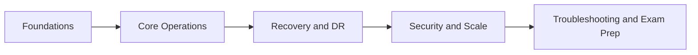

# Veeam Backup & Replication v12.x — Beginner to Advanced Course

> **Audience:** Mixed / general IT professionals, administrators, consultants, and engineers  
> **Scope:** Veeam Backup & Replication v12 with update awareness for v12.1, v12.2, and v12.3  
> **Format:** One lesson per file, full-prose instruction, step-by-step labs, and VMCE-oriented review material

## Table of Contents

- [How to Use This Course](#how-to-use-this-course)
- [Course Outcomes](#course-outcomes)
- [Recommended Study Order](#recommended-study-order)
- [Course Roadmap Diagram](#course-roadmap-diagram)
- [File List](#file-list)
- [Practical VMCE-Oriented Domain Map](#practical-vmce-oriented-domain-map)
- [How to Read the Lessons Efficiently](#how-to-read-the-lessons-efficiently)
- [Suggested Weekly Study Pacing](#suggested-weekly-study-pacing)
- [Reference Lab Naming Convention](#reference-lab-naming-convention)
- [Version Guidance for v12.x](#version-guidance-for-v12x)
- [Study Advice](#study-advice)
- [Success Criteria for Learners](#success-criteria-for-learners)
- [Instructor and Team Lead Notes](#instructor-and-team-lead-notes)
- [Reference Documents](#reference-documents)

[Go to TOC](#table-of-contents)

## How to Use This Course

This course is designed for learners who want to move from first exposure to Veeam Backup & Replication (VBR) into confident day-to-day administration, design, recovery operations, and exam preparation. The lessons are written in progression order. If you are new to Veeam, start at Lesson 1 and continue sequentially. If you already operate a Veeam environment, you can selectively jump to lessons on repositories, application-aware processing, restores, replication, security hardening, or troubleshooting.

The course intentionally supports three common learning paths:

1. **Virtualization-first path** for environments centered on VMware vSphere.
2. **Microsoft virtualization path** for environments centered on Hyper-V.
3. **No-hypervisor path** for readers protecting physical servers, standalone systems, branch office systems, or cloud-hosted machines with Veeam Agents.

Throughout the lessons, you will see references to all three paths whenever the procedure or design decision changes.

[Go to TOC](#table-of-contents)

## Course Outcomes

By the end of this course, you should be able to:

- Explain backup and recovery fundamentals in business terms, including RPO, RTO, retention, and resilience.
- Install and configure a Veeam Backup & Replication v12.x environment.
- Add virtual and physical infrastructure safely.
- Design backup repositories, scale-out storage, and object storage tiers.
- Build and validate VM, agent, NAS, and backup copy jobs.
- Perform restores confidently, from guest files to Instant VM Recovery.
- Implement replication and disaster recovery workflows.
- Apply security hardening, immutability, malware-aware recovery practices, and operational safeguards.
- Troubleshoot common and complex failures across hypervisors, agents, repositories, application-aware jobs, and restores.
- Prepare effectively for VMCE-style exam questions and scenario thinking.

[Go to TOC](#table-of-contents)

## Recommended Study Order

1. Lessons 1–6 build the beginner foundation.
2. Lessons 7–18 establish core operational competence.
3. Lessons 19–28 extend into advanced design, enterprise operations, and exam preparation.

[Go to TOC](#table-of-contents)

## Course Roadmap Diagram

The roadmap above is intentionally simple. The course does not assume that a learner is already comfortable with enterprise backup language, so the opening lessons build shared vocabulary first. From there, the sequence shifts into operational skills such as repository design, backup job creation, and agent-based protection. Only after those foundations are stable does the course move into replication, copy strategy, hardening, monitoring, and advanced troubleshooting.

This sequence mirrors how real-world competence develops. Teams that skip directly to advanced features often discover that their environment is still weak at the basics: credential hygiene, repository placement, restore validation, or retention logic. By the time you reach the final lessons in this course, you should not merely know how to click through Veeam wizards. You should understand what those workflows are trying to achieve and what assumptions they depend on.

[Go to TOC](#table-of-contents)

## File List

| File | Lesson | Level |
|---|---|---|
| `01-introduction.md` | Veeam B&R v12: Product Overview, Editions and Licensing | Beginner |
| `02-backup-fundamentals.md` | Backup Theory: RPO, RTO, 3-2-1 and Backup Types | Beginner |
| `03-architecture-overview.md` | Components, Data Flow and Deployment Models | Beginner |
| `04-installation-requirements.md` | Planning, Requirements, Accounts and Ports | Beginner |
| `05-lab-install-vbr.md` | Lab: Install VBR 12 on Windows Server | Beginner |
| `06-adding-infrastructure.md` | Add vCenter, Hyper-V and Physical Infrastructure | Beginner |
| `07-backup-repositories.md` | Backup Repositories and Storage Design | Intermediate |
| `08-lab-configure-repository.md` | Lab: Repository and SOBR Configuration | Intermediate |
| `09-vm-backup-jobs.md` | VM Backup Jobs and Retention Strategy | Intermediate |
| `10-lab-vm-backup-job.md` | Lab: Create and Run a VM Backup Job | Intermediate |
| `11-backup-proxies.md` | Backup Proxies and Transport Modes | Intermediate |
| `12-application-aware-processing.md` | Application-Aware Processing | Intermediate |
| `13-agent-based-backup.md` | Veeam Agents and No-Hypervisor Protection | Intermediate |
| `14-lab-agent-backup.md` | Lab: Agent Policy for Windows and Linux | Intermediate |
| `15-nas-backup.md` | NAS Backup and File Share Protection | Intermediate |
| `16-restore-options.md` | Restore Methods and Recovery Planning | Intermediate |
| `17-lab-instant-vm-recovery.md` | Lab: Instant VM Recovery and Validation | Intermediate |
| `18-application-item-restore.md` | Veeam Explorers and Item-Level Recovery | Intermediate |
| `19-replication.md` | Replication and Failover Strategy | Advanced |
| `20-lab-replication.md` | Lab: Replication and Planned Failover | Advanced |
| `21-backup-copy-jobs.md` | Backup Copy Jobs and GFS Retention | Intermediate/Advanced |
| `22-tape-support.md` | Tape Infrastructure and Archive Workflows | Advanced |
| `23-object-storage-cloud-tier.md` | Object Storage, Cloud Tier and Immutability | Advanced |
| `24-security-hardening.md` | Security Hardening and Cyber Resilience | Advanced |
| `25-scale-enterprise.md` | Enterprise Manager, RBAC, API and Automation | Advanced |
| `26-monitoring-reporting.md` | Monitoring, Reporting and Capacity Planning | Advanced |
| `27-troubleshooting.md` | Deep-Dive Troubleshooting | Advanced |
| `28-vmce-exam-prep.md` | VMCE-Style Review, Practice Questions and Lab Appendix | All |
| [`../glossary.md`](../glossary.md) | Glossary of Terms — A–Z reference for all course terminology | Reference |

[Go to TOC](#table-of-contents)

## Practical VMCE-Oriented Domain Map

This course is aligned to the knowledge areas typically expected from a Veeam administrator preparing for VMCE-level work. Exact public exam blueprints may change over time, so use this table as a practical skills map rather than a claim of the official internal exam structure.

| Domain | Focus | Lessons |
|---|---|---|
| Product and backup fundamentals | Terminology, resilience, licensing, editions | 01, 02 |
| Architecture and planning | Components, deployment design, prerequisites | 03, 04, 05 |
| Managed infrastructure | Virtual, physical and agent-managed systems | 06, 13, 14 |
| Repositories and storage | Local, network, hardened, object, SOBR | 07, 08, 23 |
| Job configuration | Backup jobs, processing, scheduling, retention | 09, 10, 11, 12 |
| Recovery operations | VM, file, item, application and instant restore | 16, 17, 18 |
| Data movement and DR | Backup copy, replication, tape | 19, 20, 21, 22 |
| Security and operations | Hardening, enterprise controls, monitoring | 24, 25, 26 |
| Troubleshooting and support | Log reading, root cause isolation, remediation | 27 |
| Exam preparation | Review and scenario questions | 28 |

[Go to TOC](#table-of-contents)

## How to Read the Lessons Efficiently

Every lesson in this course follows the same broad teaching pattern:

1. a practical statement of what you are expected to learn
2. conceptual explanation in plain operational language
3. examples of where the topic matters in real environments
4. a lab or decision exercise
5. review questions and answer key

If you are self-studying for certification, use the lessons in three passes:

- **Pass one:** read for understanding
- **Pass two:** build the lab steps and take notes on configuration choices
- **Pass three:** answer the review questions without looking at the lesson body

If you are using the course as internal team training, assign one learner to summarize each lesson back to the group in business language rather than product language. That exercise quickly reveals whether the learner truly understands the topic.

[Go to TOC](#table-of-contents)

## Suggested Weekly Study Pacing

This is a long-form course. It is reasonable to spread it across several weeks.

| Week | Recommended scope |
|---|---|
| 1 | Lessons 1–4 |
| 2 | Lessons 5–8 |
| 3 | Lessons 9–12 |
| 4 | Lessons 13–16 |
| 5 | Lessons 17–21 |
| 6 | Lessons 22–24 |
| 7 | Lessons 25–28 |

This pacing is only a guide. Some learners will move faster, especially if they already administer backups. Others will move more slowly because they are building a lab from scratch. Both approaches are valid. The main goal is to avoid rushing through the restore and troubleshooting sections, because those are often the most important parts of the entire subject.

[Go to TOC](#table-of-contents)

## Reference Lab Naming Convention

The course uses generic hostnames so you can adapt the steps to your own environment. A full sample topology is included in the appendix section of Lesson 28.

Common system names used in the labs:

- `VEEAM-SRV` — the Veeam Backup & Replication server
- `SQL01` — external SQL Server if used
- `VCENTER01` — VMware vCenter Server
- `ESX01`, `ESX02` — VMware ESXi hosts
- `HV01`, `HV02` — Hyper-V hosts
- `WIN-APP01` — Windows application VM
- `LIN-WEB01` — Linux VM or server
- `PHYS-SRV01` — protected physical or standalone server
- `REPO01` — repository server
- `LIN-IMMUT01` — hardened Linux repository host
- `NAS01` — NAS share source

[Go to TOC](#table-of-contents)

## Version Guidance for v12.x

This course teaches the Veeam Backup & Replication v12 platform while acknowledging that many environments operate on later v12 updates. Where relevant, lessons call out update-aware considerations such as:

- support matrix and platform compatibility changes
- hardened repository improvements
- object storage and immutability enhancements
- security and malware detection additions
- UI workflow changes in later v12 releases

Always validate platform support, upgrade order, and release notes against the current Veeam documentation before changing a production environment.

[Go to TOC](#table-of-contents)

## Study Advice

To get the most value from the course:

1. Read the theory section before starting the lab.
2. Build a small lab and actually run the steps.
3. Take notes on defaults, caveats, and verification points.
4. Do not skip restore labs. Backup success without restore validation is false confidence.
5. Review the questions at the end of every lesson before moving on.

[Go to TOC](#table-of-contents)

## Success Criteria for Learners

You can consider yourself course-complete when you can do the following without looking up every step:

- deploy a Veeam server and add core infrastructure
- configure at least one repository and one backup job
- protect a Windows or Linux workload with an agent
- perform an Instant VM Recovery or equivalent agent-based recovery operation
- explain why one repository or proxy design is better than another in a given scenario
- troubleshoot a failed backup by reading the log, identifying the failing component, and applying a sensible fix

[Go to TOC](#table-of-contents)

## Instructor and Team Lead Notes

If this course is being used for internal enablement, onboarding, or cross-training, the following checkpoints are useful:

- after Lesson 4, learners should be able to explain the difference between a poor and a well-planned Veeam deployment
- after Lesson 9, learners should be able to justify a backup job configuration without relying on defaults
- after Lesson 16, learners should be able to choose the correct recovery method for a scenario without over-restoring
- after Lesson 24, learners should be able to explain why backup security is part of backup design
- after Lesson 27, learners should be able to classify failures by layer and propose an investigation path

These checkpoints help instructors and team leads assess whether learners are merely following instructions or actually building operational judgment.

Proceed to Lesson 1 to begin.

[Go to TOC](#table-of-contents)

## Reference Documents

The following documents are standalone references that complement the lesson content. They are not lessons themselves and do not need to be read in sequence, but they are useful throughout the course and as revision aids.

| Document | Description |
|---|---|
| [`../glossary.md`](../glossary.md) | Extensive A–Z glossary of all terms, acronyms, and concepts used in the course |
| [`../instructor-guide.md`](../instructor-guide.md) | Module-based syllabus and delivery guidance for instructors and team leads |

[Go to TOC](#table-of-contents)

---

**License:** [CC BY-NC-SA 4.0](../LICENSE.md)
