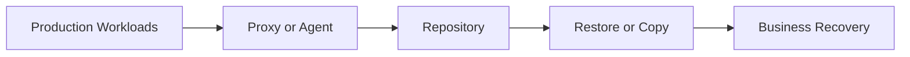

# Lesson 1 — Veeam Backup & Replication v12: Product Overview, Editions and Licensing

> **VMCE Objective(s):** Product positioning, core capabilities, deployment understanding  
> **Level:** Beginner  
> **Estimated reading time:** 35–45 minutes  
> **Lab time:** 20 minutes

## Table of Contents

- [Learning Objectives](#learning-objectives)
- [Concepts and Theory](#concepts-and-theory)
- [What Veeam Backup & Replication Includes](#what-veeam-backup-replication-includes)
- [Backup, Replication and Copy: Similar Words, Different Jobs](#backup-replication-and-copy-similar-words-different-jobs)
- [Who Usually Uses Veeam Day to Day](#who-usually-uses-veeam-day-to-day)
- [Veeam in the Context of Data Resilience](#veeam-in-the-context-of-data-resilience)
- [Why Veeam Matters in Modern Backup Strategy](#why-veeam-matters-in-modern-backup-strategy)
- [Editions and Licensing at a High Level](#editions-and-licensing-at-a-high-level)
- [High-Level Edition and Packaging Awareness](#high-level-edition-and-packaging-awareness)
- [Core Use Cases You Will See Repeatedly](#core-use-cases-you-will-see-repeatedly)
- [What Changed in v12 and Why It Matters](#what-changed-in-v12-and-why-it-matters)
- [Practical Differences Between Learning v12 and Operating v12.x](#practical-differences-between-learning-v12-and-operating-v12x)
- [Real-World Scenario Walkthrough](#real-world-scenario-walkthrough)
- [Common Beginner Misunderstandings](#common-beginner-misunderstandings)
- [Lab Walkthrough](#lab-walkthrough)
- [Operational Checklist](#operational-checklist)
- [Key Takeaways](#key-takeaways)
- [Review Questions](#review-questions)

[Go to TOC](#table-of-contents)

## Learning Objectives

By the end of this lesson, you should be able to:

- describe what Veeam Backup & Replication does and where it fits in a data protection strategy
- explain the difference between backup, replication, backup copy, and archive workflows
- identify the major Veeam platform components relevant to Backup & Replication
- understand common licensing terms and edition choices at a high level
- recognize how v12 evolved across later v12.x updates

[Go to TOC](#table-of-contents)

## Concepts and Theory

Veeam Backup & Replication is a backup, recovery, and replication platform designed to protect workloads across virtual, physical, cloud, and application-aware environments. For many administrators, Veeam becomes the operational center of data resilience: it coordinates how workloads are discovered, how copies of data are created, where those copies are stored, and how those copies are used for recovery when something goes wrong.

That “something” can be small or catastrophic. A junior administrator might need to recover a single deleted file from a Windows file server. A systems engineer might need to restore a failed business application virtual machine. A senior architect might need to build a retention strategy that satisfies ransomware resilience goals, legal retention requirements, and off-site copy expectations. Veeam is not only a backup engine. It is a set of coordinated workflows for operational recovery.

At a basic level, Veeam reads production data from a source workload, processes it through a proxy or agent, and writes the resulting restore points to one or more repositories. Those restore points are then used for many downstream operations: file recovery, VM recovery, application item recovery, replication-based failover, copy jobs, capacity tier offload, and long-term archival.

Because Veeam operates in many environments, it is useful to think in terms of protection models rather than only product names. In a virtualized environment, Veeam often integrates with the hypervisor and protects the VM from the outside, which allows image-based backups and fast restores. In a physical or standalone environment, Veeam Agent operates inside or directly on the protected system and becomes the protection mechanism. In a NAS scenario, Veeam protects file shares rather than VM disks. The product surface is broad, but the purpose is consistent: create reliable recovery points and make them recoverable under pressure.

[Go to TOC](#table-of-contents)

## What Veeam Backup & Replication Includes

The product name is commonly shortened to **VBR**. In practice, VBR usually refers to the Windows-based backup server role and the management console, but operationally the term often includes the surrounding infrastructure that makes protection possible. A VBR deployment commonly includes:

- a backup server that runs Veeam services and stores configuration data
- one or more backup proxies that move and process data
- one or more repositories that store restore points
- optional scale-out backup repositories for policy-based capacity management
- optional hardened Linux repositories for immutability
- optional object storage integration for offload or direct backup targets
- optional enterprise management and reporting components

You should also distinguish Veeam Backup & Replication from adjacent Veeam products and services. Veeam ONE focuses on monitoring and reporting. Veeam Recovery Orchestrator addresses more formalized disaster recovery orchestration. Veeam Data Platform is a broader packaging concept that combines products into editions. In daily practice, administrators often say “Veeam” when they really mean “Veeam Backup & Replication,” so clarity matters.

[Go to TOC](#table-of-contents)

## Backup, Replication and Copy: Similar Words, Different Jobs

One of the first sources of confusion for new administrators is the difference between a backup, a replica, and a copied backup.

A **backup** is a set of restore points stored in a backup repository. Backups are optimized for retention flexibility, storage efficiency, and a wide variety of restore operations. They are the backbone of most Veeam deployments.

A **replica** is a VM copy kept in a ready-to-start state on another host. Replication is usually chosen for faster failover in disaster recovery scenarios. The tradeoff is that replication is generally more infrastructure-specific and less flexible than a normal backup chain for long-term recovery requirements.

A **backup copy** is a second copy of already-created backups, typically moved to another repository, tier, or site. This improves resilience and supports multi-copy protection strategies. Backup copy jobs are extremely important in real-world design because a single backup chain on a single repository is not enough.

An **archive or long-term retention workflow** extends beyond normal operational retention and often targets tape or object storage tiers designed for extended retention windows and cost optimization.

Understanding these distinctions early prevents design mistakes later. Many weak environments are not caused by lack of tooling. They are caused by administrators assuming that one job type solves all recovery goals.

[Go to TOC](#table-of-contents)

## Who Usually Uses Veeam Day to Day

One reason Veeam is so widely adopted is that it serves several operational personas at once. A virtualization administrator may care most about efficient VM protection and fast restore options. A systems administrator may focus on agent-based backup for physical servers or cloud-hosted Windows and Linux workloads. A storage or infrastructure architect may care more about repository design, immutability, and copy separation. A service desk escalation engineer may interact with Veeam mainly through guest file restore or application item recovery. All of these people are touching the same platform from different angles.

That matters because backup platforms often fail socially before they fail technically. If nobody clearly owns restore testing, backups may exist but recovery confidence remains low. If only one engineer understands repository design, growth and maintenance become fragile. If the security team is excluded from backup conversations, critical immutability and access-control decisions may be made too late. Learning Veeam well therefore means understanding not only what the software can do, but also how organizations divide responsibility around it.

[Go to TOC](#table-of-contents)

## Veeam in the Context of Data Resilience

Data resilience is broader than backup, but backup is one of its central pillars. A resilient environment expects failure and still prepares to recover. That mindset affects how you think about every Veeam feature. Repositories are not simply storage targets; they are resilience anchors. Backup copy jobs are not just extra jobs; they are protection against a primary copy becoming unusable. Restore testing is not a checkbox; it is evidence that the environment can recover under real pressure.

This resilience mindset also changes how you talk about success. A successful Veeam environment is not defined solely by job success rate. It is defined by whether the business can recover the right data, in the right timeframe, from the right location, under the right conditions.

[Go to TOC](#table-of-contents)

## Why Veeam Matters in Modern Backup Strategy

Historically, backup was often treated as a nightly operational task. Modern resilience requires more. Organizations now expect:

- multiple copies of data
- copies stored in different fault domains
- immutability or isolation against ransomware
- application-consistent recovery
- verification that backups are actually recoverable
- flexible restoration across different scopes, from individual items to full services

Veeam became popular because it aligned well with these expectations, especially in virtual environments. Its recovery features, image-based protection model, and operational simplicity made it practical for busy infrastructure teams. Over time, the platform expanded to support modern requirements such as object storage integration, Linux hardened repositories, direct-to-object workflows, malware-aware recovery guidance, and broader workload coverage.

The most important mental shift for learners is this: Veeam is not just a way to “make backups.” It is a system for designing and executing recovery.

[Go to TOC](#table-of-contents)

## Editions and Licensing at a High Level

Licensing and packaging can change over time, so you should always verify current commercial details with official Veeam documentation and current sales guidance. Still, administrators need enough understanding to design and communicate effectively.

At a high level, you will encounter:

- community or trial-style access for lab or limited use
- Veeam Universal License concepts, commonly consumed per workload instance
- broader Veeam Data Platform packaging that bundles additional capabilities or related products depending on the edition

From an operational perspective, licensing matters because it can affect which workloads are protected, how many instances you can onboard, and whether certain advanced features or adjacent products are available. In many environments, licensing is not the immediate technical blocker. Poor planning is. But a good administrator should still know enough to avoid promising unsupported or unlicensed coverage.

[Go to TOC](#table-of-contents)

## High-Level Edition and Packaging Awareness

Because Veeam packaging evolves over time, the goal in this section is not to memorize a commercial matrix. Instead, you should understand the practical questions that licensing and edition choices raise:

- Are you protecting only a few workloads for a lab or proof of concept, or are you designing for a broad production estate?
- Do you need only backup and restore, or do you also expect broader monitoring, orchestration, or advanced platform capabilities?
- Are you likely to grow into additional workload types such as NAS, object-connected designs, or multi-platform protection?

These questions shape how organizations evaluate Veeam Universal Licensing and broader Veeam Data Platform editions. For exam preparation and operational understanding, the most important thing is to recognize that edition choice can affect platform scope, but it does not replace good technical design. Even a richly licensed environment can still be poorly protected if repositories, copy strategy, and recovery testing are weak.

[Go to TOC](#table-of-contents)

## Core Use Cases You Will See Repeatedly

Across this course, you will repeatedly return to a handful of real-world use cases:

1. Protect a set of VMs with application-aware processing and a sensible retention policy.
2. Keep a secondary copy of those backups on another repository or cloud-connected tier.
3. Protect physical or cloud-hosted standalone workloads with Veeam Agent.
4. Recover quickly at different scopes: file, application item, full system, or failed VM.
5. Validate recoverability, not just backup completion.
6. Harden the environment so that the backup platform itself is harder to compromise.

These are the operational motions that matter far more than memorizing product marketing language.

[Go to TOC](#table-of-contents)

## What Changed in v12 and Why It Matters

Version 12 was significant because it pushed Veeam further into modern storage patterns and security-oriented design. Although you will learn the details in later lessons, the major themes worth understanding now include:

- stronger object storage integration
- increased emphasis on immutability and hardened repository design
- broader workload flexibility and enterprise-scale storage patterns
- continued evolution in malware-aware and security-focused operational features

Later v12.x updates continued refining support matrices, security features, platform coverage, repository behaviors, and administrator workflows. For course purposes, treat **v12** as the platform generation and **v12.1, v12.2, and v12.3** as important operational refinements. Production administrators should always check the exact build and release notes before planning upgrades or new features.

[Go to TOC](#table-of-contents)

## Practical Differences Between Learning v12 and Operating v12.x

There is an important difference between learning a major platform generation and operating a specific point release. The major version gives you the architectural and conceptual model. The point release determines the exact support boundaries, updated features, UI refinements, and operational caveats you are actually working with.

For example, a design decision that is broadly correct for v12 may still require build-specific validation in production. Object storage behavior, hardened repository refinements, support for newer operating systems or hypervisor versions, and malware-aware recovery features can all evolve across point releases. This is why experienced administrators always pair conceptual knowledge with release-note discipline.

When teaching teams or planning production changes, a useful habit is to separate statements into two categories:

- **platform truths** that remain broadly valid across v12.x
- **build-specific details** that must be verified before implementation

This habit keeps your mental model stable while still respecting operational reality.

[Go to TOC](#table-of-contents)

## Real-World Scenario Walkthrough

Consider a mid-sized organization with the following environment:

- 120 VMware virtual machines
- 15 physical Windows and Linux systems
- several department file shares
- one SQL-heavy business application
- a requirement for off-site copy and at least one immutable retention path

In that organization, Veeam Backup & Replication becomes more than a backup scheduler. It becomes the coordination point for multiple protection models:

- image-based VM backup for most virtualized workloads
- agent-based protection for physical and edge systems
- NAS protection for shared file data
- copy strategy for secondary resilience
- restore processes aligned to the service criticality of each workload

If the team thinks only in terms of “nightly backups,” they will under-design the environment. If they think in terms of recovery pathways and risk layers, they will use the platform much more effectively.

[Go to TOC](#table-of-contents)

## Common Beginner Misunderstandings

There are a few misconceptions that repeatedly cause trouble:

**“If the backup job is green, we are protected.”**  
Not necessarily. A successful job does not guarantee fast or successful recovery. You still need restore testing, verification, and sensible storage design.

**“Replication replaces backup.”**  
It does not. Replication is useful for fast failover, but you still need backups for retention flexibility, broader restore options, and resilience against corruption or site issues.

**“One repository is enough.”**  
It rarely is. If the repository fails, is encrypted, or becomes unavailable, your protection model collapses.

**“Virtual workloads are the only important ones.”**  
No-hypervisor workloads, physical systems, appliances, and standalone cloud servers are common and often critical.

[Go to TOC](#table-of-contents)

## Lab Walkthrough

### Prerequisites

- access to a lab environment or at least the Veeam documentation site
- a text editor or notes tool
- optional: a trial or lab instance of Veeam Backup & Replication v12.x

### Steps

1. Create a simple worksheet with four columns: workload type, business criticality, target RPO, target RTO.
2. List at least five workloads you would expect in a real environment, such as domain controller, SQL Server, file server, Linux web server, and NAS share.
3. For each workload, decide whether backup alone is sufficient or whether replication or backup copy should also be considered.
4. Identify which workloads could be protected through hypervisor integration and which would need an agent-based path.
5. Write a one-paragraph summary answering this question: “Why is Veeam a recovery platform, not just a backup scheduler?”

### Verification

You have completed the lab if you can explain:

- the difference between backup, replica, and backup copy
- why multi-copy strategy matters
- how no-hypervisor workloads fit into the overall design

[Go to TOC](#table-of-contents)

## Operational Checklist

At the end of this lesson, you should be able to answer these practical starter questions without hesitation:

- What kinds of workloads will this Veeam environment protect?
- Which of those workloads depend on a hypervisor and which do not?
- Which workloads are most likely to require item-level or application-aware recovery?
- Which workloads would be dangerous to leave with only one backup copy?
- Which platform build is currently in use, and where would you validate feature details before making changes?

[Go to TOC](#table-of-contents)

## Key Takeaways

- Veeam Backup & Replication is a recovery-focused platform, not just a job runner.
- Backups, replicas, backup copies, and archives serve different operational purposes.
- The product supports virtual, physical, and file-based protection models.
- v12.x is best understood as a platform generation with meaningful later refinements.
- A successful backup strategy always starts by thinking about recovery outcomes.

[Go to TOC](#table-of-contents)

## Review Questions

1. What is the difference between a backup and a replica?
2. Why are backup copy jobs important in a resilience strategy?
3. What kinds of workloads can still be protected when there is no hypervisor?
4. Why is it dangerous to assume that a green job status means recovery is guaranteed?
5. Why should administrators pay attention to the exact v12.x build they are using?

---

### Answers

1. A backup stores restore points for flexible recovery and retention; a replica is a ready-to-start VM copy for faster failover.
2. They create an additional copy of backup data on another repository or site, reducing single-point-of-failure risk.
3. Physical servers, standalone systems, and cloud-hosted machines can be protected with Veeam Agent.
4. Because successful backup creation does not guarantee integrity, performance, recoverability, or proper restore testing.
5. Because support, features, and operational behavior can change across v12.1, v12.2, and v12.3.

[Go to TOC](#table-of-contents)
---

**License:** [CC BY-NC-SA 4.0](../LICENSE.md)
