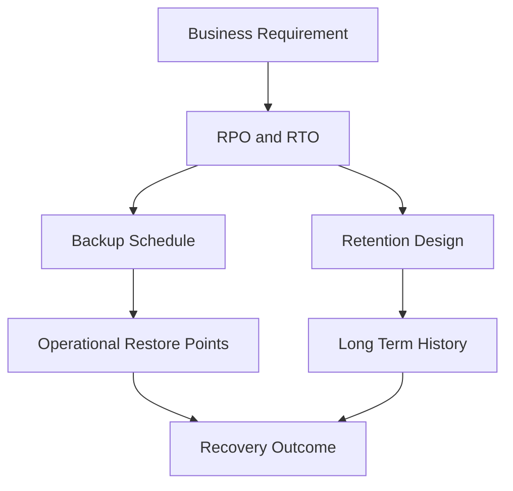

# Lesson 2 — Backup Theory: RPO, RTO, 3-2-1 and Backup Types

> **VMCE Objective(s):** Resilience concepts, backup terminology, retention and policy thinking  
> **Level:** Beginner  
> **Estimated reading time:** 40–50 minutes  
> **Lab time:** 25 minutes

## Table of Contents

- [Learning Objectives](#learning-objectives)
- [Concepts and Theory](#concepts-and-theory)
- [Why Business Context Matters](#why-business-context-matters)
- [Translating Business Language Into Backup Policy](#translating-business-language-into-backup-policy)
- [The 3-2-1 Rule and Its Modern Extensions](#the-3-2-1-rule-and-its-modern-extensions)
- [Backup Types You Must Understand](#backup-types-you-must-understand)
- [Operational Tradeoff Table](#operational-tradeoff-table)
- [Retention Is Not the Same as Scheduling](#retention-is-not-the-same-as-scheduling)
- [Compression, Deduplication and Encryption Tradeoffs](#compression-deduplication-and-encryption-tradeoffs)
- [Translating Theory Into Veeam Policy Design](#translating-theory-into-veeam-policy-design)
- [Scenario Examples](#scenario-examples)
- [Decision Checklist](#decision-checklist)
- [Update Awareness for v12.x](#update-awareness-for-v12x)
- [Lab Walkthrough](#lab-walkthrough)
- [Key Takeaways](#key-takeaways)
- [Review Questions](#review-questions)

[Go to TOC](#table-of-contents)

## Learning Objectives

- define RPO and RTO in practical business terms
- explain the 3-2-1 rule and modern extensions of that rule
- distinguish full, incremental, synthetic full, reverse incremental, and forever-forward concepts
- understand retention versus backup window versus copy strategy
- connect backup theory to day-to-day Veeam design choices

[Go to TOC](#table-of-contents)

## Concepts and Theory

Before you configure a single Veeam job, you need to understand what problem backups are actually meant to solve. Backup administration is full of technical detail, but the real purpose is simple: preserve the ability to recover useful business data within an acceptable amount of data loss and downtime.

Two concepts govern almost every design conversation: **Recovery Point Objective (RPO)** and **Recovery Time Objective (RTO)**.

**RPO** is the maximum acceptable amount of data loss measured in time. If a server is backed up every four hours and it fails right before the next run, the theoretical data loss could be close to four hours. That is the practical meaning of RPO.

**RTO** is the maximum acceptable downtime before service must be restored. If the business can tolerate only fifteen minutes of outage, the recovery method must support that. A slow full restore from deep archive may satisfy retention, but not a tight RTO.

Administrators often confuse these two concepts. RPO is about how current the recovered data needs to be. RTO is about how quickly the service needs to be back.

[Go to TOC](#table-of-contents)

## Why Business Context Matters

The right protection design is never the same for every workload. A print server and a transactional database do not deserve the same policy. A payroll system and a development sandbox should not be prioritized equally. Good Veeam administrators translate business criticality into technical settings.

For example:

- a domain controller may require frequent backups and careful restore procedures, but perhaps not replication in every environment
- a SQL Server hosting revenue-critical data may need application-aware backups, shorter RPO, backup copies, and possibly replication
- a Linux web frontend might be rebuilt quickly from configuration management, making file-level protection of content and config more important than aggressive VM replication

The reason this lesson matters is that job settings are easy to click. Choosing the right settings is harder.

[Go to TOC](#table-of-contents)

## Translating Business Language Into Backup Policy

One of the most useful skills a backup administrator can develop is the ability to translate vague business language into concrete technical policy. Business leaders rarely ask for “hourly synthetic full strategy with weekly GFS retention.” They ask for things like:

- “we cannot lose more than an hour of work”
- “this system must be back before the business day starts”
- “finance needs seven years of historical records”
- “if ransomware hits, we need a clean copy that cannot be modified”

Your job is to translate those statements into schedule, retention, repository, copy, and restore design. This translation is where backup engineering becomes valuable. If you skip it, you create generic policies that are easy to configure but weak in practice.

[Go to TOC](#table-of-contents)

## The 3-2-1 Rule and Its Modern Extensions

The classic **3-2-1 rule** means:

- keep at least **3 copies** of your data
- on at least **2 different media or storage types**
- with at least **1 copy off-site**

This rule remains a strong foundation because it forces redundancy and separation. But modern threat models, especially ransomware, pushed many organizations toward expanded versions such as **3-2-1-1-0**:

- 3 copies of data
- 2 different storage types
- 1 off-site copy
- 1 offline, air-gapped, or immutable copy
- 0 unverified backups, meaning restore points are tested and monitored

Veeam maps very naturally to this thinking. A primary repository can hold the first operational copy. A backup copy job or scale-out tier can create another copy. An immutable Linux repository, object storage with immutability, or tape can satisfy the isolated or immutable copy requirement. SureBackup-style validation or restore testing addresses the “0 errors” concept.

The deeper lesson is that backup is not only about storage. It is about fault domains. If all copies are writable by the same compromised account, the design may still fail under attack.

[Go to TOC](#table-of-contents)

## Backup Types You Must Understand

Veeam exposes several methods and terms that can look intimidating at first, but the core logic is manageable once you understand restore points and change tracking.

### Full Backup

A full backup captures the complete dataset required for a recovery point. In practice, a full backup creates a self-contained restore point chain baseline. Full backups are easy to understand conceptually, but expensive if done too frequently because they consume more time, storage, and read operations from the source.

### Incremental Backup

An incremental backup stores only the changes since the last restore point, depending on the chain logic in use. Incrementals reduce daily backup impact and storage use, which is why they are common.

### Synthetic Full

A synthetic full creates a new full backup on the repository side using existing backup data plus incrementals, rather than rereading all data from production. This reduces source impact and can be very efficient when the repository is designed to handle the I/O.

### Active Full

An active full reads all source data again from production. It is heavier but sometimes desirable to reset the chain from production data or as part of a periodic operational strategy.

### Reverse Incremental

Reverse incremental keeps the most recent restore point in the full backup file while moving older states into reverse increments. Some environments used this to optimize certain restore patterns, but administrators must understand the storage and operational tradeoffs.

### Forever Forward Incremental

This is a commonly discussed approach in modern backup design. The chain begins with a full backup and continues with incrementals. The oldest restore points are merged forward as retention ages out, keeping the chain manageable while minimizing repeated full backups.

The important point is not memorizing jargon. It is understanding how each method affects storage consumption, performance, backup windows, and recovery behavior.

[Go to TOC](#table-of-contents)

## Operational Tradeoff Table

| Backup pattern | Typical strength | Typical caution |
|---|---|---|
| Active full | Clean full read from source | Heavy source impact |
| Synthetic full | Lower production impact | Repository I/O can increase |
| Incremental chain | Efficient daily protection | Chain health and merge behavior matter |
| Reverse incremental | Recent state prominence | Operational complexity and storage behavior |
| Forever forward | Balanced common approach | Requires understanding of merge and retention behavior |

The goal is not to choose the “best” pattern universally. The goal is to choose the pattern that behaves acceptably in your environment and supports your recovery priorities.

[Go to TOC](#table-of-contents)

## Retention Is Not the Same as Scheduling

New administrators often assume that backup frequency automatically equals retention quality. It does not. Frequency controls how often restore points are created. Retention controls how many restore points or how much history is kept. These are related but different decisions.

For example, you might back up a workload every four hours but retain only seven days of operational restore points. You might also create weekly, monthly, and yearly GFS points for longer retention. A short RPO requirement does not automatically mean long retention, and a long retention requirement does not automatically require an extremely short RPO.

In Veeam design, always separate the questions:

1. How often do I need new restore points?
2. How long do I need to keep them?
3. Where should additional copies live?
4. Which recovery methods must this policy support?

Administrators who confuse schedule and retention often make two opposite mistakes. The first is creating very frequent backups but retaining too little history to be useful after late discovery of data corruption or malware. The second is retaining enormous history without aligning it to realistic restore needs, creating waste and long-term management burden. Mature backup design tries to avoid both extremes.

[Go to TOC](#table-of-contents)

## Compression, Deduplication and Encryption Tradeoffs

Backup storage efficiency matters, but efficiency features can change behavior. Compression reduces backup size. Deduplication reduces redundant storage use. Encryption protects confidentiality. Each can affect performance and downstream storage efficiency.

For example, encrypted source data can reduce deduplication benefits. Compression settings can alter CPU use on proxies or repositories. These are not reasons to avoid the features. They are reasons to understand the consequences.

[Go to TOC](#table-of-contents)

## Translating Theory Into Veeam Policy Design

When you design a Veeam job, every key setting traces back to a fundamental question:

- retention window answers “how much history do I keep?”
- schedule answers “how frequently do I capture change?”
- backup copy answers “how many resilient copies do I maintain?”
- repository choice answers “how durable, fast, or secure is the storage?”
- immutability answers “how hard is it to destroy my backups?”
- application-aware processing answers “is the data inside the workload consistent?”

Understanding theory means your configuration choices stop being random.

[Go to TOC](#table-of-contents)

## Scenario Examples

### Scenario 1 — Accounting Database

An accounting database may need relatively short RPO, application-aware protection, and longer retention than a test environment. That suggests more frequent restore points, careful guest/application consistency, and possibly longer copy retention.

### Scenario 2 — Development Test VM

A test VM may tolerate longer RPO and shorter retention. It may not justify replication. It might still need backup, but not premium protection treatment.

### Scenario 3 — Branch File Server

A branch file server may need daily protection, easy file-level restore, and at least one second copy off-site, especially if local IT support is limited.

These examples show why backup policy should reflect workload role, not just platform type.

[Go to TOC](#table-of-contents)

## Decision Checklist

Before creating a job, ask yourself:

- What is the real business impact if I lose the latest hour, four hours, or one day of data?
- How long can users wait for access to return?
- How much history is truly needed for operational recovery?
- Do I need a second copy in another fault domain?
- Do I need an immutable or otherwise protected copy?

[Go to TOC](#table-of-contents)

## Update Awareness for v12.x

In the v12 generation, Veeam continued strengthening object storage, immutability, and large-scale backup strategy options. That means modern backup theory is not only about “disk versus tape.” It is increasingly about multi-tier copy strategy, immutable storage, and operational verification. When you read older backup advice, always ask whether it predates object-first or immutable backup design.

[Go to TOC](#table-of-contents)

## Lab Walkthrough

### Prerequisites

- spreadsheet or notepad
- at least five example workloads
- optional access to a lab Veeam server

### Steps

1. Choose five workloads: one domain controller, one SQL workload, one Linux server, one file server, and one low-priority test VM.
2. Define a target RPO and RTO for each workload.
3. For each workload, decide whether it needs only backup, backup plus backup copy, or backup plus replication.
4. Write a retention policy for each workload including operational retention and long-term retention.
5. Identify which workloads would benefit most from immutability.
6. Explain why a single nightly full backup would be a weak design for at least two of the workloads.

### Verification

You have completed the lab if your policy choices clearly connect business requirements to technical settings.

[Go to TOC](#table-of-contents)

## Key Takeaways

- RPO measures acceptable data loss; RTO measures acceptable downtime.
- 3-2-1 and 3-2-1-1-0 thinking are practical design tools, not slogans.
- Backup type selection affects source impact, storage behavior, and restore workflow.
- Retention, frequency, and copy strategy must be planned separately.
- Good Veeam administration starts with policy logic, not wizard-clicking.

[Go to TOC](#table-of-contents)

## Review Questions

1. What is the difference between RPO and RTO?
2. What does the final “0” mean in 3-2-1-1-0?
3. Why might you choose a synthetic full instead of an active full?
4. Why is retention not the same as backup frequency?
5. Why should business criticality influence whether you choose backup only or backup plus replication?

---

### Answers

1. RPO defines acceptable data loss in time; RTO defines acceptable downtime to restore service.
2. It means backups should be verified so there are zero known unrecoverable or unvalidated backup errors.
3. To avoid rereading all production data while still producing a new full backup on the repository side.
4. Because frequency controls how often restore points are created, while retention controls how long they are kept.
5. Because critical systems may require faster recovery or additional resilience measures that backup alone does not provide.

[Go to TOC](#table-of-contents)

---

**License:** [CC BY-NC-SA 4.0](../LICENSE.md)
