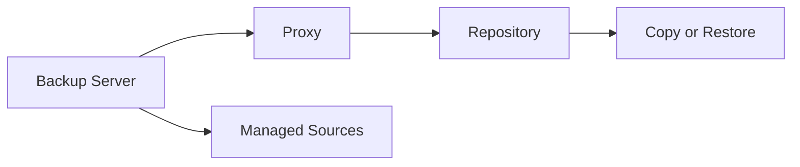

# Lesson 3 — Veeam Architecture: Components, Data Flow and Deployment Models


> **VMCE Objective(s):** Core architecture, component roles, data flow understanding  
> **Level:** Beginner  
> **Estimated reading time:** 45–55 minutes  
> **Lab time:** 30 minutes

## Table of Contents

- [Learning Objectives](#learning-objectives)
- [Concepts and Theory](#concepts-and-theory)
- [The Backup Server](#the-backup-server)
- [Backup Proxies](#backup-proxies)
- [Backup Repositories](#backup-repositories)
- [The Configuration Database](#the-configuration-database)
- [Managed Servers and Infrastructure Objects](#managed-servers-and-infrastructure-objects)
- [Data Flow at a High Level](#data-flow-at-a-high-level)
- [Architecture as a Set of Boundaries](#architecture-as-a-set-of-boundaries)
- [A Simple ASCII View](#a-simple-ascii-view)
- [Small, Medium and Larger Deployment Models](#small-medium-and-larger-deployment-models)
- [Architecture Patterns by Environment Size](#architecture-patterns-by-environment-size)
- [Architectural Principles That Matter Early](#architectural-principles-that-matter-early)
- [Architecture Review Questions for Real Environments](#architecture-review-questions-for-real-environments)
- [v12.x Architectural Trends](#v12x-architectural-trends)
- [Lab Walkthrough](#lab-walkthrough)
- [Key Takeaways](#key-takeaways)
- [Review Questions](#review-questions)

[Go to TOC](#table-of-contents)

## Learning Objectives

- identify the major Veeam Backup & Replication components and their roles
- understand how data moves from source to restore point
- explain the purpose of backup server, proxy, repository, and optional supporting roles
- compare small, medium, and larger deployment models
- recognize why architecture decisions directly affect performance, scale, and resilience

[Go to TOC](#table-of-contents)

## Concepts and Theory

Veeam architecture is easiest to understand when you stop thinking of it as a single server application and instead see it as a coordinated set of roles. In a very small lab, several roles may coexist on one Windows server. In a larger environment, those roles are distributed to improve scalability, performance, and security. The names of the components matter because troubleshooting and design discussions often revolve around identifying which role is responsible for which task.

[Go to TOC](#table-of-contents)

## The Backup Server



The **backup server** is the management brain of a Veeam deployment. It runs the core Veeam services, stores the configuration database reference, manages jobs, tracks infrastructure objects, and coordinates processing. Administrators connect to this server through the Veeam console or related management interfaces.

If the backup server is unavailable, jobs may stop, management becomes difficult, and restores may become more complex. This is why protecting the Veeam server itself and documenting its dependencies is so important. It is not usually the primary data mover in larger environments, but it is the control plane.

[Go to TOC](#table-of-contents)

## Backup Proxies

The **backup proxy** is the data mover and processor. It retrieves data from the source workload, applies processing such as compression and deduplication behavior relevant to the job flow, and sends the data toward the repository. In VMware environments, the proxy may use transport modes such as NBD, HotAdd, or Direct SAN. In Hyper-V or other scenarios, transport behavior differs.

Why does this matter? Because many performance and compatibility issues are not actually “backup server problems.” They are proxy path problems. A job that falls back from HotAdd to NBD can still succeed but perform badly. A proxy with too few resources can bottleneck an entire protection window.

[Go to TOC](#table-of-contents)

## Backup Repositories

The **backup repository** stores backup files and restore points. Repositories can be Windows-based, Linux-based, local disk, network-attached storage, deduplication appliances, or object-connected structures when used as part of broader designs like scale-out repositories or direct-to-object strategies.

Repositories are more than folders. Their design affects:

- backup ingest performance
- retention capacity
- immutability options
- health check and synthetic full efficiency
- copy and tiering behavior
- blast radius in a ransomware event

In mature environments, repository design becomes one of the most important architectural decisions.

[Go to TOC](#table-of-contents)

## The Configuration Database

Veeam uses a configuration database to store metadata about jobs, infrastructure, sessions, settings, and operational state. In smaller deployments, this may be hosted in a bundled or local SQL-based option; in larger or more performance-sensitive environments, administrators often choose an external SQL platform.

Losing the configuration database does not automatically destroy backup files, but it complicates management and recovery of the Veeam environment itself. You should always treat the configuration database as a critical dependency.

[Go to TOC](#table-of-contents)

## Managed Servers and Infrastructure Objects

Veeam interacts with many managed systems, including:

- VMware vCenter or ESXi hosts
- Hyper-V hosts and clusters
- Windows or Linux servers used as repositories or agents
- NAS devices and file shares
- object storage endpoints

These are not just sources and targets. They are trust relationships. Credentials, ports, certificates, time sync, DNS, and permissions all matter.

[Go to TOC](#table-of-contents)

## Data Flow at a High Level

In a typical image-based virtual backup, the flow looks like this:

1. The backup server schedules and coordinates the job.
2. Veeam communicates with the virtualization platform to prepare the workload.
3. A proxy reads the source data.
4. Processed data is sent to the repository.
5. Metadata is updated in the configuration database.
6. Optional downstream jobs or tiers may later copy or move data.

For agent-based workloads, the protected system itself may participate more directly in data capture. For NAS backups, the flow centers on file share scanning, indexing, and repository/caching behavior rather than VM disk capture.

[Go to TOC](#table-of-contents)

## Architecture as a Set of Boundaries

It helps to think about Veeam architecture through boundaries rather than only through roles. The backup server is the coordination boundary. The proxy is the data movement boundary. The repository is the storage and retention boundary. Managed sources are the production boundary. When you view the platform this way, troubleshooting becomes much easier because you can ask: which boundary failed to do its job?

This mental model also improves design conversations. For example, when someone says “the backup server is slow,” you can ask whether the actual bottleneck is coordination, data movement, or repository write performance. Those are different things, even if the console makes them appear in one interface.

[Go to TOC](#table-of-contents)

## A Simple ASCII View

```text
            +-------------------+
            |   VEEAM-SRV       |
            | Backup Server     |
            | Console + Services|
            +---------+---------+
                      |
          +-----------+-----------+
          |                       |
  +-------v--------+     +--------v--------+
  | Backup Proxy   |     | Managed Sources |
  | Data Mover     |<--->| vCenter/HV/Agent|
  +-------+--------+     +-----------------+
          |
  +-------v--------+
  | Repository     |
  | Restore Points |
  +-------+--------+
          |
  +-------v--------+
  | Copy/Tier/Tape |
  +----------------+
```

This diagram is deliberately simple. Later lessons will add more detail around scale-out repositories, capacity tiers, hardened repositories, and replication targets.

[Go to TOC](#table-of-contents)

## Small, Medium and Larger Deployment Models

In a **small environment**, it is common to place the backup server, proxy role, and repository role on one machine. This is easy to deploy and appropriate for labs or small businesses with modest workloads. The downside is role concentration. Performance bottlenecks and security exposure are centralized.

In a **medium environment**, the backup server may remain separate from at least one repository and one proxy. This allows better workload distribution and often improves scalability.

In a **larger environment**, multiple proxies, multiple repository extents, hardened storage, copy targets, and possibly enterprise management components are common. Here, design is less about “can Veeam run?” and more about “can it run predictably, securely, and at scale?”

[Go to TOC](#table-of-contents)

## Architecture Patterns by Environment Size

| Environment size | Common pattern | Main risk |
|---|---|---|
| Small lab | All-in-one server | Role concentration |
| Small production | Backup server plus dedicated repository | Underestimating growth |
| Medium production | Dedicated backup server, proxies, repositories | Inconsistent credential and role design |
| Larger enterprise | Multiple proxies, multiple repositories, copy tiers, hardened storage | Complexity without documentation |

A strong architecture scales not only technically but operationally. If the design cannot be understood quickly by the team that runs it, it becomes fragile under turnover, incidents, or growth.

[Go to TOC](#table-of-contents)

## Architectural Principles That Matter Early

Even as a beginner, you should internalize a few principles:

**Keep management and data paths clear.**  
Know which component controls the job and which component actually moves data.

**Scale the data mover, not just the console server.**  
Adding CPU to the Veeam server does not solve a badly placed proxy.

**Treat repositories as strategic assets.**  
If your repository design is weak, your recovery design is weak.

**Minimize unnecessary trust.**  
Shared credentials and excessive permissions increase risk.

**Design for failure domains.**  
If one site, server, credential, or storage system is compromised, what survives?

[Go to TOC](#table-of-contents)

## Architecture Review Questions for Real Environments

When reviewing an existing Veeam deployment, ask:

- Which component is doing data movement today?
- Is the repository in the same administrative blast radius as the backup server?
- Are the control plane and storage plane separated enough for the organization’s threat model?
- If the backup server is lost, how quickly could the team rebuild the environment and regain visibility?
- Does the architecture support both operational recovery and cyber resilience?

[Go to TOC](#table-of-contents)

## v12.x Architectural Trends

The v12 generation reinforced several architectural trends:

- stronger object storage use cases
- greater importance of immutable repository design
- more deliberate separation of management and storage trust boundaries
- increased attention to cyber resilience, not just operational backup completion

This means that architecture in modern Veeam environments is increasingly a security and resilience discussion, not just a performance discussion.

[Go to TOC](#table-of-contents)

## Lab Walkthrough

### Prerequisites

- a lab note sheet or whiteboard
- optional access to an existing Veeam environment

### Steps

1. Draw your own Veeam architecture diagram using the systems in your lab or a hypothetical environment.
2. Mark the backup server, at least one proxy, at least one repository, and at least two protected workloads.
3. Identify the data path for a VMware VM backup, a Hyper-V VM backup, and a physical server backup.
4. Add a second copy target such as object storage, tape, or a secondary repository.
5. Circle which components are management-plane systems and which are data-plane systems.

### Verification

You have completed the lab if you can explain, in order, how data moves during a standard backup job and which component would be most likely responsible for a performance bottleneck.

[Go to TOC](#table-of-contents)

## Key Takeaways

- The backup server coordinates jobs; proxies move data; repositories store restore points.
- The configuration database is a critical dependency even though it is not the backup data itself.
- Architectural choices affect scale, performance, and security.
- Small environments can combine roles, but larger environments benefit from separation.
- Modern Veeam architecture must consider immutability and multi-copy resilience from the start.

[Go to TOC](#table-of-contents)

## Review Questions

1. What is the main role of the backup server?
2. Why is the backup proxy important?
3. What risks come from placing all roles on a single server?
4. Why should administrators treat the configuration database as critical?
5. How does repository design affect resilience?

---

### Answers

1. It coordinates jobs, stores configuration metadata references, and manages the environment.
2. It retrieves and processes source data and is often the key performance component during backups.
3. It concentrates performance load, operational dependency, and security risk in one place.
4. Because it stores the environment’s operational metadata and losing it complicates management and recovery.
5. It determines where restore points live, how fast they can be written or restored, and how resistant they are to failure or attack.

[Go to TOC](#table-of-contents)
---

**License:** [CC BY-NC-SA 4.0](../LICENSE.md)
