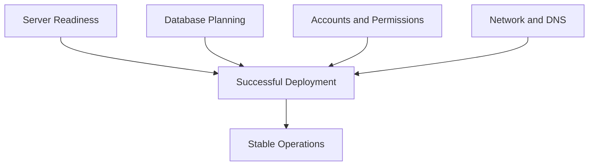

# Lesson 4 — Planning Your Deployment: Requirements, Ports, Service Accounts and Readiness

> **VMCE Objective(s):** Deployment planning, prerequisite validation, infrastructure readiness  
> **Level:** Beginner  
> **Estimated reading time:** 45–55 minutes  
> **Lab time:** 30 minutes

## Table of Contents

- [Learning Objectives](#learning-objectives)
- [Concepts and Theory](#concepts-and-theory)
- [Operating System and Host Readiness](#operating-system-and-host-readiness)
- [Database Planning](#database-planning)
- [Service Accounts and Permission Design](#service-accounts-and-permission-design)
- [Account Design Patterns That Age Well](#account-design-patterns-that-age-well)
- [Network, Ports and Firewalls](#network-ports-and-firewalls)
- [DNS and Time Synchronization](#dns-and-time-synchronization)
- [Virtualization Readiness](#virtualization-readiness)
- [Storage and Repository Readiness](#storage-and-repository-readiness)
- [Common Deployment Mistakes](#common-deployment-mistakes)
- [Pre-Install Readiness Checklist](#pre-install-readiness-checklist)
- [Scenario Example](#scenario-example)
- [Update Awareness for v12.x](#update-awareness-for-v12x)
- [Lab Walkthrough](#lab-walkthrough)
- [Key Takeaways](#key-takeaways)
- [Review Questions](#review-questions)

[Go to TOC](#table-of-contents)

## Learning Objectives

- identify the major prerequisites for deploying Veeam Backup & Replication
- understand why sizing, ports, permissions, and service accounts matter before installation
- plan for external dependencies such as SQL and virtualization access
- avoid common installation mistakes that create later operational problems

[Go to TOC](#table-of-contents)

## Concepts and Theory

Many Veeam problems that appear later in production actually begin during deployment planning. An installation can complete successfully and still produce an environment that is fragile, undersized, over-privileged, or difficult to scale. Lesson 4 is about avoiding that trap.

When planning a Veeam deployment, think in terms of dependency categories:

- operating system and hardware readiness
- database choice and placement
- account and permission model
- network and firewall readiness
- virtualization platform access
- storage target readiness
- time synchronization, DNS, and name resolution

If you validate these well, installation becomes routine. If you skip them, you create hidden support debt.

[Go to TOC](#table-of-contents)

## Operating System and Host Readiness

Veeam Backup & Replication is commonly deployed on Windows Server. The exact supported versions change over time, so always verify the current Veeam support matrix before installing in production. Beyond simple supportability, pay attention to the practical readiness questions:

- Is the server dedicated or shared with unrelated roles?
- Does it have sufficient CPU and RAM for expected scale?
- Is storage provisioned sensibly for logs, temporary operations, and updates?
- Is the server domain-joined if the design assumes domain identities?
- Are OS patching and security baselines compatible with required Veeam communication?

In a lab, almost anything “works.” In production, it is better to avoid role sprawl. The more unrelated software you place on the Veeam server, the more operational and security risk you inherit.

[Go to TOC](#table-of-contents)

## Database Planning

Veeam uses a configuration database. Small environments often begin with a local or bundled database option, while larger environments may use an externally hosted SQL Server. The decision should be based on environment size, operational standards, DBA support expectations, and recovery planning.

Important considerations include:

- who backs up the database itself
- who is responsible for patching and maintenance
- whether latency or availability between Veeam and the database is acceptable
- how upgrades and rollback are handled

Externalizing the database is not automatically better. It is often better for larger organizations with established database administration practices, but it also introduces another dependency that must be managed carefully.

[Go to TOC](#table-of-contents)

## Service Accounts and Permission Design

One of the most common mistakes in backup deployments is using an account with far too much privilege because it is convenient. Convenience and good design are not the same thing.

Veeam needs accounts for multiple trust relationships, including:

- local installation and service execution
- access to virtualization platforms
- access to managed Windows and Linux servers
- access to repositories and object storage
- guest processing for application-aware backups

Best practice thinking starts with separation of purpose. Do not assume the same account should do everything. A domain administrator account might make initial setup easy, but it broadens the blast radius if that account is later compromised.

When you design accounts, ask:

- what system is this account accessing?
- what exact rights does it need?
- is this account interactive or service-only?
- how will credentials be rotated?
- what happens if the account is locked out or expires?

Many backup failures come from expired credentials rather than broken software.

[Go to TOC](#table-of-contents)

## Account Design Patterns That Age Well

Strong account design is usually boring, which is exactly why it works. A mature environment tends to separate accounts by purpose and reduce informal exceptions. For example, the account used to install or maintain the Veeam server should not automatically become the same account used for guest processing inside every protected VM. Likewise, the account used to access VMware infrastructure should not necessarily be the same identity used to administer Linux repository servers.

This separation improves both troubleshooting and security. When a task fails, you can more easily identify which access path is broken. When a credential must be rotated, you can update a clearly defined dependency rather than risking accidental outage across half the environment.

[Go to TOC](#table-of-contents)

## Network, Ports and Firewalls

Veeam is a distributed system. Distributed systems depend on network communication. Administrators sometimes underestimate how much backup reliability depends on port reachability, DNS consistency, certificate trust, and basic connectivity.

At a minimum, plan for communication among:

- backup server and proxies
- backup server and repositories
- backup server and vCenter / ESXi / Hyper-V hosts
- backup server and guest OS systems when guest processing is used
- backup server and object storage endpoints if relevant

Do not reduce this to “open all ports.” You should know which traffic is required and which ranges are customizable. This becomes especially important in segmented or security-conscious networks.

[Go to TOC](#table-of-contents)

## DNS and Time Synchronization

DNS and time synchronization sound mundane, but they repeatedly appear in Veeam troubleshooting. Name resolution problems can cause infrastructure onboarding failures, certificate mismatch confusion, and unreliable communication with managed servers. Time drift can affect authentication, logging correlation, and event interpretation.

A mature deployment validates forward resolution, reverse resolution where relevant, and consistent NTP or domain time behavior before the backup platform is installed.

[Go to TOC](#table-of-contents)

## Virtualization Readiness

For VMware environments, decide whether Veeam will integrate with vCenter or directly with hosts. In most managed environments, vCenter is preferred because it provides centralized inventory and control. For Hyper-V, think about standalone hosts versus clusters and how WinRM, credentials, and network access will behave.

You should also know ahead of time:

- which workloads will need application-aware processing
- whether transport mode choices are constrained by the environment
- whether proxies need network or storage adjacency to the source workloads

[Go to TOC](#table-of-contents)

## Storage and Repository Readiness

Even before installation, decide where restore points will go. If you postpone repository thinking, the backup server often ends up storing data locally “for now,” and temporary designs have a habit of becoming permanent.

Repository planning questions include:

- local disk, dedicated server, NAS, hardened Linux, or object-connected design?
- expected growth over 6, 12, and 24 months?
- immutability requirements?
- operational maintenance windows?
- copy strategy and off-site requirements?

[Go to TOC](#table-of-contents)

## Common Deployment Mistakes

The most common avoidable mistakes are:

- installing Veeam on an underpowered all-in-one server for a growing environment
- using an over-privileged domain admin credential everywhere
- ignoring port and DNS readiness until after onboarding fails
- not documenting account ownership and password expiration
- treating repository planning as an afterthought
- upgrading without a clear rollback or configuration backup plan

[Go to TOC](#table-of-contents)

## Pre-Install Readiness Checklist

Use the following as a practical readiness gate before installing in production:

- supported Windows version verified
- system sizing reviewed against expected workload count and growth
- hostname, DNS, and time synchronization validated
- database placement choice documented
- installation account and service-access model documented
- target repository plan documented
- firewall and port path assumptions validated
- virtualization platform access method identified
- configuration backup destination planned

If several items on this list are uncertain, the install should pause. Pausing before deployment is cheaper than redesigning a half-working environment later.

[Go to TOC](#table-of-contents)

## Scenario Example

Imagine an organization that deploys Veeam quickly onto an existing utility Windows server because “it has enough space.” The same system also hosts unrelated management tools, has inconsistent patching, and uses a domain admin account whose password expires every 45 days. Installation may succeed. But over the next three months the team will likely experience avoidable failures: service interruptions after patching, confusion over which tool changed what, and job failures when the credential rotates. The technical product did not fail. The planning did.

[Go to TOC](#table-of-contents)

## Update Awareness for v12.x

Across v12.x, administrators should pay extra attention to current support matrices, repository guidance, security hardening practices, and release-specific upgrade notes. Newer v12 releases often improve feature behavior, but they can also change prerequisites or supported combinations. Do not assume a design validated on early v12 behaves identically on later v12.x builds without checking release notes.

[Go to TOC](#table-of-contents)

## Lab Walkthrough

### Prerequisites

- a blank planning worksheet
- sample environment details

### Steps

1. Create a checklist for your future `VEEAM-SRV` deployment.
2. Document the chosen OS, CPU, memory, and expected protected workload count.
3. Decide whether the configuration database will be local or external.
4. List every required account and the system each account will access.
5. Identify the major network paths that must be allowed.
6. Decide where the initial repository will reside.
7. Add a note describing how you would protect the Veeam configuration backup.

### Verification

You have completed the lab if you can hand your worksheet to another administrator and they could explain how the deployment is supposed to work before the installer is ever launched.

[Go to TOC](#table-of-contents)

## Key Takeaways

- Installation success is not the same as deployment quality.
- Account design, database planning, and repository placement should be decided before installation.
- DNS, ports, and time sync are operational requirements, not minor details.
- Early design shortcuts often become future troubleshooting tickets.

[Go to TOC](#table-of-contents)

## Review Questions

1. Why is using one highly privileged account for all Veeam tasks a bad practice?
2. What kinds of issues can DNS problems cause in a Veeam deployment?
3. Why should repository planning happen before installation?
4. What are the tradeoffs of using an external database?
5. Why should you document account ownership and password policies during planning?

---

### Answers

1. Because it expands the security blast radius and makes privilege separation difficult.
2. Infrastructure onboarding failures, certificate trust confusion, communication issues, and harder troubleshooting.
3. Because restore point placement, capacity, performance, and security strategy all depend on it.
4. It can improve organizational fit and scale, but introduces another managed dependency.
5. Because expired or locked credentials are a common cause of backup and management failures.

[Go to TOC](#table-of-contents)

---

**License:** [CC BY-NC-SA 4.0](../LICENSE.md)
