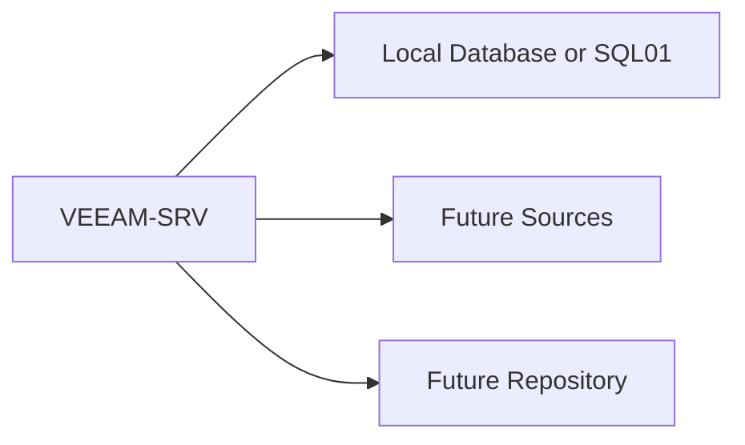

# Lesson 5 — Lab: Installing Veeam Backup & Replication v12 on Windows Server

> **VMCE Objective(s):** Core installation and initial platform setup  
> **Level:** Beginner  
> **Estimated reading time:** 25–35 minutes  
> **Lab time:** 60–90 minutes

## Table of Contents

- [Learning Objectives](#learning-objectives)
- [Concepts and Theory](#concepts-and-theory)
- [Lab Topology for This Lesson](#lab-topology-for-this-lesson)
- [Prerequisites](#prerequisites)
- [Step-by-Step Lab Walkthrough](#step-by-step-lab-walkthrough)
- [Common Installation Problems to Watch For](#common-installation-problems-to-watch-for)
- [Troubleshooting Notes for This Lab](#troubleshooting-notes-for-this-lab)
- [Platform Notes for Different Learning Paths](#platform-notes-for-different-learning-paths)
- [Verification Checklist](#verification-checklist)
- [Key Takeaways](#key-takeaways)
- [Review Questions](#review-questions)

[Go to TOC](#table-of-contents)

## Learning Objectives

- install Veeam Backup & Replication in a lab or controlled environment
- verify prerequisite readiness before running the installer
- understand the major installer phases and first-launch tasks
- perform basic post-install validation

[Go to TOC](#table-of-contents)

## Concepts and Theory

Installing Veeam is straightforward when the groundwork is done properly. The purpose of this lab is not merely to complete an installer wizard. It is to build disciplined deployment habits: verify prerequisites, understand dependencies, document decisions, and validate the platform before moving on to infrastructure onboarding.

In production, you should always align the exact installation flow with the current build’s release notes and supported upgrade/install guidance. In a lab, the goal is simpler: build a clean and understandable Veeam server that you can use for the rest of the course.

[Go to TOC](#table-of-contents)

## Lab Topology for This Lesson

Minimum recommended systems:

- `VEEAM-SRV` — Windows Server for the Veeam Backup & Replication role
- optional `SQL01` — external SQL Server if you want to test separated database placement
- network connectivity to at least one future source system and one future repository target

[Go to TOC](#table-of-contents)

## Prerequisites

Before installation, confirm the following:

- the Windows Server version is supported by the intended Veeam build
- the server has sufficient CPU, RAM, and free disk space
- the system has a stable hostname and correct DNS settings
- the account used to install Veeam has local administrative rights on `VEEAM-SRV`
- required Windows updates and restarts are complete
- antivirus or endpoint controls are reviewed so they do not block installation paths or services
- database decision is made: local/bundled or external

[Go to TOC](#table-of-contents)

## Step-by-Step Lab Walkthrough

### Step 1 — Prepare the Server

Log on to `VEEAM-SRV` with the installation account. Confirm the server name, IP configuration, domain membership if applicable, and current time synchronization. Open Server Manager and verify there are no pending reboots.

If your organization uses a server build checklist, document the machine’s intended purpose as the Veeam backup server. This sounds procedural, but it prevents role confusion later.

### Step 2 — Gather Installation Media and License or Trial Access

Obtain the Veeam Backup & Replication v12.x installation media appropriate for your lab. If you are using a trial or community-appropriate access path, make sure you understand any feature or workload limitations that may affect later lessons.

### Step 3 — Decide on Database Placement

If you are using a small self-contained lab, a local or bundled database path may be sufficient. If you want to simulate a more structured environment, point Veeam to an external SQL Server such as `SQL01`. Record your choice. The course works with either model, but later troubleshooting and upgrade lessons will be easier if you remember what you chose and why.

### Step 4 — Launch the Installer

Start the Veeam installer. The exact UI may differ slightly by build, but the general flow remains similar:

1. launch setup
2. accept the license agreement
3. supply license details if required by your environment
4. allow the installer to check prerequisites
5. resolve any missing components it flags
6. select installation paths and database settings
7. confirm service account behavior if prompted
8. begin installation

Do not rush past prerequisite warnings. If the installer flags missing components or unsupported conditions, stop and resolve them properly instead of hoping they will not matter later.

### Step 5 — Review Prerequisite Checks Carefully

This step is where experienced administrators differ from rushed ones. If the installer indicates a missing runtime, system component, or other prerequisite, pause and understand the reason. A clean prerequisite screen is part of a clean deployment.

In some environments, security tools or outbound restrictions may prevent automatic prerequisite retrieval. If that happens, obtain the required packages through your approved software process and rerun the check.

### Step 6 — Complete Installation and Reboot if Needed

Allow the install to finish. If the system requires a reboot, complete it before launching the Veeam console. Do not treat “almost finished” as “ready.” Services, drivers, and dependencies should be fully initialized before validation begins.

### Step 7 — Launch the Veeam Console

Open the Veeam Backup & Replication console from `VEEAM-SRV`. Confirm that the console connects successfully to the backup server and that core views load without obvious errors.

At this stage, you are not expecting protected workloads yet. You are validating the platform itself.

### Step 8 — Perform Immediate Post-Install Checks

Check the following:

- Veeam services are running
- the configuration database is reachable
- the local backup infrastructure views open normally
- there are no obvious warning dialogs about failed components
- the system event log does not show fresh service failures related to Veeam startup

### Step 9 — Record the Build and Baseline State

Document the exact Veeam build installed, the Windows Server version, the database choice, and the account used for installation. Capture this information in a simple deployment note. Later, when you study upgrades, troubleshooting, or supportability, these basic facts will matter.

This step is often skipped in labs because the environment feels disposable. But keeping the habit is valuable. Production recovery and support work is easier when the baseline is written down from day one.

### Step 10 — Configure a Configuration Backup Target Plan

Even in a lab, make note of how you would back up the Veeam configuration. In production, the Veeam configuration backup is essential because it protects metadata about your backup environment and speeds rebuild scenarios.

You do not need to complete the full configuration backup strategy in this lesson, but you should identify where it would go and who would own it.

### Step 11 — Capture a Post-Install Health Snapshot

Before ending the lab, note the following:

- core services visible and healthy
- console launches consistently
- no unresolved prerequisite issues remain
- installation media and version details are documented

Think of this as a baseline snapshot. Later, if something breaks, you will know what “good” looked like.

[Go to TOC](#table-of-contents)

## Common Installation Problems to Watch For

- pending reboot blocks prerequisite installation
- antivirus blocks file extraction or service creation
- external SQL connectivity fails because of permissions or firewall issues
- installer account lacks local administrative rights
- server naming, DNS or certificate trust issues later confuse console connectivity

[Go to TOC](#table-of-contents)

## Troubleshooting Notes for This Lab

If the console does not connect after installation, begin by checking whether Veeam services actually started and whether the database path is reachable. If prerequisites failed during setup, avoid the temptation to proceed “for now.” Re-run the checks and resolve the gap cleanly. If the installer appears to hang or fail unexpectedly, confirm there is no endpoint protection interfering with service creation or binary extraction.

These habits may feel cautious in a lab, but they build the discipline needed in production where partial installs become expensive to unwind.

[Go to TOC](#table-of-contents)

## Platform Notes for Different Learning Paths

This lesson is shared across all paths because the Veeam management server is still central even if you later focus on no-hypervisor agent protection. The difference comes later when you begin onboarding sources and choosing repositories.

[Go to TOC](#table-of-contents)

## Verification Checklist

You can consider the lab complete when all of the following are true:

- `VEEAM-SRV` boots cleanly after installation
- the Veeam console opens successfully
- core Veeam services are running
- the environment is ready for infrastructure onboarding in Lesson 6

[Go to TOC](#table-of-contents)

## Key Takeaways

- A disciplined Veeam installation begins before the setup wizard starts.
- Prerequisite failures should be resolved, not ignored.
- Post-install validation is part of the installation, not an optional extra.
- Documenting database choice and configuration backup strategy now will help later.

[Go to TOC](#table-of-contents)

## Review Questions

1. Why should you confirm there are no pending reboots before installing Veeam?
2. Why is a clean prerequisite check important?
3. What should you verify immediately after installation completes?
4. Why should you think about configuration backup even in a lab?
5. What is one common cause of external database connection failure during installation?

---

### Answers

1. Pending reboots can interrupt component installation and leave the environment in a partial or unstable state.
2. Because unresolved prerequisites often become later failures in services or management components.
3. Service health, console connectivity, database reachability, and absence of obvious startup errors.
4. Because rebuilding Veeam without protected configuration metadata is much harder, and the lab teaches production habits.
5. Firewall, credential, or SQL permissions issues.

[Go to TOC](#table-of-contents)
---

**License:** [CC BY-NC-SA 4.0](../LICENSE.md)
