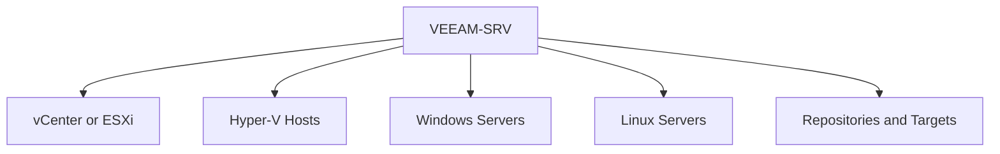

# Lesson 6 — Adding Managed Infrastructure: vCenter, Hyper-V, Windows, Linux and Physical Systems

> **VMCE Objective(s):** Managed server onboarding, credential use, platform integration  
> **Level:** Beginner  
> **Estimated reading time:** 45–55 minutes  
> **Lab time:** 45 minutes

## Table of Contents

- [Learning Objectives](#learning-objectives)
- [Concepts and Theory](#concepts-and-theory)
- [Categories of Infrastructure Commonly Added to Veeam](#categories-of-infrastructure-commonly-added-to-veeam)
- [Adding VMware Infrastructure](#adding-vmware-infrastructure)
- [Adding Hyper-V Infrastructure](#adding-hyper-v-infrastructure)
- [Adding Windows Servers](#adding-windows-servers)
- [Adding Linux Servers](#adding-linux-servers)
- [Credentials Manager and Credential Hygiene](#credentials-manager-and-credential-hygiene)
- [Infrastructure Onboarding Patterns That Reduce Confusion](#infrastructure-onboarding-patterns-that-reduce-confusion)
- [No-Hypervisor Path Considerations](#no-hypervisor-path-considerations)
- [Practical Sequence for Infrastructure Onboarding](#practical-sequence-for-infrastructure-onboarding)
- [Scenario Example](#scenario-example)
- [Lab Walkthrough](#lab-walkthrough)
- [Key Takeaways](#key-takeaways)
- [Review Questions](#review-questions)

[Go to TOC](#table-of-contents)

## Learning Objectives

- add and categorize common infrastructure objects in Veeam
- understand how Veeam connects to VMware, Hyper-V, Windows and Linux systems
- use credentials deliberately instead of carelessly reusing privileged accounts
- prepare the environment for backup, repository, and agent-based lessons

[Go to TOC](#table-of-contents)

## Concepts and Theory

After the Veeam server is installed, the next step is to teach it about the environment it must protect. This is the moment where the abstract architecture from earlier lessons becomes practical. Veeam cannot create meaningful jobs until it can see workloads, authenticate to management points, and communicate with the systems that will become sources, proxies, repositories, or managed agent targets.

Infrastructure onboarding is also where many avoidable mistakes appear. Administrators sometimes add systems with overly broad credentials, ignore certificate warnings, use IP addresses where DNS would be more stable, or fail to separate management accounts from guest-processing accounts. All of these shortcuts may work initially and then fail later at exactly the wrong time.

[Go to TOC](#table-of-contents)

## Categories of Infrastructure Commonly Added to Veeam

In a typical environment, you may add:

- VMware vCenter Server or individual ESXi hosts
- Hyper-V standalone hosts or clusters
- Windows servers that will serve as repositories, proxies, or agent-managed targets
- Linux servers that will serve as repositories, proxies, or agent-managed targets
- object storage endpoints and other backup target systems

For this lesson, focus on the principle that “adding infrastructure” means building a trusted, functional relationship between Veeam and another system.

[Go to TOC](#table-of-contents)

## Adding VMware Infrastructure

In most VMware environments, you should add **vCenter** rather than manually onboarding each ESXi host separately. vCenter gives Veeam centralized inventory visibility, consistent policy application, and cleaner long-term management.

When you add VMware infrastructure, Veeam needs:

- stable network connectivity
- correct DNS resolution
- credentials with appropriate privileges
- certificate acceptance if the presented certificate is not already trusted

Certificate prompts deserve attention. Administrators often click through them reflexively. In a lab, that may be acceptable if documented. In production, you should know exactly what system you are trusting and why.

[Go to TOC](#table-of-contents)

## Adding Hyper-V Infrastructure

Hyper-V integration differs because it leans heavily on Microsoft remote management behavior. Credentials, WinRM configuration, firewall rules, cluster awareness, and host communication become especially important.

For Hyper-V clusters, remember that cluster behavior matters beyond host-level reachability. VM mobility, CSV ownership, and off-host processing all influence later backup behavior.

[Go to TOC](#table-of-contents)

## Adding Windows Servers

Windows servers may be added for many reasons:

- repository role
- proxy role
- guest processing access path
- managed agent or protection group scope

When Veeam connects to a Windows server, administrative rights are often required for role deployment or management actions. That does not mean the same account should be used universally. Keep the access purpose clear.

[Go to TOC](#table-of-contents)

## Adding Linux Servers

Linux systems are increasingly important in Veeam environments because hardened repositories rely on Linux-based immutability designs, and Veeam Agents for Linux cover no-hypervisor protection needs. Linux onboarding usually depends on:

- SSH connectivity
- correct credentials or key-based access
- privilege elevation behavior such as sudo
- package compatibility and supported distribution versions

Linux systems reward careful planning. They also punish assumptions. A server that allows interactive SSH may still fail role deployment if privilege escalation is misconfigured.

[Go to TOC](#table-of-contents)

## Credentials Manager and Credential Hygiene

Veeam stores and uses credentials to access managed systems. This makes operational sense, but it also creates responsibility. Poor credential hygiene can cause both backup failures and security exposure.

Good habits include:

- create separate credentials for separate roles where practical
- label stored credentials clearly
- document ownership and password rotation schedule
- avoid leaving obsolete or test credentials in the system
- review failed authentications promptly

If a credential expires, the failure may not become obvious until the next job or next management action. Proactive review matters.

[Go to TOC](#table-of-contents)

## Infrastructure Onboarding Patterns That Reduce Confusion

In mature environments, the order in which infrastructure is added can make the rest of the project easier. A good pattern is to first add the management systems that provide inventory visibility, then add target systems such as repositories, and only then move on to protected endpoint scope. This ensures that when jobs are created later, the environment already reflects the intended trust and data-flow relationships.

Another useful practice is to name stored credentials and infrastructure objects clearly enough that another administrator can understand the design without guessing. Labels such as “temporary admin” or “old VMware account” create confusion very quickly. Explicit naming makes both troubleshooting and handoff easier.

[Go to TOC](#table-of-contents)

## No-Hypervisor Path Considerations

If you are protecting physical servers or standalone systems, this lesson is especially important. Your environment may not contain vCenter or Hyper-V at all. In that case, your infrastructure onboarding focuses more on Windows and Linux servers as protected or managed endpoints, plus the repository design that will receive agent-based backups.

This is still a first-class Veeam deployment. It is simply a different protection model.

[Go to TOC](#table-of-contents)

## Practical Sequence for Infrastructure Onboarding

Although environments vary, a sensible sequence is usually:

1. add the main virtualization management point if one exists
2. add repository target servers
3. add proxy candidates if separate from the backup server
4. add Windows and Linux managed systems for future protection or roles
5. validate credentials and connectivity before creating jobs

[Go to TOC](#table-of-contents)

## Scenario Example

Suppose an administrator adds vCenter with one credential, Hyper-V with a second, Linux repositories with a third, and guest processing with a fourth, but documents none of them. Two months later, a password rotation breaks only the Linux repository path. The team sees failing jobs and assumes the repository is corrupt, when the actual problem is a single outdated stored credential. This is a small example of why onboarding discipline matters. Good onboarding reduces future ambiguity.

The goal is not to add everything as quickly as possible. The goal is to add systems cleanly and confirm they behave as expected.

[Go to TOC](#table-of-contents)

## Lab Walkthrough

### Prerequisites

- `VEEAM-SRV` installed and console accessible
- at least one source environment available: `VCENTER01`, `HV01`, or `PHYS-SRV01` / `LIN-WEB01`
- credentials prepared for each system type

### Steps

1. Open the Veeam console on `VEEAM-SRV`.
2. Add one virtualization management system if available:
   - VMware path: add `VCENTER01`.
   - Hyper-V path: add `HV01` or the cluster entry point.
3. Add one Windows managed server that may later become a repository or protected host.
4. Add one Linux managed server using SSH-based access.
5. If following the no-hypervisor path, add `PHYS-SRV01` and `LIN-WEB01` as systems you intend to protect with agent-based workflows.
6. Review the stored credentials in the Veeam credential manager area and label them clearly.
7. Confirm that each added system appears healthy and reachable in the console.

### Optional Extension

If your lab is large enough, add one repository target and one Linux host that is intended to become a hardened repository later. This gives you a stronger mental link between infrastructure onboarding and storage design.

### Verification

You have completed the lab if you can show, in the Veeam console, at least two successfully added infrastructure objects and explain which credentials are used for each and why.

[Go to TOC](#table-of-contents)

## Key Takeaways

- Adding infrastructure creates trust relationships that affect later job success.
- VMware, Hyper-V, Windows and Linux onboarding each have different dependency patterns.
- Credential hygiene is an operational and security requirement.
- No-hypervisor environments rely heavily on Windows and Linux endpoint onboarding.

[Go to TOC](#table-of-contents)

## Review Questions

1. Why is adding vCenter usually preferable to adding ESXi hosts one by one?
2. What common dependency often causes Hyper-V onboarding issues?
3. Why should Linux onboarding be tested carefully before repository or agent use?
4. Why is credential labeling important in Veeam?
5. How does the no-hypervisor path change the importance of Windows and Linux managed servers?

---

### Answers

1. Because vCenter provides centralized inventory and cleaner long-term management.
2. WinRM configuration, permissions, and firewall reachability.
3. Because SSH access alone is not enough if privilege elevation or distribution compatibility fails.
4. Because it reduces confusion, supports rotation, and helps troubleshoot authentication failures.
5. They become the primary protected workloads and management targets rather than secondary supporting systems.

[Go to TOC](#table-of-contents)

---

**License:** [CC BY-NC-SA 4.0](../LICENSE.md)
