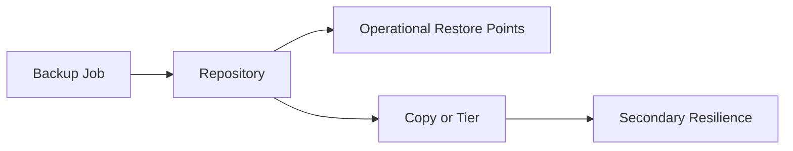

# Lesson 7 — Backup Repositories: Types, Design, Performance and Resilience

> **VMCE Objective(s):** Repository planning, storage target selection, resilience-oriented design  
> **Level:** Intermediate  
> **Estimated reading time:** 55–70 minutes  
> **Lab time:** 40 minutes

## Table of Contents

- [Learning Objectives](#learning-objectives)
- [Concepts and Theory](#concepts-and-theory)
- [What a Repository Stores](#what-a-repository-stores)
- [Common Repository Types](#common-repository-types)
- [Windows vs. Linux Repositories](#windows-vs-linux-repositories)
- [Hardened Repository Thinking](#hardened-repository-thinking)
- [Repository Selection Matrix](#repository-selection-matrix)
- [Scale-Out Backup Repository (SOBR)](#scale-out-backup-repository-sobr)
- [Object Storage and Modern Repository Strategy](#object-storage-and-modern-repository-strategy)
- [Repository Design Questions You Should Always Ask](#repository-design-questions-you-should-always-ask)
- [Performance Considerations](#performance-considerations)
- [Maintenance Considerations](#maintenance-considerations)
- [Security Considerations](#security-considerations)
- [No-Hypervisor Path Repository Design](#no-hypervisor-path-repository-design)
- [Decision Checklist](#decision-checklist)
- [v12.x Notes](#v12x-notes)
- [Lab Walkthrough](#lab-walkthrough)
- [Key Takeaways](#key-takeaways)
- [Review Questions](#review-questions)

[Go to TOC](#table-of-contents)

## Learning Objectives

- compare major Veeam repository types and when to use them
- understand how repository choice affects performance, retention, security, and recovery speed
- explain the role of hardened repositories, SOBR extents, and object storage integration
- choose repository designs for VMware, Hyper-V, and no-hypervisor environments

[Go to TOC](#table-of-contents)

## Concepts and Theory

If backup jobs are the visible part of Veeam administration, repositories are the operational foundation underneath them. A poorly chosen repository can slow backups, weaken resilience, complicate maintenance, and make recovery more painful than it needs to be. A well-designed repository strategy, by contrast, supports performance, predictability, growth, and security at the same time.

Many beginners think of a repository as simply “the place where the backup files go.” That is true, but incomplete. A repository is also a performance domain, a security domain, a retention domain, and often a fault domain. The repository determines how quickly restore points can be ingested, how long they can be retained, what copy and tiering strategies are practical, and how vulnerable the backup estate is to compromise or accidental damage.

[Go to TOC](#table-of-contents)

## What a Repository Stores

At a practical level, repositories store Veeam backup data files and related metadata. Depending on job type and settings, this may include full backup files, incremental files, metadata for indexing, and operational structures used by health checks or synthetic operations. What matters to the administrator is not only that the files exist, but that the underlying storage can support the expected write rate, retention window, and maintenance operations.

For example, a repository that handles ingest well may still struggle with synthetic full operations. Another may be large enough for retention but too exposed from a security perspective. A third may be ideal for capacity and immutability but slower for frequent small restore operations. Repository design is always a tradeoff exercise.

[Go to TOC](#table-of-contents)

## Common Repository Types

Veeam supports multiple repository models. The broad categories you will commonly encounter are:

- **direct attached or local storage** on a Windows or Linux repository server
- **network-based repositories**, such as SMB or NFS-backed targets depending on the supported scenario
- **deduplication appliances** such as vendor-integrated storage platforms
- **hardened Linux repositories** designed for immutability
- **scale-out backup repositories (SOBR)** that combine multiple extents and optional tiers
- **object storage connected designs**, often used with capacity tier or direct-to-object workflows in modern deployments

These are not interchangeable in all scenarios. Their operational behavior differs significantly.

[Go to TOC](#table-of-contents)

## Windows vs. Linux Repositories

Historically, many Veeam administrators began with Windows repositories. They are familiar, easy to onboard in Microsoft-centric environments, and fine for many use cases. However, the rise of hardened Linux repositories gave Linux-based storage a much stronger strategic role, especially where immutability is a requirement.

A **Windows repository** may still be acceptable for simple or legacy deployments, short-term operational backup landing zones, or environments where the team’s operational maturity strongly favors Windows. But if the organization is serious about ransomware resilience, Linux-based hardened repositories deserve close consideration.

A **Linux repository** becomes especially compelling when you want to reduce the attack surface and enforce immutability controls that make it much harder for compromised credentials or hostile software to alter restore points during the protected window.

[Go to TOC](#table-of-contents)

## Hardened Repository Thinking

The hardened repository concept is one of the most important architectural changes in modern Veeam practice. The reason is simple: many organizations learned that “we have backups” is not enough if the attacker can encrypt or delete those backups before recovery begins.

An immutable or hardened repository is designed so that even administrative actions are constrained in specific ways. This sharply reduces the chance that a compromised account or hasty human action can destroy critical restore points. In security-conscious environments, hardened repositories are no longer a niche feature. They are part of the expected baseline for serious resilience planning.

However, hardening is not magic. It requires correct deployment, correct user model, correct immutability settings, correct retention alignment, and ongoing operational discipline. A misconfigured hardened repository gives false confidence.

[Go to TOC](#table-of-contents)

## Repository Selection Matrix

| Repository type | Best fit | Main caution |
|---|---|---|
| Windows repository | Simpler Microsoft-centric environments | Larger attack surface and weaker immutability story |
| Linux repository | Flexible general-purpose target | Requires Linux operational comfort |
| Hardened Linux repository | Security-focused resilience design | Must be configured carefully to avoid false confidence |
| Dedup appliance | Existing enterprise storage strategy | Vendor behavior and restore expectations vary |
| SOBR | Growth and policy-based placement | More moving parts to understand |
| Object-connected strategy | Long-term scale and copy separation | Restore expectations and connectivity must be planned |

This matrix is not meant to make the decision for you automatically. It is meant to train you to ask the right questions before choosing.

[Go to TOC](#table-of-contents)

## Scale-Out Backup Repository (SOBR)

A **scale-out backup repository** allows Veeam to treat multiple repository extents as a logical pool. This improves flexibility and makes it easier to grow capacity over time. It also enables more modern tiering behavior, especially when combined with capacity or archive tiers.

SOBR is not just a convenience feature. It supports policy-driven storage design. Instead of managing each repository as an isolated island, administrators can group capacity and apply placement logic more consistently. This becomes valuable as environments grow and backup data spreads across more than one storage system.

The tradeoff is complexity. Once you move into scale-out behavior, you must understand extent health, placement modes, evacuation behavior, maintenance considerations, and how backup chains interact with those extents.

[Go to TOC](#table-of-contents)

## Object Storage and Modern Repository Strategy

Veeam v12.x continued reinforcing object storage as an important part of backup architecture. In earlier generations, many administrators thought primarily in terms of local disk, dedupe appliance, or tape. Modern Veeam environments increasingly include object storage for off-site durability, long-term retention, or scale-out tier integration.

Object storage is particularly valuable because it supports separation from the primary performance landing zone. In other words, you can optimize one location for ingest and operational restore performance while using another location for scale, cost management, and immutability-oriented copy strategy.

This does not mean every environment should back up directly to object storage as the first choice. It means administrators must understand when object storage is appropriate and how it changes the copy model.

[Go to TOC](#table-of-contents)

## Repository Design Questions You Should Always Ask

Before selecting a repository type, ask the following:

1. What is my expected ingest rate during the backup window?
2. How much retention must be stored locally for fast recovery?
3. Do I need immutable restore points?
4. Will this repository be the primary landing zone, a copy target, or both?
5. How quickly must I restore from it?
6. What maintenance operations will it need to support?
7. How will capacity grow over time?
8. If this repository is unavailable, what surviving copy remains?

These questions matter just as much in a no-hypervisor environment as they do in a large vSphere environment. Physical server backups still need durable, recoverable storage.

[Go to TOC](#table-of-contents)

## Performance Considerations

Repository performance is influenced by:

- storage media type
- network throughput and latency
- synthetic full and merge behavior
- number of concurrent tasks
- repository role placement
- compression and encryption settings
- extent distribution in SOBR designs

Do not reduce repository sizing to raw capacity. Capacity is the easiest thing to see and often the least interesting operational variable. Two repositories with equal capacity may behave very differently under the same workload.

[Go to TOC](#table-of-contents)

## Maintenance Considerations

Repositories must also support maintenance behavior. That includes merge operations, health checks, compact or verification activity where relevant, storage firmware changes, Linux maintenance windows, and capacity expansions. A repository that performs well during initial backups but becomes difficult to maintain cleanly is not a strong long-term design.

Administrators should ask not only “can this repository hold the data?” but also “can the team operate this repository safely for the next several years?”

[Go to TOC](#table-of-contents)

## Security Considerations

From a security perspective, repositories should be evaluated based on:

- credential exposure
- operating system hardening
- immutability support
- isolation from routine administrative activity
- copy separation from primary infrastructure

Repositories are often targeted because they concentrate recovery value. That is why repository design is inseparable from security design.

[Go to TOC](#table-of-contents)

## No-Hypervisor Path Repository Design

For no-hypervisor or agent-heavy environments, repository thinking changes slightly. You may not need transport mode considerations that dominate virtualization discussions, but you still need:

- good ingest performance for agent backups
- suitable space for long retention
- secure copy strategy
- workable recovery speed for file, volume, or bare metal restore

In these environments, the lack of a hypervisor does not reduce the importance of repository design. It often increases the importance of agent recovery media and repository accessibility during disaster conditions.

[Go to TOC](#table-of-contents)

## Decision Checklist

- What is the primary landing zone?
- Where is the second copy?
- Is one copy immutable?
- What is the expected restore speed from each location?
- Which platform team owns the repository host?
- How will capacity be monitored?

[Go to TOC](#table-of-contents)

## v12.x Notes

The v12 generation strengthened the practical importance of object storage, direct-to-object and cloud-connected strategies, and immutable design patterns. Even if your current environment is simple, learn repository design with growth in mind. A repository decision made today often shapes the next two or three years of backup operations.

[Go to TOC](#table-of-contents)

## Lab Walkthrough

### Prerequisites

- `VEEAM-SRV` operational
- at least one potential repository target, such as `REPO01` or `LIN-IMMUT01`
- worksheet for design choices

### Steps

1. List three candidate repository models for your lab: local Windows, Linux hardened, and SOBR with object-connected tier concept.
2. For each one, note strengths and weaknesses in performance, security, and complexity.
3. Decide which model you would choose for:
   - a small VMware lab
   - a medium Hyper-V environment
   - a no-hypervisor branch-office or physical server scenario
4. Write a short explanation of which repository would be your primary landing zone and which would hold your second copy.
5. If possible in the console, inspect the repository management area to become familiar with the available repository categories.

### Verification

You have completed the lab if you can justify a repository choice using both operational and security reasoning, not just available capacity.

[Go to TOC](#table-of-contents)

## Key Takeaways

- Repositories are performance, retention, and security decisions at the same time.
- Hardened Linux repositories are strategically important in modern ransomware-aware design.
- SOBR improves flexibility and growth but adds design complexity.
- Object storage is now a mainstream part of Veeam architecture, not a niche option.

[Go to TOC](#table-of-contents)

## Review Questions

1. Why is repository design more than just choosing a folder or disk volume?
2. What makes hardened repositories important in modern environments?
3. What is the main idea behind SOBR?
4. Why should repository planning include restore speed, not just backup speed?
5. How does repository design still matter in a no-hypervisor environment?

---

### Answers

1. Because it affects performance, retention, recovery behavior, and security.
2. They reduce the risk that backups can be altered or deleted during the immutability window.
3. It groups multiple extents into one logical backup repository with flexible placement and growth options.
4. Because a repository that writes backups quickly but restores too slowly may still fail business recovery requirements.
5. Because agent backups still rely on durable, secure, and recoverable storage targets.

[Go to TOC](#table-of-contents)

---

**License:** [CC BY-NC-SA 4.0](../LICENSE.md)
