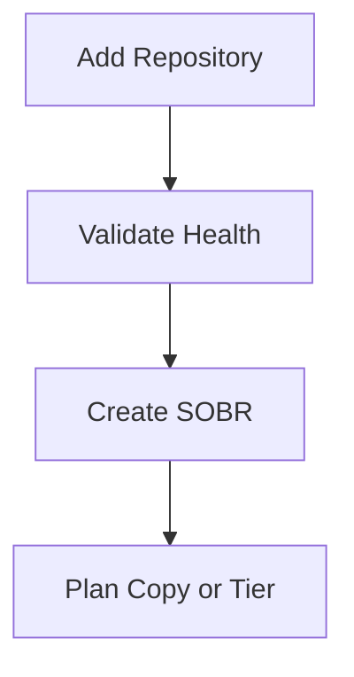

# Lesson 8 — Lab: Configure a Repository and Scale-Out Backup Repository (SOBR)

> **VMCE Objective(s):** Repository implementation, storage onboarding, foundational SOBR workflow  
> **Level:** Intermediate  
> **Estimated reading time:** 25–35 minutes  
> **Lab time:** 60–90 minutes

## Table of Contents

- [Learning Objectives](#learning-objectives)
- [Concepts and Theory](#concepts-and-theory)
- [Lab Scenarios Supported](#lab-scenarios-supported)
- [Prerequisites](#prerequisites)
- [Step-by-Step Lab Walkthrough](#step-by-step-lab-walkthrough)
- [Common Issues During Repository Onboarding](#common-issues-during-repository-onboarding)
- [Operational Reflection](#operational-reflection)
- [Verification Checklist](#verification-checklist)
- [Key Takeaways](#key-takeaways)
- [Review Questions](#review-questions)

[Go to TOC](#table-of-contents)

## Learning Objectives

- add a repository to Veeam
- understand the practical steps involved in repository onboarding
- create a simple SOBR design in a lab scenario
- validate repository readiness before using it in production-style jobs

[Go to TOC](#table-of-contents)

## Concepts and Theory

This lab takes the repository concepts from Lesson 7 and makes them concrete. Your goal is not only to add storage to Veeam, but also to understand what information the platform needs from you during repository configuration and why those decisions matter later.

In a real production environment, repository onboarding should be accompanied by storage sizing review, security review, and maintenance planning. In the lab, focus on correctness and clarity.

[Go to TOC](#table-of-contents)

## Lab Scenarios Supported

You can perform this lab in one of three ways:

1. **Simple Windows repository path** using `REPO01`
2. **Linux repository path** using `LIN-IMMUT01` as a standard or hardened repository candidate
3. **Multi-extent SOBR path** using two repositories or one primary repository plus a conceptual second extent if your lab is limited

[Go to TOC](#table-of-contents)

## Prerequisites

- `VEEAM-SRV` installed and operational
- repository target system(s) already added to Veeam if required
- storage on target system(s) prepared and documented
- if using Linux, SSH and privilege access validated

[Go to TOC](#table-of-contents)

## Step-by-Step Lab Walkthrough

### Step 1 — Review Repository Target Health

Before adding the repository, confirm the target server is reachable and has the intended storage mounted or available. Make sure the repository path is not being used casually for unrelated file storage.

The reason for this check is simple: backup targets should not feel temporary. Treating them as general-purpose file shares invites accidents.

### Step 2 — Add a Basic Repository

From the Veeam console on `VEEAM-SRV`, go to the backup infrastructure area and begin the workflow to add a backup repository.

Choose the appropriate repository type based on your lab:

- Windows server repository on `REPO01`
- Linux server repository on `LIN-IMMUT01`

Specify the path that will store the backup data. Review any task slot or concurrent task settings that appear, even if you keep defaults in the lab. These settings become more important in larger environments.

### Step 3 — Validate Role Deployment

If the repository target requires deployment of Veeam components, allow the process to complete and watch for credential, firewall, or package-related errors. If the system is Linux-based, confirm the deployment account can elevate as needed.

### Step 4 — Review Mount Server and Operational Settings

Some repository flows also involve mount server or related operational choices. Even if you use defaults in the lab, note what these settings are for. They affect how certain restore and processing workflows behave later.

### Step 5 — Test Repository Visibility

After onboarding, confirm the repository appears in the infrastructure inventory and shows no immediate warnings. If possible, inspect repository properties and note available space, role settings, and operational state.

### Step 6 — Create a Simple SOBR

If your lab supports more than one repository extent, create a Scale-Out Backup Repository.

General workflow:

1. start the SOBR creation wizard
2. name the SOBR logically
3. add one or more performance extents
4. review placement or policy options presented by the wizard
5. if available in your lab, explore the capacity tier concept even if you do not fully configure object storage yet

If your lab has only one repository, still walk through the SOBR conceptually and document what second extent you would add in a larger environment.

### Step 7 — Record Operational Assumptions

Write down:

- who owns the repository server
- where free space will be monitored
- whether this repository is expected to support synthetic operations or only direct ingest
- whether this repository is intended to remain a simple landing zone or evolve into a larger strategy

### Step 8 — Document Intended Use

Write down whether this repository or SOBR will act as:

- primary landing zone
- backup copy target
- future object-connected structure
- immutable storage target

This step matters because repositories should not exist without a clear role.

### Step 9 — Validate Before Using in Jobs

Before you point important jobs at the repository, confirm one more time that the path, capacity, role deployment, and operational purpose all match your notes. In production, a quick validation step here prevents backup jobs from being built on top of a misidentified path or the wrong server.

[Go to TOC](#table-of-contents)

## Common Issues During Repository Onboarding

- access denied to the target path
- insufficient free space or wrong disk selected
- Linux package deployment or sudo issue
- firewall or remote management communication failure
- unexpected performance limitations because storage is shared with other workloads

[Go to TOC](#table-of-contents)

## Operational Reflection

After this lab, ask yourself whether you have actually designed a repository or merely registered one. The difference matters. Registering a storage path is easy. Designing a backup target means understanding how it will behave under retention growth, restore pressure, maintenance activity, and security events.

[Go to TOC](#table-of-contents)

## Verification Checklist

The lab is complete when:

- at least one repository is visible and healthy in the console
- you understand where backup files will land
- you can explain whether the repository is operational, immutable, scale-out, or intended as a copy target

[Go to TOC](#table-of-contents)

## Key Takeaways

- Repository configuration is a design task, not just a setup wizard.
- You should always know what role a repository plays in the protection strategy.
- SOBR introduces flexibility, but you should understand extent logic before using it heavily.

[Go to TOC](#table-of-contents)

## Review Questions

1. Why should you validate storage on the target before adding it as a repository?
2. What is the value of documenting the intended role of the repository?
3. What is one reason a Linux repository might fail onboarding?
4. Why is it useful to learn SOBR even in a small lab?
5. What should you verify immediately after repository creation?

---

### Answers

1. Because selecting the wrong path, volume, or shared storage area can create operational and capacity problems later.
2. Because primary landing zones, copy targets, and immutable targets serve different purposes.
3. SSH or sudo/privilege elevation failure.
4. Because it teaches scalable storage design patterns that become important as environments grow.
5. Health, available space, component deployment success, and clear repository role understanding.

[Go to TOC](#table-of-contents)

---

**License:** [CC BY-NC-SA 4.0](../LICENSE.md)
