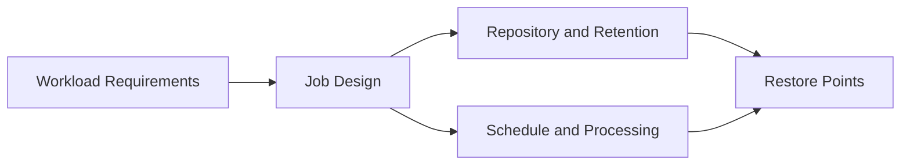

# Lesson 9 — VM Backup Jobs: Settings, Scheduling, Retention and Recovery Intent

> **VMCE Objective(s):** Job design, scheduling, retention logic, backup policy translation  
> **Level:** Intermediate  
> **Estimated reading time:** 60–75 minutes  
> **Lab time:** 35 minutes

## Table of Contents

- [Learning Objectives](#learning-objectives)
- [Concepts and Theory](#concepts-and-theory)
- [Start With the Workload, Not the Wizard](#start-with-the-workload-not-the-wizard)
- [Object Selection Strategy](#object-selection-strategy)
- [Job Naming and Policy Clarity](#job-naming-and-policy-clarity)
- [Storage Settings and Chain Logic](#storage-settings-and-chain-logic)
- [Scheduling and Backup Windows](#scheduling-and-backup-windows)
- [Application-Aware Processing Preview](#application-aware-processing-preview)
- [VMware and Hyper-V Differences](#vmware-and-hyper-v-differences)
- [Security and Job Design](#security-and-job-design)
- [Job Review Checklist Before Production Use](#job-review-checklist-before-production-use)
- [No-Hypervisor Path Contrast](#no-hypervisor-path-contrast)
- [v12.x Notes](#v12x-notes)
- [Scenario Example](#scenario-example)
- [Lab Walkthrough](#lab-walkthrough)
- [Key Takeaways](#key-takeaways)
- [Review Questions](#review-questions)

[Go to TOC](#table-of-contents)

## Learning Objectives

- design a VM backup job based on recovery requirements rather than guesswork
- understand job components such as object selection, storage settings, schedule, and advanced options
- compare policy choices for VMware and Hyper-V workloads
- connect VM backup job design to backup copy, restore, and security strategies

[Go to TOC](#table-of-contents)

## Concepts and Theory

Creating a backup job is one of the most visible tasks in Veeam, but it is also one of the easiest to oversimplify. New administrators often open the wizard, click through the pages, and accept defaults without fully understanding the consequences. A backup job can still run that way, but the resulting policy may be badly aligned with business needs.

The correct way to think about a VM backup job is this: it is a formal statement of recovery intent. The objects you include, the schedule you choose, the repository you target, and the retention policy you apply all express what kind of failure you are preparing for and how much disruption the organization can tolerate.

[Go to TOC](#table-of-contents)

## Start With the Workload, Not the Wizard

Before selecting VMs, ask:

- how critical is the service?
- what is the RPO?
- what is the RTO?
- is application consistency required?
- how long should restore points remain available locally?
- does this workload also need replication or backup copy?

Once you know the answers, the wizard becomes straightforward. Without them, it becomes easy to create inconsistent or wasteful jobs.

[Go to TOC](#table-of-contents)

## Object Selection Strategy

In many environments, job design begins with one of two approaches:

- **service-oriented grouping**, where related workloads are protected together because they share recovery or maintenance expectations
- **infrastructure-oriented grouping**, where workloads are grouped by host, cluster, folder, or tag

Either can work, but service-oriented thinking usually produces more meaningful recovery policies. For example, if a SQL Server and its dependent application servers need aligned schedules and similar restore handling, grouping them intentionally may make sense.

At the same time, very large jobs can create long backup windows and harder troubleshooting. Job sprawl is bad, but over-consolidation is also bad. Balance matters.

[Go to TOC](#table-of-contents)

## Job Naming and Policy Clarity

An underrated part of good backup administration is naming. A job name should help another administrator understand what is protected and why. Names like `Job1`, `Nightly-2`, or `New Backup` create confusion almost immediately. Clear names make review, troubleshooting, and audit conversations easier.

Good job design also includes a short rationale in your operational documentation. For example: “This job protects customer-facing application VMs with four-hour RPO, application-aware processing, and seven-day local retention plus backup copy.” That level of clarity improves both handoff and long-term consistency.

[Go to TOC](#table-of-contents)

## Storage Settings and Chain Logic

The storage page of a Veeam job is where backup theory becomes implementation. Here you decide:

- which repository receives the data
- how many restore points to retain
- whether specific full backup behavior applies
- whether compression, deduplication, or encryption is enabled

Every one of these choices affects downstream operations. For example, enabling encryption may be necessary for compliance or security, but it also affects some storage efficiency assumptions. Choosing short retention may save space but weaken the ability to recover from late-detected corruption or malware dwell time.

[Go to TOC](#table-of-contents)

## Scheduling and Backup Windows

Scheduling is often treated as a convenience setting. In reality, it is a negotiation between production operations, backup infrastructure capacity, and recovery requirements. A backup job that starts at 10 p.m. because “that’s when backups run” may conflict with maintenance windows, replication traffic, batch processing, or repository merge behavior.

Good scheduling practice considers:

- when the workload is least disruptive to read
- whether application-aware processing will increase runtime
- how long the backup window can realistically be
- how many tasks the proxies and repository can sustain simultaneously
- whether backup copy or offload jobs will overlap later

Another scheduling lesson is to avoid thinking of backup jobs in isolation. A job can be perfectly reasonable by itself and still become problematic when several similar jobs start at the same time, consume the same proxy capacity, and push to the same repository. Mature scheduling takes the whole environment into account.

[Go to TOC](#table-of-contents)

## Application-Aware Processing Preview

For many virtual machines, crash-consistent backup may be technically acceptable. But if the workload hosts a transactional application such as SQL Server or Exchange, you should usually think more carefully. Application-aware processing helps create better recovery outcomes by interacting with the guest operating system and supported application behaviors.

Lesson 12 explores this in detail, but job design must anticipate it now.

[Go to TOC](#table-of-contents)

## VMware and Hyper-V Differences

The job design principles are similar across VMware and Hyper-V, but environmental details differ. VMware jobs may interact with CBT, snapshots, and transport mode behavior more visibly. Hyper-V jobs may be more sensitive to host communication, VSS integration, checkpoint behavior, and cluster topology.

The lesson here is simple: job design is shared, implementation details differ.

[Go to TOC](#table-of-contents)

## Security and Job Design

Job design also affects security posture. Consider:

- should this job write to an immutable target?
- should backup encryption be enabled?
- how much retention is necessary to recover from slow-moving compromise?
- who is allowed to change or disable the job?

Security is not an optional layer added after the backup policy. It is part of the policy.

[Go to TOC](#table-of-contents)

## Job Review Checklist Before Production Use

Before enabling a new job widely, review the following:

- Are the included objects grouped intentionally?
- Does the repository align to the importance of the workload?
- Is retention sufficient for both ordinary mistakes and delayed incident discovery?
- Is guest/application processing enabled where needed?
- Does the schedule fit infrastructure and business reality?
- Is there a plan for secondary copy or immutability?

If you cannot answer these questions clearly, the job is probably not ready for production.

[Go to TOC](#table-of-contents)

## No-Hypervisor Path Contrast

If you are protecting systems without a hypervisor, the equivalent policy decisions still exist, but the mechanism shifts to agent-based jobs or policies. That means this lesson remains conceptually important even if your next practical steps happen in the agent lessons rather than the VM job wizard.

[Go to TOC](#table-of-contents)

## v12.x Notes

Modern Veeam job design increasingly assumes that backup jobs are only one part of a broader copy and resilience strategy. In v12.x environments, think less in terms of a single job and more in terms of a **protection chain**:

source backup -> repository restore points -> backup copy or tier -> validation -> restore readiness.

[Go to TOC](#table-of-contents)

## Scenario Example

Imagine two jobs protecting ten VMs each. The first job protects low-priority test systems once per day with short retention to a standard repository. The second protects a customer-facing application group every four hours with application-aware processing, longer retention, and an immutable copy strategy. Both jobs may use the same wizard. But from a design standpoint, they are solving different business problems. That is the mindset this lesson is trying to build.

[Go to TOC](#table-of-contents)

## Lab Walkthrough

### Prerequisites

- virtualization infrastructure added in Veeam
- at least one repository configured
- at least one candidate VM available

### Steps

1. Select one VM or small VM group for protection.
2. Write down the intended RPO, RTO, and retention target before opening the job wizard.
3. In the Veeam console, begin creating a backup job.
4. Choose the VM(s), repository, and retention settings.
5. Decide whether you would enable application-aware processing and why.
6. Create a schedule that matches the workload’s business criticality.
7. Before finishing, review the complete configuration and explain it in your own words.

### Optional Reflection

After creating the job design, ask yourself what would happen if the repository became unavailable, if a credential expired, or if the application owner asked for a longer restore history. If those changes would be hard to accommodate, note that now. Job design should be adaptable, not brittle.

### Verification

You have completed the lab if you can justify every major job setting based on the workload’s recovery requirement.

[Go to TOC](#table-of-contents)

## Key Takeaways

- A VM backup job is a recovery policy expressed in Veeam settings.
- Object grouping, retention, schedule, and processing choices should all reflect business need.
- Backup jobs should be designed alongside copy, restore, and security strategy.

[Go to TOC](#table-of-contents)

## Review Questions

1. Why should you define RPO and RTO before creating a job?
2. What is the risk of grouping too many unrelated workloads into one job?
3. Why is schedule planning more than choosing an overnight time?
4. How can retention settings affect ransomware recovery?
5. Why is job design still relevant to no-hypervisor environments?

---

### Answers

1. Because job settings should reflect business recovery needs, not arbitrary defaults.
2. It can create long backup windows, policy mismatch, and harder troubleshooting.
3. Because backup runtime, maintenance windows, infrastructure load, and downstream jobs all matter.
4. Short retention may leave too little clean history if compromise is detected late.
5. Because the same policy logic applies even if the mechanics are implemented through agents rather than hypervisor-based image backups.

[Go to TOC](#table-of-contents)
---

**License:** [CC BY-NC-SA 4.0](../LICENSE.md)
