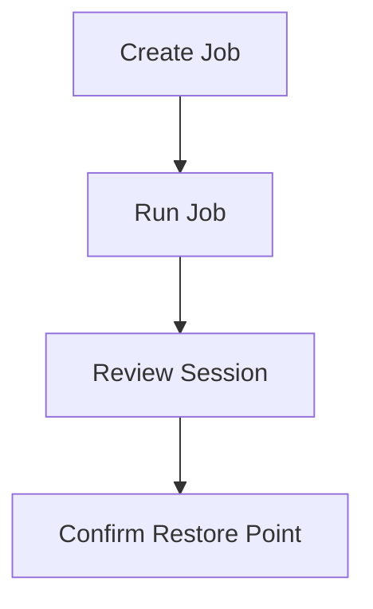

# Lesson 10 — Lab: Create and Run a VM Backup Job (VMware and Hyper-V)

> **VMCE Objective(s):** Practical job creation and first-run validation  
> **Level:** Intermediate  
> **Estimated reading time:** 20–30 minutes  
> **Lab time:** 45–75 minutes

## Table of Contents

- [Learning Objectives](#learning-objectives)
- [Concepts and Theory](#concepts-and-theory)
- [Prerequisites](#prerequisites)
- [Lab Goal and Success Standard](#lab-goal-and-success-standard)
- [Step-by-Step Lab Walkthrough](#step-by-step-lab-walkthrough)
- [Platform Notes](#platform-notes)
- [What to Record in Your Lab Notes](#what-to-record-in-your-lab-notes)
- [Common First-Run Issues](#common-first-run-issues)
- [Verification Checklist](#verification-checklist)
- [Operational Reflection](#operational-reflection)
- [Extended Practice](#extended-practice)
- [Key Takeaways](#key-takeaways)
- [Review Questions](#review-questions)

[Go to TOC](#table-of-contents)

## Learning Objectives

- create a working VM backup job in Veeam
- run the job and monitor the session
- verify that restore points are created successfully
- observe differences in VMware and Hyper-V workflows

[Go to TOC](#table-of-contents)

## Concepts and Theory

This lesson turns the design thinking from Lesson 9 into a live backup job. The point is not only to create a green status in the console, but to observe what the platform does during the run and to verify the resulting restore point.

In production, first-run observation is essential. The first successful run often reveals timing, processing, or credential issues that would otherwise remain hidden until the next maintenance window or incident.

[Go to TOC](#table-of-contents)

## Prerequisites

- `VEEAM-SRV` functioning normally
- repository available
- VMware or Hyper-V infrastructure visible in Veeam
- at least one powered-on test VM available for protection

[Go to TOC](#table-of-contents)

## Lab Goal and Success Standard

The purpose of this lab is not just to produce a green status icon. The real goal is to build the habit of treating the first backup run as a validation event. A correctly run lab should leave you able to answer all of the following:

- Which objects were protected and why were they grouped together?
- Which repository received the backup data?
- What processing choices were used?
- Did the resulting restore point appear where you expected?
- What would you change before using the same configuration in production?

If you finish the lab without being able to answer those questions, you completed the wizard but missed the deeper lesson.

[Go to TOC](#table-of-contents)

## Step-by-Step Lab Walkthrough

### Step 1 — Select the Workload

Choose a non-critical test VM such as `WIN-APP01` or `LIN-WEB01`. For VMware learners, the VM should be visible through `VCENTER01`. For Hyper-V learners, it should be visible through `HV01` or the cluster inventory.

### Step 2 — Create the Job

In the Veeam console:

1. create a new VM backup job
2. name the job clearly
3. select the VM object(s)
4. choose the repository
5. specify retention
6. decide on guest/application processing settings
7. define the schedule

Keep the configuration simple for the first run. Complexity can come later.

As you create the job, pay attention to the difference between fields you are filling because they are technically required and fields you are choosing because they represent actual policy decisions. A name is required, but a meaningful name is a design decision. A repository must be selected, but the right repository is a resilience decision. This distinction helps you avoid becoming a passive wizard operator.

### Step 3 — Start the Job Manually

Run the job manually so you can observe it in real time. Open the session details and watch the stages. Look for major phases such as object preparation, snapshot/checkpoint behavior, data read, processing, and target write.

This is also the point where you begin building troubleshooting instincts. If the job slows, warns, or fails, try not to jump immediately to random changes. Instead, ask which phase you are currently in and which component is most likely responsible. That habit becomes extremely valuable in larger environments where many jobs may be active at once.

### Step 4 — Inspect the Session Result

If the job succeeds, review the session statistics rather than closing the window immediately. Note total data processed, duration, and any warnings.

If the job fails, do not treat that as a failed lab. It is still valuable. Record the failure and identify which component failed first.

If the job succeeds but shows warnings, do not wave them away. Review whether the warning is operationally meaningful. For example, a warning related to guest processing on a transactional workload may matter far more than a cosmetic or environmental note in a low-priority test VM.

### Step 5 — Confirm Restore Point Creation

Navigate to the backup data area and confirm the restore point exists. Identify the job name, protected object, timestamp, and repository location.

This step is critical because it shifts your focus from job execution to recovery readiness. Many junior administrators stop at the session window and assume success. Experienced administrators confirm that the resulting restore point is actually visible and logically consistent with what they expected to create.

### Step 6 — Document What You Observed

Write down:

- the job duration
- whether warnings occurred
- what consistency model was used
- which repository received the data
- whether the observed behavior matched your expectations

### Step 7 — Record Follow-Up Actions

Even if the job succeeds, write down one improvement you would make before using the same configuration in production. That improvement might involve naming, retention, repository choice, application-aware processing, or backup copy planning. This helps turn a lab success into operational judgment.

[Go to TOC](#table-of-contents)

## Platform Notes

### VMware Path

You may observe snapshot-related steps and VMware-specific processing behavior more explicitly. These details become important later when learning about CBT and snapshot troubleshooting.

### Hyper-V Path

You may observe checkpoint or host-related behavior that ties more directly to Hyper-V and VSS processing expectations.

[Go to TOC](#table-of-contents)

## What to Record in Your Lab Notes

Your notes for this lab should include at least:

- job name and purpose
- included object(s)
- chosen repository
- retention setting used
- whether application-aware processing was enabled
- start time and completion time
- success, warning, or failure result
- what you would improve before production use

Building this note-taking habit now will make later troubleshooting and design review much easier.

[Go to TOC](#table-of-contents)

## Common First-Run Issues

Typical issues in first-run backup jobs include:

- wrong object selection
- wrong repository selection
- unexpected guest processing warnings
- connectivity or credential issues to the source platform
- backup duration longer than expected because the job design did not account for infrastructure reality

The point of the first run is to expose these assumptions early, not to hide them.

[Go to TOC](#table-of-contents)

## Verification Checklist

- job created successfully
- job executed at least once
- restore point confirmed
- observations documented

[Go to TOC](#table-of-contents)

## Operational Reflection

The most useful outcome of this lab is not simply “the job worked.” It is your ability to say why it worked, what path it used, and what you would verify next before trusting it with production workloads.

[Go to TOC](#table-of-contents)

## Extended Practice

As a second pass through this lab, try one of the following:

- create a similar job for a second low-priority VM and compare the session statistics
- change the schedule design on paper and explain how it would alter the workload’s RPO
- pretend the repository has failed and describe what additional design you would need to preserve resilience

These exercises help connect a basic backup run to broader policy thinking.

[Go to TOC](#table-of-contents)

## Key Takeaways

- A green job is valuable, but the session details teach more than the final status alone.
- First-run validation should always include restore point confirmation.
- Platform-specific behavior becomes easier to understand when observed live.

[Go to TOC](#table-of-contents)

## Review Questions

1. Why should you run a new job manually the first time?
2. Why is checking the restore point itself important after job completion?
3. What should you do if the first run fails?
4. What VMware behavior might you notice during a run?
5. What should you document after the session completes?

---

### Answers

1. So you can observe processing stages and catch issues immediately.
2. Because job completion alone is not enough; you want to confirm actual recoverable data exists.
3. Record the error and identify which component failed first rather than just rerunning blindly.
4. Snapshot-related operations and VMware-specific data path behavior.
5. Duration, warnings, settings used, repository target, and whether results matched intent.

[Go to TOC](#table-of-contents)

---

**License:** [CC BY-NC-SA 4.0](../LICENSE.md)
