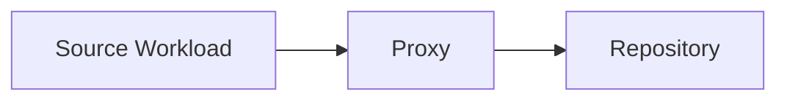

# Lesson 11 — Backup Proxies: Data Movement, Transport Modes and Performance Behavior

> **VMCE Objective(s):** Proxy role understanding, transport mode selection, performance interpretation  
> **Level:** Intermediate  
> **Estimated reading time:** 55–70 minutes  
> **Lab time:** 30 minutes

## Table of Contents

- [Learning Objectives](#learning-objectives)
- [Concepts and Theory](#concepts-and-theory)
- [What the Proxy Actually Does](#what-the-proxy-actually-does)
- [VMware Transport Modes](#vmware-transport-modes)
- [Why Transport Mode Matters](#why-transport-mode-matters)
- [Proxy Placement Strategy](#proxy-placement-strategy)
- [Proxy Sizing and Operational Expectations](#proxy-sizing-and-operational-expectations)
- [Hyper-V and Other Paths](#hyper-v-and-other-paths)
- [Concurrency and Task Slots](#concurrency-and-task-slots)
- [Common Proxy Problems](#common-proxy-problems)
- [Performance Reading Mindset](#performance-reading-mindset)
- [Common Proxy Design Mistakes](#common-proxy-design-mistakes)
- [Lab Walkthrough](#lab-walkthrough)
- [Key Takeaways](#key-takeaways)
- [Review Questions](#review-questions)

[Go to TOC](#table-of-contents)

## Learning Objectives

- explain what a backup proxy does in Veeam
- compare common VMware transport modes such as NBD, HotAdd, and Direct SAN
- understand how proxy placement affects performance and scalability
- recognize common proxy-related pitfalls before they appear in production

[Go to TOC](#table-of-contents)

## Concepts and Theory

The backup proxy is one of the most important and misunderstood roles in a Veeam environment. Many administrators assume the backup server itself “does the backup.” In reality, the proxy often performs the heavy lifting of reading source data and moving it toward the repository. When backup performance is poor, the proxy or transport path is frequently part of the explanation.

[Go to TOC](#table-of-contents)

## What the Proxy Actually Does

At a high level, the proxy:

- reads or receives data from the source workload
- processes that data as part of the backup pipeline
- passes the resulting stream to the repository

This makes the proxy a bridge between source and target. Because of that position, its CPU, RAM, network reachability, storage visibility, and transport mode all matter.

[Go to TOC](#table-of-contents)

## VMware Transport Modes

In VMware environments, you will commonly encounter three transport models:

### NBD

Network Block Device mode reads data over the network through the VMware management path. It is often the simplest option because it requires fewer special placement considerations. The downside is that performance can be limited compared with more direct data paths.

NBD is often acceptable in small environments or labs, but in larger production environments it may become a bottleneck if used unintentionally for many large jobs.

### HotAdd

HotAdd allows a virtual proxy VM to attach target VM disks and read them more directly. This can improve performance, but it requires careful proxy placement and operational understanding. It can also introduce its own complexities around datastore visibility and disk attachment behavior.

### Direct SAN

Direct SAN mode allows a proxy with direct storage visibility to read data from shared storage without traversing the production network path in the same way as NBD. This can be highly efficient in the right environment, but it depends on proper storage presentation and careful design.

[Go to TOC](#table-of-contents)

## Why Transport Mode Matters

A backup can still “work” when the wrong transport mode is used, but it may work badly. This is a common trap. An environment designed for HotAdd or Direct SAN may silently fall back to NBD when prerequisites are not met. Administrators then wonder why performance dropped even though jobs still complete.

The real lesson is that success status and efficiency are different concepts.

[Go to TOC](#table-of-contents)

## Proxy Placement Strategy

Proxy placement should reflect the environment:

- proximity to the data source
- network path to the repository
- expected concurrency
- storage access requirements
- role isolation and scalability goals

In a small all-in-one lab, the backup server may also act as the proxy. In larger environments, dedicated proxies are often the better design.

[Go to TOC](#table-of-contents)

## Proxy Sizing and Operational Expectations

Although exact sizing depends on workload mix and environment behavior, the administrator should always think of the proxy as a finite resource. CPU, RAM, network, and in some designs storage adjacency all influence how many tasks the proxy can sustain. It is therefore possible for a proxy to appear fine in a pilot and then become a major limitation as more jobs are added.

This is why proxy design should be reviewed whenever any of the following happen:

- backup windows become longer
- more large VMs are added
- repository targets change
- transport mode expectations change
- replication or copy activity overlaps with backup processing

[Go to TOC](#table-of-contents)

## Hyper-V and Other Paths

Hyper-V environments do not use VMware transport modes in the same way, but the architectural lesson remains the same: the component moving data matters. You should always ask which system reads the source, how it reaches the source, and what network or storage path it uses.

[Go to TOC](#table-of-contents)

## Concurrency and Task Slots

A proxy is not infinitely scalable. It can handle only a certain number of concurrent tasks effectively. If too many tasks are placed on a proxy with limited resources, jobs may slow, queue excessively, or become unpredictable. Understanding concurrency is part of responsible capacity planning.

[Go to TOC](#table-of-contents)

## Common Proxy Problems

- wrong transport mode due to fallback
- proxy VM placed where required datastores are not visible
- too few resources assigned to proxy systems
- network bottlenecks between proxy and repository
- overloaded all-in-one Veeam server trying to serve as management point, proxy, and repository simultaneously

[Go to TOC](#table-of-contents)

## Performance Reading Mindset

When performance is poor, ask:

1. Is the source read path efficient?
2. Is the proxy resource-constrained?
3. Is the network path saturated?
4. Is the repository writing slowly?
5. Has the job fallen back to a less efficient transport mode?

This line of questioning is more useful than immediately changing random settings.

[Go to TOC](#table-of-contents)

## Common Proxy Design Mistakes

- assuming the backup server can always remain the best proxy forever
- placing a virtual proxy where required storage visibility does not exist
- overlooking concurrency growth as new jobs are added
- assuming a single proxy is acceptable because one successful lab job completed quickly

In each case, the visible symptom often appears later as “backups are now slow” rather than “the proxy is wrong.”

[Go to TOC](#table-of-contents)

## Lab Walkthrough

### Prerequisites

- at least one functioning VM backup job
- visibility into proxy configuration in the Veeam console

### Steps

1. Open the backup infrastructure area and identify the proxy currently used in your lab.
2. Determine whether your environment uses an all-in-one proxy or a separate proxy.
3. For VMware learners, note which transport mode is expected and why.
4. For Hyper-V learners, document the likely data path between source host and repository.
5. Write one paragraph answering: “If this job became slow tomorrow, what would I check first and why?”

### Verification

You have completed the lab if you can explain the role of the proxy in your current environment and identify at least one likely bottleneck domain.

[Go to TOC](#table-of-contents)

## Key Takeaways

- The proxy is a core performance component in Veeam.
- VMware transport mode selection strongly affects efficiency.
- A successful backup can still be inefficient if the proxy path is wrong.
- Capacity planning must include concurrency and placement considerations.

[Go to TOC](#table-of-contents)

## Review Questions

1. What is the main job of a backup proxy?
2. Why is NBD often simpler but slower?
3. What is a common risk with HotAdd environments?
4. Why can an all-in-one deployment become a bottleneck?
5. What question should you ask first when backup performance suddenly drops?

---

### Answers

1. To read and move source data as part of the backup pipeline.
2. Because it uses the network path more generally and may not be as direct as other methods.
3. Datastore visibility or attachment issues can prevent expected transport behavior.
4. Because management, proxy, and repository load all compete for the same system resources.
5. Whether the source read path and proxy transport behavior are still what you expect.

[Go to TOC](#table-of-contents)
---

**License:** [CC BY-NC-SA 4.0](../LICENSE.md)
