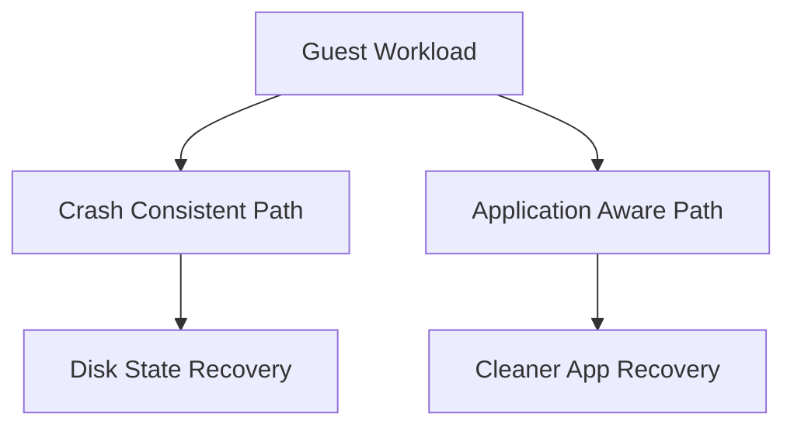

# Lesson 12 — Application-Aware Processing: Consistency, Guest Interaction and Transaction-Safe Recovery

> **VMCE Objective(s):** Application consistency, guest processing, transactional recovery readiness  
> **Level:** Intermediate  
> **Estimated reading time:** 55–70 minutes  
> **Lab time:** 35 minutes

## Table of Contents

- [Learning Objectives](#learning-objectives)
- [Concepts and Theory](#concepts-and-theory)
- [Crash-Consistent vs. Application-Consistent](#crash-consistent-vs-application-consistent)
- [How Veeam Interacts With the Guest](#how-veeam-interacts-with-the-guest)
- [Typical Workloads That Need Special Attention](#typical-workloads-that-need-special-attention)
- [Transaction Logs and Truncation](#transaction-logs-and-truncation)
- [Credentials and Security](#credentials-and-security)
- [Why This Matters for Restores](#why-this-matters-for-restores)
- [Practical Decision Framework](#practical-decision-framework)
- [No-Hypervisor Path Relevance](#no-hypervisor-path-relevance)
- [Common Failure Themes](#common-failure-themes)
- [Lab Walkthrough](#lab-walkthrough)
- [Key Takeaways](#key-takeaways)
- [Review Questions](#review-questions)

[Go to TOC](#table-of-contents)

## Learning Objectives

- explain the purpose of application-aware processing
- distinguish crash-consistent and application-consistent backups
- understand guest credentials and processing requirements
- identify common workloads that benefit from application-aware settings

[Go to TOC](#table-of-contents)

## Concepts and Theory

Backing up a running machine is not the same as backing up a quiet one. If an operating system and its applications are actively writing data when the backup is taken, the resulting restore point may be technically usable but operationally messy unless the workload is processed consistently. This is why application-aware processing matters.

[Go to TOC](#table-of-contents)

## Crash-Consistent vs. Application-Consistent

A **crash-consistent** backup is similar to pulling power from a machine and preserving its disk state at that moment. Many systems can recover from that state, especially simple services, stateless application tiers, or lightly changing workloads. But databases and transactional platforms may not recover cleanly or may require repair and replay operations.

An **application-consistent** backup attempts to coordinate with the guest operating system and supported applications so the backup reflects a cleaner transaction state. This is often important for SQL Server, Exchange, and other data-heavy application workloads.

The goal is not perfection for every application on every platform. The goal is materially better recovery behavior.

[Go to TOC](#table-of-contents)

## How Veeam Interacts With the Guest

Application-aware processing depends on communication into the guest operating system. That means:

- the guest must be reachable in the required way
- credentials must be valid
- relevant guest services or frameworks must function correctly
- VSS or equivalent mechanisms must work where required

This is why guest processing issues often involve more than the hypervisor. The backup platform may be functioning, yet guest-level consistency fails because the application writer, service, or credential path is broken.

[Go to TOC](#table-of-contents)

## Typical Workloads That Need Special Attention

Common examples include:

- Microsoft SQL Server
- Microsoft Exchange
- Active Directory domain controllers
- Oracle-backed application systems
- file servers or application servers with consistency-sensitive services

Not every workload requires full application-aware processing in the same way. But administrators should be able to identify which systems deserve more careful handling.

[Go to TOC](#table-of-contents)

## Transaction Logs and Truncation

For some workloads, application-aware backups also connect to transaction log handling. Done correctly, this can help keep application log growth under control and support point-in-time recovery models. Done incorrectly, or assumed without validation, it can create confusion or risk.

You should never enable log-handling options casually without understanding the application owner’s recovery expectations.

[Go to TOC](#table-of-contents)

## Credentials and Security

Application-aware processing usually requires guest credentials. This introduces security and operational questions:

- who owns those credentials?
- do they expire?
- are they scoped narrowly enough?
- can they reach all intended systems?

One of the most common causes of guest processing failure is stale or incorrect credentials. Another is assuming that administrator access to the hypervisor automatically grants guest processing access. It does not.

[Go to TOC](#table-of-contents)

## Why This Matters for Restores

Application-aware processing pays off during recovery. A backup that captures a database in a more consistent state is easier to restore and trust. That does not eliminate all restore testing requirements, but it improves the odds that your restore behaves as expected under stress.

[Go to TOC](#table-of-contents)

## Practical Decision Framework

When deciding whether application-aware processing should be enabled, ask:

- Does the workload host a transactional service?
- Would crash-consistent recovery create unacceptable repair time or uncertainty?
- Are reliable guest credentials available?
- Is the guest healthy enough to support the processing workflow?

If the answer to the first two questions is yes, the workload probably deserves close review for application-aware protection.

[Go to TOC](#table-of-contents)

## No-Hypervisor Path Relevance

In no-hypervisor and agent-based environments, consistency still matters. The mechanisms may differ, but the recovery principle remains: application data should be captured in a way that supports clean recovery.

[Go to TOC](#table-of-contents)

## Common Failure Themes

- bad guest credentials
- VSS writer failures inside Windows guests
- application writer issues
- firewall or connectivity problems to the guest
- misunderstanding what “successful backup” means when guest processing only partially succeeds

These failure themes are important because they train administrators not to stop reading the session details too early. A green or warning-marked job may still need operational attention if the protected workload is one where consistency matters.

This lesson is also an important precursor to troubleshooting, because many VSS and guest-processing failures are among the most common Veeam support scenarios.

[Go to TOC](#table-of-contents)

## Lab Walkthrough

### Prerequisites

- at least one Windows guest VM or physical Windows workload
- optional SQL or similar application workload for realism
- guest credentials available

### Steps

1. Choose one workload that should receive application-aware treatment.
2. Explain why crash-consistent protection alone may not be sufficient.
3. In your job or policy design notes, record which guest credentials would be used.
4. Identify one risk if those credentials expire.
5. If your lab allows, inspect the application-aware processing settings in a job configuration.

### Verification

You have completed the lab if you can clearly explain why a transactional workload benefits from application-aware processing and what dependencies that introduces.

[Go to TOC](#table-of-contents)

## Key Takeaways

- Crash-consistent and application-consistent backups are not the same.
- Transactional workloads often need guest-aware processing for reliable recovery.
- Guest credentials and internal guest health are part of backup success.

[Go to TOC](#table-of-contents)

## Review Questions

1. What is the main difference between crash-consistent and application-consistent backups?
2. Why are guest credentials important for application-aware processing?
3. Name two workloads that often benefit from application-aware backups.
4. Why can a backup still appear successful even if application consistency is imperfect?
5. How does this concept remain relevant in agent-based environments?

---

### Answers

1. Crash-consistent captures disk state only; application-consistent coordinates with the guest and supported applications for cleaner recovery.
2. Because Veeam needs guest-level access to perform processing and consistency operations.
3. SQL Server and Exchange, among others.
4. Because the data capture may complete even if guest-level processing produces warnings or limited consistency.
5. Because transactional consistency still matters regardless of whether the backup is image-based or agent-based.

[Go to TOC](#table-of-contents)

---

**License:** [CC BY-NC-SA 4.0](../LICENSE.md)
