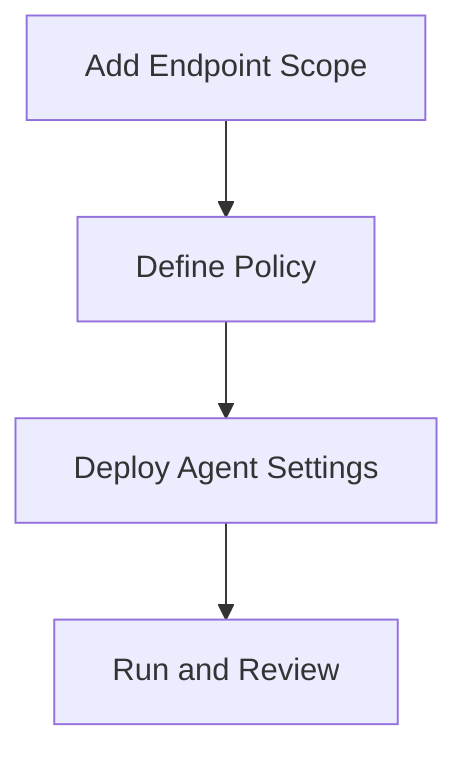

# Lesson 14 — Lab: Deploy an Agent Policy for Windows and Linux Workloads

> **VMCE Objective(s):** Practical agent onboarding and policy assignment  
> **Level:** Intermediate  
> **Estimated reading time:** 20–30 minutes  
> **Lab time:** 60–90 minutes

## Table of Contents

- [Learning Objectives](#learning-objectives)
- [Concepts and Theory](#concepts-and-theory)
- [Prerequisites](#prerequisites)
- [Lab Goal and Mindset](#lab-goal-and-mindset)
- [Step-by-Step Lab Walkthrough](#step-by-step-lab-walkthrough)
- [Common Issues to Watch For](#common-issues-to-watch-for)
- [Documentation Checklist for This Lab](#documentation-checklist-for-this-lab)
- [Operational Reflection](#operational-reflection)
- [Extended Practice](#extended-practice)
- [Verification Checklist](#verification-checklist)
- [Key Takeaways](#key-takeaways)
- [Review Questions](#review-questions)

[Go to TOC](#table-of-contents)

## Learning Objectives

- prepare Windows and Linux systems for agent-based protection
- define and apply a policy for agent-managed backups
- verify that the systems can be protected through the no-hypervisor path

[Go to TOC](#table-of-contents)

## Concepts and Theory

This lesson turns the no-hypervisor design ideas into a real managed workflow. The main point is to prove that Veeam can protect systems that are not being read through a hypervisor management API. Just as important, you will document the assumptions the policy makes about connectivity, credentials, and destination storage.

[Go to TOC](#table-of-contents)

## Prerequisites

- `VEEAM-SRV` operational
- one Windows target such as `PHYS-SRV01`
- one Linux target such as `LIN-WEB01`
- credentials prepared
- repository configured

[Go to TOC](#table-of-contents)

## Lab Goal and Mindset

This lab is designed to make the no-hypervisor path feel operationally normal rather than exceptional. Many environments are strongest on VM backup and weakest on physical or standalone systems. The goal here is to reduce that gap. By the end of the lab, you should be able to explain the policy, the deployment dependencies, the target repository path, and the likely first restore option for each protected endpoint.

[Go to TOC](#table-of-contents)

## Step-by-Step Lab Walkthrough

### Step 1 — Validate Endpoint Reachability

Confirm both systems are reachable, correctly named, and stable. Validate that administrative or elevated access works. If remote access is inconsistent now, policy assignment will not get easier later.

### Step 2 — Create a Protection Group or Equivalent Scope

In the Veeam console, identify the mechanism used to scope managed agents in your lab. Add `PHYS-SRV01` and `LIN-WEB01` as intended targets.

Think carefully about grouping. Even in a small lab, do not group systems together simply because they are available. Group them because the policy you are about to apply makes sense for both of them. This trains you to avoid messy policy sprawl in real environments.

### Step 3 — Define the Policy

Create a policy that includes:

- backup schedule
- destination repository or target
- retention settings
- any application-aware or volume selection choices relevant to the platform

Do not simply accept defaults. State why each choice makes sense for these systems.

For example, if the Windows system is a general-purpose business server and the Linux system is a web server, ask whether one schedule and one retention policy really makes sense for both. If the answer is yes, explain why. If the answer is no, note what a more mature production design would change.

### Step 4 — Assign and Deploy

Apply the policy to both endpoints. Watch for deployment or communication issues, especially on the Linux side where SSH and privilege behavior may matter more explicitly.

This stage is especially valuable because it teaches you that agent protection depends on endpoint realities. A hypervisor path can sometimes hide guest-level complexity. Agent-based protection makes local OS assumptions much more visible.

### Step 5 — Trigger or Observe First Protection Run

If possible, run the policy or wait for the first scheduled session. Review the outcome carefully. Record any warnings.

If the run succeeds for one endpoint but not the other, do not treat that as a simple “one host is broken” event. Instead, compare the differences systematically: operating system, credentials, repository reachability, privilege behavior, and local snapshot/consistency expectations. That comparison process is one of the most useful habits in mixed OS environments.

### Step 6 — Confirm Recovery Scope

For each endpoint, write down the most likely recovery action you would perform first in a real incident.

Include the reason for that choice. A Windows system might most often need file or volume restore. A Linux web server might be faster to rebuild partially and then recover configuration or content. Recovery planning should reflect operational reality, not just available product features.

### Step 7 — Compare the Two Endpoints

Write a short comparison of the Windows and Linux policy experience. Which platform was easier to onboard? Which one introduced more dependency checks? Which one would you want to test more aggressively before using in production? This reflection helps turn the lab into cross-platform operational understanding.

[Go to TOC](#table-of-contents)

## Common Issues to Watch For

- endpoint firewall blocks deployment or communication
- wrong credentials or privilege elevation problem
- Linux compatibility or package issue
- target repository not accessible as expected

[Go to TOC](#table-of-contents)

## Documentation Checklist for This Lab

Record the following:

- endpoint names and operating systems
- credentials used for policy deployment
- repository target
- schedule and retention choices
- result of first policy run
- first likely restore option for each endpoint
- one improvement you would make before scaling agent protection further

This small documentation habit mirrors the kind of operational record that becomes very useful in real environments.

[Go to TOC](#table-of-contents)

## Operational Reflection

A useful checkpoint after this lab is whether you now see agent-based protection as equivalent in seriousness to VM-based protection. If the answer is yes, the no-hypervisor path is becoming part of your normal backup thinking rather than an exception case.

[Go to TOC](#table-of-contents)

## Extended Practice

Try one follow-up exercise:

- design a second agent policy for a different class of system
- compare Windows and Linux restore priorities
- write a simple decision matrix for when to choose agent protection over hypervisor-based protection

These exercises help cement the policy-thinking side of the lesson.

[Go to TOC](#table-of-contents)

## Verification Checklist

- both endpoints visible in the managed scope
- policy assigned successfully
- at least one initial protection result reviewed
- recovery intent documented for each system

[Go to TOC](#table-of-contents)

## Key Takeaways

- Agent policies should be deliberate and role-aware.
- The no-hypervisor path still benefits from centralized control and disciplined validation.
- First-run verification matters just as much with agents as with VM jobs.

[Go to TOC](#table-of-contents)

## Review Questions

1. Why should you verify endpoint reachability before assigning an agent policy?
2. What is the value of using a protection group or managed scope?
3. Why should you document intended recovery action for each protected system?
4. What is one common Linux deployment obstacle?
5. Why is the first agent run important to watch closely?

---

### Answers

1. Because connectivity and authentication problems will otherwise cause avoidable deployment failure.
2. It supports central management and consistent policy application.
3. Because backup design should reflect recovery need, not just data capture.
4. SSH or privilege elevation problems.
5. Because it reveals whether the policy actually works in the real endpoint context.

[Go to TOC](#table-of-contents)

---

**License:** [CC BY-NC-SA 4.0](../LICENSE.md)
