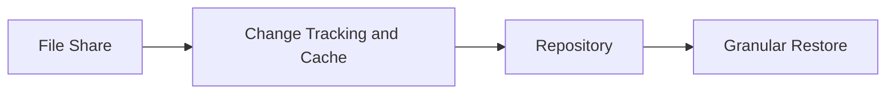

# Lesson 15 — NAS Backup: File Share Protection, Change Tracking and Recovery Expectations

> **VMCE Objective(s):** NAS protection, file-share-oriented backup strategy, restore concepts  
> **Level:** Intermediate  
> **Estimated reading time:** 45–60 minutes  
> **Lab time:** 30 minutes

## Table of Contents

- [Learning Objectives](#learning-objectives)
- [Concepts and Theory](#concepts-and-theory)
- [Why NAS Backup Is Different](#why-nas-backup-is-different)
- [Typical NAS Use Cases](#typical-nas-use-cases)
- [Cache Repository and Processing Considerations](#cache-repository-and-processing-considerations)
- [Recovery Expectations for NAS Data](#recovery-expectations-for-nas-data)
- [Operational Design Questions for NAS Protection](#operational-design-questions-for-nas-protection)
- [Security and Ransomware Considerations](#security-and-ransomware-considerations)
- [Relationship to No-Hypervisor Environments](#relationship-to-no-hypervisor-environments)
- [v12.x Notes](#v12x-notes)
- [Lab Walkthrough](#lab-walkthrough)
- [Key Takeaways](#key-takeaways)
- [Review Questions](#review-questions)

[Go to TOC](#table-of-contents)

## Learning Objectives

- explain how NAS backup differs from VM and agent backup
- understand why file share protection has its own architecture and workflow
- identify design concerns such as cache, indexing, and recovery speed
- recognize use cases for NAS backup in mixed IT environments

[Go to TOC](#table-of-contents)

## Concepts and Theory

NAS backup protects file shares rather than virtual disk images or directly managed endpoint volumes. This sounds simpler at first, but it introduces its own architecture and operational logic. Instead of focusing on VM snapshots or agent deployment, NAS protection focuses on discovering share contents, tracking changes, indexing, and storing recoverable versions efficiently.

NAS workloads matter because many organizations still depend heavily on shared file stores for departmental data, user home folders, collaboration shares, archives, engineering files, and application-generated content. These shares are often business-critical and heavily used.

[Go to TOC](#table-of-contents)

## Why NAS Backup Is Different

A VM backup captures the state of a virtual machine. An agent backup protects a machine from within or directly on the OS. NAS backup, by contrast, protects data exposed through the file share interface. That means:

- the protected object is the share and its contents
- file-level change tracking and indexing become more important
- cache and repository behavior matter differently than in image-based backups
- restore expectations are often more granular and user-facing

Administrators should not treat NAS backup as an afterthought. It serves a distinct recovery need.

[Go to TOC](#table-of-contents)

## Typical NAS Use Cases

- departmental file shares
- home directories
- application-export shares
- long-lived content repositories
- user collaboration or project spaces

In many environments, the volume of NAS data is large and the file count is even larger. This changes performance and indexing expectations considerably.

[Go to TOC](#table-of-contents)

## Cache Repository and Processing Considerations

Because NAS backup involves change tracking and file indexing logic, cache behavior becomes relevant. The cache repository supports the operational model that helps Veeam determine what changed between runs. Poor cache design or insufficient space can affect efficiency.

The key lesson is that NAS protection is not only about where the backup lands, but also how Veeam keeps track of the file-share state over time.

[Go to TOC](#table-of-contents)

## Recovery Expectations for NAS Data

Most NAS recoveries are granular. Users often need a deleted file, overwritten folder, or prior version restored. That means administrators should pay special attention to:

- browse and search usability
- retention depth for accidental deletion scenarios
- performance when restoring many small files
- share availability expectations after incident conditions

NAS backups may also play a role in larger disaster recovery situations if an entire file share or file server function is disrupted.

[Go to TOC](#table-of-contents)

## Operational Design Questions for NAS Protection

Before configuring NAS backup in a serious environment, ask:

- How many files and how much total data are involved?
- How often does content change?
- How often do users request deleted or previous-version recovery?
- What retention window is needed for accidental deletion versus corruption discovery?
- Does the organization need a second copy or immutable copy of file-share data?

NAS protection often becomes more demanding as file counts grow, even if total capacity seems manageable.

[Go to TOC](#table-of-contents)

## Security and Ransomware Considerations

Shared file environments are common ransomware targets because they contain broad user-accessible content. Protecting them effectively means:

- retaining sufficient history
- maintaining resilient backup copies
- considering immutable storage for at least one copy
- ensuring restore workflows are fast enough to respond to large-scale file corruption or encryption

[Go to TOC](#table-of-contents)

## Relationship to No-Hypervisor Environments

NAS backup is highly relevant in no-hypervisor and mixed environments. Even if you are not protecting many VMs, you may still have critical shared storage that needs dedicated protection.

[Go to TOC](#table-of-contents)

## v12.x Notes

Modern Veeam environments increasingly treat NAS as a first-class workload type. Administrators should be comfortable discussing file-share protection alongside VM and agent protection rather than seeing it as a niche edge case.

[Go to TOC](#table-of-contents)

## Lab Walkthrough

### Prerequisites

- access to a NAS share or file-share concept such as `NAS01`
- repository available

### Steps

1. Identify one file share in your environment that would require backup.
2. Document why VM-level protection alone might not be the best operational answer.
3. Define a retention expectation for accidental deletion recovery.
4. State where you would want the second copy of that data to live.
5. If your lab allows, inspect the NAS backup workflow area in the Veeam console.

### Verification

You have completed the lab if you can explain how NAS backup differs from VM backup and what kind of recovery users would expect from it.

[Go to TOC](#table-of-contents)

## Key Takeaways

- NAS backup protects shares and file content, not entire VM disk images.
- File count, indexing, and cache behavior are central to NAS design.
- Granular restore expectations make retention and usability especially important.

[Go to TOC](#table-of-contents)

## Review Questions

1. Why is NAS backup different from VM backup?
2. Why does cache design matter in NAS protection?
3. What type of restore is especially common in NAS scenarios?
4. Why are NAS shares attractive ransomware targets?
5. How can NAS backup still matter in a no-hypervisor environment?

---

### Answers

1. Because it protects file shares and their contents rather than VM images.
2. Because Veeam uses change tracking and operational state to process large file-share datasets efficiently.
3. Granular file or folder restore.
4. Because they centralize large amounts of user and departmental data.
5. Because file shares remain critical workloads even when virtual machine protection is limited.

[Go to TOC](#table-of-contents)
---

**License:** [CC BY-NC-SA 4.0](../LICENSE.md)
