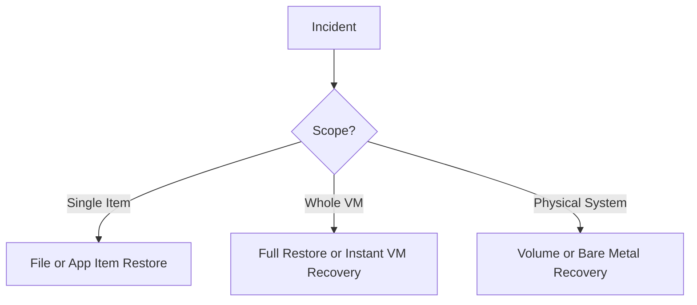

# Lesson 16 — Restore Options Overview: VM, File, Volume and Service Recovery

> **VMCE Objective(s):** Recovery method selection, restore workflow understanding, RTO-aware recovery planning  
> **Level:** Intermediate  
> **Estimated reading time:** 60–75 minutes  
> **Lab time:** 35 minutes

## Table of Contents

- [Learning Objectives](#learning-objectives)
- [Concepts and Theory](#concepts-and-theory)
- [Common Recovery Questions](#common-recovery-questions)
- [Full VM Restore](#full-vm-restore)
- [Instant VM Recovery](#instant-vm-recovery)
- [Guest File Restore](#guest-file-restore)
- [Application Item Restore](#application-item-restore)
- [Volume or Bare Metal Recovery](#volume-or-bare-metal-recovery)
- [Restore Speed vs. Restore Simplicity](#restore-speed-vs-restore-simplicity)
- [Recovery Decision Table](#recovery-decision-table)
- [Recovery Verification](#recovery-verification)
- [Security Considerations During Restore](#security-considerations-during-restore)
- [Recovery Planning Checklist](#recovery-planning-checklist)
- [Lab Walkthrough](#lab-walkthrough)
- [Key Takeaways](#key-takeaways)
- [Review Questions](#review-questions)

[Go to TOC](#table-of-contents)

## Learning Objectives

- compare major Veeam restore methods and when to use each one
- understand the difference between operational convenience and recovery completeness
- choose restore methods based on incident type and business pressure
- explain how restore planning differs across virtual and no-hypervisor workloads

[Go to TOC](#table-of-contents)

## Concepts and Theory

Backups exist for one reason: recovery. If administrators spend all their time optimizing backup jobs and none of their time understanding restore choices, the backup program is incomplete. Veeam offers many recovery methods, and that flexibility is one of its strengths. It is also one reason learners can feel overwhelmed. The solution is to organize restore methods by problem type.

[Go to TOC](#table-of-contents)

## Common Recovery Questions

When an incident occurs, ask:

- do I need one file or the whole system?
- do I need the system online immediately, or can I wait for a full restore?
- is the workload virtual, physical, or NAS-based?
- do I need application items rather than raw files?
- is the target location the original system or a new one?

The right restore method becomes clearer once these questions are answered.

[Go to TOC](#table-of-contents)

## Full VM Restore

A full VM restore is appropriate when you want to restore an entire virtual machine back to production or an alternate location. It is conceptually simple but may require more time and target capacity than faster, more surgical methods.

This method is useful when the whole VM must be reconstructed, the original is lost or corrupted beyond practical repair, or alternate faster methods are not appropriate.

[Go to TOC](#table-of-contents)

## Instant VM Recovery

Instant VM Recovery is designed to restore service quickly by mounting and running the VM directly from backup storage while a more permanent move back to production is prepared. This is a classic example of balancing RTO and long-term restoration completeness.

The reason Instant VM Recovery is so powerful is not that it is always the final answer. It is powerful because it gets the service back faster while buying time for a cleaner final placement.

[Go to TOC](#table-of-contents)

## Guest File Restore

Many incidents are small. A user deletes a folder, overwrites a report, or needs a single configuration file. Guest file restore is ideal here because it avoids the disruption of restoring the whole machine. Administrators should become very comfortable with this path because it is often the most common real-world recovery request.

[Go to TOC](#table-of-contents)

## Application Item Restore

Sometimes what is needed is not the VM, and not just a raw file, but an application object such as a database item, directory object, message, or record. This is where Veeam’s application explorer tools become important. Lesson 18 covers these in more detail, but the core recovery principle belongs here: recover at the narrowest scope that solves the incident.

[Go to TOC](#table-of-contents)

## Volume or Bare Metal Recovery

For physical or no-hypervisor systems, recovery needs often involve entire volume sets, operating system recovery, or bare metal rebuild scenarios. This can be more operationally demanding than virtual recovery because hardware compatibility, boot media, and drivers become part of the story.

The broader lesson is that no-hypervisor recovery is often less forgiving than VM recovery. Planning matters more, not less.

[Go to TOC](#table-of-contents)

## Restore Speed vs. Restore Simplicity

Not every recovery method optimizes the same goal. Some methods optimize speed, others completeness, others granularity. A skilled administrator chooses based on the incident rather than blindly preferring the most dramatic option.

For example:

- a deleted spreadsheet should not trigger a full VM restore
- a business-critical failed application server may justify Instant VM Recovery
- a corrupted physical server may require full machine or volume-oriented recovery planning

[Go to TOC](#table-of-contents)

## Recovery Decision Table

| Incident type | Likely best first action |
|---|---|
| Single deleted document | Guest file restore |
| Missing AD object | Application item recovery |
| Failed business VM with tight RTO | Instant VM Recovery |
| Total VM corruption with time available | Full VM restore |
| Physical server boot failure | Volume or bare-metal-oriented recovery |

This table is intentionally simple, but it reinforces an essential recovery lesson: match the method to the incident, not to whatever feature you are most excited to use.

[Go to TOC](#table-of-contents)

## Recovery Verification

The existence of a restore method is not proof that it will succeed under pressure. Recovery planning should include:

- target capacity and placement awareness
- network mapping awareness
- credential readiness for guest-level operations
- familiarity with the restore wizard paths
- regular testing of representative recovery cases

[Go to TOC](#table-of-contents)

## Security Considerations During Restore

Modern recovery also requires cyber awareness. If compromise is suspected, administrators should consider whether the restore point is likely clean, whether malware scanning or validation should occur, and whether the recovered system should be isolated first.

This becomes especially important in ransomware scenarios where restoring the wrong point too quickly can recreate the problem.

[Go to TOC](#table-of-contents)

## Recovery Planning Checklist

- Do we know the cleanest likely restore point?
- Do we know the target location?
- Do we know whether the recovery is temporary or final?
- Do we know who validates the application after restore?
- Do we know what to do if the first recovery attempt is incomplete?

These questions reduce confusion during high-pressure incidents.

[Go to TOC](#table-of-contents)

## Lab Walkthrough

### Prerequisites

- at least one restore point created from earlier lessons
- optional agent-protected system or NAS share concept

### Steps

1. List three incident types: deleted file, failed VM, corrupted physical server.
2. For each incident, choose the best Veeam restore method and explain why.
3. Define one case where Instant VM Recovery is the best answer.
4. Define one case where it is not.
5. For a physical server, write what additional information you would need before attempting full recovery.

### Verification

You have completed the lab if you can match the recovery method to the incident instead of treating every incident as a full restore problem.

[Go to TOC](#table-of-contents)

## Key Takeaways

- Restore method selection should match the scope and urgency of the incident.
- Instant VM Recovery optimizes service restoration speed, not necessarily final placement.
- Guest file and item-level restores often solve common problems faster and more safely.
- No-hypervisor recovery requires additional planning around boot and hardware assumptions.

[Go to TOC](#table-of-contents)

## Review Questions

1. When is a full VM restore appropriate?
2. What makes Instant VM Recovery valuable?
3. Why should administrators prefer narrow-scope recovery when possible?
4. Why is physical recovery often more demanding than virtual recovery?
5. What additional concern applies to recovery in suspected malware incidents?

---

### Answers

1. When the entire VM must be restored or reconstructed.
2. It can restore service quickly by running the VM from backup storage while permanent recovery is completed later.
3. Because it minimizes disruption and targets only what is actually missing or damaged.
4. Because hardware, boot media, and driver compatibility can all affect the outcome.
5. You must consider whether the restore point is clean and whether validation or isolation is needed before returning it to production.

[Go to TOC](#table-of-contents)
---

**License:** [CC BY-NC-SA 4.0](../LICENSE.md)
