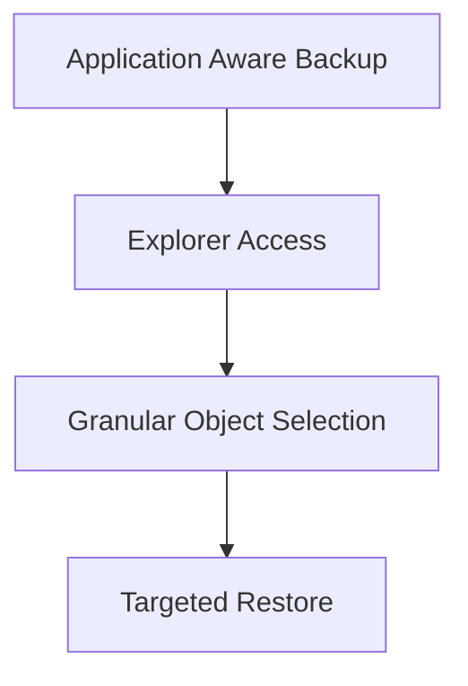

# Lesson 18 — Veeam Explorers and Application Item Recovery

> **VMCE Objective(s):** Granular recovery, explorer-based restore workflows, application-aware restore scope  
> **Level:** Intermediate  
> **Estimated reading time:** 50–65 minutes  
> **Lab time:** 30 minutes

## Table of Contents

- [Learning Objectives](#learning-objectives)
- [Concepts and Theory](#concepts-and-theory)
- [Why Item-Level Application Recovery Matters](#why-item-level-application-recovery-matters)
- [Relationship to Application-Aware Processing](#relationship-to-application-aware-processing)
- [Common Explorer Use Cases](#common-explorer-use-cases)
- [Operational Benefits](#operational-benefits)
- [Decision Framework](#decision-framework)
- [Risks and Cautions](#risks-and-cautions)
- [No-Hypervisor Relevance](#no-hypervisor-relevance)
- [Lab Walkthrough](#lab-walkthrough)
- [Key Takeaways](#key-takeaways)
- [Review Questions](#review-questions)

[Go to TOC](#table-of-contents)

## Learning Objectives

- understand the purpose of Veeam Explorer-based application item recovery
- identify scenarios where item-level restore is better than full system restore
- explain how application-aware backups support granular application recovery
- recognize common operational use cases for AD, Exchange, SQL, and similar recoveries

[Go to TOC](#table-of-contents)

## Concepts and Theory

One of the strongest operational benefits of Veeam is the ability to recover not just systems, but meaningful objects inside systems. This is where Veeam Explorers shine. Rather than restoring an entire VM because one Active Directory object or SQL database item is needed, the administrator can work at the application object level.

This aligns with a core recovery principle: restore only as much as necessary to solve the problem.

[Go to TOC](#table-of-contents)

## Why Item-Level Application Recovery Matters

In real environments, failures are often granular:

- an AD object is deleted or modified incorrectly
- an Exchange item needs recovery
- a SQL database needs point-in-time or object-focused help
- a SharePoint or similar application object is missing or damaged

Restoring the whole server for such incidents would often be excessive, disruptive, and risky. Granular recovery improves operational speed and reduces collateral impact.

[Go to TOC](#table-of-contents)

## Relationship to Application-Aware Processing

Application item recovery usually depends on having captured the workload in a way that supports meaningful introspection and consistency. That is why Lesson 12 matters so much. If the backup was not taken with the right level of guest and application awareness, the resulting restore flexibility may be reduced.

[Go to TOC](#table-of-contents)

## Common Explorer Use Cases

### Active Directory

Administrators may need to recover accidentally deleted users, groups, OUs, or attributes. Domain controllers are especially sensitive systems, so granular recovery can be much safer than broad rollback.

### Exchange

Mailbox- or item-level recovery allows targeted restoration of messages or related data without restoring the entire mail server environment.

### SQL Server

Database-oriented recovery is one of the most common reasons application-aware backup settings are taken seriously. Administrators often need precise recovery options rather than all-or-nothing server rollback.

### Other Supported Application Contexts

Depending on the workload and integration path, other application-level recovery options may also exist. The exact toolset and platform support can evolve across releases, so always validate the current product capabilities for your environment.

[Go to TOC](#table-of-contents)

## Operational Benefits

- faster targeted recovery
- less disruption to healthy data or services
- more confidence in meeting application owner expectations
- better alignment between backup design and business support outcomes

[Go to TOC](#table-of-contents)

## Decision Framework

Before restoring an application item, ask:

- Is the problem isolated enough for granular recovery?
- Is the original application still healthy apart from the missing item?
- Do we need to restore in place or to an alternate location for review?
- Who should validate the recovered object?

These questions help avoid turning a focused recovery request into a broader operational incident.

[Go to TOC](#table-of-contents)

## Risks and Cautions

Granular restore is powerful, but administrators should still be cautious about:

- restoring into the wrong context
- overwriting valid current state unintentionally
- assuming application data is healthy without validation
- misunderstanding whether the restore should go to the original location or an alternate target

[Go to TOC](#table-of-contents)

## No-Hypervisor Relevance

Application item thinking also matters in environments where agents protect the workload. The important idea is not just how the backup is captured, but whether recovery can be performed at the right scope.

[Go to TOC](#table-of-contents)

## Lab Walkthrough

### Prerequisites

- at least one application-aware backup or conceptual workload
- optional domain controller or SQL workload in lab

### Steps

1. Choose one application workload such as AD or SQL.
2. Define a realistic recovery incident at the item level.
3. Explain why full machine restore would be a poor first response.
4. Identify what preconditions are necessary for successful item recovery.
5. If your lab allows, inspect the relevant explorer or restore menu paths.

### Verification

You have completed the lab if you can explain when application item recovery is the best operational choice and what earlier backup design choices enable it.

[Go to TOC](#table-of-contents)

## Key Takeaways

- Granular application recovery is often safer and faster than full system rollback.
- Application-aware backup design improves restore flexibility.
- Item-level restore should still be planned and validated carefully.

[Go to TOC](#table-of-contents)

## Review Questions

1. Why is application item restore often preferable to full VM restore?
2. How does application-aware processing support this kind of recovery?
3. Name two workloads where granular recovery is especially valuable.
4. What is one risk of careless item-level restoration?
5. Why does this lesson still matter in mixed or no-hypervisor environments?

---

### Answers

1. Because it solves narrow incidents with less disruption and faster turnaround.
2. It helps capture the workload in a state that supports meaningful object-level recovery.
3. Active Directory and SQL Server.
4. Overwriting valid current data or restoring into the wrong context.
5. Because the recovery scope problem exists regardless of the source protection method.

[Go to TOC](#table-of-contents)
---

**License:** [CC BY-NC-SA 4.0](../LICENSE.md)
