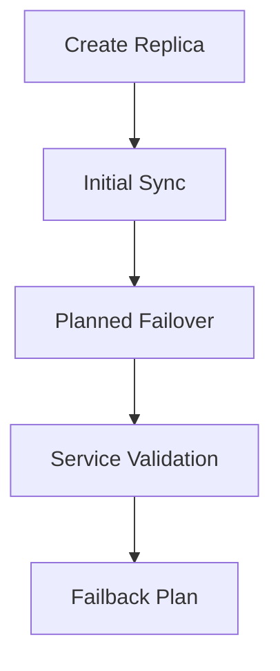

# Lesson 20 — Lab: Configure Replication and Perform a Planned Failover

> **VMCE Objective(s):** Practical replication workflow and planned failover reasoning  
> **Level:** Advanced  
> **Estimated reading time:** 20–30 minutes  
> **Lab time:** 60–90 minutes

## Table of Contents

- [Learning Objectives](#learning-objectives)
- [Concepts and Theory](#concepts-and-theory)
- [Prerequisites](#prerequisites)
- [Lab Goal and Success Standard](#lab-goal-and-success-standard)
- [Step-by-Step Lab Walkthrough](#step-by-step-lab-walkthrough)
- [Validation Checklist for Planned Failover](#validation-checklist-for-planned-failover)
- [Common Lab Failure Points](#common-lab-failure-points)
- [Lab Note Checklist](#lab-note-checklist)
- [Extended Practice](#extended-practice)
- [Operational Reflection](#operational-reflection)
- [Verification Checklist](#verification-checklist)
- [Key Takeaways](#key-takeaways)
- [Review Questions](#review-questions)

[Go to TOC](#table-of-contents)

## Learning Objectives

- configure a replication job for a test VM
- understand target mapping considerations
- perform or simulate a planned failover workflow

[Go to TOC](#table-of-contents)

## Concepts and Theory

This lab focuses on the operational flow of preparing a replica and thinking through a controlled failover. The purpose is not merely to produce a second VM copy, but to understand what assumptions must hold true for failover to work under pressure.

[Go to TOC](#table-of-contents)

## Prerequisites

- source VM available
- target host or site available
- clear network and storage mapping assumptions

[Go to TOC](#table-of-contents)

## Lab Goal and Success Standard

The goal of this lab is to move from the abstract idea of “we have a replica” to the more useful statement “we understand how failover would work and what it would take to validate it.” A replica is only meaningful if the team knows where it will run, how it will connect, who will validate the recovered service, and how the environment returns to a stable state afterward.

[Go to TOC](#table-of-contents)

## Step-by-Step Lab Walkthrough

1. Choose a test workload suitable for replication.
2. Create a replication job and identify the target infrastructure.
3. Review network and storage mapping choices carefully.
4. Run the initial replication cycle.
5. Document what would happen in a planned failover.
6. If the lab supports it, execute a controlled failover and validate service startup.
7. Write the steps you would take for failback.

As you work through the steps, note which parts are technical configuration and which parts are operational assumptions. Technical configuration includes target host, mapping, and synchronization behavior. Operational assumptions include who approves failover, who validates the application, and how long the replica might remain in service before failback.

[Go to TOC](#table-of-contents)

## Validation Checklist for Planned Failover

During or after the exercise, verify:

- the replica is up to date enough for the intended scenario
- host and datastore mappings match the design notes
- network placement is correct for the failover site or test segment
- administrative login works as expected
- the application owner or tester can confirm basic service availability

Even in a small lab, practicing this validation mindset is important. It helps you avoid the common trap of assuming that a powered-on VM is the same thing as a recovered service.

[Go to TOC](#table-of-contents)

## Common Lab Failure Points

- target network mapping is forgotten or incorrect
- replica target lacks enough space or compute headroom
- production assumptions are accidentally carried into the DR side without verification
- failback is not documented, leaving the exercise incomplete

[Go to TOC](#table-of-contents)

## Lab Note Checklist

Record the following:

- source workload selected
- target host or site used
- storage and network mapping assumptions
- whether planned failover was simulated or actually performed
- how service validation was done
- what failback steps were identified

These notes turn the lab into a reusable DR playbook fragment rather than a one-time exercise.

[Go to TOC](#table-of-contents)

## Extended Practice

To deepen this lab, try one of these:

- choose a different workload and explain whether it truly deserves replication
- compare replication versus backup-plus-copy for a medium-priority service
- write a one-page planned failover runbook based on your test

[Go to TOC](#table-of-contents)

## Operational Reflection

The value of this lab is not simply that a replica exists. The real value is understanding whether that replica can be turned into a usable service during a controlled event and how the environment returns to a stable operating state afterward.

[Go to TOC](#table-of-contents)

## Verification Checklist

- replication job exists
- target mapping decisions documented
- failover flow understood or tested

[Go to TOC](#table-of-contents)

## Key Takeaways

- Replication without validated mapping is incomplete.
- Planned failover testing builds confidence before a real incident.
- Failback thinking should be documented during the same exercise.

[Go to TOC](#table-of-contents)

## Review Questions

1. What must be validated before a replica is considered useful?
2. Why is network mapping important in failover?
3. What should you document after a planned failover test?
4. Why is a test VM preferable for labs?
5. Why is failback part of the same exercise?

---

### Answers

1. Target readiness, mapping, replica status, and expected service behavior.
2. Because the recovered VM may need different network identity or connectivity at the target site.
3. Service behavior, mapping assumptions, gaps, and the failback path.
4. Because replication testing changes VM state and should not endanger production.
5. Because a complete DR workflow includes returning or stabilizing the workload after failover.

[Go to TOC](#table-of-contents)

---

**License:** [CC BY-NC-SA 4.0](../LICENSE.md)
