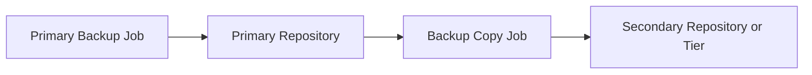

# Lesson 21 — Backup Copy Jobs: Secondary Protection, GFS and Retention Strategy

> **VMCE Objective(s):** Secondary copy strategy, long-term retention, resilience through copy separation  
> **Level:** Intermediate/Advanced  
> **Estimated reading time:** 50–65 minutes  
> **Lab time:** 30 minutes

## Table of Contents

- [Learning Objectives](#learning-objectives)
- [Concepts and Theory](#concepts-and-theory)
- [Why Backup Copy Matters](#why-backup-copy-matters)
- [Backup Copy vs. Primary Backup Job](#backup-copy-vs-primary-backup-job)
- [GFS Retention Thinking](#gfs-retention-thinking)
- [Security and Copy Separation](#security-and-copy-separation)
- [Operational Copy Strategy Questions](#operational-copy-strategy-questions)
- [No-Hypervisor Relevance](#no-hypervisor-relevance)
- [Immediate and Periodic Copy Thinking](#immediate-and-periodic-copy-thinking)
- [GFS in Real Retention Conversations](#gfs-in-real-retention-conversations)
- [Copy Design Review Questions](#copy-design-review-questions)
- [Key Takeaways](#key-takeaways)
- [Review Questions](#review-questions)

[Go to TOC](#table-of-contents)

## Learning Objectives

- explain why backup copy jobs are essential in resilient Veeam design
- distinguish source backups from copied backups
- understand GFS-style long-term retention concepts
- design backup copy strategy for operational and cyber resilience

[Go to TOC](#table-of-contents)

## Concepts and Theory

One of the biggest differences between a basic backup setup and a resilient backup design is whether there is a truly separate additional copy. Backup copy jobs exist because one copy is not enough. If the primary repository fails, is encrypted, or is administratively damaged, the environment needs another trustworthy copy.

[Go to TOC](#table-of-contents)

## Why Backup Copy Matters

Backup copy jobs support:

- off-site or alternate-site resilience
- longer-term retention models
- separation from the primary landing zone
- greater recovery confidence in ransomware or repository failure scenarios

Many organizations incorrectly assume their primary backup repository is sufficient because it is large and reliable. That belief usually survives only until the first serious incident.

[Go to TOC](#table-of-contents)

## Backup Copy vs. Primary Backup Job

The primary backup job creates the first restore points. A backup copy job takes already-created backup data and produces an additional protected copy according to its own policy. This means the copy strategy can differ from the source job strategy.

That flexibility is valuable. For example, you may want short, performance-focused retention locally but much longer retention on a secondary copy target.

[Go to TOC](#table-of-contents)

## GFS Retention Thinking

Grandfather-Father-Son (GFS) retention is a familiar pattern for keeping weekly, monthly, and yearly points without retaining every short-interval restore point forever. Administrators should understand GFS not as a legacy concept, but as a practical way to express layered retention.

The key is to match GFS design to actual business requirements. Retaining points “because we can” often leads to complexity and cost without clear benefit.

[Go to TOC](#table-of-contents)

## Security and Copy Separation

For security, the second copy should ideally differ from the primary in meaningful ways:

- different storage system
- different trust boundary
- different site or failure domain
- ideally immutable or otherwise harder to alter

This is where backup copy jobs fit directly into ransomware resilience.

[Go to TOC](#table-of-contents)

## Operational Copy Strategy Questions

Backup copy jobs are most useful when administrators can answer these questions clearly:

- Is the second copy in a different fault domain?
- Does it have a different risk profile from the first copy?
- Does its retention fit the business need rather than merely mirroring the primary?
- Can we restore from it within an acceptable timeframe if the first copy is unavailable?

If the answer to these questions is vague, the copy design may exist on paper while still being weak in practice.

[Go to TOC](#table-of-contents)

## No-Hypervisor Relevance

Copy jobs matter just as much for agent-protected systems and NAS data as for VMs. The workload source changes, but the resilience logic does not.

[Go to TOC](#table-of-contents)

## Immediate and Periodic Copy Thinking

One useful way to understand backup copy design is to separate the concept of *how fast the second copy should appear* from *how long that second copy should be retained*. Some environments want the secondary copy updated as soon as practical after the primary backup finishes. Others are comfortable with a more periodic rhythm because bandwidth, target cost, or organizational constraints make constant copy movement less attractive.

This distinction matters because copy strategy is not purely about “more copies.” It is about the timing, quality, and survivability of those copies. If the source repository is compromised before the secondary copy is current enough, the theoretical protection may not be as strong as the team assumed.

[Go to TOC](#table-of-contents)

## GFS in Real Retention Conversations

GFS becomes more useful when you translate it out of backup jargon and back into business language. Weekly points help with short- to medium-term rollback needs. Monthly points help with reporting cycles, compliance checkpoints, or late-discovered changes. Yearly points help where records must remain available beyond normal operational history. The real value of GFS is that it offers a structured retention vocabulary rather than forcing administrators to keep everything forever or delete too aggressively.

[Go to TOC](#table-of-contents)

## Copy Design Review Questions

- If the primary repository were unavailable today, what restore history would still exist?
- Is the copy target in a different administrative and technical fault domain?
- Are copy jobs monitored as seriously as primary backup jobs?
- Is the retention on the copy target intentionally different where needed?
- Has the team ever restored from the secondary copy rather than only from the primary?

[Go to TOC](#table-of-contents)

## Key Takeaways

- Backup copy jobs are essential for multi-copy resilience.
- GFS retention helps express layered long-term retention policy.
- The second copy should differ meaningfully from the first copy’s risk profile.

[Go to TOC](#table-of-contents)

## Review Questions

1. Why is one backup copy not enough?
2. What is the purpose of a backup copy job?
3. Why is GFS useful?
4. What makes a secondary copy meaningfully resilient?
5. Why do agent-based workloads still benefit from backup copy jobs?

---

### Answers

1. Because a single repository can fail, be compromised, or become unavailable.
2. To create an additional backup copy with its own storage and retention logic.
3. It provides structured weekly, monthly, and yearly retention without keeping all short-interval points forever.
4. Different storage, trust boundaries, fault domains, or immutability.
5. Because recovery resilience depends on copy separation, not on workload type.

[Go to TOC](#table-of-contents)
---

**License:** [CC BY-NC-SA 4.0](../LICENSE.md)
