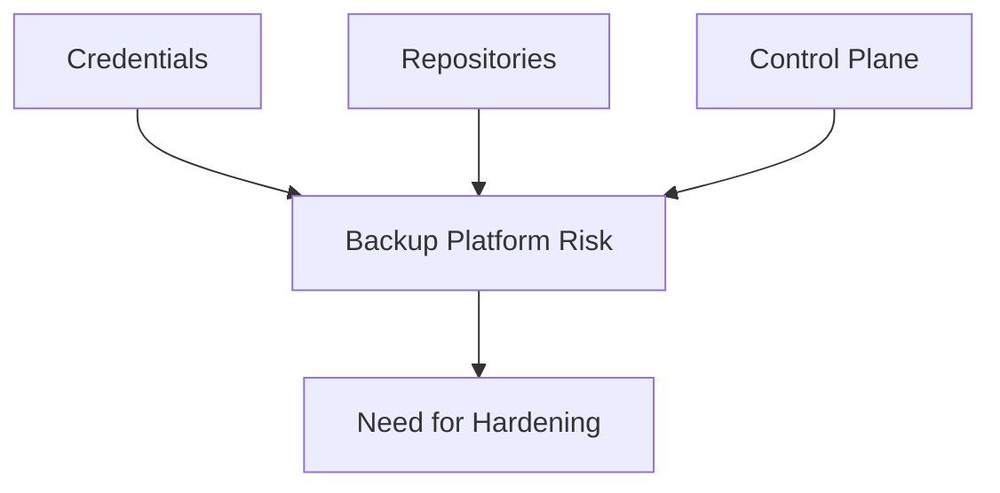

# Lesson 24 — Security Hardening: Immutability, Least Privilege and Cyber-Resilient Backup Operations

> **VMCE Objective(s):** Backup security, ransomware-aware design, operational hardening  
> **Level:** Advanced  
> **Estimated reading time:** 60–80 minutes  
> **Lab time:** 35 minutes

## Table of Contents

- [Learning Objectives](#learning-objectives)
- [Concepts and Theory](#concepts-and-theory)
- [Why Backup Infrastructure Is Targeted](#why-backup-infrastructure-is-targeted)
- [Core Hardening Principles](#core-hardening-principles)
- [Why Security Hardening Often Fails in Practice](#why-security-hardening-often-fails-in-practice)
- [Operational Hardening Habits](#operational-hardening-habits)
- [Security Review Checklist](#security-review-checklist)
- [Threat Modeling the Backup Platform](#threat-modeling-the-backup-platform)
- [Hardening by Layer](#hardening-by-layer)
- [Signs of a Weakly Hardened Environment](#signs-of-a-weakly-hardened-environment)
- [Security-Focused Lab Extension](#security-focused-lab-extension)
- [v12.x Security Direction](#v12x-security-direction)
- [Key Takeaways](#key-takeaways)
- [Review Questions](#review-questions)

[Go to TOC](#table-of-contents)

## Learning Objectives

- identify the most important hardening measures for a Veeam environment
- explain why backup infrastructure is a high-value target
- apply least-privilege and multi-copy security thinking to backup design
- connect immutability, credential hygiene, and operational discipline to cyber resilience

[Go to TOC](#table-of-contents)

## Concepts and Theory

A backup platform is valuable because it holds the path to recovery. That also makes it a target. Attackers who compromise the backup infrastructure can turn a recoverable event into a crisis. This is why modern Veeam administration must include security hardening as a core discipline, not an optional enhancement.

[Go to TOC](#table-of-contents)

## Why Backup Infrastructure Is Targeted

Backup systems contain:

- visibility into many workloads
- credentials or credentialed trust relationships
- concentrated restore data
- operational authority over protection policies

Compromising that combination can give an attacker leverage over the organization’s ability to recover.

[Go to TOC](#table-of-contents)

## Core Hardening Principles

### Least Privilege

Use only the permissions required for each task. Avoid universal administrative accounts. Separate roles where practical.

### Immutability

At least one backup copy should be difficult to alter or delete during its retention window.

### Credential Hygiene

Document account purpose, rotate credentials, avoid credential reuse, and monitor failures.

### Isolation and Separation

Do not place all trust, storage, and control in one easily compromised domain.

### Recovery Validation

Backups should not only exist; they should be recoverable and, where appropriate, assessed as clean.

[Go to TOC](#table-of-contents)

## Why Security Hardening Often Fails in Practice

Hardening efforts often fail not because the ideas are wrong, but because they are treated as one-time setup tasks rather than ongoing operating habits. An organization may create one immutable repository and feel safe, while still leaving over-privileged credentials in place, failing to review restore readiness, or allowing too many people to make job and repository changes. In other words, a single strong control is not enough if the rest of the environment remains casually administered.

Another common failure pattern is assuming the backup team alone owns security. In reality, hardening often depends on cooperation between infrastructure, identity, storage, and security teams. If those teams are not aligned, the backup environment may inherit weak practices from the wider environment.

[Go to TOC](#table-of-contents)

## Operational Hardening Habits

- restrict who can modify jobs and repositories
- review configuration backup strategy
- monitor warnings and failed sessions promptly
- protect the backup server itself with the same seriousness as other critical infrastructure
- document recovery authority and emergency procedures

[Go to TOC](#table-of-contents)

## Security Review Checklist

- Are any credentials over-privileged or reused too broadly?
- Is at least one important copy immutable or otherwise strongly protected?
- Are repository hosts operated with the same care as other critical systems?
- Can backup changes be tracked to authorized administrators?
- Is restore validation part of the organization’s incident readiness?

Security hardening is strongest when it is routine rather than reactive.

[Go to TOC](#table-of-contents)

## Threat Modeling the Backup Platform

One of the simplest and most useful security exercises is to ask how an attacker would try to weaken your ability to recover. Common answers include:

- stealing or abusing privileged credentials
- deleting or encrypting primary repositories
- disabling jobs or changing retention
- compromising the backup server and its trust relationships
- waiting for backup history to age out before revealing corruption or exfiltration

When you think this way, hardening decisions become easier to justify. Immutability matters because attackers target backup history. Least privilege matters because trust relationships can be abused. Configuration backup matters because rebuilding the management plane is part of recovery too.

[Go to TOC](#table-of-contents)

## Hardening by Layer

| Layer | Hardening focus |
|---|---|
| Backup server | patching, restricted admin access, service integrity |
| Credentials | least privilege, rotation, ownership clarity |
| Repository | immutability, isolation, controlled access |
| Operations | change review, monitoring, tested recovery |
| Recovery workflow | validation, clean-point awareness, incident discipline |

This layered view helps teams move beyond the vague idea of “secure the backups” into a more actionable model.

[Go to TOC](#table-of-contents)

## Signs of a Weakly Hardened Environment

- one credential is used broadly across unrelated workflows
- repository access is not clearly separated from routine administration
- no one can quickly answer where the immutable copy is
- configuration backups exist but are not reviewed or tested
- the team assumes restore will work but has not validated it recently

These are not merely theoretical warning signs. They are common real-world weaknesses that turn manageable incidents into major outages.

[Go to TOC](#table-of-contents)

## Security-Focused Lab Extension

As an extension to this lesson, write a short hardening plan for your own lab. Include:

- which accounts you would reduce or separate
- which repository would become the immutable copy
- which administrative actions should be restricted to a smaller group
- how you would prove that the environment can still restore after those controls are applied

[Go to TOC](#table-of-contents)

## v12.x Security Direction

The v12 generation increased the visibility and importance of cyber resilience features, immutable design, and malware-aware operational thinking. Administrators should treat these not as marketing extras, but as practical resilience tools.

[Go to TOC](#table-of-contents)

## Key Takeaways

- Backup infrastructure is a strategic security asset.
- Hardening requires technical controls and operational discipline.
- Immutability, least privilege, and copy separation are central to resilient design.

[Go to TOC](#table-of-contents)

## Review Questions

1. Why are backup systems attractive targets?
2. What does least privilege mean in a Veeam environment?
3. Why is immutability important?
4. Why should the Veeam server itself be treated as critical infrastructure?
5. What role does recovery validation play in security?

---

### Answers

1. Because they hold recovery data, credentials, and operational control.
2. Using only the permissions required for each Veeam trust relationship or administrative task.
3. It helps prevent backup data from being altered or deleted during the protected period.
4. Because its compromise can disrupt backup operations and recovery capability broadly.
5. It confirms that recoverable data actually exists and may support clean-point selection after compromise.

[Go to TOC](#table-of-contents)
---

**License:** [CC BY-NC-SA 4.0](../LICENSE.md)
