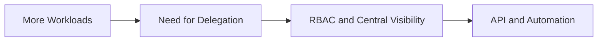

# Lesson 25 — Enterprise Scale: Enterprise Manager, RBAC, REST API and Automation Concepts

> **VMCE Objective(s):** Enterprise operations, delegation, API awareness, automation mindset  
> **Level:** Advanced  
> **Estimated reading time:** 50–65 minutes  
> **Lab time:** 25 minutes

## Table of Contents

- [Learning Objectives](#learning-objectives)
- [Concepts and Theory](#concepts-and-theory)
- [Why Scale Changes Administration](#why-scale-changes-administration)
- [RBAC Thinking](#rbac-thinking)
- [API and Automation](#api-and-automation)
- [Enterprise Visibility and Consistency](#enterprise-visibility-and-consistency)
- [Enterprise Operations Mindset](#enterprise-operations-mindset)
- [What Should Be Standardized](#what-should-be-standardized)
- [Automation Candidates](#automation-candidates)
- [Maturity Model Thinking](#maturity-model-thinking)
- [Key Takeaways](#key-takeaways)
- [Review Questions](#review-questions)

[Go to TOC](#table-of-contents)

## Learning Objectives

- understand why enterprise-scale Veeam operations require centralized management and delegation
- explain RBAC and why role separation matters
- understand where API and automation fit into larger Veeam environments

[Go to TOC](#table-of-contents)

## Concepts and Theory

As Veeam deployments grow, the administrator’s challenge shifts. The question is no longer just “can we back this up?” It becomes “can we operate this platform consistently across teams, sites, and responsibilities?” Enterprise features and management approaches help answer that question.

[Go to TOC](#table-of-contents)

## Why Scale Changes Administration

Larger environments bring:

- more workloads
- more repositories and proxies
- more administrators or support teams
- more reporting and audit expectations
- greater need for repeatable operations

These needs are difficult to satisfy with purely manual, single-console habits.

[Go to TOC](#table-of-contents)

## RBAC Thinking

Role-based access control matters because not every operator should be able to do everything. Delegation improves security and operational clarity.

In small environments, RBAC can feel like extra complexity. In larger environments, it becomes one of the only practical ways to avoid confusion and over-privilege. Once several teams are involved, the question is no longer whether access should be limited. The question is whether the limits are clear enough that everyone understands their scope without blocking essential operations.

[Go to TOC](#table-of-contents)

## API and Automation

APIs and automation help with:

- repeatable reporting
- inventory and governance integration
- controlled operational workflows
- reducing manual error for repetitive tasks

Automation should not replace understanding. It should scale good practices.

[Go to TOC](#table-of-contents)

## Enterprise Visibility and Consistency

As environments grow, leaders and operators start asking broader questions:

- Which workloads are protected under current policy?
- Which teams own which repositories or backup scopes?
- Which restore requests require approval and which are routine?
- How can management review the environment without granting unnecessary administrative access?

These questions explain why centralized visibility and structured interfaces matter. Large-scale backup administration is not just a technical task. It is also a governance task.

[Go to TOC](#table-of-contents)

## Enterprise Operations Mindset

At scale, the real challenge is consistency. Different teams may handle backup jobs, repositories, restore requests, credential management, and security review. If every team uses different naming, different escalation assumptions, and different reporting expectations, the platform becomes difficult to govern. Enterprise management features and structured automation help reduce that drift.

[Go to TOC](#table-of-contents)

## What Should Be Standardized

Large environments benefit from standardization in at least these areas:

- job naming and tagging conventions
- repository naming and ownership documentation
- restore request workflow and approval pattern
- credential documentation and rotation tracking
- monitoring and reporting cadence
- escalation paths for job failure, storage issues, and security concerns

Standardization is not bureaucracy for its own sake. It is what allows large teams to operate the same platform without constantly surprising each other.

[Go to TOC](#table-of-contents)

## Automation Candidates

Automation is most useful when the process already works manually and needs to be performed repeatedly. Good candidates include:

- scheduled reports and inventory summaries
- policy compliance checks
- bulk metadata exports for governance review
- standardized post-change validation routines

Poor automation candidates are poorly understood manual processes that no one has documented properly. Automating confusion only makes it faster.

[Go to TOC](#table-of-contents)

## Maturity Model Thinking

You can think of enterprise-scale Veeam operations as progressing through rough maturity stages:

1. one or two administrators manually operate everything
2. multiple people share the platform informally
3. roles, reports, and naming conventions become standardized
4. APIs and automation begin reducing repetitive manual work
5. governance, security, operations, and recovery evidence are all aligned

This model is useful because it shows that scale is not just about adding more infrastructure. It is about operating the same infrastructure more deliberately.

[Go to TOC](#table-of-contents)

## Key Takeaways

- Enterprise operations need delegation, visibility, and repeatability.
- RBAC reduces unnecessary privilege.
- Automation works best when the underlying process is already understood.

[Go to TOC](#table-of-contents)

## Review Questions

1. Why does scale change how Veeam should be managed?
2. What problem does RBAC solve?
3. Why is automation helpful in larger environments?
4. Why should automation not replace understanding?
5. What kinds of tasks are good candidates for API-driven workflows?

---

### Answers

1. Because more workloads, staff, and operational complexity require structured control.
2. It limits who can perform which actions based on role.
3. It makes repeated operational tasks more consistent and less error-prone.
4. Because automating a poorly understood process only scales mistakes.
5. Reporting, inventory workflows, standardized operations, and controlled integrations.

[Go to TOC](#table-of-contents)

---

**License:** [CC BY-NC-SA 4.0](../LICENSE.md)
