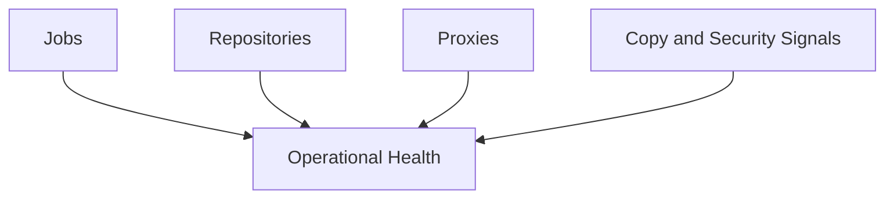

# Lesson 26 — Monitoring and Reporting: Health Visibility, Capacity Planning and Operational Confidence

> **VMCE Objective(s):** Monitoring, reporting, health review, proactive operations  
> **Level:** Advanced  
> **Estimated reading time:** 50–65 minutes  
> **Lab time:** 25 minutes

## Table of Contents

- [Learning Objectives](#learning-objectives)
- [Concepts and Theory](#concepts-and-theory)
- [What to Monitor](#what-to-monitor)
- [Reporting as Decision Support](#reporting-as-decision-support)
- [Capacity Planning](#capacity-planning)
- [Healthy Review Cadence](#healthy-review-cadence)
- [What Good Reporting Looks Like](#what-good-reporting-looks-like)
- [Metrics Worth Tracking Over Time](#metrics-worth-tracking-over-time)
- [Common Monitoring Blind Spots](#common-monitoring-blind-spots)
- [Reporting for Different Audiences](#reporting-for-different-audiences)
- [Key Takeaways](#key-takeaways)
- [Review Questions](#review-questions)

[Go to TOC](#table-of-contents)

## Learning Objectives

- understand what should be monitored in a Veeam environment
- explain why reporting is more than generating status summaries
- connect capacity planning and trend awareness to backup reliability

[Go to TOC](#table-of-contents)

## Concepts and Theory

A Veeam environment cannot be considered healthy just because jobs usually finish. Reliable operations require visibility into exceptions, trends, capacity, and warning signals that may not yet be causing outright failure.

[Go to TOC](#table-of-contents)

## What to Monitor

- job successes, warnings, and failures
- repository capacity trends
- proxy load and performance patterns
- copy-job completion behavior
- security-relevant anomalies and access changes
- backup age and coverage gaps

[Go to TOC](#table-of-contents)

## Reporting as Decision Support

Reporting is valuable because it supports planning and accountability. Good reporting helps answer:

- are we meeting policy expectations?
- where is capacity pressure developing?
- which workloads are routinely unhealthy?
- are we accumulating hidden risk?

This is why good reporting is closely tied to management communication. A technical team may understand that a string of warnings is important, but leadership often needs that translated into risk language. Reporting helps bridge that gap by turning operational patterns into explainable evidence.

[Go to TOC](#table-of-contents)

## Capacity Planning

Capacity planning should look ahead, not just describe current free space. If the repository is growing quickly, you want to know before protection windows or retention are forced into emergency changes.

[Go to TOC](#table-of-contents)

## Healthy Review Cadence

A mature Veeam environment benefits from multiple review rhythms:

- daily review of failures and warnings
- weekly review of recurring patterns and backup age
- monthly review of capacity growth and policy alignment
- periodic review of restore testing and security posture

This cadence prevents the team from living in a constant reactive mode.

[Go to TOC](#table-of-contents)

## What Good Reporting Looks Like

Good reporting answers operational questions clearly. For example:

- Which workloads have not been successfully protected within policy?
- Which repositories are growing fastest and why?
- Which warnings recur often enough to suggest deeper design weakness?
- Which copy jobs or secondary targets are becoming the next hidden risk?

Reports should support decisions, not simply generate dashboards. A weekly PDF or email that nobody reads is not meaningful monitoring.

[Go to TOC](#table-of-contents)

## Metrics Worth Tracking Over Time

- backup success rate with warnings separated from clean success
- oldest successful restore point age per critical workload group
- average and worst-case job duration for important jobs
- free space trend on major repositories
- number of failed or delayed copy operations
- number of restores tested within a defined period

These metrics help teams talk about resilience in measurable terms rather than intuition alone.

[Go to TOC](#table-of-contents)

## Common Monitoring Blind Spots

Even reasonably mature teams can miss important signals. Common blind spots include:

- focusing only on hard failures and ignoring warnings
- tracking repository free space without tracking growth rate
- assuming copy jobs are healthy because primary jobs are healthy
- performing restore tests but not recording the outcome in a way others can review
- failing to notice that one workload group has much older successful backups than expected

The purpose of monitoring is not to collect more data than necessary. It is to notice important weak signals before they become major incidents.

[Go to TOC](#table-of-contents)

## Reporting for Different Audiences

Different audiences need different summaries. An operator may need per-job detail and warning context. A team lead may need trend information across repositories and job groups. Leadership may need a concise view of policy coverage, exception counts, and recovery confidence. Good reporting practice recognizes that one report rarely serves every audience equally well.

[Go to TOC](#table-of-contents)

## Key Takeaways

- Monitoring should be proactive, not reactive.
- Warnings matter because they often signal tomorrow’s failures.
- Capacity planning is a resilience activity, not just a storage exercise.

[Go to TOC](#table-of-contents)

## Review Questions

1. Why is a mostly-green dashboard not enough?
2. What should capacity reporting help you do?
3. Why do warnings deserve attention?
4. What kinds of trends should backup teams watch?
5. Why is monitoring part of resilience rather than just operations?

---

### Answers

1. Because hidden warnings, drift, and capacity pressure can still threaten recovery readiness.
2. Predict and plan for future storage or operational needs before failures occur.
3. Because warnings often reveal early-stage problems before jobs fully fail.
4. Capacity growth, job duration, recurring partial issues, and unhealthy workload patterns.
5. Because reliable recovery depends on ongoing visibility into platform health.

[Go to TOC](#table-of-contents)
---

**License:** [CC BY-NC-SA 4.0](../LICENSE.md)
