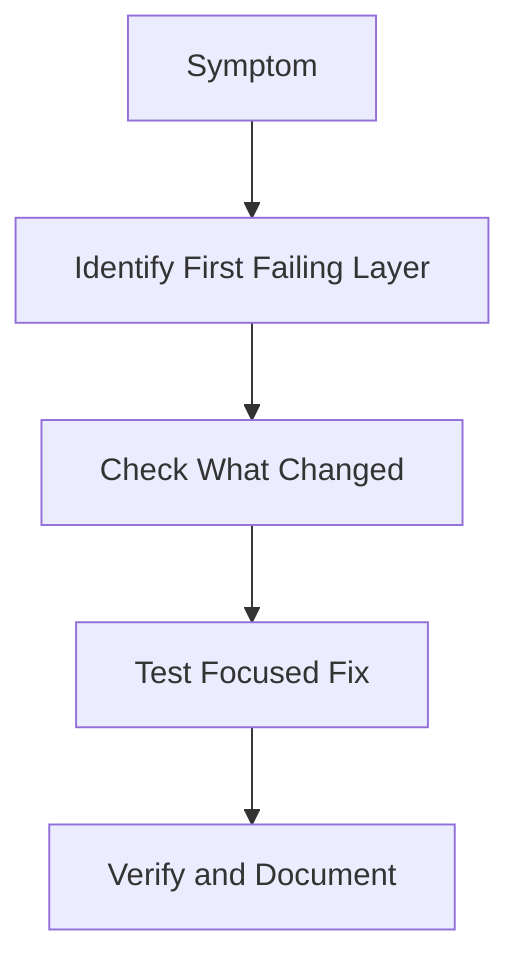

# Lesson 27 — Deep-Dive Troubleshooting: Common Failures, Root Causes and Recovery Tactics

> **VMCE Objective(s):** Troubleshooting methodology, platform-specific diagnosis, common issue remediation  
> **Level:** Advanced  
> **Estimated reading time:** 120–180 minutes  
> **Lab time:** Multiple focused exercises

## Table of Contents

- [Learning Objectives](#learning-objectives)
- [Concepts and Theory](#concepts-and-theory)
- [Part 1 — Troubleshooting Methodology](#part-1-troubleshooting-methodology)
- [Layer Classification Table](#layer-classification-table)
- [How to Read a Veeam Failure Log Conceptually](#how-to-read-a-veeam-failure-log-conceptually)
- [Part 2 — Installation and Upgrade Issues](#part-2-installation-and-upgrade-issues)
- [Part 3 — Infrastructure and Connectivity Issues](#part-3-infrastructure-and-connectivity-issues)
- [Part 4 — Proxy and Transport Mode Issues](#part-4-proxy-and-transport-mode-issues)
- [Part 5 — VMware-Specific Backup Issues](#part-5-vmware-specific-backup-issues)
- [Part 6 — Hyper-V-Specific Issues](#part-6-hyper-v-specific-issues)
- [Part 7 — Agent-Based Backup Issues](#part-7-agent-based-backup-issues)
- [Part 8 — Repository and Storage Issues](#part-8-repository-and-storage-issues)
- [Part 9 — Application-Aware Processing and VSS Issues](#part-9-application-aware-processing-and-vss-issues)
- [Part 10 — Restore Issues](#part-10-restore-issues)
- [Part 11 — Backup Copy and Tape Issues](#part-11-backup-copy-and-tape-issues)
- [Part 12 — Performance Troubleshooting](#part-12-performance-troubleshooting)
- [Part 13 — Security and Access Problems](#part-13-security-and-access-problems)
- [Focused Scenario Catalog](#focused-scenario-catalog)
- [Common Mistakes During Troubleshooting](#common-mistakes-during-troubleshooting)
- [Scenario Walkthrough 1 — The Green Job With Hidden Risk](#scenario-walkthrough-1-the-green-job-with-hidden-risk)
- [Scenario Walkthrough 2 — Everything Failed After a Small Change](#scenario-walkthrough-2-everything-failed-after-a-small-change)
- [Building a Personal Troubleshooting Checklist](#building-a-personal-troubleshooting-checklist)
- [Focused Lab Exercises](#focused-lab-exercises)
- [Troubleshooting Habits Worth Keeping](#troubleshooting-habits-worth-keeping)
- [Key Takeaways](#key-takeaways)
- [Review Questions](#review-questions)

[Go to TOC](#table-of-contents)

## Learning Objectives

- apply a structured method to Veeam troubleshooting rather than guessing
- identify common failures across install, infrastructure, repositories, proxies, guest processing, restores, replication, and agent workflows
- distinguish symptom, failing component, and root cause
- build operational habits that shorten time to resolution during real incidents

[Go to TOC](#table-of-contents)

## Concepts and Theory

Troubleshooting in Veeam is less about memorizing every possible error string and more about learning how to identify **which layer is failing**. Most issues fall into one of a few broad categories:

- installation or upgrade dependency issues
- connectivity and trust relationship issues
- source-read path issues
- target-write path issues
- guest/application consistency issues
- restore path issues
- performance path issues
- security and credential issues

If you understand those layers, log reading becomes much easier.

[Go to TOC](#table-of-contents)

## Part 1 — Troubleshooting Methodology

Use the following structured approach:

1. **Reproduce or define the symptom clearly.** What failed, exactly? Was it the whole job, one object, one task, or a post-processing phase?
2. **Identify the first failing component.** The first visible error is not always the root cause, but it often identifies the layer.
3. **Classify the path.** Is this install, source, proxy, repository, guest, copy, or restore?
4. **Check what changed.** Credentials, certificates, DNS, patch levels, storage space, network segmentation, or workload movement often explain “sudden” failures.
5. **Verify the fix with the smallest sensible rerun.** Do not change five variables at once.
6. **Document the incident and permanent prevention step.**

The most dangerous troubleshooting habit is random setting changes. The second most dangerous is rerunning failed jobs repeatedly without understanding what failed first.

[Go to TOC](#table-of-contents)

## Layer Classification Table

| Layer | Typical symptom examples |
|---|---|
| Install and service | Console cannot connect, services fail to start |
| Source access | Host add fails, snapshot creation fails, source object unavailable |
| Proxy path | Slow backups, transport fallback, read bottlenecks |
| Repository path | Write failures, out-of-space issues, target permission problems |
| Guest and app | VSS warnings, guest processing failures, log truncation issues |
| Restore path | Mapping problems, unusable recovered systems, recovery media issues |

Using this table during incidents helps keep your analysis structured instead of emotional.

[Go to TOC](#table-of-contents)

## How to Read a Veeam Failure Log Conceptually

When reviewing a failed job, ask:

- which stage failed: preparation, snapshot, data read, guest processing, transport, target write, post-processing?
- which system name appears in the first critical or error event?
- does the error indicate access, timeout, inconsistency, or capacity?
- is the failure isolated to one workload or repeated across many jobs?

Even if you do not yet know the exact fix, these questions narrow the field dramatically.

[Go to TOC](#table-of-contents)

## Part 2 — Installation and Upgrade Issues

### Common Symptoms

- installer fails during prerequisite checks
- console cannot connect after installation
- upgrade completes partially or services fail to start afterward
- database connectivity breaks after a version change

### Typical Root Causes

- pending reboot or missing prerequisite component
- unsupported OS or outdated dependent software
- database permission or reachability problem
- antivirus or endpoint protection interfering with component deployment
- upgrade path not aligned to the supported build sequence

### Practical Response

Start by checking whether the issue is local to `VEEAM-SRV` or external to it. If services will not start, focus on the backup server, service accounts, and database connectivity first. If the console cannot connect but services are healthy, focus on management connectivity and local component state.

Before upgrades, always back up the configuration and document the database state. If an upgrade introduces instability, knowing the last good state matters enormously.

### Upgrade Triage Discipline

If an issue begins immediately after an upgrade, treat “what changed” as a primary clue rather than an afterthought. Review the exact build installed, whether the upgrade path was supported, whether all components were upgraded in the expected order, and whether any dependent infrastructure changed at the same time. Administrators sometimes lose hours by debugging a generic symptom while ignoring the fact that the environment changed just beforehand.

[Go to TOC](#table-of-contents)

## Part 3 — Infrastructure and Connectivity Issues

### VMware Onboarding Failures

Common symptoms:

- cannot add vCenter or ESXi host
- certificate warning or thumbprint mismatch
- authentication failure despite “correct” credentials

Typical causes:

- wrong FQDN or DNS issue
- certificate trust mismatch after host replacement or renewal
- account missing required privileges
- firewall or segmentation problem

**Troubleshooting mindset:** confirm name resolution, confirm you are connecting to the correct system, verify the certificate prompt is expected, and validate the privileges of the onboarding account.

### Connectivity Triage Shortcut

When infrastructure onboarding breaks, try to answer three questions in order:

1. Can the Veeam server reach the target system?
2. Is the target system the system you think it is?
3. Does the provided credential truly have the required rights?

These three questions solve a surprisingly large percentage of early onboarding failures.

### Hyper-V Onboarding Failures

Common symptoms:

- host add fails with remote management or authentication issues
- cluster discovery incomplete
- some VMs appear inaccessible during job creation

Typical causes:

- WinRM not configured or blocked
- host credentials valid locally but insufficient remotely
- cluster or CSV behavior not aligned to expectations

### Windows and Linux Managed Server Add Failures

Windows causes often include firewall, RPC/WMI, privilege, or antivirus interference. Linux causes often include SSH issues, sudo misconfiguration, unsupported distribution state, or privilege escalation failure.

[Go to TOC](#table-of-contents)

## Part 4 — Proxy and Transport Mode Issues

### Symptom: Job Completes Slowly for No Obvious Reason

One of the most common causes is unexpected transport fallback. For VMware jobs, a proxy expected to use HotAdd or Direct SAN may silently use NBD instead. This does not always produce a dramatic error. It produces a disappointing result.

**What to check:**

- current proxy selected for the session
- datastore visibility from the proxy
- proxy VM placement
- network throughput during the session

### Symptom: Proxy Overload

If many tasks hit the same proxy, jobs may queue or perform inconsistently. Look at concurrency settings, task placement, and whether one proxy is disproportionately favored.

### Symptom: Storage Snapshot Integration Problems

Where backup-from-storage-snapshot workflows are used, vendor integration issues can cause failures that look like source-read failures but are actually array communication or API problems. Validate the storage integration layer separately.

[Go to TOC](#table-of-contents)

## Part 5 — VMware-Specific Backup Issues

### Snapshot Creation Fails

Common causes:

- existing snapshot complexity
- datastore capacity pressure
- VM state or VMware tools issue
- vCenter permission gap

### Snapshot Consolidation Problems

Symptoms include lingering snapshot files, datastore growth, and post-job warnings. These are dangerous because a backup might appear to “mostly work” while the VM accumulates technical debt.

### CBT Problems

Changed Block Tracking issues can lead to unexpected backup behavior, inconsistencies, or the need for a reset/active full strategy. If incremental behavior seems abnormal or backups look unexpectedly large after environmental changes, CBT should be considered.

### Practical Approach

When a VMware job fails, isolate whether the problem is at:

- vCenter communication layer
- snapshot layer
- transport mode/proxy layer
- repository target layer

Do not assume all “VMware backup failures” are the same.

### CBT Reset as a Troubleshooting Concept

Changed Block Tracking is very useful when healthy, but if behavior becomes suspicious after storage changes, host issues, or unusual incremental size changes, administrators should at least consider whether the tracking state may need to be reset through a controlled operational process. The exact action should be aligned with current vendor guidance, but the troubleshooting lesson is simple: if changed-block logic is wrong, the backup chain can behave unexpectedly even when the product itself is not “broken.”

[Go to TOC](#table-of-contents)

## Part 6 — Hyper-V-Specific Issues

### VSS and Checkpoint Problems

Hyper-V backup workflows often depend on healthy checkpoint and VSS behavior. Common issues include:

- non-transient VSS writer failures
- leftover checkpoints after failed backups
- cluster ownership changes causing timing problems

### Clustered Environments

If workloads move or CSV ownership changes, unexpected timing and path behavior can appear. Cluster-aware troubleshooting means understanding not just the VM, but where it was and which host owned the relevant resource at the time.

[Go to TOC](#table-of-contents)

## Part 7 — Agent-Based Backup Issues

### Windows Agent Problems

Common symptoms:

- deployment failure
- VSS snapshot failure
- agent service not starting
- policy not applying

Typical causes:

- WMI/RPC/firewall blocks
- endpoint protection interference
- local VSS writer instability
- stale or insufficient credentials

### Linux Agent Problems

Common symptoms:

- deployment succeeds but backup fails immediately
- snapshot module or kernel-related failure
- policy applies inconsistently
- repository communication failure

Typical causes:

- unsupported or recently changed kernel
- privilege escalation problem
- SSH inconsistency
- snapshot mechanism mismatch

### No-Hypervisor Lesson

In no-hypervisor environments, always separate **deployment problems** from **backup execution problems**. The fix path is often different.

### Agent Triage Heuristic

If the agent is not present or not communicating, start with deployment and access. If the agent is present but backups fail, start with local OS state, snapshot mechanisms, and target connectivity. This simple distinction can save a lot of time.

[Go to TOC](#table-of-contents)

## Part 8 — Repository and Storage Issues

### Repository Out of Space

This is obvious but common. The mistake is treating it as only a storage team issue. When a repository fills, Veeam policy, retention, growth planning, and copy-job design are all relevant.

Immediate actions may include:

- confirm whether the repository is truly full or the path is wrong
- evaluate whether safe retention operations or temporary capacity increases are possible
- prevent cascading failures in dependent jobs

### SOBR Extent Problems

An extent may go offline, behave slowly, or need maintenance. Administrators should understand the operational consequences for placement and chain health before taking action.

### Object Storage Connectivity Issues

Typical causes:

- credential or token issue
- DNS or endpoint reachability problem
- TLS/certificate trust issue
- service-side immutability or bucket configuration mismatch

### Hardened Repository Problems

A hardened repository can fail operationally if:

- it was configured with the wrong user assumptions
- immutability windows do not align with job design
- the Linux system itself is unhealthy or storage is mismanaged

The goal of hardening is resilience, not fragility. But it must be configured correctly.

### Repository Incident Priorities

When repository problems occur, administrators should think in this order:

1. Are current jobs failing or at risk of cascading failure?
2. Are existing restore points still safe?
3. What short-term step stabilizes operations?
4. What long-term design or capacity issue caused this?

This prevents panic-driven actions that fix today’s symptom but worsen tomorrow’s risk.

[Go to TOC](#table-of-contents)

## Part 9 — Application-Aware Processing and VSS Issues

This is one of the richest failure categories in Veeam operations.

### Symptom: Backup Job Warning About Guest Processing

This often means the image backup completed, but application consistency may not be as expected. Administrators should not ignore repeated warnings here, especially for transactional workloads.

### Common Causes

- expired guest credentials
- Windows VSS writer failure
- application writer instability
- guest firewall or service communication issue
- workload itself not healthy at backup time

### SQL-Specific Themes

- log truncation not occurring as expected
- SQL writer or application service instability
- mismatch between backup expectations and DBA recovery model expectations

### Active Directory Themes

Domain controllers need careful handling. A backup that is technically present is not the same as a recovery plan you trust. This is why AD-related restore planning should be deliberate, not improvised.

### VSS Mindset

VSS-related issues are often tempting to treat as mysterious. They are usually less mysterious when broken into components: credential path, guest reachability, writer state, application health, and timing. The more structured your approach, the less intimidating VSS troubleshooting becomes.

[Go to TOC](#table-of-contents)

## Part 10 — Restore Issues

### Full Restore Fails or Is Impractical

Check:

- target capacity
- network mapping
- target host health
- credential path if guest-level steps are required

### Instant VM Recovery Issues

Common symptoms:

- NFS or mounted datastore visibility issues
- recovered VM powers on but services fail
- migration back to production stalls or behaves unexpectedly

This reinforces a key lesson: recovery is not validated until the workload is usable.

### Guest File Restore Problems

Possible causes include:

- missing or inaccessible index path
- guest authentication issues
- restore operator confusion about source vs. target placement

### Agent Recovery Problems

For physical systems, full recovery can fail due to recovery media, driver, or boot-path issues. These are not theoretical. They are exactly why recovery testing matters.

### Restore Validation Reminder

A restore wizard finishing successfully does not guarantee the application or system is genuinely usable. Administrators should always define what “usable” means before the restore begins.

[Go to TOC](#table-of-contents)

## Part 11 — Backup Copy and Tape Issues

### Backup Copy Job Not Running as Expected

Check:

- whether the source backup completed and is in the expected state
- whether the schedule or policy logic aligns with actual source behavior
- whether the target repository is healthy and reachable

### Tape Issues

Common problems include:

- media availability mismatch
- device/driver visibility issues
- write or read problems on aging media
- operational handling errors such as wrong media pool usage

[Go to TOC](#table-of-contents)

## Part 12 — Performance Troubleshooting

Performance problems are often harder than hard failures because jobs still “work.”

Use a bottleneck mindset:

1. source read
2. proxy processing
3. network transfer
4. repository write

The goal is to identify which part is slowest, not to optimize blindly.

### Performance Interview Questions

When someone reports “backups are slow,” ask:

- Was this ever fast?
- Did it become slow suddenly or gradually?
- Is the issue affecting one job or many?
- Did repositories, proxies, networks, or source workloads change?
- Is the concern backup speed, restore speed, or both?

These questions quickly separate environmental drift from isolated job issues.

### Common Performance Causes

- proxy fallback to slower mode
- insufficient proxy concurrency capacity
- repository I/O contention
- network saturation
- encryption/compression overhead in the wrong place

[Go to TOC](#table-of-contents)

## Part 13 — Security and Access Problems

### Credential Expiry

Credential expiry is one of the most boring and common backup problems. It is also one of the easiest to prevent with discipline.

### Authorization and Role Misunderstanding

In more mature environments, changes to RBAC or security policy can unintentionally break tasks that used to work. When a previously successful workflow begins failing after a security review or role change, examine access changes first.

### Clean Restore Point Concerns

In suspected compromise situations, the troubleshooting question is not only “can I restore?” but “should I restore this point?” Recovery confidence matters.

[Go to TOC](#table-of-contents)

## Focused Scenario Catalog

Below are common scenarios and the most likely first area to inspect.

| Scenario | First area to inspect |
|---|---|
| New install, console won’t connect | Local Veeam services and DB path |
| VMware job suddenly much slower | Proxy transport mode and datastore visibility |
| Hyper-V job warning about consistency | VSS / checkpoint behavior |
| Linux agent deploys but backups fail | Kernel/snapshot mechanism and privilege path |
| Repository jobs failing across many workloads | Repository capacity, reachability, or permissions |
| Backup copy jobs lagging | Source job completion timing and target availability |
| Instant VM boots but app is broken | Guest/application validation, not backup chain |
| Repeated guest processing warnings | Credentials and application/VSS state |
| Many jobs fail at once after password rotation | Credential inventory and dependency mapping |

[Go to TOC](#table-of-contents)

## Common Mistakes During Troubleshooting

- changing schedule, repository, and processing settings all at once
- ignoring warnings because jobs are still mostly green
- assuming the final error is the first error
- failing to record the environmental change that preceded the issue
- testing a fix on critical production workloads first when a smaller test would do

Avoiding these mistakes is often more important than knowing every specific product message by memory.

[Go to TOC](#table-of-contents)

## Scenario Walkthrough 1 — The Green Job With Hidden Risk

Imagine a SQL workload whose backup job completes with warnings three nights in a row. The operator sees the job as mostly successful and moves on. Two weeks later the team tries to restore and discovers the consistency of the application state is not what they expected. The lesson is not that Veeam failed silently. The lesson is that the warning was operationally meaningful and was treated as cosmetic.

This scenario is common enough to matter. A good troubleshooter learns to classify warnings by significance. Some warnings can wait. Repeated warnings on transactional workloads should not.

[Go to TOC](#table-of-contents)

## Scenario Walkthrough 2 — Everything Failed After a Small Change

Another common pattern is a burst failure after a “minor” environmental change. Examples include a password rotation, a DNS change, a certificate renewal, a storage path remap, or a host migration. In these moments, the troubleshooting habit of asking “what changed?” often saves more time than deep product-specific guessing. Backup systems depend on many external relationships. When one of those relationships changes, the failure often surfaces through the backup workflow.

[Go to TOC](#table-of-contents)

## Building a Personal Troubleshooting Checklist

Experienced administrators often carry a mental or written checklist they run through automatically. A useful version includes:

1. What is the first failing stage?
2. Is this one object or many?
3. Did anything change recently?
4. Is the failure more about access, capacity, timing, or consistency?
5. What is the safest focused test to validate the next hypothesis?

This kind of checklist is valuable because it creates calm. Troubleshooting quality often drops when the operator feels pressure to “fix it now” without taking thirty seconds to classify the problem.

[Go to TOC](#table-of-contents)

## Focused Lab Exercises

### Lab 27-A — Identify the Failing Layer

Take any failed or hypothetical job and answer these questions:

1. Which stage failed first?
2. Which system name appears first in the error path?
3. Is the error more likely source, proxy, repository, guest, or restore-path related?

### Lab 27-B — VMware Slow Backup Diagnosis

Create a checklist for diagnosing a VMware job that became 4x slower overnight. Include transport mode, proxy, datastore visibility, and network path.

### Lab 27-C — Guest Processing Warning Analysis

Choose a Windows guest workload and write a mini-troubleshooting flow for recurring guest processing warnings.

### Lab 27-D — Agent Deployment Failure

Write a step-by-step decision tree for a Windows or Linux agent that will not deploy from Veeam.

### Lab 27-E — Repository Full Incident

Document the immediate triage, short-term mitigation, and long-term prevention steps for a repository that filled overnight.

### Lab 27-F — Restore That Boots but Fails Validation

Write a decision path for a VM that powers on after recovery but whose application still does not function. Include infrastructure validation, guest validation, and application-owner validation.

### Lab 27-G — Credential Rotation Failure Burst

Design a triage plan for the case where several jobs fail shortly after a password or service-account rotation.

[Go to TOC](#table-of-contents)

## Troubleshooting Habits Worth Keeping

- always note the first failing component, not just the final red message
- check what changed before changing anything else
- classify the issue by layer
- verify the fix with the smallest safe test
- document recurrence prevention

[Go to TOC](#table-of-contents)

## Key Takeaways

- Effective troubleshooting starts with layer identification, not random fixes.
- Many Veeam issues are really credential, connectivity, or storage issues expressed through the backup workflow.
- “Successful but slow” is still a problem worth diagnosing.
- Restore validation matters just as much as backup troubleshooting.

[Go to TOC](#table-of-contents)

## Review Questions

1. What is the first troubleshooting question you should ask after a job fails?
2. Why is random setting-changing a bad troubleshooting habit?
3. What is a common reason a VMware backup becomes slower without fully failing?
4. Why should guest processing warnings not be ignored on SQL or AD workloads?
5. What is the difference between a symptom and a root cause?
6. Why are repository-full incidents not just storage-team issues?
7. Why can a restored VM still count as an incomplete recovery?
8. What makes no-hypervisor troubleshooting different in some cases?
9. Why should you document what changed before the failure began?
10. Why is a layered approach more effective than memorizing error strings?

---

### Answers

1. Which stage or component failed first.
2. Because it obscures cause and may create new problems.
3. Unexpected fallback to a slower transport mode such as NBD.
4. Because transactional consistency and application integrity may be compromised.
5. The symptom is what you observe; the root cause is the underlying reason it happened.
6. Because job design, retention, growth planning, and copy strategy all influence repository exhaustion.
7. Because boot success alone does not prove application usability or production readiness.
8. Endpoint OS state, agent deployment, and recovery media become more important than hypervisor integration.
9. Because environmental changes often explain failures faster than low-level guessing.
10. Because the same visible error text can originate from different underlying layers, but layer analysis narrows the real cause quickly.

[Go to TOC](#table-of-contents)

---

**License:** [CC BY-NC-SA 4.0](../LICENSE.md)
